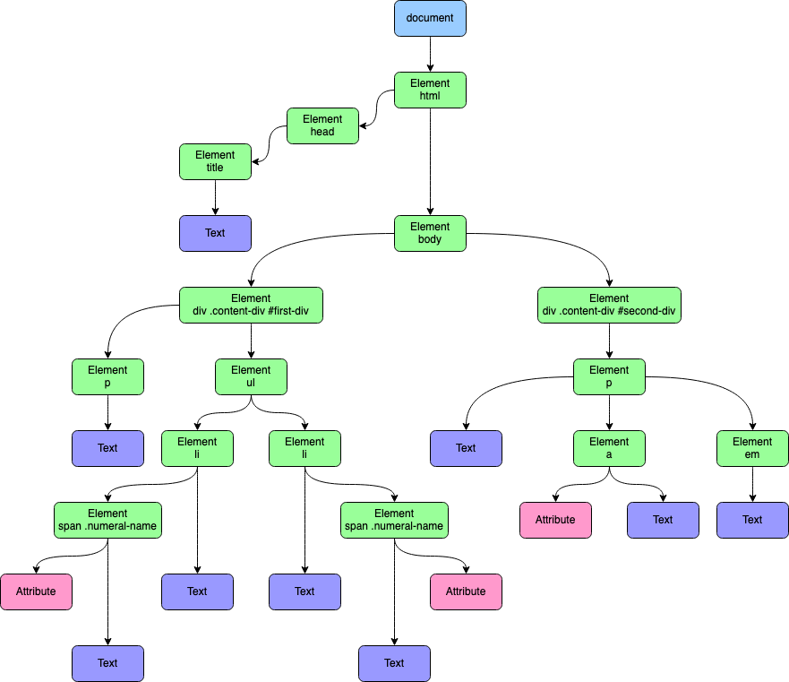
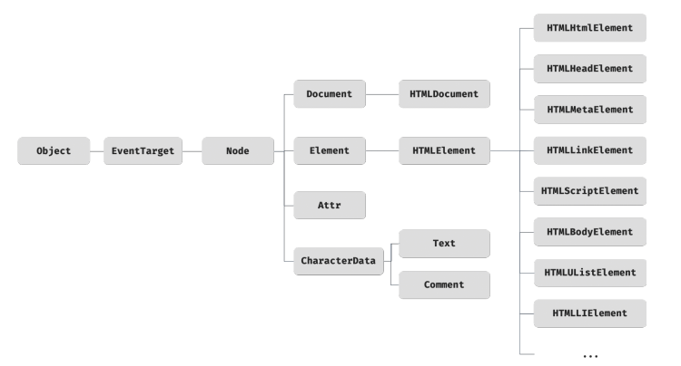

# DOM

- [DOM 트리(DOM Tree)](#dom-트리dom-tree)
- [노드 상속(Node Inheritance)](#노드-상속node-inheritance)
- [속성(Attribute • Property)](#속성attribute--property)
  - [Attribute와 Property의 차이](#attribute와-property의-차이)
  - [예시](#예시)

## DOM 트리(DOM Tree)

문서 객체 모델(DOM, Document Object Model)은 HTML 문서의 계층적 구조를 메모리에 표현한 모델이다.

- HTML이라는 초기 설계도를 바탕으로 브라우저가 생성하는 트리 구조임.
- 노드(Node)로 구성되며, 각 노드는 요소, 텍스트, 속성 등을 나타냄.
- JavaScript를 통해 이 모델을 조작하여 웹 페이지의 내용과 구조를 동적으로 변경할 수 있음.



## 노드 상속(Node Inheritance)

DOM의 모든 노드는 특정 인터페이스를 상속받는다. 이 계층 구조를 이해하면 각 노드에서 사용할 수 있는 메서드와 속성을 파악하기 용이하다.



## 속성(Attribute • Property)

HTML 요소의 값을 다루는 두 가지 방식인 어트리뷰트(Attribute)와 프로퍼티(Property)는 명확히 구분되어야 한다.

### Attribute와 Property의 차이

| 항목 | 어트리뷰트(Attribute)              | 프로퍼티(Property)                   |
| :--- | :--------------------------------- | :----------------------------------- |
| 위치 | HTML 소스 코드에 정의됨            | DOM 객체의 메모리 내 속성임          |
| 성격 | 정적 (HTML에 고정된 초기값)        | 동적 (JavaScript로 실시간 변경 가능) |
| 접근 | `getAttribute()`, `setAttribute()` | `element.property` 점 표기법         |
| 타입 | 항상 문자열(String)임              | 문자열, 숫자, 불리언, 객체 등 다양함 |

### 예시

```html
<input type="text" value="초기값" />
```

```ts
const input = document.querySelector('input');

// Attribute 접근
console.log(input.getAttribute('value')); // "초기값" (HTML 소스에 명시된 값)
// Property 접근
console.log(input.value); // "초기값" (DOM 객체의 현재 상태값)

// 사용자가 입력창에 "새 값"을 입력하거나 스크립트로 변경하면
input.value = '새 값';

console.log(input.value); // "새 값" (Property는 현재 상태를 반영함)
console.log(input.getAttribute('value')); // "초기값" (Attribute는 초기 설계 상태를 유지함)
```
