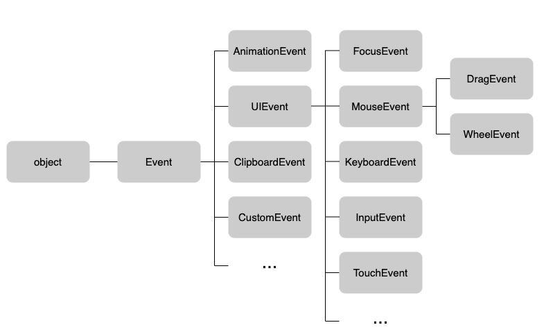
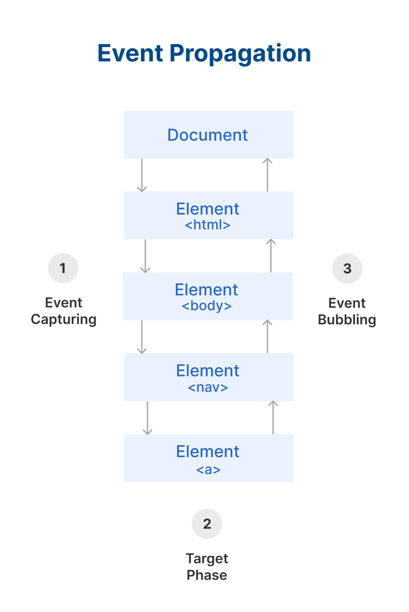
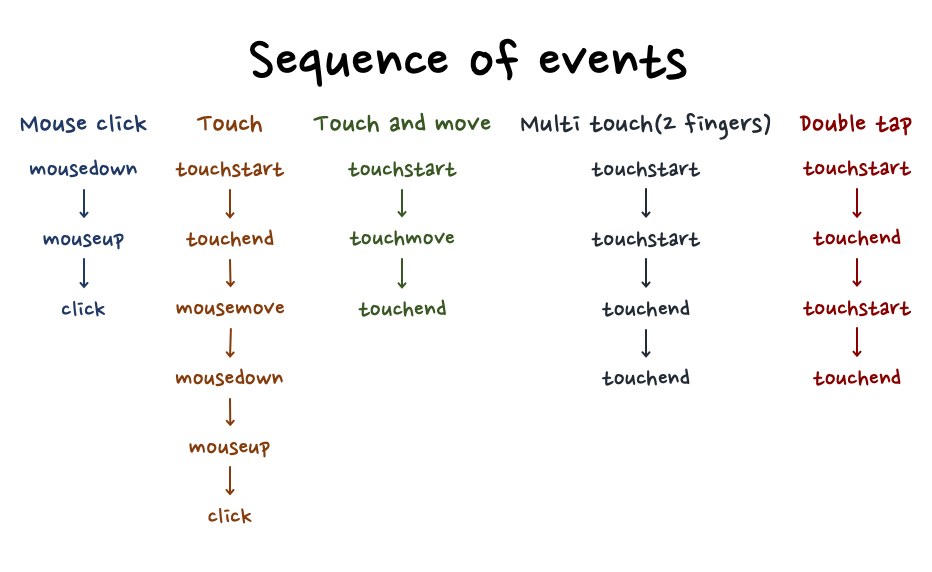

# Event

- [Event Inheritance](#event-inheritance)
- [Event Propagation](#event-propagation)
- [`event.target` • `event.currentTarget`](#eventtarget--eventcurrenttarget)
- [`onclick` • `addEventListener('click')`](#onclick--addeventlistenerclick)
- [터치 이벤트 시퀀스](#터치-이벤트-시퀀스)

## Event Inheritance

## Event Propagation

## `event.target` • `event.currentTarget`

▾ `event.target`

- 이벤트가 실제로 발생한 요소를 가리킨다.

▾ `event.currentTarget`

- 이벤트 리스너가 실제로 등록된 요소를 가리킨다.
- `event.currentTarget`의 값은 해당 이벤트의 핸들러 내에서만 사용할 수 있다. 이벤트 핸들러 외부에서는 `null`이 된다. 예를 들어, 이벤트 핸들러 내부에서 `Event` 객체에 대한 참조를 취한 후 이벤트 핸들러 외부에서 그 `currentTarget` 속성에 접근하면 그 값은 `null`이 된다.

## `onclick` • `addEventListener('click')`

▾ `onclick` 속성

- 요소의 `onclick` 속성을 통해 한 번에 하나의 이벤트 핸들러만 연결할 수 있다.
- 다른 핸들러보다 우선순위가 높다.
- 빈 문자열(`''`)을 할당하여 이벤트 핸들러를 제거할 수 있다.

▾ `addEventListener('click')` 메서드

- 하나의 요소에 여러 개의 이벤트 핸들러를 연결할 수 있다.
- 여러 핸들러 등록 시 등록된 순서대로 호출된다.
- `removeEventListener()`를 사용하여 핸들러를 제거할 수 있다.
  - 단, 제거하려는 핸들러는 동일한 함수 참조여야 한다.

## 터치 이벤트 시퀀스

