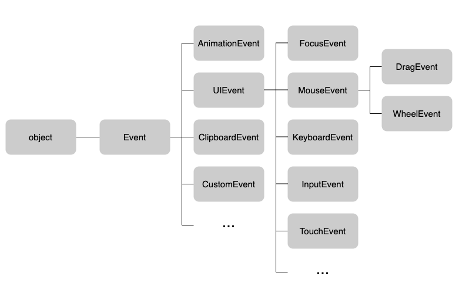
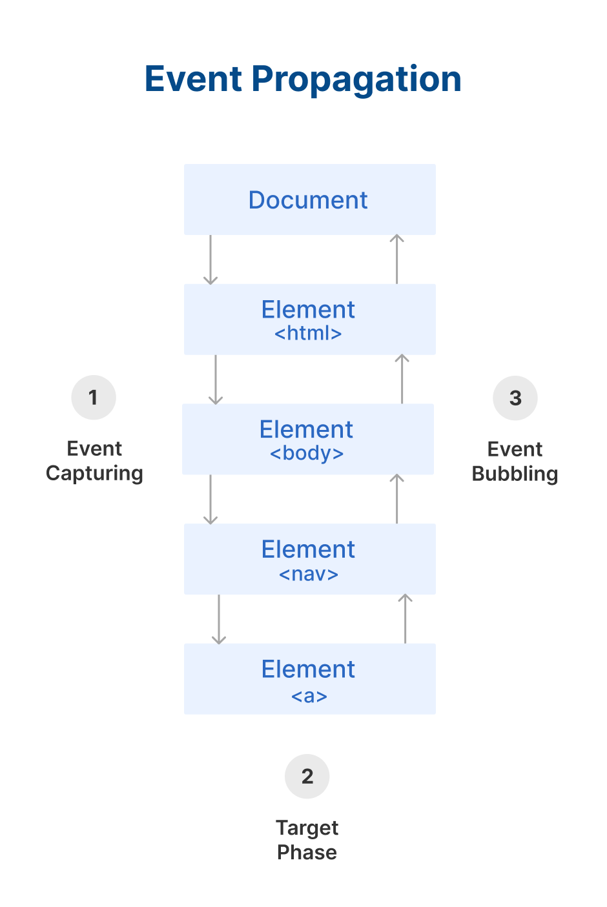
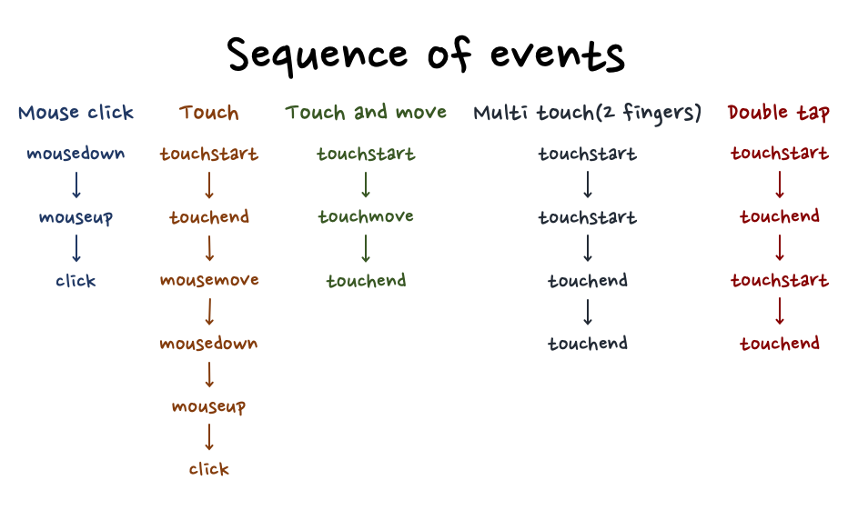

# DOM 이벤트

- [이벤트 상속(Event Inheritance)](#이벤트-상속event-inheritance)
- [이벤트 전파(Event Propagation)](#이벤트-전파event-propagation)
  - [버블링(Bubbling)](#버블링bubbling)
  - [캡처링(Capturing)](#캡처링capturing)
- [이벤트 위임(Event Delegation)](#이벤트-위임event-delegation)
- [`event.target` • `event.currentTarget`](#eventtarget--eventcurrenttarget)
- [`event.repeat`](#eventrepeat)
- [`onclick` • `addEventListener('click')`](#onclick--addeventlistenerclick)
  - [`passive: true` 옵션](#passive-true-옵션)
- [터치 이벤트 시퀀스(Touch Event Sequence)](#터치-이벤트-시퀀스touch-event-sequence)

## 이벤트 상속(Event Inheritance)

이벤트 객체는 계층적인 상속 구조를 가진다. 모든 이벤트의 최상위에는 `Event` 인터페이스가 존재하며, 발생한 이벤트의 종류에 따라 구체적인 하위 인터페이스를 상속받는다.



## 이벤트 전파(Event Propagation)

이벤트가 발생했을 때 DOM 트리를 따라 전파되는 과정을 말한다. 브라우저는 표준 이벤트 흐름에 따라 3단계로 이벤트를 전파한다.



### 버블링(Bubbling)

- 특정 요소에서 이벤트가 발생했을 때, 해당 이벤트가 부모 요소를 거쳐 최상위 요소(`window`)까지 전달되는 현상임.
- 대부분의 이벤트는 버블링 단계에서 핸들러가 실행됨.
- `event.stopPropagation()`을 호출하여 버블링을 중단할 수 있음.

### 캡처링(Capturing)

- 이벤트가 최상위 요소에서 실제 이벤트가 발생한 타겟 요소까지 내려가는 과정임.
- `addEventListener`의 세 번째 인자로 `{ capture: true }`를 전달하여 캡처링 단계에서 이벤트를 감지할 수 있음.
- 실무에서는 드물게 사용되지만, 특정 이벤트를 하위 요소에 도달하기 전 가로채야 할 때 유용함.

## 이벤트 위임(Event Delegation)

이벤트 위임은 비슷한 방식으로 다뤄야 하는 많은 요소를 다룰 때 사용한다. 각 요소에 핸들러를 할당하지 않고, 공통 조상에 단 하나의 핸들러를 할당하여 이벤트를 관리하는 패턴이다.

- 이점:
  - 메모리 사용량이 절감됨 (핸들러 개수 최소화).
  - 동적으로 추가되는 요소에 대해서도 별도의 핸들러 등록 없이 이벤트 처리가 가능함.
  - 코드 구조가 간결해지고 관리가 용이함.
- 작동 원리:
  - 조상 요소에서 `event.target`을 확인하여 실제 이벤트가 발생한 위치를 파악하고 로직을 수행함.

## `event.target` • `event.currentTarget`

`event.target`:

- 이벤트가 실제로 발생한 요소를 가리킴.
- 버블링이 일어나도 변하지 않는 원본 요소를 유지함.

`event.currentTarget`:

- 이벤트 리스너가 실제로 등록된 요소를 가리킴.
- 핸들러 내부에서 `this`와 동일한 요소를 가리킴.
- 이벤트 핸들러 외부에서는 `null`이 되므로 참조 시 주의가 필요함.

## `event.repeat`

`KeyboardEvent` 인터페이스의 읽기 전용 프로퍼티로, 키가 계속 눌려 있어 이벤트가 반복 발생하고 있는지를 나타낸다.

- 사용자가 키를 처음 누를 때는 `false`, 키를 놓지 않고 계속 누르고 있으면 `true`가 됨.
- 키보드의 자동 반복(Auto-repeat) 기능에 의해 발생하는 이벤트를 구분할 수 있음.
- 게임 조작, 단축키 처리 등에서 첫 입력과 반복 입력을 구분해야 할 때 유용함.

```ts
document.addEventListener('keydown', (event: KeyboardEvent) => {
  if (event.repeat) return; // 반복 입력은 무시
  handleKeyPress(event.key);
});
```

## `onclick` • `addEventListener('click')`

`onclick` 속성:

- 요소의 `onclick` 속성을 통해 한 번에 하나의 이벤트 핸들러만 연결할 수 있음.
- 기존에 등록된 핸들러가 있다면 덮어쓰게 됨.
- 빈 문자열(`''`)을 할당하여 간단히 제거 가능함.

`addEventListener('click')` 메서드:

- 하나의 요소에 여러 개의 이벤트 핸들러를 병렬로 등록할 수 있음.
- 등록된 순서대로 핸들러가 실행됨.
- 옵션 객체를 통해 캡처링, 한 번만 실행(`once`), 패시브(`passive`) 등을 설정할 수 있음.

### `passive: true` 옵션

- 브라우저에게 해당 핸들러가 `preventDefault()`를 호출하지 않을 것임을 미리 알리는 옵션임.
- 특히 스크롤 성능 최적화에 중요한 역할을 함.
- 브라우저는 핸들러의 실행 완료를 기다리지 않고 즉시 스크롤을 수행할 수 있어 화면 버벅임(Jank)을 방지함.

## 터치 이벤트 시퀀스(Touch Event Sequence)

터치 인터페이스에서 발생하는 이벤트들의 발생 순서와 흐름을 나타낸다.


