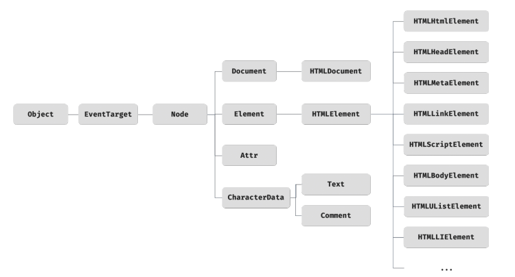

# DOM Note

- [DOM Tree](#dom-tree)
- [Node Inheritance](#node-inheritance)
- [Attribute • Property](#attribute--property)
  - [예시](#예시)

## DOM Tree

- DOM은 HTML이라는 초기 설계도를 바탕으로 표현된 트리 구조의 모델이다.
- DOM은 HTML 문서의 계층적 구조를 메모리의 표현한 것이다.
- 노드(Node)로 구성된다. 각 노드는 HTML 요소, 텍스트, 속성 등을 나타낸다.


## Node Inheritance



## Attribute • Property

- Attribute: HTML 소스에 작성된 정적 키-값 쌍. `getAttribute()`로 접근.
- Property: DOM 객체의 동적 속성. `element.property`로 접근.

| 항목        | Attribute               | Property                      |
| ----------- | ----------------------- | ----------------------------- |
| 위치        | HTML 소스 코드          | DOM 객체                      |
| 정적/동적   | 정적 (HTML에 고정된 값) | 동적 (JavaScript로 변경 가능) |
| 접근 방법   | `getAttribute()`        | `element.property`            |
| 데이터 타입 | 문자열                  | 문자열, boolean, 객체 등 다양 |

### 예시

```html
<input type="text" value="초기값" />
```

```ts
const input = document.querySelector('input');

// Attribute 접근
console.log(input.getAttribute('value')); // "초기값" (HTML에 정의된 값)
// Property 접근
console.log(input.value); // "초기값" (DOM의 현재 값)

// 사용자가 입력창에 "새 값"을 입력하면
input.value = '새 값';
console.log(input.value); // "새 값" (Property는 동적으로 변경)
console.log(input.getAttribute('value')); // 여전히 "초기값" (Attribute는 정적)
```
