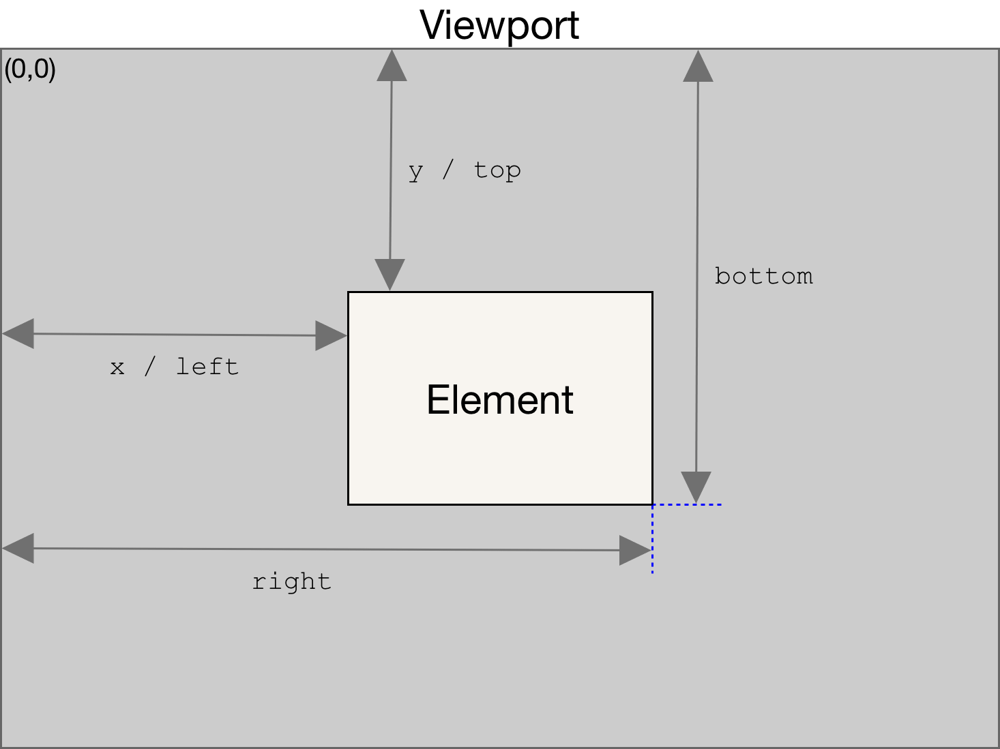
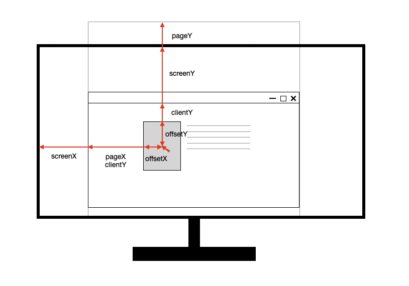
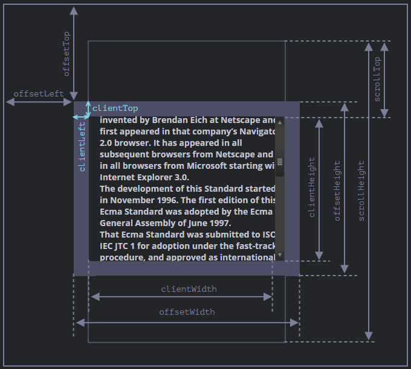

# DOM 위치 • 사이즈 • 스크롤

- [좌표(Coordinate)](#좌표coordinate)
  - [요소 좌표](#요소-좌표)
  - [마우스 좌표](#마우스-좌표)
  - [좌표 기반 요소 탐색](#좌표-기반-요소-탐색)
- [사이즈(Size)](#사이즈size)
  - [요소 사이즈](#요소-사이즈)
  - [브라우저 창 사이즈](#브라우저-창-사이즈)
- [스크롤(Scroll)](#스크롤scroll)
  - [스크롤 제어](#스크롤-제어)
  - [스크롤바 제어](#스크롤바-제어)

## 좌표(Coordinate)

브라우저 내 좌표계는 기준점에 따라 다르게 정의된다.

### 요소 좌표



`getBoundingClientRect()` 메서드를 사용하여 요소의 크기와 브라우저 창(Viewport)을 기준으로 한 상대적 위치 정보를 가져온다.

- 창 기준 좌표: `position: fixed`와 동일한 기준임.
- 문서 기준 좌표: `position: absolute`와 동일한 기준이며, 현재 창의 스크롤 위치를 더해 계산함.

```ts
// 브라우저창 기준 좌표
const { x, y, width, height, top, left, bottom, right } = element.getBoundingClientRect();

// 문서 기준 좌표 계산 함수
function getCoords(elem) {
  const { top, left } = element.getBoundingClientRect();

  return {
    top: top + window.scrollY,
    left: left + window.scrollX,
  };
}
```

### 마우스 좌표



이벤트 객체에서 제공하는 마우스 위치 정보는 다음과 같은 기준으로 나뉜다.

| 속성        | 기준                                            |
| :---------- | :---------------------------------------------- |
| `screenX/Y` | 물리적 모니터 화면의 왼쪽 상단 기준임           |
| `clientX/Y` | 현재 브라우저 창(Viewport)의 왼쪽 상단 기준임   |
| `pageX/Y`   | 전체 HTML 문서의 왼쪽 상단 기준임 (스크롤 포함) |
| `offsetX/Y` | 이벤트가 발생한 대상 요소의 왼쪽 상단 기준임    |

### 좌표 기반 요소 탐색

특정 좌표나 조건을 기반으로 DOM 요소를 찾는 메서드가 제공된다.

- `document.elementFromPoint(x, y)`: 지정한 뷰포트 좌표에 위치한 최상위 요소를 반환한다. 해당 좌표에 요소가 없으면 `null`을 반환한다.
- `element.closest(selector)`: 현재 요소에서 시작하여 DOM 트리를 상위로 탐색하며, 주어진 CSS 선택자와 일치하는 가장 가까운 조상 요소를 반환한다. 일치하는 요소가 없으면 `null`을 반환한다.

```ts
// 뷰포트 좌표 (100, 200) 위치에 있는 요소를 가져옴
const topEl = document.elementFromPoint(100, 200);

// 마우스 이벤트 좌표로 해당 위치의 요소를 탐색함
document.addEventListener('click', (e) => {
  const el = document.elementFromPoint(e.clientX, e.clientY);
});

// 현재 요소에서 가장 가까운 '#droppable' 조상을 탐색함
const droppable = element.closest('#droppable');

// 이벤트 위임: 클릭된 요소에서 가장 가까운 'li'를 찾음
list.addEventListener('click', (e) => {
  const item = e.target.closest('li');
  if (item) {
    /* ... */
  }
});
```

드래그 앤 드롭 구현에서 두 메서드를 조합하여 사용하는 패턴이 일반적이다. 드래그 중인 요소를 잠시 숨긴 뒤 `elementFromPoint()`로 아래에 있는 요소를 찾고, `closest()`로 드롭 가능한 영역인지 판별한다.

```ts
element.addEventListener('pointermove', (e) => {
  // 드래그 중인 요소를 숨겨서 elementFromPoint가 아래 요소를 감지하도록 함
  element.style.display = 'none';
  const below = document.elementFromPoint(e.clientX, e.clientY);
  element.style.display = '';

  // 드롭 가능한 영역인지 확인
  const dropZone = below?.closest('#droppable');
});
```

## 사이즈(Size)

요소와 창의 크기를 측정하는 다양한 속성이 제공된다.

### 요소 사이즈



| 속성                 | 설명                                                               |
| :------------------- | :----------------------------------------------------------------- |
| `offsetParent`       | 가장 가까운 `position` 속성이 적용된 조상 요소임                   |
| `offsetTop/Left`     | `offsetParent`를 기준으로 한 테두리(Border) 시작 지점까지의 거리임 |
| `offsetWidth/Height` | 콘텐츠 영역 + 패딩 + 테두리 + 스크롤바를 포함한 전체 크기임        |
| `clientTop/Left`     | 상단/왼쪽 테두리의 두께임                                          |
| `clientWidth/Height` | 콘텐츠 영역 + 패딩의 크기이며, 스크롤바는 제외됨                   |
| `scrollWidth/Height` | 스크롤로 가려진 영역을 포함한 전체 콘텐츠의 크기임                 |

### 브라우저 창 사이즈

- `window.innerWidth/Height`: 브라우저 창의 전체 너비와 높이이며, 스크롤바를 포함함.
- `document.documentElement.clientWidth/Height`: 스크롤바를 제외한 실제 가시 영역의 크기임.

## 스크롤(Scroll)

JavaScript를 사용하여 스크롤 위치를 조회하거나 특정 위치로 이동시킬 수 있다.

### 스크롤 제어

| 메서드/속성                | 설명                                                 |
| :------------------------- | :--------------------------------------------------- |
| `window.scrollX/Y`         | 문서가 가로/세로로 얼마나 스크롤되었는지 나타냄      |
| `window.scrollTo(x, y)`    | 지정한 절대 좌표로 스크롤을 이동함                   |
| `window.scrollBy(x, y)`    | 현재 위치에서 상대적인 거리만큼 스크롤을 이동함      |
| `element.scrollTop/Left`   | 요소 내부의 현재 스크롤 위치를 나타내며, 쓰기 가능함 |
| `element.scrollIntoView()` | 특정 요소가 화면에 보이도록 자동으로 스크롤함        |

### 스크롤바 제어

모달 창 등을 띄울 때 배경 스크롤을 막기 위해 `overflow` 속성을 조작한다.

```ts
// 스크롤 방지 및 스크롤바 너비만큼 보정
const scrollbarWidth = window.innerWidth - document.documentElement.clientWidth;
document.body.style.overflow = 'hidden';
document.body.style.paddingRight = `${scrollbarWidth}px`;

// 스크롤 복구
document.body.style.overflow = '';
document.body.style.paddingRight = '';
```
