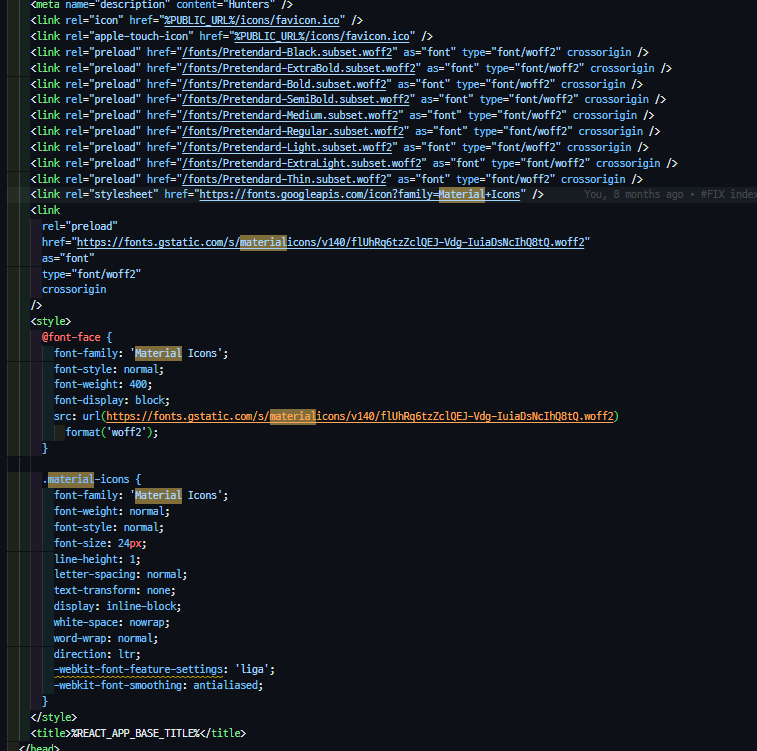

# 폰트

- [font](#font)
  - [font-family](#font-family)
  - [font-face](#font-face)
  - [font 최적화](#font-최적화)
- [rem, em](#rem-em)
- [text-overflow 속성 적용하기](#text-overflow-속성-적용하기)
  - [1. **아이콘 SVG 파일**](#1-아이콘-svg-파일)
    - [**장점:**](#장점)
    - [**단점:**](#단점)
  - [2. **웹폰트**](#2-웹폰트)
    - [**장점:**](#장점-1)
    - [**단점:**](#단점-1)
  - [**결론**](#결론)
  - [**유니코드와 아이콘 폰트의 관계**](#유니코드와-아이콘-폰트의-관계)
  - [**결론**](#결론-1)
  - [**1. HTML과 CSS에서 아이콘 폰트 사용 예시**](#1-html과-css에서-아이콘-폰트-사용-예시)
    - [**HTML**](#html)
    - [**CSS (styles.css)**](#css-stylescss)
  - [**2. 유니코드 매핑의 동작 방식 설명**](#2-유니코드-매핑의-동작-방식-설명)
  - [**3. 추가 예시**](#3-추가-예시)
  - [**결론**](#결론-2)
  - [**1. Private Use Area (PUA)와 Material Icons**](#1-private-use-area-pua와-material-icons)
  - [**2. 텍스트와 아이콘의 매핑 원리**](#2-텍스트와-아이콘의-매핑-원리)
  - [**3. 전체 동작 과정 요약**](#3-전체-동작-과정-요약)
  - [**결론**](#결론-3)
  - [**1. `cmap` 테이블의 역할**](#1-cmap-테이블의-역할)
  - [**2. `cmap` 테이블의 구성**](#2-cmap-테이블의-구성)
  - [**3. `cmap` 테이블을 통한 PUA 매핑 과정**](#3-cmap-테이블을-통한-pua-매핑-과정)
  - [**4. 예시**](#4-예시)
  - [**5. `cmap` 테이블의 중요성**](#5-cmap-테이블의-중요성)
  - [**결론**](#결론-4)
  - [**1. 인라인 SVG로 커스터마이징**](#1-인라인-svg로-커스터마이징)
    - [**예시:**](#예시)
    - [**설명:**](#설명)
  - [**2. 외부 SVG 파일을 CSS로 커스터마이징**](#2-외부-svg-파일을-css로-커스터마이징)
    - [**예시:**](#예시-1)
    - [**설명:**](#설명-1)
  - [**3. `background-image`로 SVG 사용하기**](#3-background-image로-svg-사용하기)
    - [**예시:**](#예시-2)
    - [**설명:**](#설명-2)
  - [**결론**](#결론-5)

## font

### font-family

- `font-family` 설정이 따로 없다면, 기본적으로 각 운영체제의 설치된 시스템 기본 글꼴을 사용하게 된다.
- 일반적으로 사용하려는 폰트명과 해당 글꼴이 없는 경우 대체할 폰트명을 나열한다.
- 폰트명에 띄어쓰기가 존재하면 따옴표로 감싸주어야 인식한다.

```css
body {
  font-family: Times, 'Times New Roman', Georgia, serif;
}
```

### font-face

- 로컬 컴퓨터에 설치된 폰트뿐 아니라 외부 리소스를 가져와서 폰트를 정의하기 위해 사용된다.
- `local()`은 로컬 컴퓨터에 설치된 폰트를 가리키기 위해 사용된다.
- `url()`은 외부 리소스(폰트)를 가리키기 위해 사용된다.
- `format()` 폰트 파일의 확장자를 명시하기 위해 사용된다.

```css
/* ... */
@font-face {
  font-family: 'Pretendard';
  font-weight: 600;
  font-display: swap;
  src:
    local('Pretendard SemiBold'),
    url('/fonts/Pretendard-SemiBold.subset.woff2') format('woff2'),
    url('/fonts/Pretendard-SemiBold.subset.woff') format('woff');
}
@font-face {
  font-family: 'Pretendard';
  font-weight: 500;
  font-display: swap;
  src:
    local('Pretendard Medium'),
    url('/fonts/Pretendard-Medium.subset.woff2') format('woff2'),
    url('/fonts/Pretendard-Medium.subset.woff') format('woff');
}
/* ... */

body {
  font-family: Pretendard, Times, 'Times New Roman', Georgia, serif;
}
```

- 웹 폰트를 사용하는 경우, 보통 `@font-face`가 적용된 css 파일을 보내주는 방식으로 동작한다.

### font 최적화

font-display 옵션 조절
html 헤더에 link 태그에서 preload로 미리 불러오기
웹폰트 사용해서 캐싱하기




## rem, em

```js
button: {
      fontWeight: 600,
      fontSize: '0.875rem',
      lineHeight: '1.4em',
      letterSpacing: '0em',
      fontFamily: 'inherit',
      textTransform: 'none',
    },
```

<!-- todo: 내용 보완 필요 -->

```css
html {
  font-size: 62.5%;
}
```

폰트는 `rem`으로 관리하되, 계산이 용이하도록 `html`에 `font-size: 62.5%`를 설정해 `1rem=10px`로 관리한다.

## text-overflow 속성 적용하기

```css
div {
  display: block;
  white-space: nowrap;
  overflow: hidden;
  text-overflow: eillipsis;
}
```

일반적으로 텍스트가 오버플로우 되려면 띄어쓰기 없이 글자 길이가 부모 박스보다 길어야 하는데, `white-space`가 `normal`이 기본값으로 설정되어 있기 때문에 자동 줄바꿈이 일어나 오버플로우가 빈번하게 발생하지는 않는다. 그래서 `white-space`를 `nowrap` 이나 `pre`로 바꿔 자동 줄바꿈을 제거해 오버플로우를 발생시킨다.

발생한 오버플로우는 `overflow: hidden`으로 가려버리고 이후에 `text-overflow: eillipsis`를 적용해 해당 텍스트의 `...`을 적용한다.

이 방식은 데이터를 자르기 때문에 작은 화면에서는 데이터를 모두 확인할 수 없기 때문에 반응형을 통해 데이터를 최대한 보여주는 방식으로 해결하는 것이 사용자 경험에 좋은 것 같다.

네, 폰트 파일에 아이콘을 저장하는 것이 가능합니다. 이러한 폰트를 흔히 "아이콘 폰트"라고 부르며, 웹사이트나 애플리케이션에서 다양한 아이콘을 글꼴처럼 사용할 수 있게 해줍니다.

아이콘 폰트는 기본적으로 글꼴처럼 텍스트로 처리되지만, 각 글자 위치에 아이콘이 저장되어 있어 해당 아이콘을 표시할 수 있습니다. 예를 들어, Font Awesome, Material Icons, 그리고 Ionicons 등이 널리 사용되는 아이콘 폰트입니다.

아이콘 폰트의 장점은 다음과 같습니다:

1. **확장성**: 아이콘의 크기를 쉽게 조절할 수 있으며, 벡터 기반이기 때문에 크기가 커져도 해상도 저하가 없습니다.
2. **스타일 적용 용이**: CSS를 사용하여 아이콘의 색상, 그림자 등을 쉽게 변경할 수 있습니다.
3. **퍼포먼스**: 여러 개의 아이콘을 한 번에 불러오기 때문에, 각각의 아이콘 이미지를 별도로 불러오는 것보다 성능이 좋을 수 있습니다.

그러나, 현대 웹 개발에서는 SVG 아이콘이나 웹폰트 대신에 전용 SVG 파일이나 컴포넌트 기반의 아이콘 라이브러리를 사용하는 경우도 많아지고 있습니다. 이는 접근성 및 유연성 면에서 더 나은 선택일 수 있기 때문입니다.

SVG 파일과 웹폰트는 각각의 장단점이 있으며, 특정 상황에 따라 적합한 방법을 선택하는 것이 중요합니다. 다음은 두 가지 방법의 주요 차이점과 장단점입니다.

### 1. **아이콘 SVG 파일**

#### **장점:**

- **유연성**: SVG 파일은 XML 기반의 벡터 이미지 포맷으로, CSS를 통해 색상, 크기, 애니메이션 등을 자유롭게 조정할 수 있습니다. 또한, 이미지 자체를 쉽게 수정하거나 조정할 수 있습니다.
- **접근성**: SVG는 `` 태그, `<svg>` 태그, 또는 CSS 배경 이미지로 사용될 수 있으며, 접근성을 위한 ARIA 레이블을 추가하기도 쉽습니다.
- **품질**: SVG는 벡터 이미지이기 때문에 확대하거나 축소해도 품질 저하가 없습니다.
- **성능**: 필요한 SVG만 불러오면 되므로, 불필요한 리소스 로딩을 줄일 수 있습니다.

#### **단점:**

- **관리 복잡성**: 많은 수의 아이콘을 관리해야 할 경우, 각각의 SVG 파일을 관리하고 로드하는 것이 다소 번거로울 수 있습니다.
- **브라우저 호환성**: 매우 오래된 브라우저에서는 SVG 지원이 완벽하지 않을 수 있으나, 대부분의 최신 브라우저에서는 잘 지원됩니다.

### 2. **웹폰트**

#### **장점:**

- **일관된 관리**: 수백 개의 아이콘을 하나의 폰트 파일로 관리할 수 있어 간단합니다. 한번 로드된 폰트는 다양한 곳에서 사용할 수 있습니다.
- **텍스트 기반 처리**: 아이콘을 글자처럼 다룰 수 있어 텍스트 스타일링 기능을 그대로 사용할 수 있습니다. 크기, 색상 등을 CSS로 쉽게 변경할 수 있습니다.
- **레거시 브라우저 지원**: 대부분의 브라우저에서 지원되며, 오래된 브라우저에서도 문제가 없습니다.

#### **단점:**

- **유연성 부족**: 개별 아이콘을 수정하거나 애니메이션을 추가하는 것이 어렵습니다. 또한, 여러 색상을 적용하는 것이 제한적입니다.
- **성능**: 모든 아이콘을 포함한 폰트를 로드해야 하기 때문에, 실제로 사용하지 않는 아이콘도 로드됩니다. 이는 성능에 영향을 미칠 수 있습니다.
- **접근성 문제**: 아이콘 폰트는 때때로 접근성 문제를 유발할 수 있습니다. 특히, 화면 리더기에서 아이콘을 올바르게 인식하지 못할 수 있습니다.

### **결론**

- **다양한 크기와 색상으로 개별 아이콘을 커스터마이징해야 하거나, 애니메이션을 적용하고 싶다면**: SVG 파일을 사용하는 것이 더 나은 선택입니다.
- **수많은 아이콘을 일관되게 관리하고, 텍스트 스타일링처럼 사용하고 싶다면**: 웹폰트가 유용할 수 있습니다.

현재는 **SVG 아이콘**을 사용하는 것이 더 유연하고 현대적인 접근 방식으로 여겨지고 있습니다. 성능 면에서도 필요할 때마다 개별 아이콘만 로드할 수 있기 때문에 더욱 효율적일 수 있습니다. 그러나 상황에 따라 웹폰트를 사용하는 것이 더 적합할 수 있으므로, 프로젝트의 요구 사항에 따라 적절한 방법을 선택하는 것이 중요합니다.

아이콘 폰트는 아이콘을 글꼴 파일의 문자 위치에 매핑하여 사용할 수 있도록 만든 폰트입니다. 이 아이콘 폰트는 텍스트 기반으로 작동하기 때문에 CSS로 쉽게 스타일링할 수 있고, 웹 개발에서 자주 사용됩니다. 아이콘 폰트를 이해하려면 유니코드와의 관계를 이해하는 것이 중요합니다.

### **유니코드와 아이콘 폰트의 관계**

1. **유니코드 개요**:  
   유니코드는 전 세계의 모든 문자를 포함하는 표준 문자 인코딩 시스템입니다. 각 문자는 고유한 코드 포인트(code point)를 가지며, 이 코드 포인트는 문자를 유일하게 식별합니다. 예를 들어, 영어 알파벳 "A"의 유니코드 코드 포인트는 `U+0041`입니다.

2. **아이콘 폰트의 구조**:  
   아이콘 폰트는 글자 폰트처럼 각 문자 위치에 아이콘이 매핑되어 있습니다. 이러한 매핑은 유니코드 코드 포인트를 사용하여 이루어집니다. 예를 들어, 특정 유니코드 값에 해당하는 위치에 원래 문자 대신 아이콘이 포함되어 있습니다. 따라서 해당 유니코드 문자를 사용하면 글자 대신 아이콘이 표시됩니다.

3. **아이콘 폰트와 유니코드의 상호작용**:

   - **글자 대체**: 아이콘 폰트는 텍스트 폰트처럼 유니코드 값을 사용해 아이콘을 표시합니다. 예를 들어, 웹폰트가 `U+E001`에 맵핑된 위치에 특정 아이콘을 할당했다면, 해당 유니코드 값의 문자를 입력하면 그 자리에 아이콘이 나타납니다.
   - **유니코드 범위**: 일반적으로 아이콘 폰트는 표준 유니코드 문자 대신 비표준 유니코드 영역(Private Use Area, PUA) 또는 확장 영역을 사용하여 다른 문자와의 충돌을 피합니다. 이 영역은 실제 문자 대신 특정 응용 프로그램에서 사용하기 위한 목적의 코드 포인트로 예약되어 있습니다.

4. **사용 예시**:  
   웹 개발자가 `<i class="icon">&#xe001;</i>` 같은 방식으로 HTML에서 유니코드 값을 사용하면, 이 값이 아이콘 폰트에서 매핑된 아이콘을 출력하게 됩니다. CSS로 이 아이콘의 크기나 색상을 조정할 수도 있습니다.

5. **장점 및 단점**:
   - **장점**: 유니코드를 사용해 아이콘을 표현할 수 있으므로, 텍스트처럼 취급할 수 있습니다. 이는 크기 조정, 색상 변경, 폰트 관련 스타일 적용이 쉬워지는 것을 의미합니다. 또한, 아이콘 폰트를 한 번 로드하면 다양한 아이콘을 빠르게 사용할 수 있습니다.
   - **단점**: 유니코드의 비표준 영역을 사용하기 때문에 접근성 문제가 발생할 수 있습니다. 또한, 여러 색상 또는 복잡한 그래픽을 표현하기 어려워 SVG 같은 형식에 비해 유연성이 떨어집니다.

### **결론**

아이콘 폰트는 유니코드를 기반으로 작동하며, 각 유니코드 코드 포인트에 아이콘을 매핑하는 방식으로 구성됩니다. 이러한 구조는 아이콘을 텍스트처럼 다룰 수 있게 해주어 스타일링 및 사용이 편리하지만, 유니코드의 비표준 영역을 사용하기 때문에 접근성 및 표현력에 제한이 있을 수 있습니다.

유니코드로 아이콘을 매핑하는 방식의 예시를 살펴보겠습니다. 이 예시는 HTML과 CSS를 사용하여 특정 유니코드 값에 아이콘을 매핑하고 웹페이지에 아이콘을 표시하는 방법을 보여줍니다.

### **1. HTML과 CSS에서 아이콘 폰트 사용 예시**

먼저, 아이콘 폰트 파일(예: `my-icons.woff`)을 웹페이지에 로드하고, 유니코드 값을 사용해 특정 아이콘을 표시하는 예시입니다.

#### **HTML**

```html
<!doctype html>
<html lang="en">
  <head>
    <meta charset="UTF-8" />
    <meta name="viewport" content="width=device-width, initial-scale=1.0" />
    <title>Icon Font Example</title>
    <link rel="stylesheet" href="styles.css" />
  </head>
  <body>
    <!-- 아이콘을 유니코드 값으로 표현 -->
    <div class="icon">&#xe001;</div>
    <div class="icon">&#xe002;</div>
    <div class="icon">&#xe003;</div>
  </body>
</html>
```

#### **CSS (styles.css)**

```css
@font-face {
  font-family: 'MyIcons';
  src: url('my-icons.woff') format('woff');
  font-weight: normal;
  font-style: normal;
}

.icon {
  font-family: 'MyIcons';
  font-size: 48px; /* 아이콘 크기 */
  color: #333; /* 아이콘 색상 */
}

/* 특정 유니코드 값에 맞는 아이콘의 예 */
.icon::before {
  content: '\e001'; /* 유니코드 값 */
}
```

### **2. 유니코드 매핑의 동작 방식 설명**

- **폰트 파일**: `my-icons.woff`는 아이콘들이 포함된 폰트 파일입니다. 이 파일은 다양한 유니코드 코드 포인트에 아이콘을 매핑합니다. 예를 들어, `U+E001`, `U+E002`, `U+E003` 등에 각각의 아이콘이 할당되어 있습니다.

- **유니코드 값 사용**: HTML 코드에서 `&#xe001;`, `&#xe002;`, `&#xe003;` 등으로 특정 유니코드 값을 사용합니다. 이 값들은 아이콘 폰트에서 매핑된 아이콘을 나타냅니다.

- **CSS로 스타일링**: CSS에서 `.icon` 클래스를 통해 아이콘 폰트를 사용하고, 크기와 색상 등을 조정합니다. 이때 `content: '\e001';`와 같은 방식으로 `::before` 또는 `::after`를 사용해 아이콘을 삽입할 수도 있습니다.

### **3. 추가 예시**

만약 다른 유니코드 값에 다른 아이콘을 매핑하고 싶다면, 다음과 같이 CSS에서 `content` 속성을 변경하여 각각의 아이콘을 지정할 수 있습니다:

```css
.icon-home::before {
  content: '\e001'; /* 홈 아이콘 */
}

.icon-user::before {
  content: '\e002'; /* 사용자 아이콘 */
}

.icon-settings::before {
  content: '\e003'; /* 설정 아이콘 */
}
```

그리고 HTML에서는 다음과 같이 사용할 수 있습니다:

```html
<div class="icon-home"></div>
<div class="icon-user"></div>
<div class="icon-settings"></div>
```

### **결론**

이 예시는 웹 개발자가 유니코드 코드 포인트를 사용하여 아이콘 폰트에서 특정 아이콘을 선택하고, 이를 HTML과 CSS를 통해 웹페이지에 표시하는 방법을 보여줍니다. 이러한 방식은 텍스트처럼 아이콘을 다룰 수 있게 해주어 다양한 스타일링과 조작이 가능하게 합니다.

Material Icons 폰트는 아이콘과 텍스트를 매핑하는 독특한 방식을 사용하여 동작합니다. 이 폰트는 유니코드의 **Private Use Area (PUA)**에 아이콘을 매핑한 후, CSS와 폰트 파일을 통해 해당 텍스트와 유니코드 코드 포인트를 연결하여 아이콘을 표시합니다. 이를 조금 더 구체적으로 설명하겠습니다.

### **1. Private Use Area (PUA)와 Material Icons**

유니코드에서 **Private Use Area (PUA)**는 특정 문자나 기호에 대해 공식적인 유니코드 할당이 이루어지지 않는 범위입니다. 이 영역은 개발자나 특정 시스템에서 자유롭게 사용하기 위해 예약된 공간으로, 보통 유니코드 코드 포인트 `U+E000`에서 `U+F8FF`까지의 범위를 포함합니다.

Material Icons 폰트는 이 PUA 영역에 아이콘을 할당합니다. 예를 들어, "home"이라는 아이콘은 특정 PUA 코드 포인트에 매핑됩니다. 하지만 사용자는 직접 이 유니코드 값을 입력할 필요가 없으며, Material Icons 폰트 시스템이 이를 자동으로 처리합니다.

### **2. 텍스트와 아이콘의 매핑 원리**

Material Icons가 사용하는 매핑 원리는 다음과 같습니다:

- **HTML 텍스트**: `<span class="material-icons">home</span>`처럼 사용자가 텍스트로 "home"이라는 단어를 입력합니다.
- **CSS를 통한 매핑**: Material Icons의 CSS 파일에는 이 "home" 텍스트를 특정 유니코드 값에 매핑하는 규칙이 있습니다. 이 CSS 규칙은 다음과 같이 작동할 수 있습니다:

  ```css
  .material-icons::before {
    font-family: 'Material Icons';
    content: attr(data-icon) attr(icon);
  }
  ```

  그러나 실제로는 텍스트와 아이콘을 직접적으로 매핑하는 데 복잡한 폰트 생성 과정이 있습니다. 폰트 자체에 포함된 `cmap` 테이블이 텍스트 "home"을 특정 유니코드 값(예: `U+E88A`)과 연결합니다. 폰트는 이 매핑을 통해 "home"이라는 텍스트가 주어지면, PUA 코드 포인트에 해당하는 아이콘을 렌더링합니다.

- **폰트 렌더링**: 브라우저는 이 매핑에 따라 텍스트 "home"을 대응하는 유니코드 값(`U+E88A`)으로 변환하고, 해당 유니코드에 매핑된 아이콘이 화면에 나타나도록 합니다. 이로 인해 사용자는 "home"이라는 텍스트 대신 실제 아이콘이 보이게 됩니다.

### **3. 전체 동작 과정 요약**

1. **텍스트 입력**: 개발자가 "home"이라는 텍스트를 HTML에서 사용합니다.
2. **폰트 매핑**: Material Icons 폰트 시스템은 이 텍스트를 폰트 내부의 `cmap` 테이블을 사용해 PUA의 특정 유니코드 값으로 매핑합니다.
3. **아이콘 렌더링**: 브라우저는 이 유니코드 값을 이용해 실제 아이콘을 화면에 표시합니다.

### **결론**

Material Icons의 동작 원리는, 텍스트 입력과 유니코드 PUA에 매핑된 아이콘을 연결하는 방식에 있습니다. 이는 사용자가 복잡한 유니코드 값을 다룰 필요 없이, 직관적인 텍스트 입력만으로 아이콘을 쉽게 사용할 수 있게 해줍니다. 이러한 방식은 CSS와 폰트 파일의 조합을 통해 이루어지며, 브라우저가 폰트를 렌더링할 때 자동으로 처리됩니다.

물론입니다. `cmap` 테이블을 사용해 PUA(Private Use Area)의 특정 유니코드 값으로 매핑하는 과정은 폰트가 글리프(문자나 아이콘)를 올바르게 표시하도록 하기 위한 중요한 단계입니다. 이를 이해하려면 먼저 몇 가지 기본적인 폰트 구조와 동작 원리를 알아야 합니다.

### **1. `cmap` 테이블의 역할**

폰트 파일 내부에는 여러 개의 테이블이 존재하며, 이 중 **`cmap`(character map)** 테이블은 유니코드 코드 포인트와 글리프(폰트 파일 내에서 글자나 아이콘을 나타내는 실제 그림)를 매핑하는 정보를 담고 있습니다. `cmap` 테이블은 입력된 유니코드 값이 어떤 글리프를 나타내는지 알려주는 일종의 "지도" 역할을 합니다.

### **2. `cmap` 테이블의 구성**

`cmap` 테이블은 다음과 같은 방식으로 구성됩니다:

- **플랫폼 ID, 인코딩 ID**: 어떤 플랫폼(예: Windows, macOS 등)과 인코딩 방식(예: 유니코드)에서 사용할지를 정의합니다.
- **포맷**: 매핑 테이블의 포맷을 정의합니다. 폰트에서 가장 일반적인 것은 포맷 4입니다.
- **서브테이블**: 실제 매핑 정보를 담고 있는 테이블입니다. 이 서브테이블에서 유니코드 코드 포인트를 폰트의 글리프 인덱스(글리프가 폰트 내에서 위치한 위치)로 변환합니다.

### **3. `cmap` 테이블을 통한 PUA 매핑 과정**

1. **유니코드 코드 포인트 결정**: 개발자가 폰트에 포함된 아이콘을 사용하려고 할 때, Material Icons와 같은 폰트는 PUA 영역의 특정 유니코드 코드 포인트를 사용합니다. 예를 들어, "home"이라는 아이콘은 `U+E88A`에 매핑될 수 있습니다. 이 `U+E88A`는 PUA 영역의 코드 포인트입니다.

2. **글리프 인덱스와 매핑**: 폰트 파일이 로드되면, `cmap` 테이블은 입력된 코드 포인트(`U+E88A`)를 해당하는 글리프 인덱스로 변환합니다. 이 글리프 인덱스는 폰트 파일 내부에서 "home" 아이콘이 저장된 위치를 가리킵니다.

3. **아이콘 출력**: 브라우저는 `cmap` 테이블을 사용해 "home"이라는 텍스트가 `U+E88A`로 변환된 것을 감지하고, 이 코드 포인트에 매핑된 글리프를 찾아 화면에 렌더링합니다. 이렇게 하면 사용자가 "home"이라고 입력한 텍스트가 실제로는 해당 아이콘으로 화면에 나타납니다.

### **4. 예시**

다음은 이 과정을 단순화하여 보여주는 예시입니다:

- **폰트에 "home" 아이콘이 포함된 경우**:
  - "home" 텍스트 → 유니코드 PUA 값 `U+E88A`로 변환
  - `U+E88A`는 `cmap` 테이블에서 글리프 인덱스 `450`에 매핑됨
  - 글리프 인덱스 `450`에 있는 아이콘을 화면에 렌더링

즉, 개발자가 텍스트로 "home"을 입력하면, 폰트의 `cmap` 테이블이 이를 PUA 영역의 유니코드 코드 포인트로 변환하고, 해당 코드 포인트가 글리프 인덱스로 매핑되어 실제 아이콘이 출력됩니다.

### **5. `cmap` 테이블의 중요성**

`cmap` 테이블이 없다면, 폰트 시스템은 어떤 유니코드 코드 포인트가 어떤 글리프를 나타내야 하는지 알 수 없기 때문에 폰트가 제대로 작동하지 않습니다. 특히 PUA 영역의 코드 포인트는 표준 문자와 달리 특정한 의미가 정해져 있지 않기 때문에, `cmap` 테이블의 매핑이 매우 중요합니다.

### **결론**

Material Icons와 같은 아이콘 폰트는 `cmap` 테이블을 통해 텍스트로 입력된 문자열을 PUA 영역의 특정 유니코드 코드 포인트로 변환하고, 이 코드 포인트에 매핑된 글리프(아이콘)를 렌더링합니다. 이 과정 덕분에 사용자는 단순히 텍스트를 입력하는 것만으로 복잡한 아이콘을 쉽게 사용할 수 있게 됩니다.

SVG 파일을 CSS로 커스터마이징하는 방법은 다양합니다. SVG는 XML 기반의 벡터 이미지 형식이기 때문에, HTML 문서 내에서 스타일링하거나, 외부 CSS 파일을 사용하여 SVG의 색상, 크기, 애니메이션 등을 조정할 수 있습니다.

### **1. 인라인 SVG로 커스터마이징**

인라인 SVG는 HTML 코드 내에 직접 SVG 코드를 작성하는 방식으로, CSS를 사용해 쉽게 스타일링할 수 있습니다.

#### **예시:**

```html
<!doctype html>
<html lang="en">
  <head>
    <meta charset="UTF-8" />
    <meta name="viewport" content="width=device-width, initial-scale=1.0" />
    <title>SVG Customization</title>
    <style>
      .my-icon {
        fill: #3498db; /* 색상 */
        width: 100px; /* 너비 */
        height: 100px; /* 높이 */
      }

      .my-icon:hover {
        fill: #e74c3c; /* 호버 시 색상 변경 */
        transform: scale(1.2); /* 호버 시 크기 확대 */
      }
    </style>
  </head>
  <body>
    <!-- 인라인 SVG -->
    <svg class="my-icon" xmlns="http://www.w3.org/2000/svg" viewBox="0 0 24 24">
      <path d="M12 2L2 22h20L12 2z" />
    </svg>
  </body>
</html>
```

#### **설명:**

- **`.my-icon` 클래스**를 통해 SVG의 `fill` 속성을 변경하여 색상을 지정할 수 있습니다.
- **`width`**와 **`height`** 속성을 사용해 SVG의 크기를 조정할 수 있습니다.
- **`:hover`** 상태에서는 SVG가 마우스를 올릴 때 색상이 바뀌고 크기가 확대되도록 설정할 수 있습니다.

### **2. 외부 SVG 파일을 CSS로 커스터마이징**

외부에 저장된 SVG 파일을 `` 태그나 `background-image`로 불러와서 사용할 수 있습니다. 이 경우 SVG 내부의 스타일을 직접 조정하는 것은 어렵지만, SVG 전체의 크기와 위치를 조정할 수 있습니다.

#### **예시:**

```html
<!doctype html>
<html lang="en">
  <head>
    <meta charset="UTF-8" />
    <meta name="viewport" content="width=device-width, initial-scale=1.0" />
    <title>External SVG Customization</title>
    <style>
      .icon-img {
        width: 100px;
        height: 100px;
        transition: transform 0.3s ease;
      }

      .icon-img:hover {
        transform: rotate(45deg); /* 호버 시 회전 */
      }
    </style>
  </head>
  <body>
    <!-- 외부 SVG 파일 -->
    
  </body>
</html>
```

#### **설명:**

- **`.icon-img` 클래스**에서 SVG의 크기를 조정하고, **`transition`**과 **`transform`** 속성을 통해 SVG가 호버 시 회전하도록 설정할 수 있습니다.
- SVG 내부의 개별 요소는 직접 스타일링할 수 없지만, SVG 파일 자체에 대해 전반적인 스타일을 적용할 수 있습니다.

### **3. `background-image`로 SVG 사용하기**

CSS의 `background-image` 속성으로 SVG를 배경으로 사용할 수 있습니다.

#### **예시:**

```html
<!doctype html>
<html lang="en">
  <head>
    <meta charset="UTF-8" />
    <meta name="viewport" content="width=device-width, initial-scale=1.0" />
    <title>SVG Background</title>
    <style>
      .icon-background {
        width: 150px;
        height: 150px;
        background-image: url('data:image/svg+xml,<svg xmlns="http://www.w3.org/2000/svg" viewBox="0 0 24 24"><path fill=\'%233498db\' d=\'M12 2L2 22h20L12 2z\'/></svg>');
        background-size: cover;
        background-repeat: no-repeat;
      }
    </style>
  </head>
  <body>
    <div class="icon-background"></div>
  </body>
</html>
```

#### **설명:**

- **`background-image`** 속성으로 SVG를 배경 이미지로 사용했습니다. 이 예시에서는 데이터 URI를 사용하여 SVG 코드를 직접 삽입했습니다.
- **`background-size: cover;`**와 **`background-repeat: no-repeat;`**를 사용해 SVG가 컨테이너에 맞게 조정되고 반복되지 않도록 설정할 수 있습니다.

### **결론**

SVG 파일은 CSS를 사용해 다양한 방법으로 커스터마이징할 수 있습니다. 인라인 SVG는 CSS로 개별 요소를 직접 스타일링할 수 있어 가장 유연한 방식이며, 외부 SVG 파일이나 `background-image`로 사용하면 전체 SVG를 조정할 수 있습니다. 각각의 방법은 특정 상황에 맞게 선택될 수 있습니다.
