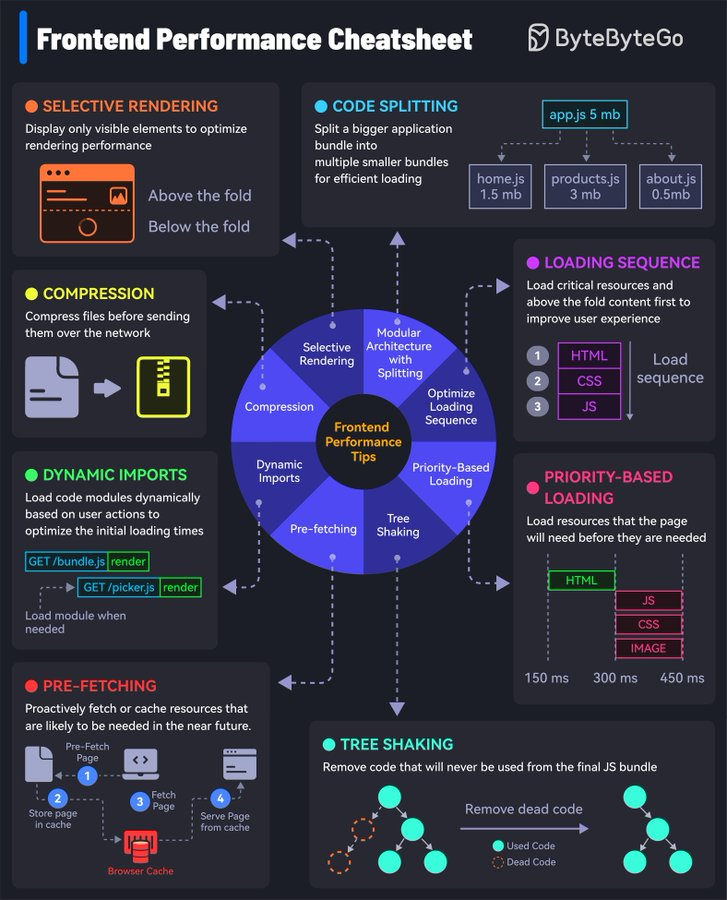

# Frontend Design

- [그림으로 보는 프론트엔드 설계](#그림으로-보는-프론트엔드-설계)
- [그림으로 보는 프론트엔드 최적화](#그림으로-보는-프론트엔드-최적화)
- [설계 목록](#설계-목록)
- [자료형과 초기값 설정](#자료형과-초기값-설정)
- [유효성 설계](#유효성-설계)
- [비동기 데이터 처리](#비동기-데이터-처리)
  - [API 타입 정의](#api-타입-정의)
  - [에러 핸들링](#에러-핸들링)
- [리스트 필터링](#리스트-필터링)
- [ENUM 관리](#enum-관리)
- [페이지 간 데이터 전달](#페이지-간-데이터-전달)
- [트릭 패턴](#트릭-패턴)
- [오래 걸리는 로직 처리](#오래-걸리는-로직-처리)
- [라이브러리 선택](#라이브러리-선택)

## 그림으로 보는 프론트엔드 설계


## 그림으로 보는 프론트엔드 최적화



## 설계 목록

- [ ] 디자인 패턴 정의: FSD(Feature-Sliced Design)
- [ ] 레이아웃 및 UI 구조: 레이아웃, 페이지, 네비게이션, 디자인 시스템 라이브러리
- [ ] 라우팅 및 인증: 라우팅 가드, 토큰 관리, 404/500 페이지
- [ ] 국제화(i18n): 다국어 데이터 구조 관리
- [ ] 데이터 관리: 전역 상태 관리, 브라우저 저장소 관리, Enum 관리
- [ ] 폼 관리: 데이터 구조, 초기값, 유효성 검사
- [ ] 통신 클라이언트 관리: Axios 인스턴스, 요청/응답 타입 정의, API 정의
- [ ] 비동기 데이터 관리: 로딩/성공/에러 상태 처리, 데이터 부재(0개) 시 화면 처리
- [ ] 데이터 쿼리 조작: 검색/정렬/필터링/페이징 쿼리 설계

## 자료형과 초기값 설정

대부분의 데이터는 명확한 자료형과 초기값을 가지도록 설계한다.

- 이유: 변수가 다양한 타입을 가지거나 초기값이 `undefined/null`일 경우, 런타임 메서드 호출 시 타입 에러가 발생할 수 있음.
- 전략:
  - 클라이언트 데이터는 조작이 용이한 `string` 형태를 기본으로 하며, 필요 시 변환하여 사용.
  - 초기값은 빈 문자열(`""`) 등으로 설정하여 `null` 참조 오류 방지.
  - TypeScript를 도입하여 컴파일 단계에서 타입 오류 방지 권장.

## 유효성 설계

- 원칙: 입력 자체를 막기보다는, 자유로운 입력을 허용하되 잘못된 입력에 대해 UI로 피드백을 제공한다.
- 제어: 유효성 에러가 존재하는 경우 API 요청 트리거를 비활성화한다.
- 구조: 유효성 검사 로직과 API 요청 로직은 분리하여 작성한다.

## 비동기 데이터 처리

- 상태 관리:
  - GET: `로딩` / `성공` / `에러`
  - Mutation (POST/PUT/DELETE): `대기` / `로딩` / `성공` / `에러`
- 데이터 가공:
  - 서버 데이터가 `null`일 경우를 대비해 옵셔널 체이닝(`?.`)과 Nullish 병합 연산자(`??`)를 활용하여 기본값 보장.
  - 불변성 유지: 원본 데이터를 직접 수정하지 않고, 가공된 새 데이터를 생성하여 사용.

### API 타입 정의

- Response (응답): 모든 필드는 누락되거나 `null`일 가능성을 염두에 두고 Optional 처리를 권장한다.
- Request (요청): 필수값과 선택값을 엄격히 구분하여, 선택값에만 Optional 처리를 한다.

### 에러 핸들링

- GET (조회): 에러 발생 시 UI에 에러 컴포넌트(Fallback) 노출.
- Mutation (수정/삭제): Toast 알림 메시지 및 후속 로직(롤백 등) 처리.
- 비동기 공통 에러: Axios Interceptor에서 전역적으로 핸들링 (예: 네트워크 오류, 인증 만료).
- 렌더링 에러 (React): `react-error-boundary`를 사용하여 컴포넌트 레벨에서 격리.
- 서버 에러 (Next.js): `error.js`, `global-error.js` 등 프레임워크 기능 활용.
- Uncaught 에러: Sentry 등의 모니터링 도구로 수집.

## 리스트 필터링

리스트 필터링은 URL Query String을 통해 관리한다.

- 장점: 새로고침 시 필터 상태 유지, 링크 공유 가능.
- 히스토리 관리:
  - `push`: 뒤로가기 시 이전 필터 상태로 이동.
  - `replace`: 뒤로가기 시 이전 페이지로 이동.
- 데이터 파싱:
  - 쿼리는 문자열로 전송되므로 사용 시 적절한 형변환 필요 (`qs` 라이브러리 등 활용).
  - 배열 데이터(`?foo=1&foo=2`)나 `null/undefined` 값의 전송 방식은 백엔드와 협의하여 결정.

## ENUM 관리

```ts
// ENUM 상수 정의
const USER_TYPE = {
  GUEST: 'GUEST',
  HR: 'HR',
  ADMIN: 'ADMIN',
  USER: 'USER',
} as const;

// ENUM 타입 정의
type UserType = (typeof USER_TYPE)[keyof typeof USER_TYPE];

// ENUM 관리 유틸리티
const userType = {
  ...USER_TYPE,
  values: Object.values(USER_TYPE),
  keys: Object.keys(USER_TYPE) as Array<keyof typeof USER_TYPE>,
  isValid(value: string): value is UserType {
    return this.values.includes(value as UserType);
  },
};
```

## 페이지 간 데이터 전달

- URL Query String 활용
- history 객체의 state 활용
- window.opener.postMessage 활용
- 브라우저 저장소 활용
- 전역 상태 관리 라이브러리 활용

## 트릭 패턴

- 빈 페이지를 인터셉터처럼 사용하여 분기 로직 처리하기

## 오래 걸리는 로직 처리

- 비동기 알림: 요청 접수 후 작업이 완료되면 이메일/알림 발송 (사용자는 대기하지 않음).
- 미리 생성 (Pre-generation): 프로젝트 종료 등 특정 시점에 미리 데이터를 생성해두고, 요청 시 즉시 제공.
- 실시간 생성 (지양): 요청 시 생성 (대기 시간 길어짐, 타임아웃 위험).

## 라이브러리 선택

- Repository Structure
  - [ ] Monorepo (Turborepo)
  - [ ] Multirepo
- UI Library
  - [ ] React
- Framework
  - [ ] Next.js
  - [ ] React Router (SPA)
  - [ ] Vite
- Backend Framework
  - [ ] Express
  - [ ] NestJS
- Package Manager
  - [ ] npm
  - [ ] Yarn
  - [ ] pnpm
- Styling
  - [ ] Emotion
  - [ ] Tailwind CSS
- Design System / UI Kit
  - [ ] Radix UI (Headless)
  - [ ] Shadcn/ui
  - [ ] MUI
- Form Management
  - [ ] React Hook Form
- Validation
  - [ ] Zod
  - [ ] Yup
- State Management
  - [ ] Zustand
  - [ ] Recoil
  - [ ] Jotai
- Async Data
  - [ ] Axios
  - [ ] TanStack Query (React Query)
- i18n
  - [ ] next-intl
  - [ ] react-i18next
- Visualization
  - [ ] Recharts
  - [ ] D3.js
- Interaction
  - [ ] dnd-kit (Drag & Drop)
  - [ ] TanStack Table
  - [ ] @silevis/reactgrid
  - [ ] Tiptap (WYSIWYG)
- Utilities
  - [ ] query-string
  - [ ] jwt-decode
  - [ ] es-toolkit
  - [ ] js-cookie
  - [ ] dayjs
- Code Quality
  - [ ] ESLint
  - [ ] Prettier
