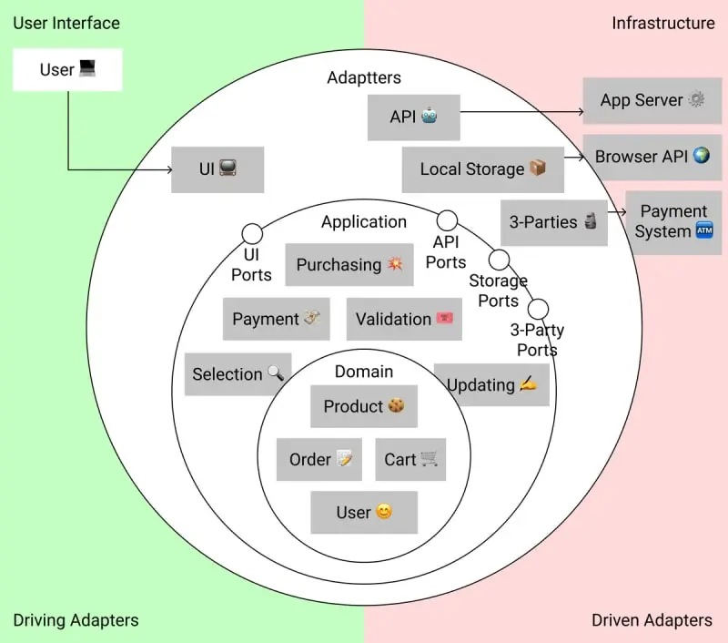
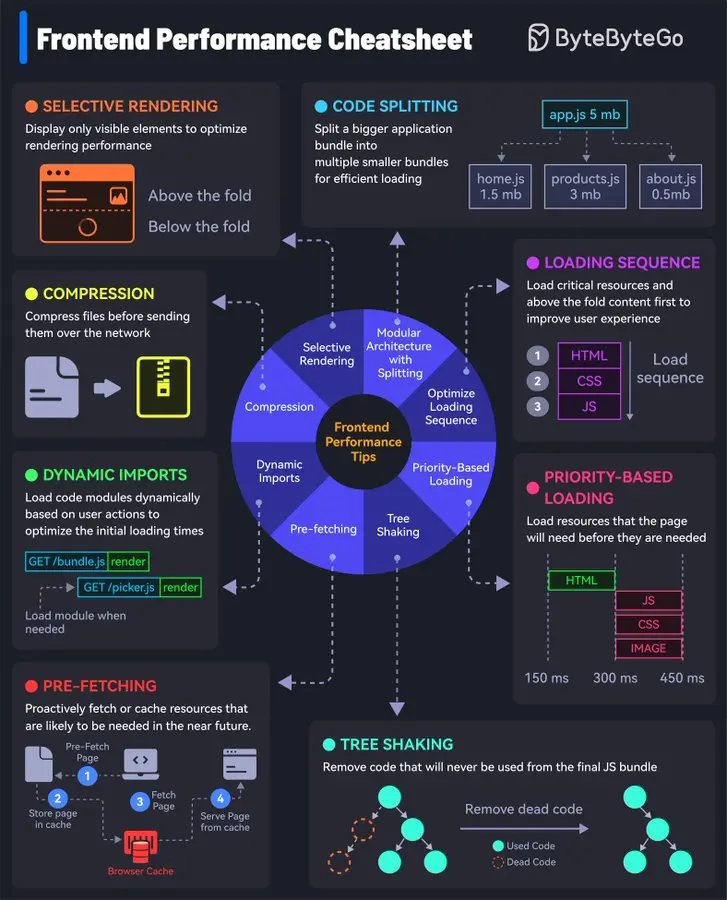

# 프론트엔드 설계(Frontend Design)

- [핵심 설계 다이어그램](#핵심-설계-다이어그램)
  - [전체 아키텍처](#전체-아키텍처)
  - [웹 성능 최적화](#웹-성능-최적화)
- [브라우저 성능 최적화(CRP)](#브라우저-성능-최적화crp)
- [프로젝트 아키텍처 패턴 - FSD](#프로젝트-아키텍처-패턴---fsd)
  - [레이어(Layer)](#레이어layer)
  - [슬라이스(Slice)와 세그먼트(Segment)](#슬라이스slice와-세그먼트segment)
  - [Public API](#public-api)
  - [FSD 디렉터리 구조 예시](#fsd-디렉터리-구조-예시)
- [라우팅 및 인증](#라우팅-및-인증)
  - [라우팅 가드(Route Guard)](#라우팅-가드route-guard)
  - [토큰 관리](#토큰-관리)
  - [에러 페이지(404/500)](#에러-페이지404500)
- [컴포넌트 디자인 패턴](#컴포넌트-디자인-패턴)
- [데이터 모델링 및 초기값 설정](#데이터-모델링-및-초기값-설정)
- [입력 유효성 검증(Validation)](#입력-유효성-검증validation)
- [비동기 데이터 통신](#비동기-데이터-통신)
  - [API 타입 정의](#api-타입-정의)
  - [에러 핸들링 전략](#에러-핸들링-전략)
- [상태 관리 및 상수화(ENUM)](#상태-관리-및-상수화enum)
- [국제화(i18n)](#국제화i18n)
  - [번역 데이터 구조](#번역-데이터-구조)
  - [라우팅 전략](#라우팅-전략)
- [페이지 간 데이터 전달](#페이지-간-데이터-전달)
- [빈 페이지를 인터셉터로 활용하기](#빈-페이지를-인터셉터로-활용하기)
- [장시간 로직 처리 전략](#장시간-로직-처리-전략)

## 핵심 설계 다이어그램

### 전체 아키텍처



### 웹 성능 최적화



## 브라우저 성능 최적화(CRP)

중요 렌더링 경로(Critical Rendering Path)를 최적화하여 사용자 체감 성능을 개선함.

- DOM 트리 구축: HTML을 파싱하여 DOM 노드 생성.
- CSSOM 트리 구축: CSS를 파싱하여 스타일 규칙 생성.
- 렌더 트리(Render Tree) 생성: DOM과 CSSOM을 결합하여 가시적인 노드만 포함하는 트리 구성.
- 레이아웃(Layout/Reflow): 노드의 정확한 위치와 크기를 계산.
- 페인트(Paint): 계산된 레이아웃을 실제 픽셀로 변환.
- 컴포지트(Composite): 여러 레이어를 하나로 합성하여 화면에 출력.

## 프로젝트 아키텍처 패턴 - FSD

Feature-Sliced Design(FSD)은 프론트엔드 프로젝트를 기능(Feature) 단위로 분할하여 구조화하는 아키텍처 방법론이다. 코드의 의존 방향을 상위 레이어에서 하위 레이어로 단방향으로 제한하여, 모듈 간 결합도를 낮추고 독립적인 개발/테스트를 가능하게 한다.

- 핵심 원칙:
  - 단방향 의존: 상위 레이어는 하위 레이어에 의존할 수 있지만, 하위 레이어는 상위 레이어를 참조할 수 없다.
  - 격리: 같은 레이어 내의 슬라이스는 서로 직접 참조하지 않는다.
  - Public API: 각 슬라이스는 `index.ts`를 통해 외부에 공개할 인터페이스만 노출한다.

### 레이어(Layer)

FSD는 7개의 표준 레이어를 정의하며, 위에서 아래로 갈수록 재사용성이 높고 추상화 수준이 낮다.

| 레이어      | 역할                                           | 예시                                        |
| ----------- | ---------------------------------------------- | ------------------------------------------- |
| `app`       | 앱 초기화, 프로바이더, 전역 설정               | 라우터 설정, 글로벌 스타일, 프로바이더 래핑 |
| `processes` | 여러 페이지에 걸친 복합 비즈니스 흐름 (선택적) | 결제 프로세스, 온보딩 플로우                |
| `pages`     | 라우트 단위의 페이지 컴포넌트                  | `/dashboard`, `/settings`                   |
| `widgets`   | 독립적인 UI 블록, 여러 feature/entity를 조합   | 헤더, 사이드바, 사용자 프로필 카드          |
| `features`  | 사용자 시나리오 단위의 기능                    | 로그인 폼, 댓글 작성, 좋아요 토글           |
| `entities`  | 비즈니스 도메인 모델과 관련 UI                 | User, Product, Order                        |
| `shared`    | 프로젝트 전반에서 재사용되는 유틸리티, UI 키트 | API 클라이언트, 공통 컴포넌트, 상수, 타입   |

- `app` -> `pages` -> `widgets` -> `features` -> `entities` -> `shared` 순으로 의존이 흐른다.
- `processes`는 대부분의 프로젝트에서 생략 가능하며, 복잡한 멀티스텝 흐름이 있을 때만 도입한다.

### 슬라이스(Slice)와 세그먼트(Segment)

- 슬라이스(Slice): 레이어 내에서 비즈니스 도메인 또는 기능 단위로 분리한 폴더. 예를 들어 `features/auth`, `features/comment`, `entities/user` 등이 각각 하나의 슬라이스다.
- 세그먼트(Segment): 슬라이스 내부를 기술적 역할로 구분한 폴더. 일반적으로 다음과 같은 세그먼트를 사용한다.

| 세그먼트 | 역할                                |
| -------- | ----------------------------------- |
| `ui`     | 컴포넌트, 스타일                    |
| `model`  | 상태 관리, 비즈니스 로직, 타입 정의 |
| `api`    | 서버 통신 함수                      |
| `lib`    | 슬라이스 내 유틸리티 함수           |
| `config` | 슬라이스 관련 설정값                |

### Public API

각 슬라이스의 루트에 `index.ts`를 두어 외부에 공개할 항목만 re-export한다. 슬라이스 외부에서는 반드시 이 `index.ts`를 통해서만 접근해야 하며, 내부 세그먼트를 직접 import하는 것을 금지한다.

```ts
// features/auth/index.ts
export { LoginForm } from './ui/LoginForm';
export { useAuth } from './model/useAuth';
export type { AuthState } from './model/types';
```

```ts
// ✅ correct: Public API를 통한 import
import { LoginForm } from '@/features/auth';

// ❌ incorrect: 내부 세그먼트 직접 import
import { LoginForm } from '@/features/auth/ui/LoginForm';
```

### FSD 디렉터리 구조 예시

```text
src/
├── app/                  # 앱 초기화, 프로바이더
│   ├── providers/
│   ├── styles/
│   └── index.tsx
├── pages/                # 라우트 단위 페이지
│   ├── dashboard/
│   │   ├── ui/
│   │   └── index.ts
│   └── settings/
│       ├── ui/
│       └── index.ts
├── widgets/              # 독립적인 UI 블록
│   ├── header/
│   │   ├── ui/
│   │   └── index.ts
│   └── sidebar/
│       ├── ui/
│       ├── model/
│       └── index.ts
├── features/             # 사용자 기능 단위
│   ├── auth/
│   │   ├── ui/
│   │   ├── model/
│   │   ├── api/
│   │   └── index.ts
│   └── comment/
│       ├── ui/
│       ├── model/
│       ├── api/
│       └── index.ts
├── entities/             # 비즈니스 도메인 모델
│   ├── user/
│   │   ├── ui/
│   │   ├── model/
│   │   ├── api/
│   │   └── index.ts
│   └── product/
│       ├── ui/
│       ├── model/
│       └── index.ts
└── shared/               # 공통 유틸리티, UI 키트
    ├── ui/
    ├── lib/
    ├── api/
    ├── config/
    └── types/
```

## 라우팅 및 인증

SPA/SSR 환경에서 라우팅 구조와 인증 흐름은 사용자 경험과 보안에 직접적인 영향을 미친다. 라우트 보호, 토큰 수명 관리, 에러 페이지 처리를 체계적으로 설계해야 한다.

### 라우팅 가드(Route Guard)

인증/인가 상태에 따라 특정 라우트의 접근을 제어하는 패턴이다.

- 접근 제어 분류:
  - Public: 누구나 접근 가능 (로그인 페이지, 랜딩 페이지).
  - Protected: 인증된 사용자만 접근 가능 (대시보드, 설정).
  - Role-based: 특정 권한을 가진 사용자만 접근 가능 (관리자 페이지).
- 구현 방식:
  - React Router: 래퍼 컴포넌트(`<ProtectedRoute>`)로 인증 상태를 검사하고, 미인증 시 로그인 페이지로 리다이렉트함.
  - Next.js: `proxy.ts`에서 요청 단계에 토큰 유무를 검사하여 서버 사이드에서 리다이렉트 처리함.
- 리다이렉트 복귀: 로그인 후 원래 접근하려던 페이지로 돌아가기 위해, 리다이렉트 시 `returnUrl`(또는 `callbackUrl`)을 Query String에 포함시킴.

```ts
// React Router 래퍼 컴포넌트 예시
function ProtectedRoute({ children }: { children: React.ReactNode }) {
  const { isAuthenticated } = useAuth();
  const location = useLocation();

  if (!isAuthenticated) {
    return <Navigate to={`/login?returnUrl=${location.pathname}`} replace />;
  }

  return children;
}
```

### 토큰 관리

Access Token과 Refresh Token을 조합하여 인증 상태를 유지한다.

| 항목      | Access Token                     | Refresh Token          |
| --------- | -------------------------------- | ---------------------- |
| 용도      | API 요청 인증                    | Access Token 갱신      |
| 수명      | 짧음 (15분 ~ 1시간)              | 긺 (7일 ~ 30일)        |
| 저장 위치 | 메모리 또는 `Authorization` 헤더 | `httpOnly` 쿠키 (권장) |

- 자동 갱신(Silent Refresh):
  - Axios Interceptor에서 401 응답을 감지하면 Refresh Token으로 새 Access Token을 발급받고, 실패한 요청을 재시도함.
  - 동시에 여러 요청이 401을 받는 경우, 토큰 갱신 요청이 중복되지 않도록 큐잉 처리가 필요함.
- Refresh Token 만료 시: 사용자를 로그인 페이지로 리다이렉트하고, 저장된 인증 정보를 초기화함.

### 에러 페이지(404/500)

- 404 (Not Found):
  - 정의되지 않은 라우트에 대한 catch-all 페이지를 설정함.
  - React Router: `path="*"` 라우트에 404 컴포넌트를 매핑.
  - Next.js: `not-found.tsx` 파일 컨벤션을 사용.
- 500 (Server Error):
  - 서버 렌더링 중 발생한 예외를 처리하는 에러 바운더리 페이지.
  - Next.js: `error.tsx`(라우트 세그먼트별), `global-error.tsx`(루트 레이아웃 에러)를 활용.
- 공통 원칙:
  - 에러 페이지에서 홈 또는 이전 페이지로 돌아갈 수 있는 네비게이션을 제공함.
  - 에러 발생 시 Sentry 등의 모니터링 도구로 자동 리포팅하여, 사용자가 직접 신고하지 않아도 추적 가능하게 함.

## 컴포넌트 디자인 패턴

재사용성과 유지보수성을 극대화하기 위한 설계 패턴임.

- 복합 컴포넌트 패턴(Compound Components): 부모 컴포넌트 내부에 여러 자식 컴포넌트가 결합되어 하나의 기능을 수행하는 방식 (예: `Select`, `Accordion`).
- 컨테이너/프리젠터 패턴(Container/Presenter): 데이터 로직(Container)과 UI 렌더링(Presenter)을 분리함. (최근에는 Custom Hooks로 로직을 분리하는 방식이 더 선호됨).
- 렌더 프롭 패턴(Render Props): 컴포넌트의 일부 렌더링 로직을 함수형 프로퍼티로 외부에서 주입함.
- 아토믹 디자인(Atomic Design): UI를 원자(Atom), 분자(Molecule), 유기체(Organism) 등의 계층으로 나누어 구축함.

## 데이터 모델링 및 초기값 설정

명확한 자료형과 안정적인 초기값을 정의하여 런타임 오류를 방지함.

- 초기값 전략:
  - 데이터의 부재를 `null`보다는 빈 문자열(`""`)이나 빈 배열(`[]`)로 표현하여 참조 오류를 최소화함.
  - TypeScript를 활용하여 컴파일 단계에서 타입 불일치를 검증함.
- 데이터 변환(Serialize / Deserialize):
  - 서버 응답 데이터를 그대로 사용하지 않고, 프론트엔드에서 다루기 쉬운 형태로 변환(Deserialize)하여 사용한다. API 요청 시에는 서버가 기대하는 형태로 다시 변환(Serialize)하여 전송한다.
  - 서버와 클라이언트 간 데이터 구조가 다른 경우가 많기 때문에, 변환 계층을 두어 UI 로직과 API 스펙의 결합도를 낮춘다.
  - 예: 서버에서 `"2026-03-13T00:00:00Z"` 형태의 날짜 문자열을 받으면, 클라이언트에서는 `Date` 객체나 `dayjs` 인스턴스로 변환하여 사용하고, 전송 시 다시 ISO 문자열로 직렬화함.
  - 예: 서버에서 `price: 10000` (숫자)로 내려오면, 폼에서는 `"10000"` (문자열)로 변환하여 입력 필드에서 다루고, 전송 시 다시 숫자로 변환함.

```ts
// 서버 응답 타입
interface UserResponse {
  user_name: string;
  created_at: string;
  is_active: number; // 0 | 1
}

// 클라이언트 모델 타입
interface User {
  userName: string;
  createdAt: Date;
  isActive: boolean;
}

// Deserialize: 서버 -> 클라이언트
function toUser(res: UserResponse): User {
  return {
    userName: res.user_name,
    createdAt: new Date(res.created_at),
    isActive: res.is_active === 1,
  };
}

// Serialize: 클라이언트 -> 서버
function toUserRequest(user: User): UserResponse {
  return {
    user_name: user.userName,
    created_at: user.createdAt.toISOString(),
    is_active: user.isActive ? 1 : 0,
  };
}
```

## 입력 유효성 검증(Validation)

1. 자유 입력 + 실시간 피드백 (Validation 중심)
   - `onChange`: 값만 저장.
   - 오류 메시지 실시간 표시.
   - 언제: 이메일, 비밀번호 등 형식 검증이 중요한 텍스트 필드.

2. 제한 입력 + blur 클램핑
   - `onChange`: 형식만 차단 (숫자만 허용 등).
   - `onBlur`: 범위 보정 (min/max 초과 시 클램핑).
   - 언제: 숫자 범위 입력 (나이, 글자 수 제한 등).

3. Masked Input
   - `onChange`: 입력과 동시에 포맷 강제 적용 (`010-1234-5678`, `2026/03/18`).
   - 라이브러리: `react-imask`, `react-input-mask`.
   - 언제: 전화번호, 날짜, 카드번호.

4. Debounced Validation
   - `onChange`: 일정 시간 후 검증 실행 (300~500ms).
   - 언제: 중복 확인처럼 API 호출이 필요한 경우 (이메일, 닉네임).

5. Submit-only Validation
   - `onChange`: 아무것도 하지 않음.
   - `onSubmit`에서만 검증.
   - 언제: 짧은 단순 폼, 입력 중 방해 최소화가 목표일 때.

## 비동기 데이터 통신

- 상태 흐름: `대기(Idle)` -> `로딩(Loading)` -> `성공(Success)` 또는 `실패(Error)`.
- 가공: 원본 데이터를 직접 수정하지 않고 가공된 결과물만 사용함 (불변성 유지).

### API 타입 정의

- 응답(Response): 서버 데이터의 누락 가능성을 고려하여 Optional 속성을 적극 사용함.
- 요청(Request): 필수 파라미터를 엄격히 정의하고 부수적인 필드만 선택적으로 처리함.

### 에러 핸들링 전략

- 전역 처리: Axios Interceptor 등을 활용하여 네트워크 장애, 인증 만료를 일괄 관리함.
- 지역 처리: 특정 기능 내 에러는 Error Boundary 등을 사용하여 UI의 부분적 격리 및 복구를 수행함.

## 상태 관리 및 상수화(ENUM)

변하지 않는 상수 집합은 객체(`as const`)로 관리하여 자동 완성과 타입 안전성을 확보함.

```ts
const STATUS = {
  ACTIVE: 'ACTIVE',
  INACTIVE: 'INACTIVE',
} as const;
```

## 국제화(i18n)

다국어 지원이 필요한 프로젝트에서는 번역 데이터의 구조, 라우팅 전략, 런타임 언어 전환 방식을 초기 설계 단계에서 결정해야 한다. 나중에 도입하면 전체 컴포넌트를 수정해야 하므로 비용이 크다.

- 핵심 용어:
  - Locale: 언어 + 지역 조합 (예: `ko-KR`, `en-US`, `ja-JP`).
  - 번역 키(Translation Key): UI 텍스트를 식별하는 문자열 키 (예: `common.button.submit`).
  - 네임스페이스(Namespace): 번역 파일을 기능/페이지 단위로 분리하는 그룹 (예: `common`, `auth`, `dashboard`).

### 번역 데이터 구조

번역 데이터는 JSON 파일로 관리하며, 네임스페이스별로 분리하여 필요한 번역만 로드한다.

```text
locales/
  ko/
    common.json
    auth.json
    dashboard.json
  en/
    common.json
    auth.json
    dashboard.json
```

```json
// locales/ko/common.json
{
  "button": {
    "submit": "제출",
    "cancel": "취소"
  },
  "error": {
    "required": "{{field}} 항목은 필수 입력이다.",
    "minLength": "{{field}} 항목은 최소 {{min}}자 이상이어야 한다."
  }
}
```

- 중첩 키 구조(`button.submit`)를 사용하여 관련 번역을 그룹화함.
- 동적 값은 보간(Interpolation) 문법(`{{field}}`)으로 처리함.
- 복수형(Pluralization)이 필요한 언어는 `_one`, `_other` 등의 접미사 규칙을 따름.

### 라우팅 전략

다국어 라우팅은 URL에 locale을 포함하는 방식과 포함하지 않는 방식으로 나뉜다.

| 전략               | URL 형태                           | 특징                                           |
| ------------------ | ---------------------------------- | ---------------------------------------------- |
| URL prefix         | `/ko/about`, `/en/about`           | SEO에 유리, 크롤러가 언어별 페이지를 구분 가능 |
| Cookie/Header 기반 | `/about` (locale은 쿠키에 저장)    | URL이 깔끔하지만 SEO 불리, 캐싱 복잡           |
| 서브도메인         | `ko.example.com`, `en.example.com` | 인프라 설정 필요, 대규모 서비스에 적합         |

- Next.js에서의 구현:
  - `next-intl`, `next-i18next` 등의 라이브러리를 사용하여 App Router의 `[locale]` 동적 세그먼트로 처리함.
  - `proxy.ts`에서 `Accept-Language` 헤더 또는 쿠키를 기반으로 기본 locale을 감지하고 리다이렉트함.
- SPA(React Router)에서의 구현:
  - `react-i18next`의 `useTranslation` 훅으로 컴포넌트 내에서 번역 텍스트를 조회함.
  - 언어 전환 시 페이지 새로고침 없이 런타임에서 locale을 변경함.

## 페이지 간 데이터 전달

페이지 이동 시 데이터를 함께 넘겨야 하는 경우, 데이터의 크기 / 보안 요구 / 영속성 여부에 따라 적절한 방식을 선택한다.

| 방식                        | 영속성                    | 데이터 크기             | 공유 가능       |
| --------------------------- | ------------------------- | ----------------------- | --------------- |
| URL Query String            | 새로고침 유지             | 소량 (URL 길이 제한)    | 가능 (URL 복사) |
| history state               | 세션 내 유지              | 중간 (직렬화 가능 객체) | 불가            |
| `window.opener.postMessage` | 없음 (일회성)             | 중간                    | 불가            |
| 브라우저 저장소             | Storage 정책에 따름       | 대량 가능               | 같은 Origin 내  |
| 전역 상태 관리              | 메모리 (새로고침 시 소멸) | 대량 가능               | 불가            |

- URL Query String:
  - 검색 조건, 필터값 등 북마크/공유가 필요한 데이터에 적합.
  - 민감 정보(토큰 등)는 URL에 노출되므로 사용을 지양함.
  - `qs`, `query-string` 등의 라이브러리로 배열/중첩 객체 직렬화를 처리할 수 있음.
- history state (`navigate(path, { state })` 또는 `history.pushState`):
  - URL에 노출되지 않으면서 페이지 간 데이터를 전달할 수 있음.
  - 브라우저 세션이 유지되는 동안만 유효하며, 직접 URL 입력이나 새 탭으로 접근 시 `state`가 `null`이 되므로 fallback 처리가 필요함.
- `window.opener.postMessage`:
  - `window.open`으로 팝업 창을 띄운 뒤, 팝업에서 부모 창으로 결과를 전달하는 패턴에 사용됨.
  - `targetOrigin`을 반드시 명시하여 교차 출처 보안 문제를 방지해야 함.
  - 수신 측에서 `event.origin` 검증이 필수적임.
- 브라우저 저장소 (`localStorage` / `sessionStorage` / `IndexedDB`):
  - 대량의 데이터를 저장하거나 탭 간 공유가 필요할 때 활용.
  - `localStorage`는 같은 Origin의 모든 탭에서 접근 가능하며, `storage` 이벤트를 통해 탭 간 동기화도 가능함.
  - 민감 정보 저장 시 XSS 공격에 노출될 수 있으므로 주의가 필요함.
- 전역 상태 관리 (Zustand, Recoil 등):
  - SPA 내에서 라우트 전환 시 컴포넌트 간 데이터를 공유하는 가장 자연스러운 방법.
  - 새로고침 시 상태가 초기화되므로, 영속성이 필요하면 `persist` 미들웨어 등을 조합하여 사용함.

## 빈 페이지를 인터셉터로 활용하기

특정 URL로 진입했을 때, 실제 화면을 렌더링하지 않고 조건에 따라 다른 페이지로 리다이렉트하는 패턴이다. 빈 페이지(또는 로딩 전용 페이지)가 라우트 미들웨어 역할을 수행한다.

- 활용 사례:
  - OAuth 콜백 처리: `/auth/callback` 페이지에서 인증 코드를 받아 토큰 교환 후 적절한 페이지로 이동.
  - 딥 링크 분기: 사용자 권한/상태에 따라 같은 URL에서 서로 다른 목적지로 분기.
  - 외부 시스템 연동: 외부 서비스에서 돌아온 후 결과값을 파싱하여 후속 처리.
- 구현:
  - 해당 라우트의 컴포넌트에서 UI를 렌더링하지 않고(`return null` 또는 로딩 스피너만 표시), `useEffect` 내에서 조건 판별 후 `navigate`/`router.push`로 리다이렉트함.
  - 이 페이지의 히스토리 엔트리가 남지 않도록 `replace` 옵션을 사용하는 것이 일반적임.

## 장시간 로직 처리 전략

- 비동기 알림: 요청 즉시 응답하고 처리가 완료되면 푸시 알림이나 이메일을 발송함.
- 사전 생성(Pre-generation): 트래픽이 몰리지 않는 시점에 미리 결과를 생성하여 데이터베이스에 저장함.
