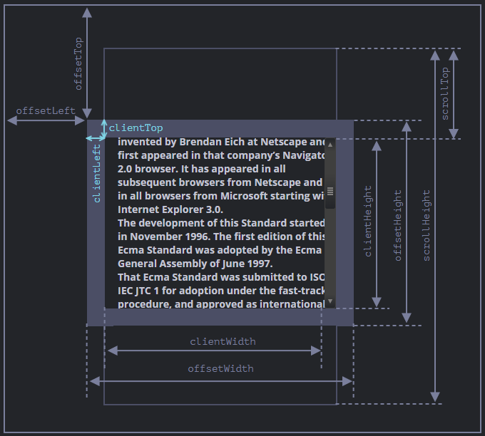

# 기하와 좌표

- [요소 사이즈와 요소 스크롤](#요소-사이즈와-요소-스크롤)
- [브라우저창 사이즈](#브라우저창-사이즈)
- [문서 사이즈](#문서-사이즈)
- [브라우저창/문서 스크롤](#브라우저창문서-스크롤)
  - [스크롤바 막기](#스크롤바-막기)
- [요소의 좌표](#요소의-좌표)
- [마우스 좌표](#마우스-좌표)

## 요소 사이즈와 요소 스크롤



요소 스크롤바는 `scrollTop`과 `scrollLeft`를 조작하여 움직일 수 있다. `scrollTop`과 `scrollLeft`를 제외한 모든 프로퍼티는 읽기 전용이다.

| 속성           | 설명                                                           |
| -------------- | -------------------------------------------------------------- |
| `offsetParent` | 가장 가까운 `postion` 속성이 적용된 부모 요소                  |
| `offsetTop`    | `offsetParent`를 기준으로 한 요소의 `borderY` 시작까지의 거리  |
| `offsetLeft`   | `offsetParent`를 기준으로 한 요소의 `borderX` 시작까지의 거리  |
| `offsetWidth`  | `paddingX` + `width` + `borderX` + y축 스크롤바 너비           |
| `offsetHeight` | `paddingY` + `height` + `borderY` + x축 스크롤바 높이          |
| `clientTop`    | 요소의 가장 상단에서 `clientHeight` 시작까지의 거리(`borderY`) |
| `clientLeft`   | 요소의 가장 왼쪽에서 `clientWidth` 시작까지의 거리(`borderX`)  |
| `clientWidth`  | `paddingX` + `width`                                           |
| `clientHeight` | `paddingY` + `height`                                          |
| `scrollTop`    | 요소의 세로 스크롤 위치                                        |
| `scrollLeft`   | 요소의 가로 스크롤 위치                                        |
| `scrollWidth`  | `clientWidth` + 오버플로우된 영역의 너비                       |
| `scrollHeight` | `clientHeight` + 오버플로우된 영역의 높이                      |

## 브라우저창 사이즈

`document.documentElement`는 `html` 요소를 의미한다.

| 속성                                    | 설명                                               |
| --------------------------------------- | -------------------------------------------------- |
| `window.innerWidth`                     | y축 스크롤바 너비가 포함된 브라우저 창 너비        |
| `window.innerHeight`                    | x축 스크롤바 높이가 포함된 브라우저 창 높이        |
| `document.documentElement.clientWidth`  | y축 스크롤바 너비가 포함되지 않은 브라우저 창 너비 |
| `document.documentElement.clientHeight` | x축 스크롤바 높이가 포함되지 않은 브라우저 창 높이 |

## 문서 사이즈

아래 방식은 정확한 문서 전체 너비/높이를 얻기 위해 오래 전부터 사용하던 방식이므로 이해할 필요가 없다.

```js
console.log(
  Math.max(
    document.body.scrollWidth,
    document.documentElement.scrollWidth,
    document.body.offsetWidth,
    document.documentElement.offsetWidth,
    document.body.clientWidth,
    document.documentElement.clientWidth,
  ),
); // 스크롤에 가려진 부분 포함 문서 총 너비

console.log(
  Math.max(
    document.body.scrollHeight,
    document.documentElement.scrollHeight,
    document.body.offsetHeight,
    document.documentElement.offsetHeight,
    document.body.clientHeight,
    document.documentElement.clientHeight,
  ),
); // 스크롤에 가려진 부분 포함 문서 총 높이
```

## 브라우저창/문서 스크롤

| 속성                            | 설명                                                        |
| ------------------------------- | ----------------------------------------------------------- |
| `window.scrollX`                | 문서의 세로 스크롤 위치(`window.pageXOffset`에서 이름 변경) |
| `window.scrollY`                | 문서의 가로 스크롤 위치(`window.pageYOffset`에서 이름 변경) |
| `window.scrollTo(x, y)`         | 절대 좌표 기준으로 문서의 스크롤 이동                       |
| `window.scrollBy(x, y)`         | 상대 좌표 기준으로 문서의 스크롤 이동                       |
| `element.scrollIntoView(true)`  | 요소의 위쪽 모서리가 창 위쪽 모서리와 일치하게 이동         |
| `element.scrollIntoView(false)` | 요소의 아래쪽 모서리가 창 아래쪽 모서리와 일치하게 이동     |

### 스크롤바 막기

```js
// 스크롤바 고정
document.body.style.overflow = 'hidden';
// 스크롤바 고정 시 스크롤바 너비만큼 보정
document.body.style.paddingleft = window.innerWidth - document.documentElement.clientWidth;
// 스크롤바 고정 해제
document.body.style.overflow = '';
// 스크롤바 고정 해제 시 스크롤바 너비만큼 보정 해제
document.body.style.paddingRight = '';
```

## 요소의 좌표


자바스크립트에서 `document.querySelector`를 사용하든, 리액트에서 `useRef`를 사용하든, 좌표를 알고싶은 요소의 객체를 가져와서 `getBoundingClientRect()` 메서드를 사용한다.

창 기준 좌표는 `position: fixed`와 사용하고 문서 기준 좌표는 `position: absolute`와 사용한다.

```js
// 브라우저창 기준 좌표(position: fixed)
const { x, y, width, height, top, left, bottom, right } = element.getBoundingClientRect();

// 문서 기준 좌표(position: absolute)
function getCoords(elem) {
  let { top, left, bottom, right } = element.getBoundingClientRect();

  return {
    top: top + window.scrollY,
    left: left + window.scrollX,
    bottom: bottom + window.scrollY,
    right: right + window.scrollX,
  };
}
```

아래 메서드로 css 선택자와 일치하는 요소를 부모로 올라가면서 찾을 수 있다.

```js
element.closest('#droppable');
```

## 마우스 좌표


아래는 기준에 따라 달라지는 마우스 좌표 값이다.

```js
element.onmousemove = function (e) {
  // 모니터 기준
  console.log(e.screenX);
  console.log(e.screenY);
  // 브라우저창 기준
  console.log(e.clientX);
  console.log(e.clientY);
  // 문서 기준
  console.log(e.pageX);
  console.log(e.pageY);
  // 요소 기준
  console.log(e.offsetX);
  console.log(e.offsetY);
};
```

아래 메서드는 주어진 마우스 좌표 아래의 가장 가까운 중첩 요소를 반환한다.

```ts
document.elementFromPoint(x, y);
```
