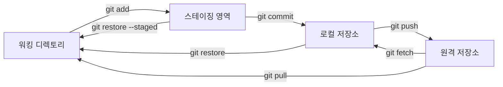

# Git

- [설정(Config)](#설정config)
  - [git 다중 사용자 설정](#git-다중-사용자-설정)
  - [git SSH 접속 설정](#git-ssh-접속-설정)
- [초기화(Initialization)](#초기화initialization)
  - [git init](#git-init)
  - [git 비활성화](#git-비활성화)
  - [git remote](#git-remote)
  - [git clone](#git-clone)
- [소스 제어(Source Control)](#소스-제어source-control)
  - [git add](#git-add)
  - [git commit](#git-commit)
  - [git push](#git-push)
  - [git pull](#git-pull)
  - [git fetch](#git-fetch)
  - [git merge](#git-merge)
  - [git rebase](#git-rebase)
  - [git revert](#git-revert)
  - [git reset](#git-reset)
  - [git restore](#git-restore)
  - [git status](#git-status)
  - [git log](#git-log)
  - [git stash](#git-stash)
- [브랜치 제어(Branch Control)](#브랜치-제어branch-control)
  - [git branch](#git-branch)
  - [git switch](#git-switch)
- [커밋 제어(Commit Control)](#커밋-제어commit-control)
  - [git checkout](#git-checkout)
  - [git cherry-pick](#git-cherry-pick)

## 설정(Config)

전역 설정 파일에 사용자 이름과 이메일을 아래 명령어를 사용하여 설정함.

`~/.gitconfig`

```sh
git config --global user.name "이름"
git config --global user.email "이메일"
```

### git 다중 사용자 설정

여러 서비스(GitHub, Bitbucket 등)를 이용할 경우 아래와 같이 조건부 포함(`includeIf`)을 사용하여 설정 가능함.

`~/.gitconfig`

```sh
[includeIf "gitdir:~/github/"]
    path = ~/github/.gitconfig

[includeIf "gitdir:~/bitbucket/"]
    path = ~/bitbucket/.gitconfig
```

`~/github/.gitconfig`

```sh
[user]
    name = RHUK2
    email = gusdnr814@naver.com
```

### git SSH 접속 설정

RSA 또는 Ed25519 방식으로 암호화된 SSH 키를 생성함.

```sh
ssh-keygen -t rsa -C "email@example.com"
ssh-keygen -t ed25519 -C "email@example.com"
```

- 공개키(Public Key): `*.pub` 파일. 내용을 복사하여 서비스의 SSH 설정에 등록함.
- 개인키(Private Key): 외부로 유출되지 않도록 주의함.

방화벽으로 인해 22번 포트가 막힌 경우, 443 포트(HTTPS)를 사용하도록 `~/.ssh/config` 설정을 변경함.

```sh
Host github.com
    Hostname ssh.github.com
    Port 443

Host bitbucket.org
    Hostname altssh.bitbucket.org
    Port 443
```

## 초기화(Initialization)


### git init

현재 디렉토리를 로컬 저장소(Local Repository)로 초기화함. 버전 관리가 시작됨.

```sh
git init
```

### git 비활성화

`.git` 디렉토리를 삭제하여 버전 관리를 중단함.

```sh
rm -rf .git
```

### git remote

로컬 저장소와 원격 저장소(Remote Repository)의 연결을 관리함.

```sh
git remote -v # 연결된 원격 저장소 목록 확인
git remote add <별명> <주소> # 원격 저장소 추가
git remote remove <별명> # 원격 저장소 삭제
git remote prune <별명> # 유효하지 않은 원격 브랜치 정리
```

### git clone

원격 저장소의 내용을 로컬로 복제함.

```sh
git clone <원격 저장소 주소>
```

## 소스 제어(Source Control)



### git add

변경 사항을 스테이징 영역(Staging Area)으로 추가함.

```sh
git add . # 모든 변경 파일 추가
git add <파일경로> # 특정 파일 추가
```

### git commit

스테이징 영역의 변경 사항을 로컬 저장소에 기록함.

```sh
git commit -m "메시지"
git commit --amend -m "새 메시지" # 최근 커밋 메시지 수정
```

### git push

로컬 저장소의 커밋 내역을 원격 저장소로 전송함.

```sh
git push <원격저장소> <브랜치명>
git push -u <원격저장소> <브랜치명> # 업스트림(Upstream) 설정
```

### git pull

원격 저장소의 변경 사항을 가져와서 현재 브랜치에 병합(Merge)함. `fetch`와 `merge`가 결합된 명령어임.

```sh
git pull <원격저장소> <브랜치명>
```

### git fetch

원격 저장소의 변경 사항 정보를 가져오지만 병합은 하지 않음.

```sh
git fetch <원격저장소>
```

### git merge

다른 브랜치의 변경 사항을 현재 브랜치로 통합함.

- 빨리 감기 병합(Fast-forward Merge): 별도의 커밋 없이 브랜치 포인터만 이동함.
- 3-way Merge: 공통 조상을 기준으로 새로운 머지 커밋을 생성함.

```sh
git merge <대상브랜치>
git merge --no-ff <대상브랜치> # 항상 머지 커밋 생성
git merge --abort # 충돌 발생 시 병합 중단
```

### git rebase

브랜치의 베이스(Base)를 다른 커밋으로 재설정하여 커밋 히스토리를 선형적으로 관리함.

- 활용 사례: 작업 브랜치를 최신 메인 브랜치 위로 재정렬하여 깨끗한 히스토리 유지.
- 위험성: 이미 원격 저장소에 공유된 커밋을 Rebase하면 히스토리가 변조되어 다른 협업자의 작업과 충돌함.
- 강제 푸시(Force Push): Rebase 후 원격 저장소에 반영하려면 `git push --force`가 필요함. 이때 `--force-with-lease`를 사용하여 타인의 커밋 덮어쓰기를 방지하는 것이 안전함.

```sh
git rebase <대상브랜치>
git push --force-with-lease # 안전한 강제 푸시
```

### git revert

기존 커밋의 변경 사항을 취소하는 새로운 커밋을 생성함. 히스토리를 보존하며 되돌릴 때 사용함.

```sh
git revert <커밋ID>
```

### git reset

특정 커밋 상태로 되돌림. 히스토리를 삭제하거나 변경할 때 사용함.

- `--soft`: 인덱스와 워킹 디렉토리는 유지 (커밋만 취소).
- `--mixed`: 인덱스는 초기화, 워킹 디렉토리는 유지 (기본값).
- `--hard`: 인덱스와 워킹 디렉토리 모두 초기화 (변경 사항 삭제).

```sh
git reset --hard <커밋ID>
```

### git restore

파일의 변경 사항을 복구함.

```sh
git restore <파일명> # 워킹 디렉토리 변경 취소
git restore --staged <파일명> # 스테이징 취소
```

### git status

작업 디렉토리와 스테이징 영역의 상태를 확인함.

### git log

커밋 히스토리를 확인함.

### git stash

현재의 작업 중간 상태를 임시로 저장하고 워킹 디렉토리를 깨끗하게 만듦.

```sh
git stash save "메시지"
git stash list # 목록 확인
git stash pop # 최근 상태 복구 및 삭제
git stash apply # 최근 상태 복구 (유지)
git stash drop # 삭제
```

## 브랜치 제어(Branch Control)

### git branch

브랜치 생성, 목록 확인, 삭제 등을 수행함.

```sh
git branch <새브랜치명>
git branch -v # 상세 목록
git branch -d <브랜치명> # 삭제
git branch -D <브랜치명> # 강제 삭제
```

### git switch

브랜치를 전환함.

```sh
git switch <브랜치명>
git switch -c <새브랜치명> # 생성 후 이동
```

## 커밋 제어(Commit Control)

### git checkout

특정 커밋이나 파일 상태로 이동함. (최근에는 `switch`와 `restore`로 기능이 분리됨)

### git cherry-pick

다른 브랜치의 특정 커밋 하나만 현재 브랜치로 가져옴.

```sh
git cherry-pick <커밋ID>
```
