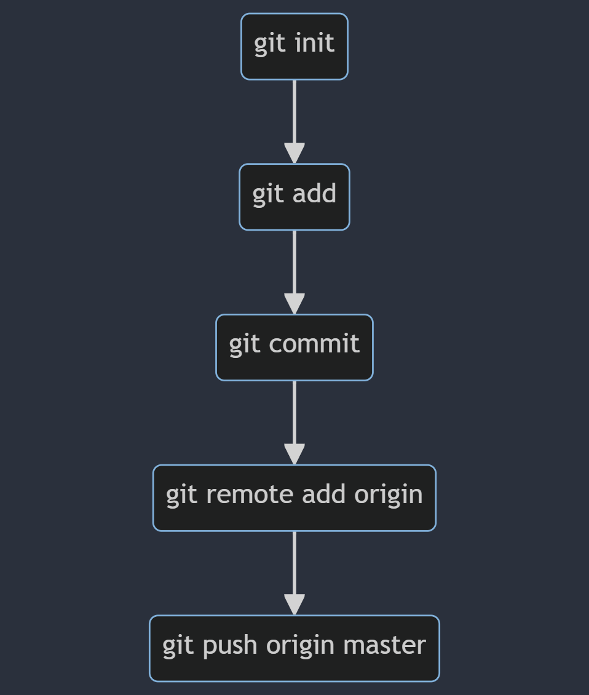
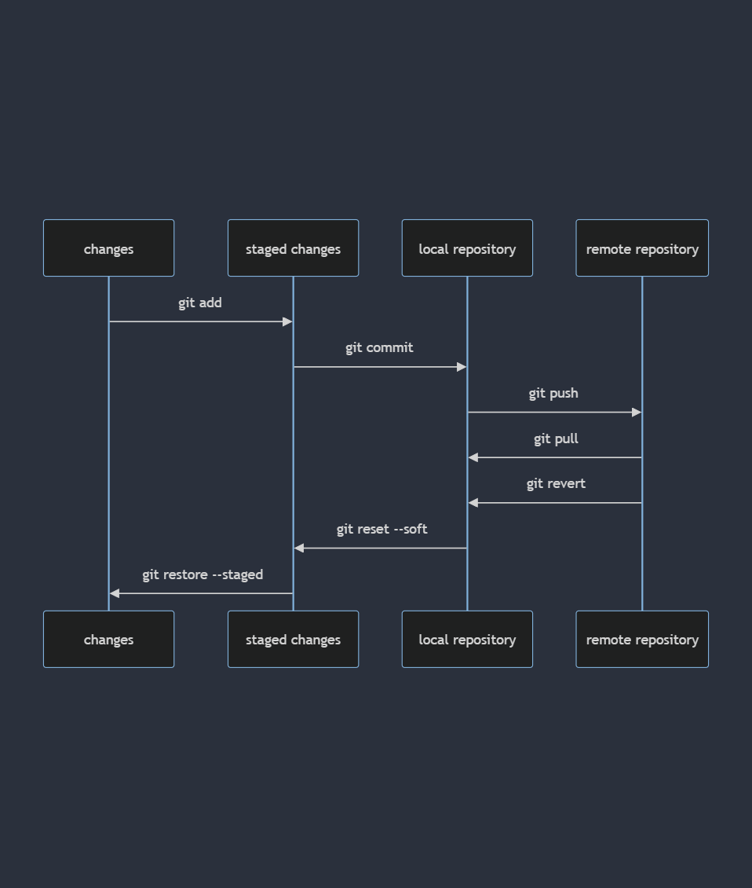

# Git Note

- [git ssh 접속 설정](#git-ssh-접속-설정)
  - [ssh config 작성 요령](#ssh-config-작성-요령)
- [git 사용자 설정](#git-사용자-설정)
- [Initialization](#initialization)
  - [git init](#git-init)
  - [git 비활성화](#git-비활성화)
  - [git remote](#git-remote)
  - [git clone](#git-clone)
- [Source Control](#source-control)
  - [git add](#git-add)
  - [git commit](#git-commit)
  - [git push](#git-push)
  - [git pull](#git-pull)
  - [git fetch](#git-fetch)
  - [git merge](#git-merge)
  - [git rebase](#git-rebase)
  - [git revert](#git-revert)
  - [git reset](#git-reset)
  - [git restore](#git-restore)
  - [git status](#git-status)
  - [git log](#git-log)
  - [git stash](#git-stash)
- [Branch Control](#branch-control)
  - [git branch](#git-branch)
  - [git switch](#git-switch)
- [Commit Control](#commit-control)
  - [git checkout](#git-checkout)
  - [git cherry-pick](#git-cherry-pick)

## git ssh 접속 설정

아래 코드를 통해 rsa 또는 ed25519 방식으로 암호화된 ssh 키 생성

```sh
ssh-keygen -t rsa -C [이메일명] # rsa 타입으로 이메일 코멘트가 붙은 키 생성
ssh-keygen -t ed25519 -C [이메일명] # ed25519 타입으로 이메일 코멘트가 붙은 키 생성
```

저장 경로를 따로 설정해주지 않았다면, `~/.ssh` 위치에 저장이 된다. 그 중에서 `*.pub` 형식의 파일이 public key이다. 나머지 파일이 private key이다. public key의 내용을 복사해서 github ssh 설정에 들어가 붙여넣기 해준다.

이후 ssh 접속이 가능해진다.

만약 집 와이파이 또는 카페 와이파이 사용 시 방화벽으로 인해 22번 포트를 막아 ssh 접속이 불가능한 경우, `~/.ssh` 디렉토리 하위에 `config`파일을 만든 후 아래와 같이 작성하여 443 포트(HTTPS) 설정을 해준다.

```sh
Host github.com
    Hostname ssh.github.com
    Port 443

Host bitbucket.org
    Hostname altssh.bitbucket.org
    Port 443
```

### ssh config 작성 요령

```sh
Host # 아래 ssh 설정에 대한 별명(영문, 숫자, 하이픈(-), 점(.)만 가능)
    Hostname # IP or IP를 가리키는 도메인
    Port # 포트 번호(보통은 22)
    User # 해당 서버 유저 이름
    IdentityFile # 키 파일을 요구하는 서버의 경우 키 파일 위치 주소
```

입력한 도메인으로 접속이 잘 안될 시에는 `nslookup [도메인명]`으로 제대로 된 IP를 가리키고 있는 지 확인해본다.

또는 `/.ssh` 디렉토리 내부에 `known_hosts` 파일을 삭제하고 시도해본다.

`known_hosts` 파일은 Secure Shell (SSH) 클라이언트가 원격 호스트의 신원을 확인하기 위해 사용하는 파일이다. `known_hosts` 파일에는 클라이언트가 이전에 연결한 호스트의 공개 키(public key)와 해당 호스트의 실제 IP 주소 또는 호스트 이름이 기록되어 있다. 이를 통해 클라이언트는 이후 연결 시 해당 호스트의 공개 키가 변경되었는지 여부를 확인하고, 중간자 공격을 방지할 수 있다.

## git 사용자 설정

전역 설정 파일에 사용자 이름과 이메일을 아래 커맨드를 사용하여 설정해준다.

`~/.gitconfig`

```sh
git config --global user.name
git config --global user.email
```

git을 이용한 서비스를 여러 개(github, bitbucket) 이용할 경우, 위 방법 대신에 아래 코드를 참고하여 설정해준다.

`~/.gitconfig`

```sh
[includeIf "gitdir:[DIR]/"]
    path = [DIR]/.gitconfig
```

나는 서비스 이름으로 폴더를 구분하고, 해당 폴더 안에 깃 설정 파일에 사용자 이름과 이메일을 작성하여 설정을 완료했다.

`~/.gitconfig`

```sh
[includeIf "gitdir:~/bitbucket/"]
    path = ~/bitbucket/.gitconfig

[includeIf "gitdir:~/github/"]
    path = ~/github/.gitconfig
```

`~/github/.gitconfig`

```sh
[user]
    name = RHUK2
    email = gusdnr814@naver.com
```

`~/bitbucket/.gitconfig`

```sh
[user]
    name = 류현욱
    email = huryu@wecruitcorp.com
```

## Initialization



### git init

현재 디렉토리를 로컬 레포지토리로 변경한다. 즉, 버전 관리가 가능해진다.

```sh
git init # .git 폴더를 생성해 버전 관리에 필요한 메타데이터들을 저장한다.
```

### git 비활성화

로컬 레포지토리를 버전 관리가 안되는 디렉토리로 변경한다. 즉, 버전 관리가 불가능해진다.

```sh
rm -rf .git
```

### git remote

로컬 레포지토리와 원격 레포지토리의 연결을 제어한다.

```sh
git remote -v # 원격 레포지토리 자세히 보기
git remote add <원격 레포 별명> <원격 레포 주소> # 원격 레포지토리 추가
git remote remove <원격 레포 별명 | 원격 레포 주소> # 원격 레포지토리 삭제
git remote prune <원격 레포 별명 | 원격 레포 주소> # 존재하지 않는 원격 레포지토리를 정리해준다.
```

### git clone

원격 레포지토리를 로컬 레포지토리로 가져온다.

```sh
git clone <원격 레포 주소>
git clone <원격 레포 주소> <레포 이름> # 원격 레포지토리 이름과 다르게 설정할 수 있다.
```

## Source Control



### git add

변경 내용을 준비된 변경 내용으로 옮겨준다.

```sh
git add . # 모든 파일을 옮긴다.
git add <상대 경로 | 절대 경로>
```

### git commit

준비된 변경 내용을 로컬 레포지토리로 옮겨준다.

```sh
git commit -m <커밋 설명 메세지>
git commit --amend -m <커밋 설명 메세지> # 가장 최근 커밋의 메세지 내용 수정
```

### git push

로컬 레포지토리의 커밋 내역을 원격 레포지토리로 옮겨준다.

```sh
git push <원격 레포 별명 | 원격 레포 주소> <원격 레포 브랜치명>
# 해당 브랜치의 원격 레포지토리를 설정하면서 커밋 내역을 옮긴다.
# 이후 git push / pull 명령만 입력해도 된다.
git push -u <원격 레포 별명 | 원격 레포 주소> <원격 레포 브랜치명>
```

### git pull

원격 레포지토리의 커밋 내역 및 정보를 로컬 레포지토리로 가져오면서 동시에 병합한다.

```sh
git pull <원격 레포 별명 | 원격 레포 주소> <원격 레포 브랜치명>
```

### git fetch

원격 레포지토리의 커밋 내역 및 정보를 로컬 레포지토리로 가져온다.

```sh
git fetch <원격 레포 별명 | 원격 레포 주소>
```

### git merge

다른 브랜치의 내용을 현재 브랜치에 병합합니다.

머지 후 커밋을 처리하는 방식은 fast-forward 방식과 새로운 커밋을 생성하는 방식 두 가지가 존재한다.

fast-forward 방식은 추가적인 커밋 없이 병합을 진행한다.

```sh
git merge <로컬 레포 브랜치명 | 원격 레포 브랜치명>
git merge --no-ff # fast-forward 방식을 사용하지 않는다.
git merge --abort # 현재 진행 중인 병합을 중단하고 이전 상태로 돌아갑니다.
```

### git rebase

```sh
git rebase main # from main to develop
git merge develop # from develop to main
```

### git revert

원격 레포지토리에 올라간 커밋 내역을 삭제할 때 사용하며, 커밋 내역을 남긴다.

```sh
git revert HEAD # 가장 최근 커밋 첫번째 삭제 후 바로 커밋
git revert HEAD^ # 가장 최근 커밋 중 두번째 삭제 후 바로 커밋
git revert HEAD^^ # 가장 최근 커밋 중 세번째 삭제 후 바로 커밋
git revert <커밋 ID>
git revert --no-commit HEAD # 자동으로 커밋하지 않음
git revert --no-commit <커밋 ID>
git revert --abort # git revert 전으로 돌아가기
```

### git reset

실수로 커밋한 내용을 되돌리기 위해 사용한다.

```sh
git reset --soft HEAD^ # 가장 최근 커밋 첫번째 되돌리기
git reset --soft HEAD^^ # 가장 최근 커밋 중 두번째 되돌리기
git reset --soft HEAD^^^ # 가장 최근 커밋 중 세번째 되돌리기
git reset --soft <커밋 ID>
```

### git restore

준비된 변경 내용을 변경 내용으로 옮겨준다.

```sh
git restore --staged . # 모든 파일을 옮긴다.
git restore --staged <상대 경로 | 절대 경로>
git restore <상대 경로 | 절대 경로> # 수정하기 전 파일 내용으로 되돌린다.
```

### git status

현재 브랜치의 전체적인 변경 사항을 보여준다.

```sh
git status
```

### git log

커밋 내역을 알려준다.

```sh
git log
```

### git stash

작업 도중 다른 요청이 들어오면 작업하던 걸 다른 장소에 보관해놓고 요청한 작업이 끝나면 기존 작업을 다시 꺼내올 때 사용한다.

```sh
git stash save -m <설명 메세지> # 메세지와 함께 보관한다.
git stash -u # untracked files도 함께 옮겨준다.
git stash -k # staged files를 제외하고 옮겨준다.
git stash list # 보관한 내용의 목록을 보여준다.
git stash pop <인덱스> # 보관한 내용을 워크플레이스로 꺼내온다.
git stash pop --index <인덱스> # 보관한 내용을 그대로 꺼내온다.(스테이징 영역)
git stash drop <인덱스> # 보관한 내용을 제거한다.
```

## Branch Control

### git branch

브랜치를 제어한다다.

```sh
git branch <로컬 레포 브랜치명> # 브랜치 생성
git branch -v # 브랜치 자세히 보기
git branch -vv # 브랜치 자세히 보기, 연결된 원격 레포지토리 확인하기
git branch -a # 원격 레포지토리의 브랜치까지 보여준다.
git branch -u <원격 레포 브랜치명> # 원격 레포지토리 연결
git branch --unset-upstream # 연결된 원격 레포지토리 삭제
git branch -m <새로운 로컬 레포 브랜치명> # 현재 위치한 브랜치명 변경
git branch -m <변경될 기존 로컬 레포 브랜치명> <새로운 로컬 레포 브랜치명> # 브랜치명 변경
git branch -D <로컬 레포 브랜치명> # 브랜치 강제 삭제
```

### git switch

브랜치 이동 시 사용한다.

```sh
git switch <브랜치명>
git switch -c <브랜치명> # 브랜치를 새로 생성하고 그 브랜치로 이동한다.
```

## Commit Control

### git checkout

특정 커밋 내역으로 이동 시 사용한다.

```sh
git checkout <커밋 ID>
```

### git cherry-pick

다른 브랜치의 특정 커밋을 가져오고 싶을 때 사용한다. 충돌이 발생할 경우 병합이 필요하다.

```sh
git cherry-pick <커밋 ID>
git cherry-pick --quit # 체리픽 끝내기
```
