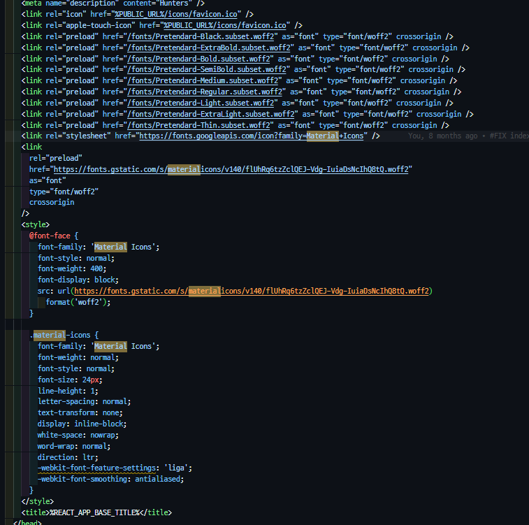

## FOUC(flash of unstyled content)

## 새로고침 시 웹 폰트가 로드되기 전까지 깨지는 이슈

- 웹 폰트를 사용하는 경우, 보통 `@font-face`가 적용된 css 파일을 보내주는 방식으로 동작한다.
- `font-display` 옵션 조절
- `html` 헤더에 `link` 태그에서 `preload`로 미리 불러오기
- 웹폰트 사용해서 캐싱하기

