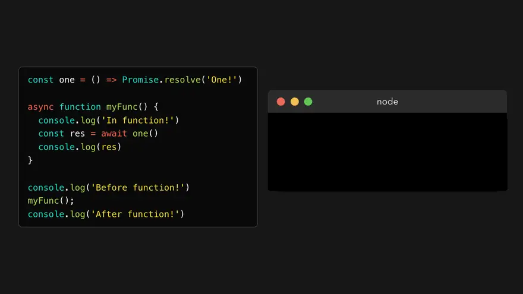

# 비동기 작업 처리 방식

- [콜백(Callback) 처리 방식](#콜백callback-처리-방식)
  - [1. 대표적 설계 패턴](#1-대표적-설계-패턴)
    - [(1) 성공/실패 콜백 분리](#1-성공실패-콜백-분리)
    - [(2) 이벤트 리스너 체인](#2-이벤트-리스너-체인)
    - [(3) 폴링 기반 상태 확인](#3-폴링-기반-상태-확인)
  - [2. 설계의 근본적 한계](#2-설계의-근본적-한계)
  - [3. 역사적 전환점](#3-역사적-전환점)
- [프로미스(Promise) 처리 방식](#프로미스promise-처리-방식)
  - [마이크로태스크 큐(Microtask Queue)와 이벤트 루프](#마이크로태스크-큐microtask-queue와-이벤트-루프)
  - [`Promise.resolve`](#promiseresolve)
  - [`Promise.reject`](#promisereject)
  - [`Promise.all` • `Promise.allSettled` • `Promise.race` • `Promise.any`](#promiseall--promiseallsettled--promiserace--promiseany)
  - [프로미스 체이닝(Promise Chaining)과 에러 처리](#프로미스-체이닝promise-chaining과-에러-처리)
- [`async` • `await` 처리 방식](#async--await-처리-방식)
  - [top level await](#top-level-await)

## 콜백(Callback) 처리 방식

- 프로미스(Promise) 이전 시대의 Web API 설계 철학
- 핵심 원칙: 이벤트 드리븐 아키텍처(Event-Driven Architecture)에 기반한 비동기 처리
- 주요 기법: 콜백 분리, 이벤트 버블링(Event Bubbling), 폴링(Polling)

### 1. 대표적 설계 패턴

#### (1) 성공/실패 콜백 분리

```ts
// XMLHttpRequest (AJAX)
const xhr = new XMLHttpRequest();
xhr.onload = () => console.log(xhr.responseText); // 성공
xhr.onerror = () => console.error('Request failed'); // 실패
xhr.open('GET', 'https://api.example.com/data');
xhr.send();
```

- 특징:
  - `onload`/`onerror`가 독립적인 이벤트 핸들러임
  - Node.js의 `(err, data)` 패턴과 달리 에러가 자동 전파되지 않음

#### (2) 이벤트 리스너 체인

```ts
// WebSocket
const socket = new WebSocket('wss://echo.websocket.org');
socket.addEventListener('message', (event) => {
  console.log('Received:', event.data);
});
socket.addEventListener('error', (event) => {
  console.error('WebSocket error:', event);
});
```

- 특징:
  - 동일 객체에 다중 이벤트 핸들러 부착 가능함
  - `Event` 객체가 에러 정보를 캡슐화함

#### (3) 폴링 기반 상태 확인

```ts
// Geolocation API (Legacy)
navigator.geolocation.getCurrentPosition(
  (position) => console.log(position.coords), // 성공
  (err) => console.error(err.message), // 실패
  { timeout: 5000 },
);
```

- 특징:
  - 콜백 분리지만 Error-First 패턴과 무관함
  - 옵션 객체로 제어 파라미터를 전달함

### 2. 설계의 근본적 한계

1. 콜백 헬(Callback Hell)

   ```ts
   // 중첩된 타이머 예제
   setTimeout(() => {
     element.style.opacity = 0;
     setTimeout(() => {
       element.style.display = 'none';
     }, 500);
   }, 1000);
   ```

   - 문제점: 가독성 저하 및 에러 추적 곤란함

2. 에러 처리의 불일치성
   - `XMLHttpRequest`: `onerror`와 `status code`를 수동 확인해야 함
   - `setTimeout`: 내부 에러 캐치가 불가하여 전역 오류 핸들러에 의존함

3. 제어 흐름의 복잡성
   - 병렬 처리 시 카운터 변수로 완료 여부를 직접 추적해야 함

   ```ts
   let completed = 0;
   [A, B, C].forEach((url) => {
     fetchLegacy(url, () => {
       if (++completed === 3) console.log('All done!');
     });
   });
   ```

### 3. 역사적 전환점

- jQuery의 Deferred Object (2011)

  ```ts
  $.get('https://api.example.com')
    .done((data) => console.log(data))
    .fail((jqXHR) => console.error(jqXHR.statusText));
  ```

  - Promise-like 패턴의 초기 구현체임

- Promise 표준화 (ES6, 2015)
  - Web API 설계 방식을 일관된 인터페이스로 통합함

## 프로미스(Promise) 처리 방식


그림 설명:

1. 실행 흐름 중 비동기 작업을 수행하는 함수를 만나면 이를 Web API로 넘겨 처리한다.
2. 비동기 작업이 완료되면 인수로 넘겨진 콜백을 매크로태스크 큐(Macrotask Queue)로 넘긴다.


그림 설명:

1. 실행 흐름 중 `Promise`를 만나면 `executor` 함수를 즉시 실행한다.
2. `resolve` 함수가 호출되면 `then` 함수에 인수로 넘겨진 콜백을 마이크로태스크 큐(Microtask Queue)로 넘긴다.
3. `reject` 함수가 호출되면 `catch` 함수에 인수로 넘겨진 콜백을 마이크로태스크 큐로 넘긴다.


그림 설명:

1. 콜 스택(Call Stack)이 비워지면 이벤트 루프(Event Loop)는 마이크로태스크 큐의 작업을 우선적으로 콜 스택으로 보낸다.
2. 이후 매크로태스크 큐의 작업을 콜 스택으로 보낸다.

### 마이크로태스크 큐(Microtask Queue)와 이벤트 루프

- 마이크로태스크 큐는 매크로태스크 큐보다 우선순위가 높다.
- 이벤트 루프는 콜 스택이 비면 먼저 마이크로태스크 큐에 대기 중인 모든 작업을 실행한다.
- 마이크로태스크 큐의 작업이 실행되는 동안 새로운 마이크로태스크가 추가되면 이들까지 모두 처리한 후에야 다음 단계(렌더링 또는 매크로태스크)로 넘어간다.
- `Promise.then/catch/finally`, `MutationObserver`, `queueMicrotask` 등이 마이크로태스크 큐를 사용한다.

### `Promise.resolve`

- `Promise.resolve(value)`는 결괏값이 `value`인 이행(Fulfilled) 상태 프로미스를 생성한다.
- `Promise.resolve(value)`는 `new Promise((res, rej) => res(value))`와 동일하다.
- 호환성을 위해 함수가 항상 프로미스를 반환하도록 보장해야 할 때 사용한다.

```ts
let cache = new Map();

function loadCached(url) {
  if (cache.has(url)) {
    // 캐시된 데이터가 있으면 즉시 이행 상태 프로미스 반환
    return Promise.resolve(cache.get(url));
  }

  return fetch(url)
    .then((response) => response.text())
    .then((text) => {
      cache.set(url, text);
      return text;
    });
}
```

### `Promise.reject`

- `Promise.reject(error)`는 결괏값이 `error`인 거부(Rejected) 상태 프로미스를 생성한다.
- `Promise.reject(error)`는 `new Promise((res, rej) => rej(error))`와 동일하다.
- 특정 조건에서 의도적으로 에러를 발생시켜 프로미스 체인의 `catch` 블록으로 넘길 때 사용한다.

```ts
axios.interceptors.response.use(
  function (response) {
    return response;
  },
  function (error) {
    // 응답 에러 발생 시 추가 처리를 하고 다시 거부 상태 프로미스 반환
    return Promise.reject(error);
  },
);
```

### `Promise.all` • `Promise.allSettled` • `Promise.race` • `Promise.any`

- `Promise.all`: 모든 프로미스가 이행될 때까지 기다렸다가 결괏값 배열을 반환함. 하나라도 실패하면 즉시 거부됨.
- `Promise.allSettled`: 모든 프로미스가 처리(Settled)될 때까지 기다렸다가 각 프로미스의 상태와 결과/에러를 담은 객체 배열을 반환함.
- `Promise.race`: 가장 먼저 처리된 프로미스의 결과 또는 에러를 반환함.
- `Promise.any`: 가장 먼저 이행된 프로미스의 결과를 반환함. `race`와 달리 거부된 프로미스는 무시하며, 모든 프로미스가 거부될 경우에만 `AggregateError`로 거부됨 (ES2021).

### 프로미스 체이닝(Promise Chaining)과 에러 처리

- `then` 메서드는 항상 새로운 프로미스를 반환하여 체이닝을 가능하게 한다.
- 체인 중간에서 발생한 에러는 가장 가까운 `catch` 블록으로 전파된다.
- `then(onFulfilled, onRejected)`의 두 번째 인자인 `onRejected`는 해당 `then`의 `onFulfilled`에서 발생한 에러를 잡지 못한다. 따라서 체인 끝에 `.catch()`를 사용하는 것이 더 안전하다.
- `catch` 블록 이후에도 `then`을 이어서 작성하면, 에러 발생 후에도 프로미스 체인을 계속 실행할 수 있다.

## `async` • `await` 처리 방식




그림 설명:

1. 실행 흐름 중 `async` 함수를 만나면 해당 함수를 실행한다.


그림 설명:

1. `async` 함수 내부에서 `await` 키워드를 만나면 해당 함수의 실행을 일시 중단하고 비동기 작업의 결과를 기다리는 동안 제어권을 호출자에게 돌려준다.
2. `await` 뒤의 작업이 완료되면 해당 `async` 함수의 남은 부분이 마이크로태스크 큐로 넘겨진다.


그림 설명:

1. 콜 스택이 비워지면 마이크로태스크 큐에 대기 중인 `async` 함수의 남은 부분이 콜 스택으로 돌아와 실행을 재개한다.


### top level await

- 모듈의 최상위 레벨에서 `async` 함수 없이도 `await`를 사용할 수 있는 기능임.
- ES2022부터 지원되며, 모듈 로딩 시 비동기적으로 의존성을 초기화할 때 유용함.
