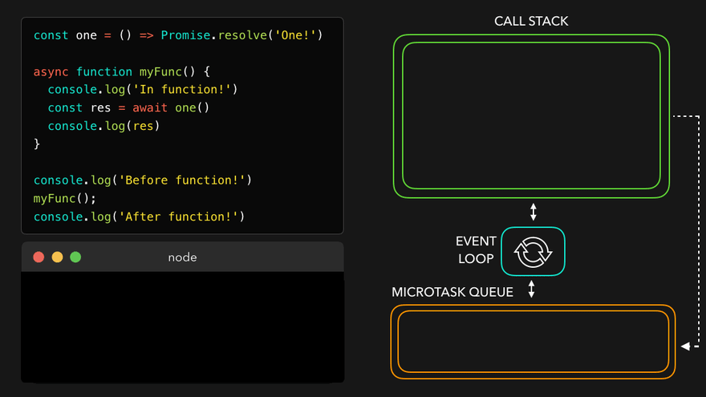

# 비동기 작업 처리 방식

- [콜백(Callback) 처리 방식](#콜백callback-처리-방식)
  - [1. 대표적 설계 패턴](#1-대표적-설계-패턴)
    - [(1) 성공/실패 콜백 분리](#1-성공실패-콜백-분리)
    - [(2) 이벤트 리스너 체인](#2-이벤트-리스너-체인)
    - [(3) 폴링 기반 상태 확인](#3-폴링-기반-상태-확인)
  - [2. 설계의 근본적 한계](#2-설계의-근본적-한계)
  - [3. 역사적 전환점](#3-역사적-전환점)
- [`Promise` 처리 방식](#promise-처리-방식)
  - [`Promise.resolve`](#promiseresolve)
  - [`Promise.reject`](#promisereject)
  - [`Promise.all` • `Promise.allSettled` • `Promise.race`](#promiseall--promiseallsettled--promiserace)
- [`async` • `await` 처리 방식](#async--await-처리-방식)
- [top level await](#top-level-await)

## 콜백(Callback) 처리 방식

- Promise 이전 시대의 Web API 설계 철학
  - _핵심 원칙_: 이벤트 드리븐 아키텍처에 기반한 비동기 처리
  - _주요 기법_: 콜백 분리, 이벤트 버블링, 폴링(Polling)

---

### 1. 대표적 설계 패턴

#### (1) 성공/실패 콜백 분리

```javascript
// XMLHttpRequest (AJAX)
const xhr = new XMLHttpRequest();
xhr.onload = () => console.log(xhr.responseText); // 성공
xhr.onerror = () => console.error('Request failed'); // 실패
xhr.open('GET', 'https://api.example.com/data');
xhr.send();
```

- 특징:
  - `onload`/`onerror`가 독립적인 이벤트 핸들러
  - Node.js의 `(err, data)` 패턴과 달리 에러가 자동 전파되지 않음

#### (2) 이벤트 리스너 체인

```javascript
// WebSocket
const socket = new WebSocket('wss://echo.websocket.org');
socket.addEventListener('message', (event) => {
  console.log('Received:', event.data);
});
socket.addEventListener('error', (event) => {
  console.error('WebSocket error:', event);
});
```

- 특징:
  - 동일 객체에 다중 이벤트 핸들러 부착 가능
  - `Event` 객체가 에러 정보를 캡슐화

#### (3) 폴링 기반 상태 확인

```javascript
// Geolocation API (Legacy)
navigator.geolocation.getCurrentPosition(
  (position) => console.log(position.coords), // 성공
  (err) => console.error(err.message), // 실패
  { timeout: 5000 },
);
```

- 특징:
  - 콜백 분리지만 Error-First 패턴과 무관
  - 옵션 객체로 제어 파라미터 전달

---

### 2. 설계의 근본적 한계

1. 콜백 헬(Callback Hell)

   ```javascript
   // 중첩된 타이머 예제
   setTimeout(() => {
     element.style.opacity = 0;
     setTimeout(() => {
       element.style.display = 'none';
     }, 500);
   }, 1000);
   ```

   - _문제점_: 가독성 저하 및 에러 추적 곤란

2. 에러 처리의 불일치성

   - `XMLHttpRequest`: `onerror` + `status code` 수동 확인
   - `setTimeout`: 에러 캐치 불가 → 전역 오류 핸들러 의존

3. 제어 흐름의 복잡성
   - 병렬 처리 시 카운터 변수로 완료 여부 추적
   ```javascript
   let completed = 0;
   [A, B, C].forEach((url) => {
     fetchLegacy(url, () => {
       if (++completed === 3) console.log('All done!');
     });
   });
   ```

---

### 3. 역사적 전환점

- jQuery의 Deferred Object (2011)

  ```javascript
  $.get('https://api.example.com')
    .done((data) => console.log(data))
    .fail((jqXHR) => console.error(jqXHR.statusText));
  ```

  - Promise-like 패턴의 초기 구현체

- Promise 표준화 (ES6, 2015)
  - Web API 설계 방식을 일관된 인터페이스로 통합

> 💡 교훈:  
> 레거시 Web API는 각자 독자적인 방식을 채택했으나,  
> Promise의 등장으로 에러 처리 패러다임이 통합되었습니다.  
> 현대 코드에서는 `async/await` + `fetch()` 조합이 권장됩니다.

## `Promise` 처리 방식


▾ 위 그림 설명:

1. 실행흐름 중 비동기 작업을 수행하는 함수을 만나 Web API로 넘겨서 처리한다.
2. 비동기 작업을 수행하는 함수가 완료되면 인수로 넘겨진 콜백을 매크로태스크 큐로 넘긴다.


▾ 위 그림 설명:

1. 실행흐름 중 `Promise`를 만나 `executor` 함수를 즉시 실행한다.
2. `resolve` 함수가 호출되면 `then` 함수에 인수로 넘겨진 콜백을 마이크로태스크 큐로 넘긴다.
3. `reject` 함수가 호출되면 `catch` 함수에 인수로 넘겨진 콜백을 마이크로태스크 큐로 넘긴다.


▾ 위 그림 설명:

1. 콜 스택이 비워지면 이벤트 루프는 마이크로태스크 큐의 작업을 우선으로 콜 스택으로 보낸다.
2. 이후 매크로태스크 큐의 작업을 콜 스택으로 보낸다.

### `Promise.resolve`

- `Promise.resolve(value)`는 결괏값이 `value`인 이행 상태 프로미스를 생성한다.
- `Promise.resolve(value)`는 `new Promise((res, rej) => res(value))`와 같다.
- `Promise.resolve`는 호환성을 위해 함수가 이행 상태 프로미스를 반환하도록 해야 할 때 사용할 수 있다.
-

아래 함수 `loadCached`는 인수로 받은 URL을 대상으로 fetch를 호출하고, 그 결과를 기억한다.

```ts
let cache = new Map();

function loadCached(url) {
  if (cache.has(url)) {
    return Promise.resolve(cache.get(url)); // (*)
  }

  return fetch(url)
    .then((response) => response.text())
    .then((text) => {
      cache.set(url, text);
      return text;
    });
}
```

`loadCached`를 호출하면 이행 상태 프로미스가 반환된다는 것이 보장된다. `(*)`로 표시한 줄에서 `Promise.resolve`를 사용한 이유가 바로 여기에 있다.

### `Promise.reject`

- `Promise.reject(error)`는 결괏값이 `error`인 거부 상태 프로미스를 생성한다.
- `Promise.reject(error)`는 `new Promise((res, rej) => rej(error))`와 같다.
- `Promise.reject`는 호환성을 위해 함수가 거부 상태 프로미스를 반환하도록 해야 할 때 사용할 수 있다.

아래는 `axios` 라이브러리의 응답에 대한 인터셉터 기능을 사용할 때이다.

```ts
axios.interceptors.response.use(
  function (response) {
    // ...
    return response;
  },
  function (error) {
    // ...
    return Promise.reject(error); // (*)
  },
);
```

`axios`는 오류가 나고 인터셉터로 에러에 대한 추가 처리가 되어도 거절 상태 프로미스가 반환된다는 것이 보장된다. `(*)`로 표시한 줄에서 `Promise.reject`를 사용한 이유가 바로 여기에 있다.

### `Promise.all` • `Promise.allSettled` • `Promise.race`

다중 프로미스는 `Promise.all`, `Promise.allSettled`, `Promise.race` 함수로 처리가 가능하다.

- `Promise.all`은 모든 프로미스가 이행될 때까지 기다렸다가 그 결괏값을 담은 배열을 반환한다. 주어진 프로미스 중 하나라도 실패하면 `Promise.all`은 거부되고, 나머지 프로미스의 결과는 무시된다.
- `Promise.allSettled`은 모든 프로미스가 처리될 때까지 기다렸다가 그 결과(객체)를 담은 배열을 반환한다. 객체는 아래와 같은 정보를 담는다.
  - `status`: `"fulfilled"` 또는 `"rejected"`
  - `value`: `status`가 `"fulfilled"`일 경우 결과값이 해당 속성에 담긴다.
  - `reason`: `status`가 `"rejected"`일 경우 에러가 해당 속성에 담긴다.
- `Promise.race` 가장 먼저 처리된 프로미스의 결과 또는 에러를 담은 프로미스를 반환한다.

```ts
let promiseList = [
  new Promise((resolve, reject) => setTimeout(() => resolve(1), 1000)),
  new Promise((resolve, reject) => setTimeout(() => resolve(2), 2000)),
  new Promise((resolve, reject) => setTimeout(() => resolve(3), 3000)),
];

let promiseListError = [
  new Promise((resolve, reject) => setTimeout(() => resolve(1), 1000)),
  new Promise((resolve, reject) => setTimeout(() => reject(new Error('에러 발생!')), 2000)),
  new Promise((resolve, reject) => setTimeout(() => resolve(3), 3000)),
];

// promiseList가 인수일 경우, then으로 넘어간다.
// promiseListError가 인수일 경우, catch로 넘어간다.
Promise.all(promiseList)
  .then((resultList) => resultList.forEach((result) => console.log(result)))
  .catch((error) => console.error(error));

// promiseList가 인수일 경우, then으로 넘어간다.
// promiseListError가 인수일 경우, then으로 넘어간다.
Promise.allSettled(promiseList).then((resultList) => {
  resultList.forEach((result, index) => {
    if (result.status == 'fulfilled') {
      console.log(`${result.value}`);
    }
    if (result.status == 'rejected') {
      console.log(`${result.reason}`);
    }
  });
});

// promiseList가 인수일 경우, then으로 넘어간다.
// promiseListError가 인수일 경우, catch로 넘어간다.
Promise.race(promiseList)
  .then((result) => console.log(result))
  .catch((error) => console.error(error));
```

## `async` • `await` 처리 방식




아래 그림 설명:

1. 실행흐름 중 `async` 함수를 만나면 해당 함수를 실행한다.


아래 그림 설명:

1. `async` 함수 내부에서 `await` 키워드를 만나면 해당 `async` 함수를 마이크로태스크 큐로 넘긴다.


아래 그림 설명:

1. 콜 스택이 비워지면 마이크로태스크 큐에 작업을 콜 스택으로 보낸다.


## top level await
