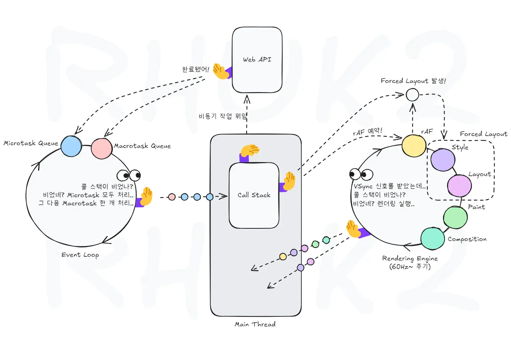

# 이벤트 루프(Event Loop)

- [이벤트 루프(Event Loop)란?](#이벤트-루프event-loop란)
- [마이크로태스크 큐(Microtask Queue)](#마이크로태스크-큐microtask-queue)
- [매크로태스크 큐(Macrotask Queue)](#매크로태스크-큐macrotask-queue)
- [이벤트 루프의 작업 처리 사이클](#이벤트-루프의-작업-처리-사이클)

## 이벤트 루프(Event Loop)란?

이벤트 루프는 단일 스레드(Single Thread)로 동작하는 JavaScript 엔진이 비동기 프로그래밍 환경에서 작업을 관리하고 실행 순서를 조정하는 핵심 메커니즘이다. 브라우저나 Node.js 환경에서 비동기 작업의 콜백이 적절한 시점에 실행되도록 콜 스택(Call Stack)과 태스크 큐 사이의 상호작용을 제어한다.

## 마이크로태스크 큐(Microtask Queue)

마이크로태스크 큐는 일반적인 비동기 작업보다 우선순위가 높은 작업들이 대기하는 공간이다.

- 주요 작업 종류:
  - `Promise`의 후속 처리 메서드 콜백(`then` • `catch` • `finally`)
  - `MutationObserver` 콜백
  - `queueMicrotask` 함수로 등록된 콜백
- 특징:
  - 현재 실행 중인 태스크가 종료된 직후, 매크로태스크보다 먼저 실행됨.
  - 마이크로태스크 큐가 완전히 비워질 때까지 대기 중인 모든 작업을 순차적으로 처리함.
  - 마이크로태스크 실행 중에 새로운 마이크로태스크가 추가되면 이 역시 즉시 처리됨.

## 매크로태스크 큐(Macrotask Queue)

매크로태스크 큐는 상대적으로 우선순위가 낮은 일반적인 비동기 작업들이 대기하는 공간이다. 명세에서는 단순히 `Task Queue`라고 부르기도 한다.

- 주요 작업 종류:
  - `setTimeout` • `setInterval` • `setImmediate`(Node.js) 콜백
  - DOM 이벤트 핸들러
  - `fetch` 응답 처리 콜백
  - 외부 스크립트(`<script src="...">`) 로드 및 실행
- 특징:
  - 이벤트 루프의 한 사이클마다 하나의 매크로태스크만 꺼내어 실행함.
  - 하나의 매크로태스크 실행이 끝나면 다시 마이크로태스크 큐를 확인하여 비어 있는지 점검함.

## 이벤트 루프의 작업 처리 사이클

1. 동기 코드 실행: 현재 콜 스택에 쌓여 있는 모든 동기 작업을 처리함.
2. 마이크로태스크 처리:
   - 마이크로태스크 큐에 대기 중인 모든 작업을 꺼내어 실행함.
   - 큐가 완전히 비워질 때까지 이 과정을 반복함.
3. 렌더링 점검(브라우저 환경):
   - 브라우저가 화면을 갱신할 필요가 있다고 판단하면 렌더링 파이프라인을 실행함.
   - 보통 60Hz(16.6ms) 주기로 발생하지만, 마이크로태스크 처리가 너무 길어지면 렌더링이 지연될 수 있음.
4. 매크로태스크 처리:
   - 매크로태스크 큐에서 가장 오래된 작업 하나를 꺼내어 실행함.
   - 실행 완료 후 다시 1번(또는 2번) 단계로 돌아감.
