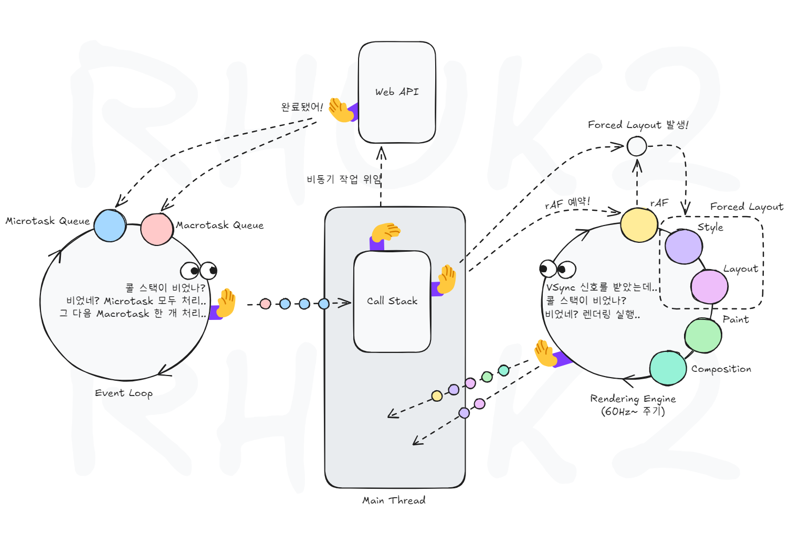

# 이벤트 루프(Event Loop)

## 이벤트 루프란?(브라우저 환경 기준)

- 이벤트 루프는 단일 스레드로 동작하는 브라우저가 비동기 프로그래밍 환경에서 작업을 관리하고 실행 순서를 조정하는 메커니즘.
- 이벤트 루프는 콜 스택, 태스크 큐, 마이크로 태스크 큐, 렌더링 엔진, 렌더링 큐와 상호 작용한다.

## 마이크로 태스크 큐(Micro Task Queue)

## 태스크 큐(Task Queue, Job Queue)

## 렌더링 큐(Rendering Queue)

## 이벤트 루프의 작업 처리 사이클

1. 이벤트 루프는 콜 스택이 비어있는 지 확인하고, 비어있으면 다음 단계로 넘어간다.
2. 마이크로 태스크 큐에 있는 작업들을 큐가 비어질 때까지 모두 실행한 후 다음 단계로 넘어간다.
3. 태스크 큐에 있는 작업 하나를 꺼내와 실행한다.
4. 앞 단계들의 처리 시간이 16.6ms 이상인 경우, 렌더링 단계를 실행하고 위를 반복한다.
5. 앞 단계들의 처리 시간이 16.6ms 이하인 경우, 렌더링 단계를 건너뛰고 위를 반복한다.
