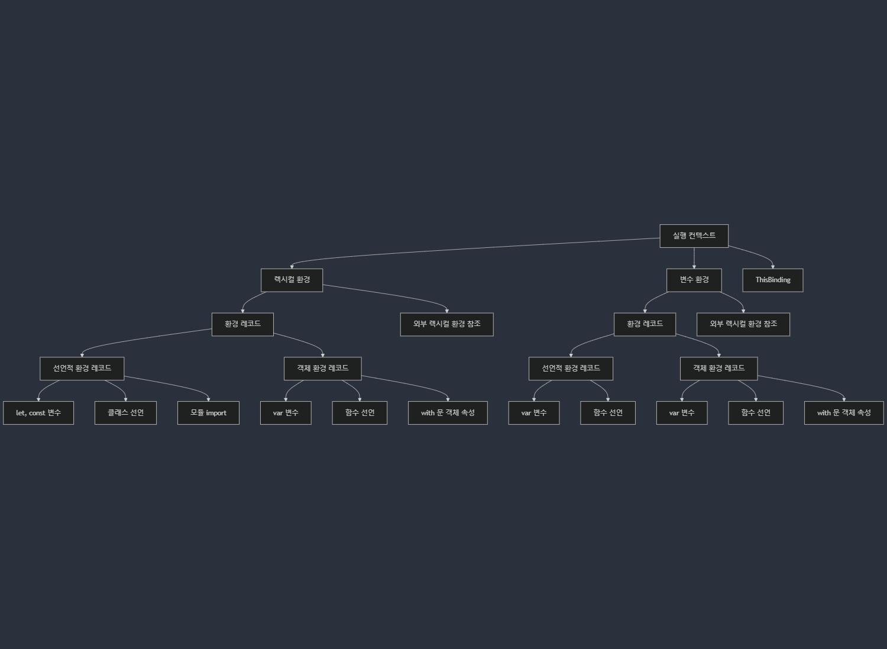

# 실행 컨텍스트(Execution Context)

- [실행 컨텍스트(Execution Context)란?](#실행-컨텍스트execution-context란)
- [실행 컨텍스트의 구성 요소](#실행-컨텍스트의-구성-요소)
  - [렉시컬 환경(Lexical Environment)](#렉시컬-환경lexical-environment)
    - [환경 레코드(Environment Record)](#환경-레코드environment-record)
    - [외부 렉시컬 환경 참조(Outer Lexical Environment Reference)](#외부-렉시컬-환경-참조outer-lexical-environment-reference)
  - [변수 환경(Variable Environment)](#변수-환경variable-environment)
    - [환경 레코드](#환경-레코드)
    - [외부 렉시컬 환경 참조](#외부-렉시컬-환경-참조)
  - [`this` 바인딩](#this-바인딩)
- [실행 컨텍스트의 생명주기](#실행-컨텍스트의-생명주기)
  - [전역 컨텍스트](#전역-컨텍스트)
  - [모듈 컨텍스트](#모듈-컨텍스트)
  - [함수 컨텍스트](#함수-컨텍스트)

## 실행 컨텍스트(Execution Context)란?

- 실행 컨텍스트는 JavaScript 엔진이 코드를 실행하기 위해 필요한 환경 정보를 담고 있는 객체다.

## 실행 컨텍스트의 구성 요소



### 렉시컬 환경(Lexical Environment)

- 렉시컬 환경은 자바스크립트에서 식별자와 그 값의 바인딩을 관리하는 자료 구조로, 코드의 정적 스코프(렉시컬 스코프)를 기반으로 생성된다.
- 렉시컬 환경은 명세서에서 자바스크립트가 어떻게 동작하는지 설명하는 데 쓰이는 이론상의 객체이다. 따라서 코드를 사용해 직접 렉시컬 환경을 얻거나 조작하는 것은 불가능하다.
- 자바스크립트 엔진들은 명세서에 언급된 사항을 준수하면서 엔진 고유의 방법을 사용해 렉시컬 환경을 최적화한다. 사용하지 않는 변수를 버려 메모리를 절약하거나 다양한 내부 트릭을 사용한다.

#### 환경 레코드(Environment Record)

선언적 환경 레코드(Declarative Environment Record):

- 특징
  - `let`, `const`로 선언된 변수는 호이스팅되지만 초기화되지 않으며, TDZ(Temporal Dead Zone)에 의해 선언 전 접근 시 참조 오류(ReferenceError)가 발생한다.
  - 블록 스코프 또는 모듈 스코프를 기반으로 동작하며, 전역 객체(`window`/`global`)의 속성으로 반영되지 않는다.

- 종류
  - `let`, `const`로 선언된 변수 (블록 스코프).
  - `let`, `const`로 선언된 함수 표현식 (예: `let func = () => {}`).
  - 클래스 선언 (`class MyClass {}`).
  - 모듈에서 `import`로 불러온 변수 및 함수 (모듈 스코프).

객체 환경 레코드(Object Environment Record):

- 특징
  - 전역 스코프 내 `var`로 선언된 변수는 호이스팅되며 `undefined`로 초기화된다.
  - 전역 스코프 내 함수 선언(`function foo() {}`)은 호이스팅되며 즉시 정의된다.
  - 전역 객체와 연결되어 속성으로 접근 가능 (예: `window.foo`).

- 종류
  - 전역 스코프 내 `var`로 선언된 변수.
  - 전역 스코프 내 함수 선언 (`function foo() {}`).
  - `with` 문에서 사용되는 객체 속성.

#### 외부 렉시컬 환경 참조(Outer Lexical Environment Reference)

- 외부 스코프의 렉시컬 환경을 참조하여 스코프 체인(Scope Chain)을 형성한다.
- 내부 함수가 외부 스코프의 변수에 접근할 수 있는 클로저(Closure)를 구현할 수 있다.

### 변수 환경(Variable Environment)

- 실행 컨텍스트 생성 시점에 렉시컬 환경과 동일한 내용으로 초기화된다.
- 변수 환경은 `var` 선언과 함수 선언에 의한 호이스팅을 처리하기 위해 사용된다.
- 코드 실행 중에는 렉시컬 환경이 변경되지만, 변수 환경은 초기 상태를 유지한다.

#### 환경 레코드

함수 환경 레코드(Function Environment Record):

- 특징
  - 함수 스코프 내 `var`로 선언된 변수는 호이스팅되며 `undefined`로 초기화된다.
  - 함수 스코프 내 함수 선언(`function foo() {}`)은 호이스팅되며 즉시 정의된다.
  - `arguments` 객체가 포함된다.

- 종류
  - 함수 스코프 내 `var`로 선언된 변수.
  - 함수 스코프 내 함수 선언 (`function foo() {}`).
  - 함수 스코프 내 `var`로 선언된 함수 표현식 (예: `var func = function() {}`).

전역 환경 레코드(Global Environment Record):

- 특징
  - 전역 스코프 내 `var`로 선언된 변수는 호이스팅되며 `undefined`로 초기화된다.
  - 전역 스코프 내 함수 선언(`function foo() {}`)은 호이스팅되며 즉시 정의된다.
  - 전역 객체와 연결되어 속성으로 접근 가능 (예: `window.foo`).

- 종류
  - 전역 스코프 내 `var`로 선언된 변수.
  - 전역 스코프 내 함수 선언 (`function foo() {}`).
  - `with` 문에서 사용되는 객체 속성.

#### 외부 렉시컬 환경 참조

- 외부 스코프의 렉시컬 환경을 참조하여 스코프 체인을 형성한다.
- 내부 함수가 외부 스코프의 변수에 접근할 수 있는 클로저를 구현할 수 있다.

### `this` 바인딩

실행 컨텍스트 내에서 `this` 값이 결정된다.

- 전역 컨텍스트
  - 브라우저에서는 `window`, Node.js에서는 `global` 객체를 참조.
  - 엄격 모드에서 `undefined`.

- 모듈 컨텍스트
  - 기본값이 엄격 모드이므로, `undefined`.

- 함수 컨텍스트
  - 함수 호출 방식에 따라 동적으로 결정.
  - 전역 컨텍스트에서 일반 함수 호출 시 `this`는 전역 객체 또는 엄격 모드에서 `undefined`.
  - 모듈 컨텍스트에서 일반 함수 호출 시 `this`는 `undefined`.
  - 메서드 호출 시 `this`는 메서드를 소유한 객체.
  - `new` 키워드 사용 시 `this`는 새로 생성된 인스턴스.
  - `call`, `apply`, `bind`는 명시적으로 `this`를 바인딩 가능.
  - 화살표 함수는 예외로, `this`가 호출 방식이 아닌 렉시컬 스코프에 따라 상위 스코프의 `this`를 상속받는다.

`this` 바인딩 예제:

```ts
console.log(this); // window or undefined

function funcThis() {
  console.log(this); // window or undefined
}
funcThis();

const arrowFuncThis = () => {
  console.log(this); // window or undefined
};
arrowFuncThis();

const obj = {
  name: 'Tomas',
  age: 30,
  objThis: this, // window or undefined
  objFunc() {
    console.log(this); // obj
  },
  objArrowFunc: () => {
    console.log(this); // window or undefined
  },
  objNestedFunc1() {
    console.log(this); // obj
    return function () {
      console.log(this); // window or undefined
    };
  },
  objNestedFunc2() {
    console.log(this); // obj
    return () => {
      console.log(this); // obj
    };
  },
  objNestedFunc3: () => {
    console.log(this); // window or undefined
    return function () {
      console.log(this); // window or undefined
    };
  },
  objNestedFunc4: () => {
    console.log(this); // window or undefined
    return () => {
      console.log(this); // window or undefined
    };
  },
};

console.log(obj.objThis);
obj.objFunc();
obj.objArrowFunc();
obj.objNestedFunc1()();
obj.objNestedFunc2()();
obj.objNestedFunc3()();
obj.objNestedFunc4()();

const copyObjMethod = obj.objFunc;
const copyObjMethodBind = obj.objFunc.bind(obj);
copyObjMethod(); // window or undefined
copyObjMethodBind(); // obj
setTimeout(obj.objFunc, 0); // window or undefined
setTimeout(obj.objFunc.bind(obj), 0); // obj

class Person {
  name = 'Tomas';
  age = 30;
  classThis = this;

  classArrowFunc = () => {
    console.log(this); // instance
  };

  classNestedFunc3 = () => {
    console.log(this); // instance
    return function () {
      console.log(this); // window or undefined
    };
  };

  classNestedFunc4 = () => {
    console.log(this); // instance
    return () => {
      console.log(this); // instance
    };
  };

  constructor() {}

  classFunc() {
    console.log(this); // instance
  }

  classNestedFunc1() {
    console.log(this); // instance
    return function () {
      console.log(this); // window or undefined
    };
  }

  classNestedFunc2() {
    console.log(this); // instance
    return () => {
      console.log(this); // instance
    };
  }
}

const cls = new Person();

console.log(cls.classThis);
cls.classFunc();
cls.classArrowFunc();
cls.classNestedFunc1()();
cls.classNestedFunc2()();
cls.classNestedFunc3()();
cls.classNestedFunc4()();

const copyClassMethod = cls.classFunc;
const copyClassMethodBind = cls.classFunc.bind(cls);
copyClassMethod(); // window or undefined
copyClassMethodBind(); // instance
setTimeout(cls.classFunc, 0); // window or undefined
setTimeout(cls.classFunc.bind(cls), 0); // instance
```

## 실행 컨텍스트의 생명주기

### 전역 컨텍스트

1. 생성 단계
   - 전역 객체 생성
   - 환경 레코드 설정
   - this 바인딩
   - 외부 렉시컬 환경 참조

2. 실행 단계
   - 코드가 순차적으로 실행됨.
   - 변수에 값이 할당되고, 함수가 호출되며, `let`과 `const` 변수가 TDZ를 벗어나 초기화됨.
   - 전역 스코프에서 선언된 변수와 함수는 전역 객체의 속성으로 접근 가능함 (예: `window.foo`).

3. 소멸 단계
   - 전역 컨텍스트는 일반적으로 프로그램이 종료될 때까지 유지됨 (예: 브라우저 창을 닫거나 Node.js 프로세스가 종료될 때).
   - 메모리 해제는 가비지 컬렉터(Garbage Collector)에 의해 관리되며, 더 이상 참조되지 않는 변수나 객체가 정리됨.

### 모듈 컨텍스트

1. 생성 단계
   - 환경 레코드 설정
   - this 바인딩
   - 외부 렉시컬 환경 참조

2. 실행 단계
   - 모듈 내 코드가 실행되며, `import`된 값이 실제로 사용되고, 변수가 초기화됨.
   - 모듈 스코프는 블록 스코프처럼 동작하며, 외부에서 직접 접근할 수 없음 (명시적 `export` 필요).
   - 모듈은 한 번만 실행되며, 이후에는 캐시된 결과를 재사용함 (싱글톤 패턴).

3. 소멸 단계(Exit Phase)
   - 모듈 컨텍스트는 프로그램 종료 시까지 유지될 수 있으며, 더 이상 참조되지 않으면 가비지 컬렉터에 의해 정리됨.
   - 모듈이 캐시에서 제거되거나, 모듈을 사용하는 스크립트가 종료되면 메모리가 해제됨.

### 함수 컨텍스트

1. 생성 단계
   - 환경 레코드 설정
   - this 바인딩
   - 외부 렉시컬 환경 참조
   - Arguments 객체 생성

2. 실행 단계
   - 함수 내 코드가 실행되며, 변수에 값이 할당되고, 내부 로직이 수행됨.
   - `let`, `const` 변수가 TDZ를 벗어나 초기화됨.
   - 스코프 체인을 통해 외부 변수에 접근할 수 있음.

3. 소멸 단계(Exit Phase)
   - 함수 실행이 완료되면 함수 컨텍스트가 스택에서 제거됨.
   - 지역 변수와 매개변수는 더 이상 참조되지 않으면 가비지 컬렉터에 의해 메모리에서 해제됨.
   - 단, 클로저로 인해 외부 스코프 변수가 참조되는 경우, 해당 변수는 유지됨.
