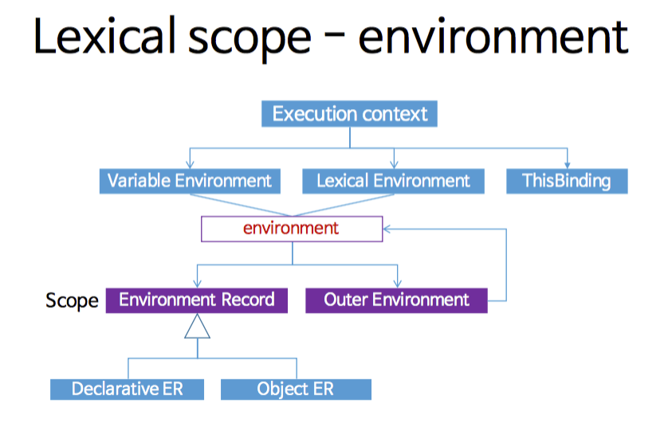

# Execution Context

- [실행 컨텍스트(Execution Context)란?](#실행-컨텍스트execution-context란)
- [실행 컨텍스트의 종류](#실행-컨텍스트의-종류)
- [실행 컨텍스트의 구성 요소](#실행-컨텍스트의-구성-요소)
  - [렉시컬 환경(Lexical Environment)](#렉시컬-환경lexical-environment)
  - [변수 환경(Variable Environment)](#변수-환경variable-environment)
  - [this 바인딩](#this-바인딩)
  - [코드 평가 상태](#코드-평가-상태)
- [실행 컨텍스트의 생명주기](#실행-컨텍스트의-생명주기)

## 실행 컨텍스트(Execution Context)란?

- 실행 컨텍스트는 자바스크립트 코드가 실행될 때 생성되는 환경을 의미한다.
- 코드 실행에 필요한 모든 정보를 담고 있다.
- 콜스택에 쌓여 순서와 환경을 보장.

## 실행 컨텍스트의 종류

1. 전역 실행 컨텍스트

   - 전역 범위에서 생성된다.
   - `window` 객체(브라우저) 또는 `global` 객체(Node.js)를 참조한다.

2. 함수 실행 컨텍스트

   - 함수가 호출될 때마다 생성된다.
   - 함수 내부의 변수, 매개변수, 스코프 등을 관리한다.

## 실행 컨텍스트의 구성 요소



### 렉시컬 환경(Lexical Environment)

렉시컬 환경은 자바스크립트에서 식별자(변수, 함수 등)와 그 값 간의 매핑을 관리하는 자료 구조로, 코드의 정적인 스코프를 기반으로 생성된다.

- 환경 레코드(Environment Record)

  - 현재 스코프 내의 변수, 함수, 클래스 선언을 저장한다.

  - 선언적 환경 레코드(Declarative Environment Record)

    - `let`, `const`, `class`, 함수 표현식으로 선언된 식별자를 저장한다.
    - `let`, `const`는 블록 스코프를 따른다.

  - 객체 환경 레코드(Object Environment Record)

    - `with` 문이나 전역 객체(`window`, `global`)와 같은 객체의 속성을 바인딩할 때 사용된다.

- 외부 렉시컬 환경 참조(Outer Lexical Environment Reference)

  - 외부 스코프의 렉시컬 환경을 참조한다. 이를 통해 스코프 체인(Scope Chain)이 형성된다.

### 변수 환경(Variable Environment)

초기에는 렉시컬 환경과 동일하지만, `var`과 함수 선언식 선언된 변수는 이곳에 저장된다.

- `var`로 선언된 변수는 호이스팅(Hoisting)되며, 함수 스코프를 따른다.
- `let`과 `const`는 블록 스코프를 따르지만, `var`는 함수 스코프를 따르기 때문에 별도로 관리된다.

### this 바인딩

실행 컨텍스트 내에서 `this` 값이 결정된다.

- 전역 컨텍스트

  - 브라우저에서는 `window`, Node.js에서는 `global` 객체를 참조.
  - 엄격 모드에서 `undefined`.

- 함수 컨텍스트

  - 함수 호출 방식에 따라 동적으로 결정.
  - 일반 함수 호출 시 `this`는 전역 객체 또는 엄격 모드에서 `undefined`.
  - 메서드 호출 시 `this`는 메서드를 소유한 객체.
  - `new` 키워드 사용 시 `this`는 새로 생성된 인스턴스.
  - `call`, `apply`, `bind`는 명시적으로 `this`를 바인딩.
  - 화살표 함수는 예외로, `this`가 호출 방식이 아닌 렉시컬 스코프에 따라 상위 스코프의 `this`를 상속받는다.

▾ this 바인딩 예제

```ts
const noObjThis = this; // window

function Func() {
  return this; // window
}
const ArrowFunc = () => {
  return this; // window
};

const obj = {
  name: 'Tomas',
  age: 30,
  objThis: this, // obj
  objFunc() {
    return this; // obj
  },
  objArrowFunc: () => {
    return this; // window
  },
  nestedObjFunc1() {
    console.log(this); // obj
    return function () {
      return this; // window
    };
  },
  nestedObjFunc2() {
    console.log(this); // obj
    return () => {
      return this; // obj
    };
  },
  nestedObjFunc3: () => {
    console.log(this); // window
    return function () {
      return this; // window
    };
  },
  nestedObjFunc4: () => {
    console.log(this); // window
    return () => {
      return this; // window
    };
  },
};

function wrapperFunc1(callback) {
  return function (...arguments) {
    return callback(...arguments); // window
  };
}

function wrapperFunc2(callback) {
  return (...arguments) => {
    return callback(...arguments); // window
  };
}

function wrapperFunc3(callback) {
  return function (...arguments) {
    return callback.call(this, ...arguments); // obj
  };
}

function wrapperFunc4(callback) {
  return (...arguments) => {
    return callback.call(this, ...arguments); // window
  };
}

function temp() {
  return this;
}

obj.wrapperFunc1 = wrapperFunc1(temp);
obj.wrapperFunc2 = wrapperFunc2(temp);
obj.wrapperFunc3 = wrapperFunc3(temp);
obj.wrapperFunc4 = wrapperFunc4(temp);
```

### 코드 평가 상태

현재 실행 중인 코드의 위치와 상태를 추적한다.

- 예: 함수가 중단된 위치, 반복문의 현재 상태 등.
- 이 정보는 자바스크립트 엔진이 코드 실행을 일시 중단하고 재개할 때 사용된다.

이러한 요소들은 자바스크립트 엔진이 코드를 실행할 때 스코프, 변수, `this` 등을 효율적으로 관리하는 데 필수적이다.

## 실행 컨텍스트의 생명주기

1. 생성 단계 (Creation Phase)

   - 변수, 함수 선언을 호이스팅하고, 스코프 체인을 설정한다.
   - `this` 값을 바인딩한다.

2. 실행 단계 (Execution Phase)
   - 코드를 한 줄씩 실행하며, 변수에 값을 할당한다.
