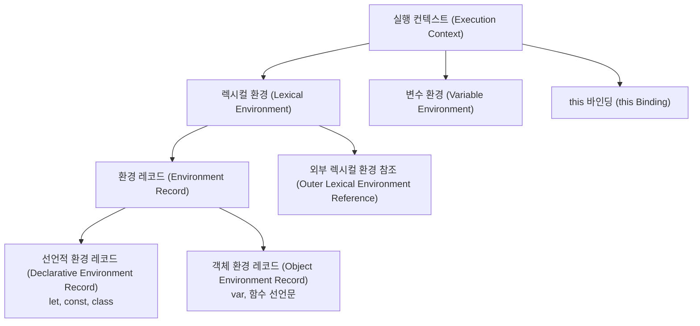

# 실행 컨텍스트(Execution Context)

- [실행 컨텍스트(Execution Context)란?](#실행-컨텍스트execution-context란)
- [실행 컨텍스트의 구성 요소](#실행-컨텍스트의-구성-요소)
  - [렉시컬 환경(Lexical Environment)](#렉시컬-환경lexical-environment)
    - [환경 레코드(Environment Record)](#환경-레코드environment-record)
    - [외부 렉시컬 환경 참조(Outer Lexical Environment Reference)](#외부-렉시컬-환경-참조outer-lexical-environment-reference)
  - [변수 환경(Variable Environment)](#변수-환경variable-environment)
  - [`this` 바인딩](#this-바인딩)
- [실행 컨텍스트의 생명주기(Lifecycle)](#실행-컨텍스트의-생명주기lifecycle)
  - [전역 컨텍스트(Global Context)](#전역-컨텍스트global-context)
  - [모듈 컨텍스트(Module Context)](#모듈-컨텍스트module-context)
  - [함수 컨텍스트(Function Context)](#함수-컨텍스트function-context)

## 실행 컨텍스트(Execution Context)란?

실행 컨텍스트는 JavaScript 엔진이 코드를 실행하기 위해 필요한 환경 정보를 담고 있는 객체다. 코드를 실행할 때 필요한 변수, 함수 선언, 스코프, `this` 등을 관리하는 추상적인 개념이다.

## 실행 컨텍스트의 구성 요소

```mermaid
graph TB
  EC["실행 컨텍스트 (Execution Context)"]
  LE["렉시컬 환경 (Lexical Environment)"]
  VE["변수 환경 (Variable Environment)"]
  THIS["this 바인딩 (this Binding)"]
  ER["환경 레코드 (Environment Record)"]
  OUTER["외부 렉시컬 환경 참조 (Outer Lexical Environment Reference)"]
  DER["선언적 환경 레코드 (Declarative Environment Record)\nlet, const, class"]
  OER["객체 환경 레코드 (Object Environment Record)\nvar, 함수 선언문"]

  EC --> LE
  EC --> VE
  EC --> THIS
  LE --> ER
  LE --> OUTER
  ER --> DER
  ER --> OER
```

### 렉시컬 환경(Lexical Environment)

렉시컬 환경은 자바스크립트에서 식별자와 그 값의 바인딩을 관리하는 자료 구조로, 코드의 정적 스코프(렉시컬 스코프)를 기반으로 생성된다.

- 특징:
  - 명세서에서 자바스크립트 동작을 설명하는 이론상의 객체임.
  - 직접 코드로 렉시컬 환경을 얻거나 조작하는 것은 불가능함.
  - 엔진 내부 트릭을 통해 사용하지 않는 변수를 제거하는 등 최적화를 수행함.

#### 환경 레코드(Environment Record)

- 선언적 환경 레코드(Declarative Environment Record):
  - `let`, `const`로 선언된 변수, 함수 표현식, 클래스 등을 관리함.
  - 호이스팅은 발생하지만 초기화되지 않아 TDZ(Temporal Dead Zone)의 영향을 받음.
  - 전역 객체(`window`/`global`)의 속성으로 반영되지 않음.
- 객체 환경 레코드(Object Environment Record):
  - `var`로 선언된 전역 변수와 함수 선언문을 관리함.
  - 전역 객체와 연결되어 속성으로 접근 가능함 (예: `window.foo`).
  - `with` 문에서 사용되는 객체 속성 등을 포함함.

#### 외부 렉시컬 환경 참조(Outer Lexical Environment Reference)

- 상위 스코프의 렉시컬 환경을 참조하여 스코프 체인(Scope Chain)을 형성함.
- 내부 함수가 외부 스코프의 변수에 접근할 수 있는 클로저(Closure) 구현의 핵심 메커니즘임.

### 변수 환경(Variable Environment)

실행 컨텍스트 생성 시점에 렉시컬 환경과 동일하게 초기화되지만, 이후 변화를 다르게 취급한다.

- `var` 선언과 함수 선언문에 의한 호이스팅을 처리하기 위해 사용됨.
- 코드 실행 중 렉시컬 환경의 값은 변할 수 있지만, 변수 환경은 생성 시점의 초기 상태를 유지함.
- 최신 명세에서는 두 개념이 매우 밀접하게 통합되어 운영됨.

### `this` 바인딩

실행 컨텍스트 생성 단계에서 `this`에 바인딩될 객체가 결정된다.

- 전역 컨텍스트:
  - 브라우저 환경에서는 `window`, Node.js에서는 `global` 객체를 참조함.
  - 엄격 모드(`strict mode`)에서는 `undefined`임.
- 모듈 컨텍스트:
  - 기본적으로 엄격 모드가 적용되어 `undefined`를 참조함.
- 함수 컨텍스트:
  - 함수 호출 방식(일반 호출, 메서드 호출, `new` 생성자 호출 등)에 따라 동적으로 결정됨.
  - 화살표 함수는 고유의 `this` 바인딩이 없으므로 상위 스코프의 `this`를 상속받음(Lexical This).

## 실행 컨텍스트의 생명주기(Lifecycle)

실행 컨텍스트는 크게 생성 단계(Creation Phase)와 실행 단계(Execution Phase)로 나뉘어 처리된다.

### 전역 컨텍스트(Global Context)

1. 생성 단계(Creation Phase):
   - 전역 객체를 생성하고 환경 레코드를 설정함.
   - `this` 바인딩을 수행하고 외부 참조를 `null`로 설정함.
   - `var` 변수와 함수 선언문이 메모리에 등록됨 (호이스팅).
2. 실행 단계(Execution Phase):
   - 코드를 순차적으로 실행하며 변수에 값을 할당함.
   - 함수 호출 시 새로운 실행 컨텍스트를 생성하여 콜 스택(Call Stack)에 쌓음.
3. 소멸 단계(Destruction Phase):
   - 애플리케이션 종료 시점에 콜 스택에서 제거됨.

### 모듈 컨텍스트(Module Context)

1. 생성 및 실행 단계:
   - 모듈 스코프는 독립적으로 관리되며 외부 직접 접근이 불가능함.
   - 최초 호출 시 한 번만 실행되고 결과가 캐싱됨(싱글톤 패턴).
2. 소멸 단계:
   - 더 이상 참조되지 않을 때 가비지 컬렉터(Garbage Collector)에 의해 정리됨.

### 함수 컨텍스트(Function Context)

1. 생성 단계:
   - 함수 환경 레코드와 `arguments` 객체를 생성함.
   - `this` 바인딩 및 상위 스코프 참조를 설정함.
2. 실행 단계:
   - 함수 내부 로직을 수행하며 지역 변수를 초기화함.
3. 소멸 단계:
   - 함수 실행 완료 후 콜 스택에서 제거됨.
   - 클로저가 형성된 경우, 해당 렉시컬 환경은 메모리에 유지됨.
