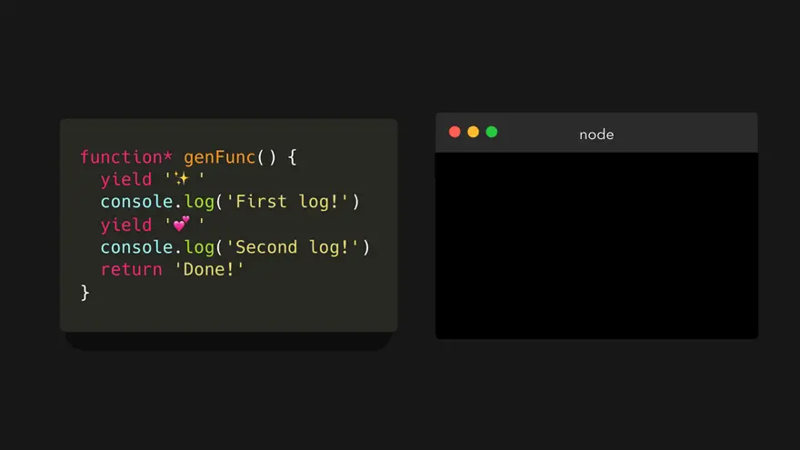
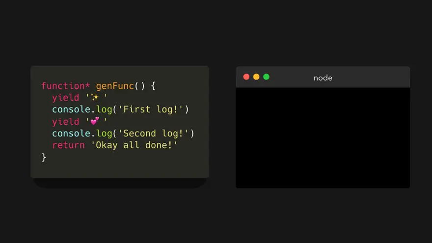
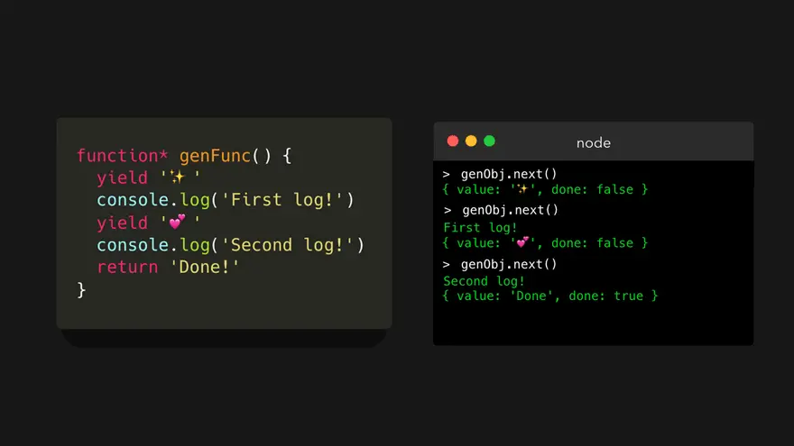
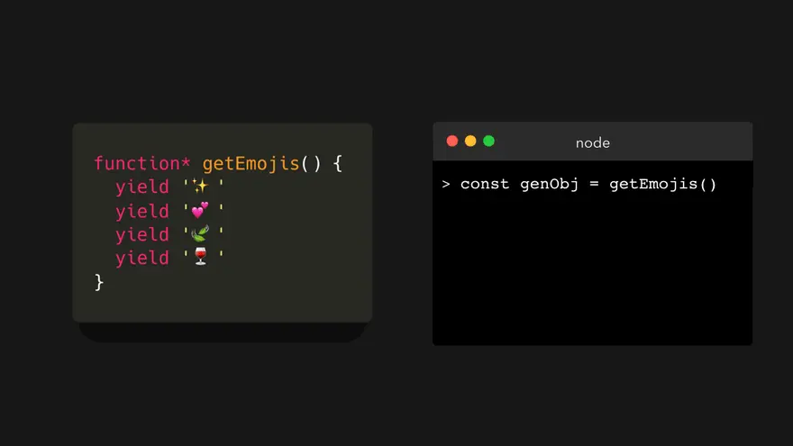
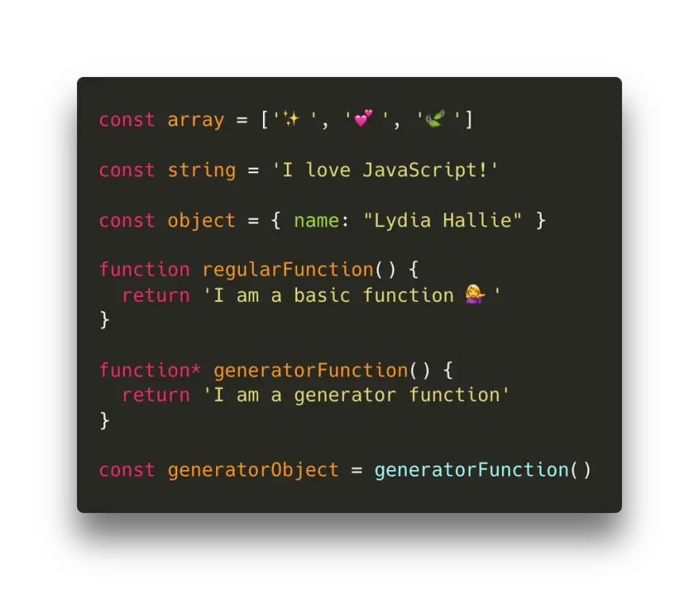
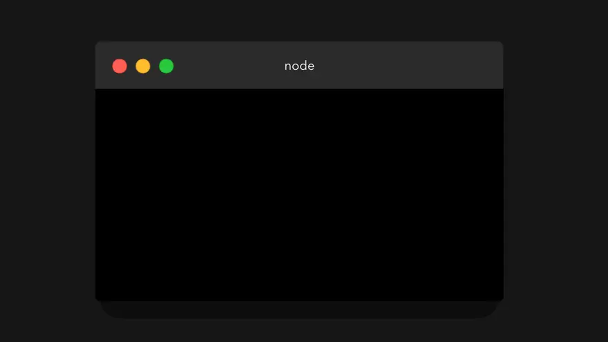

# 제너레이터(Generator)

- [제너레이터의 개념](#제너레이터의-개념)
- [기본 문법 및 동작 방식](#기본-문법-및-동작-방식)
  - [yield 키워드](#yield-키워드)
  - [next 메서드](#next-메서드)
- [이터러블과 제너레이터](#이터러블과-제너레이터)
- [제너레이터의 활용](#제너레이터의-활용)

## 제너레이터의 개념

제너레이터는 함수의 실행을 중간에 멈췄다가 필요할 때 다시 재개할 수 있는 특수한 형태의 함수다. 일반적인 함수는 한 번 실행되면 제어권을 끝까지 가져가지만, 제너레이터는 제어권을 호출자에게 양도(Yield)할 수 있다.

- 특징:
  - 함수 실행 중 상태를 유지함
  - 이터레이터(Iterator) 객체를 반환하여 순회 가능함
  - 비동기 흐름을 동기적인 코드 형태로 작성할 때 유용함

## 기본 문법 및 동작 방식

제너레이터 함수는 `function*` 키워드로 선언하며, 하나 이상의 `yield` 표현식을 포함한다.

```ts
function* numberGenerator() {
  yield 1;
  yield 2;
  yield 3;
  return 4;
}

const gen = numberGenerator(); // 제너레이터 객체 생성 (함수 본문은 아직 실행되지 않음)
```

### yield 키워드

제너레이터 함수의 실행을 일시 중단시키고, 뒤에 오는 값을 호출자에게 반환한다. 이후 `next()`가 호출되면 중단된 시점부터 다시 실행을 재개한다.

### next 메서드

제너레이터 객체의 `next()`를 호출하면 가장 가까운 `yield`를 만날 때까지 실행되고, 결과를 담은 객체를 반환한다.

- 반환 객체 구조:
  - `value`: `yield` 뒤에 오는 값 또는 `return` 값임
  - `done`: 함수의 실행이 완료되었는지 여부를 나타내는 불리언 값임

```ts
console.log(gen.next()); // { value: 1, done: false }
console.log(gen.next()); // { value: 2, done: false }
console.log(gen.next()); // { value: 3, done: false }
console.log(gen.next()); // { value: 4, done: true }
```

## 이터러블과 제너레이터

제너레이터 객체는 이터러블(Iterable) 프로토콜과 이터레이터(Iterator) 프로토콜을 모두 준수한다. 따라서 `for...of` 루프나 전개 구문(Spread Syntax)에서 직접 사용할 수 있다.

```ts
function* sequence() {
  yield 'A';
  yield 'B';
  yield 'C';
}

for (const char of sequence()) {
  console.log(char); // A, B, C 순차 출력
}
```

- 주의사항: `for...of` 루프는 `done: true`일 때의 `value`는 포함하지 않으므로 `return` 값은 출력되지 않음

## 제너레이터의 활용

- 지연 평가(Lazy Evaluation): 대량의 데이터를 미리 생성하지 않고 필요한 시점에만 생성하여 메모리를 절약함
- 비동기 흐름 제어: `yield`를 사용해 프로미스를 반환하고 외부에서 이를 처리하여 비동기 코드를 동기식으로 보이게 함 (현재는 `async/await`로 대체됨)
- 무한 시퀀스 생성: 필요한 만큼 계속해서 값을 생성하는 무한 루프 구조를 안전하게 구현 가능함










