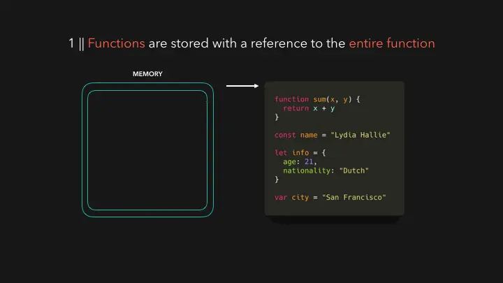
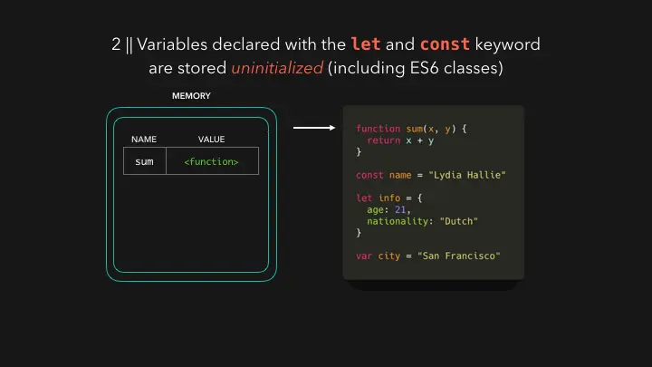
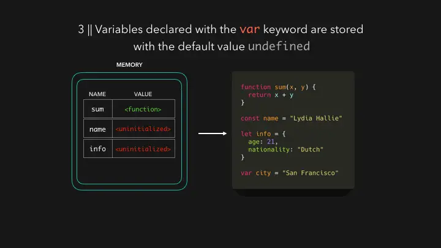
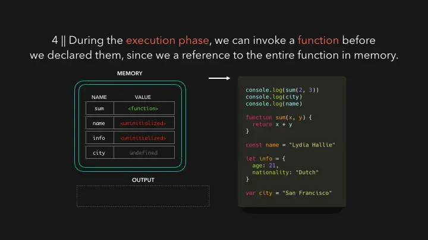
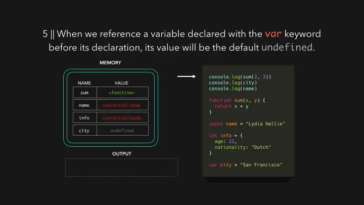
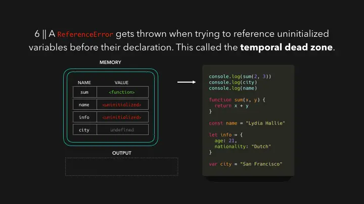

# 호이스팅(Hoisting)

- [호이스팅의 개념](#호이스팅의-개념)
- [변수 호이스팅과 TDZ](#변수-호이스팅과-tdz)
  - [var 변수의 호이스팅](#var-변수의-호이스팅)
  - [let과 const 변수의 호이스팅](#let과-const-변수의-호이스팅)
  - [일시적 사각지대(TDZ)](#일시적-사각지대tdz)
- [함수 및 클래스 호이스팅](#함수-및-클래스-호이스팅)
  - [함수 선언식과 표현식](#함수-선언식과-표현식)
  - [클래스 호이스팅](#클래스-호이스팅)
- [과정](#과정)

## 호이스팅의 개념

호이스팅(Hoisting)은 자바스크립트 엔진이 코드를 실행하기 전, 변수 및 함수 선언을 스코프(Scope)의 최상단으로 끌어올리는 것처럼 동작하는 현상이다. 실제 코드가 물리적으로 이동하는 것은 아니며, 실행 컨텍스트 생성 단계에서 변수와 함수 객체를 메모리에 등록하는 과정에서 발생한다.

- 특징:
  - 선언부만 호이스팅되며 할당부는 호이스팅되지 않음
  - 코드의 실행 순서에 영향을 주며, 선언 전 접근 시의 동작을 결정함

## 변수 호이스팅과 TDZ

변수 선언 방식에 따라 호이스팅 시의 초기화 방식이 다르다.

### var 변수의 호이스팅

`var`로 선언된 변수는 호이스팅 시 선언과 동시에 `undefined`로 초기화된다. 따라서 선언문 이전에 변수에 접근해도 에러가 발생하지 않고 `undefined`를 반환한다.

```ts
console.log(name); // undefined
var name = 'Alice';
```

### let과 const 변수의 호이스팅

`let`과 `const`로 선언된 변수도 호이스팅이 발생하지만, `var`와 달리 초기화 단계가 분리되어 있다. 선언은 호이스팅되어 메모리에 등록되지만, 실제 코드에서 선언문에 도달하기 전까지는 초기화되지 않은 상태로 남는다.

### 일시적 사각지대(TDZ)

일시적 사각지대(TDZ, Temporal Dead Zone)는 스코프의 시작 지점부터 초기화 시작 지점까지의 구간을 의미한다. 이 구간에서 변수에 접근하려고 하면 `ReferenceError`가 발생한다.

```ts
// TDZ 시작
console.log(age); // ❌ ReferenceError: Cannot access 'age' before initialization
let age = 20; // 초기화 완료, TDZ 종료
```

- 변수 선언 및 할당 과정:
  1. 선언 단계(Declaration phase): 변수를 실행 컨텍스트의 변수 객체에 등록함 (호이스팅 발생)
  2. 초기화 단계(Initialization phase): 변수를 위한 메모리를 할당함. `var`와 `let`은 이 시점에 `undefined`로 초기화되며, `const`는 반드시 선언과 동시에 값을 지정해야 하므로 초기화와 할당이 함께 일어남
  3. 할당 단계(Assignment phase): 실제 값을 변수에 저장함 (`const`는 2단계에서 이미 완료)

## 함수 및 클래스 호이스팅

### 함수 선언식과 표현식

- 함수 선언식(Function Declaration): 함수 전체가 호이스팅되어 선언 전에도 호출이 가능함
- 함수 표현식(Function Expression): 변수에 함수를 할당하는 방식이므로, 변수 호이스팅 규칙을 따름 (`var`인 경우 `undefined`이므로 호출 시 에러 발생)

```ts
sayHello(); // ✅ "Hello" 출력 (함수 선언식)

function sayHello() {
  console.log('Hello');
}

sayHi(); // ❌ TypeError: sayHi is not a function (var 호이스팅으로 undefined 상태)

var sayHi = function () {
  console.log('Hi');
};
```

### 클래스 호이스팅

클래스(Class)도 호이스팅이 발생하지만 `let`, `const`와 마찬가지로 TDZ의 영향을 받는다. 따라서 클래스 선언 이전에 인스턴스를 생성하려고 하면 에러가 발생한다.

```ts
const p = new Person(); // ❌ ReferenceError
class Person {}
```

## 과정

코드 실행 전 과정:





코드 실행 후 과정:





