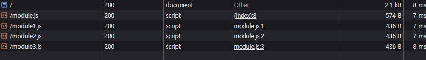

# 모듈 번들러(Module Bundler)

- [그림으로 보는 모듈 시스템과 모듈 번들러의 역사](#그림으로-보는-모듈-시스템과-모듈-번들러의-역사)
- [ESM 이전 Node.js 환경 모듈 시스템](#esm-이전-nodejs-환경-모듈-시스템)
  - [CommonJS](#commonjs)
  - [NPM(Node Package Manager)의 등장](#npmnode-package-manager의-등장)
- [ESM 이전 브라우저 환경 모듈 시스템](#esm-이전-브라우저-환경-모듈-시스템)
- [ESM의 등장](#esm의-등장)
  - [Node.js 환경](#nodejs-환경)
  - [브라우저 환경](#브라우저-환경)
- [ESM의 등장에도 모듈 번들러(Module Bundler)를 사용하는 이유](#esm의-등장에도-모듈-번들러module-bundler를-사용하는-이유)

## 그림으로 보는 모듈 시스템과 모듈 번들러의 역사


## ESM 이전 Node.js 환경 모듈 시스템

### CommonJS

- Node.js는 파일 시스템을 기반으로 자원에 접근한다.
- Node.js는 모듈을 구조화하고 재사용할 방법이 필요하여 커뮤니티 주도 하에 CommonJS 모듈 시스템을 채택했다.
- `require()` 함수로 모듈을 불러오고 `module.exports`, `exports`로 모듈을 내보낼 수 있다.
- 동기적으로 모듈을 로드한다.
- 런타임 환경에서 동적으로 모듈을 로드할 수 있다.

### NPM(Node Package Manager)의 등장

개발자들이 모듈을 공유하고 재사용하려는 요구에 따라 NPM이 등장했고, Node.js의 기본 패키지로 제공되었다.

▾ NPM 등장 이전

- 수동으로 파일을 구해 `lib/` 같은 폴더에 넣고, `require('./lib/something')`로 경로 기반 참조.
- 라이브러리가 다른 라이브러리에 의존하면, 해당 라이브러리를 수동으로 찾아야 했다(의존성 관리 어려움).
- 업데이트된 코드를 반영하려면 직접 다시 다운로드해야 했다(버전 관리 부재).
- 팀원 간 프로젝트를 공유할 때 모든 파일을 함께 넘겨야 했다(공유의 비효율성).

▾ NPM 등장 이후

- `npm install`로 NPM 레지스트리에서 다운로드하여 `node_modules`에 저장한다.
- `node_modules`가 표준 디렉토리가 되어 모듈 로딩 방식이 `node_modules`를 탐색해서 `require('something')`처럼 경로 없이 이름만으로 참조 가능하도록 표준화되었다.
- `package.json`에 의존성을 기록하면 `npm install`로 한 번에 설치 가능(의존성 자동화).
- `"express": "^4.17.1"`처럼 버전을 명시해 호환성 유지(버전 관리).
- 누구나 `npm publish`로 패키지를 공유할 수 있어 라이브러리 수가 폭발적으로 증가(생태계 확장).

## ESM 이전 브라우저 환경 모듈 시스템

- 브라우저는 네트워크를 기반으로 자원에 접근한다.
- JavaScript는 공식적인 모듈 시스템이 존재하지 않았다.
- 일반 스크립트는 `<script>` 태그를 통해 로드되며, 스크립트는 SOP를 따르지만 CORS가 필요 없는 방식으로 동작한다.
- 일반 스크립트는 브라우저에서 `file://`과 같이 파일 시스템을 이용해 직접 읽는 방식이 허용된다.
- 일반 스크립트는 전역 스코프에서 실행되어 변수나 함수가 전역 객체(`window`)에 추가될 때 이름 충돌이 빈번했다.
- 일반 스크립트는 로드 순서를 수동으로 관리해야 했기 때문에 의존성 관리가 어려웠다. 이를 해결하기 위해 AMD(Asynchronous Module Definition)나 RequireJS 같은 도구가 사용되기도 했으나, 공식 표준은 아니었다.

  ```html
  <!DOCTYPE html>
  <html>
    <head>
      <meta charset="utf-8" />
      <script src="https://unpkg.com/lodash@4.17.20"></script>
    </head>
    <body>
      <script src="index.js"></script>
    </body>
  </html>
  ```

  ```ts
  // index.js
  console.log(_.join(['a', 'b', 'c'], '~'));
  ```

  - 해당 일반 스크립트가 외부 라이브러리에 의존한다는 것이 명확하지 않다.
  - 의존성을 잃어버렸거나 잘못된 순서로 포함되었으면 앱이 제대로 작동하지 않는다.
  - 의존성이 포함되었지만 사용되지 않는 경우에도 브라우저는 필요 없는 코드를 강제로 다운로드한다.

## ESM의 등장

2015년 ECMAScript6(ES6)에서 브라우저와 서버 모두 동작하도록 설계된 모듈 시스템(ES Module)이 공식적으로 도입되었다.

▾ 특징

- `import`로 모듈을 불러오고 `export`로 모듈을 내보낼 수 있다.
- ESM은 모듈 시스템을 코드 실행 전에 정적으로 관리하므로 `import`와 `export`는 최상위 스코프에 선언되어야 한다.
- ESM은 코드 실행 전에 의존성을 분석하여 의존성 그래프를 생성한다.
- `import()`를 통해 비동기적으로 동적 모듈 로드를 지원한다.
- 모듈은 로드 시 단 한 번만 평가되어 그 결과를 메모리에 저장한다(싱글톤 패턴).

  ```ts
  // counter.js
  console.log('counter 모듈 평가 시작');
  export let count = 0;
  export function increment() {
    count++;
    console.log(`count: ${count}`);
  }

  // main.js
  import { count, increment } from './counter.js';
  console.log(`초기 count: ${count}`); // 0
  increment(); // count: 1

  // another.js
  import { count, increment } from './counter.js';
  console.log(`another에서 count: ${count}`); // 1 (0이 아님!)
  increment(); // count: 2
  ```

### Node.js 환경

▾ 특징

- `*.mjs` 확장자로 ESM 파일임을 명시하거나 `package.json`에 `"type": "module"`을 추가해 기본 모듈 시스템을 ESM으로 설정 가능. 이 외에는 CommonJS 방식으로 동작한다.
- 정적 `import` 선언은 동기적으로 동작한다.

### 브라우저 환경

▾ 과거와 비교하여 개선된 점

- 모듈 스크립트는 독립적인 모듈 스코프에서 실행되어 전역 스코프의 변수 충돌 문제를 해결할 수 있다.
- `import`로 필요한 모듈을 선언하여 의존성 관리가 쉬워졌다.

▾ 특징

- `<script>` 태그에 `type="module"` 속성 유무에 따라 일반 스크립트와 모듈 스크립트를 구분한다(`*.js`, `*.mjs` 등 확장자와 상관없음).

  ```html
  <script type='module' src='./module.js' >
  ```

- 정적 `import` 선언은 비동기적으로 동작한다.
- 모듈 스크립트는 비동기로 로드된다.

  

- 일반 스크립트에서 `async` 속성은 외부 스크립트를 불러올 때만 유효하다. 반면, 모듈 스크립트에선 `async` 속성을 인라인 스크립트에도 적용할 수 있다.
- `src` 속성값이 동일한 외부 스크립트는 한 번만 실행된다.
- ESM은 모듈 경로를 URL 기반으로 해석하여 `import { foo } from 'module.js';`를 HTTP 요청으로 변환한다. 그러므로 `file://`에서 동작하지 않는다.

  - 모듈 스크립트는 보안을 위해 CORS 정책을 강제한다.

  

- 모듈 해석 방식이 URL 기반이기 때문에 경로 없는 모듈은 에러가 발생한다.

  ```ts
  import { foo } from 'module.js'; // Success
  import { foo } from 'module'; // Error
  ```

- 각 모듈은 개별로 로드되어 파일이 많아질수록 네트워크 요청이 증가한다.

  ```html
  <script type="module" src="module.js"></script>
  ```

  ```ts
  // module1.js
  export let foo = 'foo';

  // module2.js
  export let bar = 'bar';

  // module3.js
  export let baz = 'baz';

  // index.js
  import { foo } from './module1.js';
  import { bar } from './module2.js';
  import { baz } from './module3.js';
  ```

  

## ESM의 등장에도 모듈 번들러(Module Bundler)를 사용하는 이유
