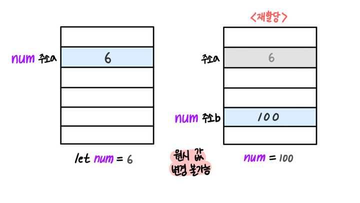
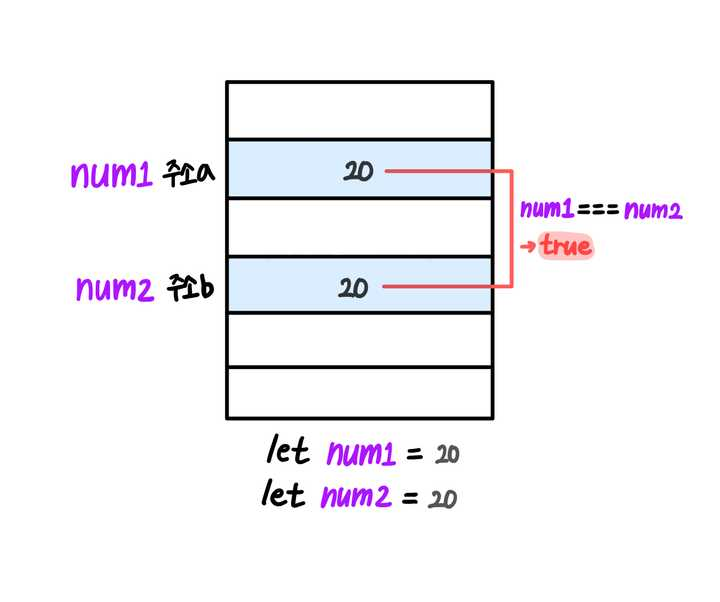
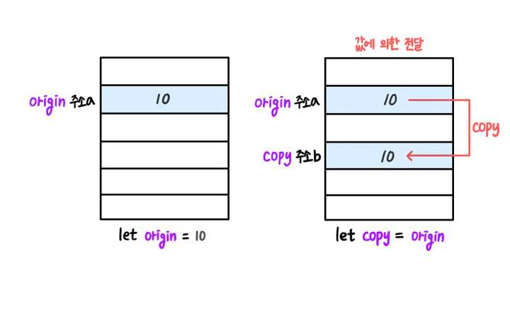
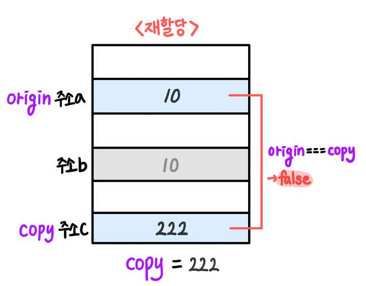
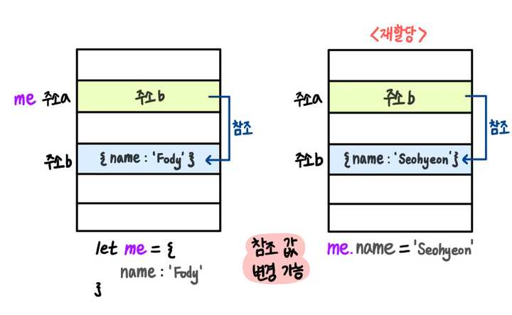
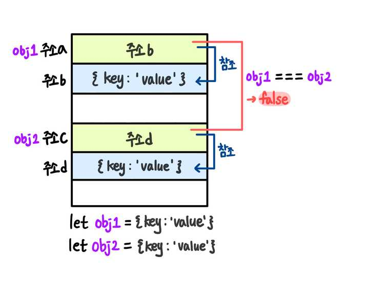
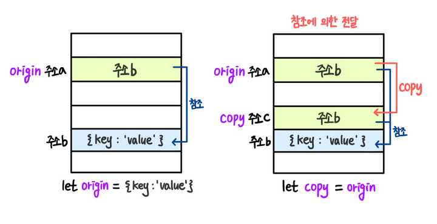
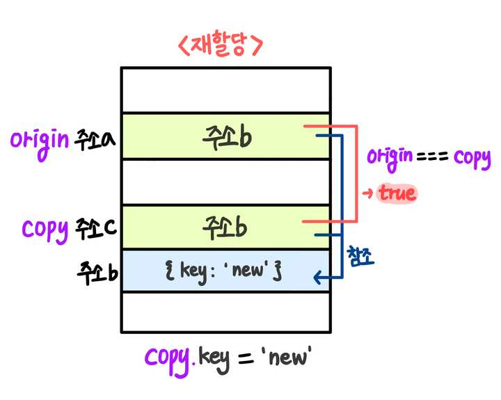

## Pass By Value vs Pass By Reference











## mutable vs immutable

JavaScript에서 mutable(변경 가능)과 immutable(불변) 개념은 데이터의 변경 가능성을 정의합니다. 이는 코드의 예측 가능성을 높이고, 특히 상태 관리가 중요한 애플리케이션에서 유용합니다. 아래에서 mutable과 immutable 데이터 유형의 차이점과 이들을 다루는 방법에 대해 설명합니다.

### Mutable vs Immutable

#### Mutable (변경 가능)

Mutable 데이터는 원래의 값을 직접 변경할 수 있는 데이터 유형입니다. JavaScript에서 배열과 객체는 대표적인 mutable 데이터 유형입니다.

**예시:**

```javascript
// 배열 (mutable)
let arr = [1, 2, 3];
arr.push(4); // arr는 [1, 2, 3, 4]로 변경됨

// 객체 (mutable)
let obj = { name: 'Alice', age: 25 };
obj.age = 26; // obj는 { name: 'Alice', age: 26 }으로 변경됨
```

#### Immutable (불변)

Immutable 데이터는 한 번 생성된 후에는 변경할 수 없는 데이터 유형입니다. JavaScript의 기본 자료형인 숫자, 문자열, 불리언은 불변입니다. 또한, 배열과 객체의 불변성을 유지하려면 복사를 통해 새로운 값을 만들어야 합니다.

**예시:**

```javascript
// 문자열 (immutable)
let str = 'Hello';
let newStr = str.concat(' World'); // str은 여전히 "Hello", newStr은 "Hello World"

// 숫자 (immutable)
let num = 5;
let newNum = num + 1; // num은 여전히 5, newNum은 6
```

### Immutable 데이터 구조를 사용하는 이유

1. **예측 가능성**: 데이터가 변하지 않기 때문에 코드의 예측 가능성이 높아집니다.
2. **변경 추적**: 불변 객체를 사용하면 변경 전후의 상태를 쉽게 추적할 수 있습니다.
3. **비교 용이성**: 불변 객체는 값이 변경되지 않으므로 얕은 비교(shallow comparison)로도 변경 여부를 알 수 있습니다.

### 불변성 유지하기

불변성을 유지하기 위해, JavaScript에서는 종종 배열이나 객체를 복사하여 새로운 데이터를 생성합니다.

**객체의 불변성 유지:**

```javascript
const originalObj = { name: 'Alice', age: 25 };

// 새로운 객체 생성
const newObj = { ...originalObj, age: 26 };

console.log(originalObj); // { name: 'Alice', age: 25 }
console.log(newObj); // { name: 'Alice', age: 26 }
```

**배열의 불변성 유지:**

```javascript
const originalArr = [1, 2, 3];

// 새로운 배열 생성
const newArr = [...originalArr, 4];

console.log(originalArr); // [1, 2, 3]
console.log(newArr); // [1, 2, 3, 4]
```

### 불변 라이브러리

불변성을 더 쉽게 관리하기 위해, JavaScript에서 `Immutable.js` 같은 라이브러리를 사용할 수 있습니다. 이는 복잡한 불변 데이터 구조를 간단하게 다룰 수 있도록 도와줍니다.

**예시:**

```javascript
const { Map } = require('immutable');

let map1 = Map({ a: 1, b: 2, c: 3 });
let map2 = map1.set('b', 50);

console.log(map1.get('b')); // 2
console.log(map2.get('b')); // 50
```

### 결론

JavaScript에서 mutable과 immutable 데이터 구조는 데이터의 변경 가능성을 관리하는 중요한 개념입니다. 특히, 상태 관리가 중요한 애플리케이션에서는 불변성을 유지하는 것이 예측 가능성을 높이고, 코드의 유지보수성을 향상시키는 데 도움이 됩니다. Spread 연산자, `Object.assign`, 또는 `Immutable.js`와 같은 도구를 사용하여 불변성을 유지할 수 있습니다.

## 깊은 객체 복사

```js
const object = {
  person: {
    age: 20,
    name: 'Tomas',
  },
  country: 'Korea',
};

const copyObject = JSON.parse(JSON.stringify(object));
```

### 직렬화가 불가능한 객체

- 함수 (Functions): 함수는 직렬화할 수 없다. 함수는 코드와 상태를 가지고 있어 일련의 바이트로 단순히 표현하기 어렵다.
- 심볼 (Symbols): ES6에서 추가된 심볼(Symbol)은 직렬화할 수 없다.
- 특별한 객체 (Host Objects): 일부 브라우저나 환경에서 제공하는 특수한 객체들은 직렬화가 불가능할 수 있다.
- 일부 자바스크립트 내장 객체 (Certain Native JavaScript Objects): 특정 내장 객체들은 직렬화가 어려울 수 있다. 예를 들어, `Error` 객체와 같은 것들은 일부 직렬화 형식에서는 문제를 일으킬 수 있다.

### null, undefined 직렬화 차이

```js
console.log(
  JSON.stringfy({
    name: null,
    age: 30,
    gender: undefine,
  }),
); // {"name":null,"age":30}
```

`null`의 경우 값으로 인정되고, `undefined`의 경우 삭제해버린다.

## null, undefined type check

```js
const temp = null;

if (temp == null) {
  console.log(temp); // null
}
```

```js
const temp = undefined;

if (temp == null) {
  console.log(temp); // undefined
}
```
