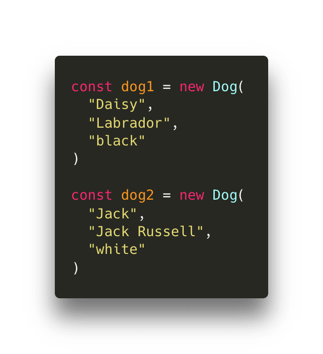
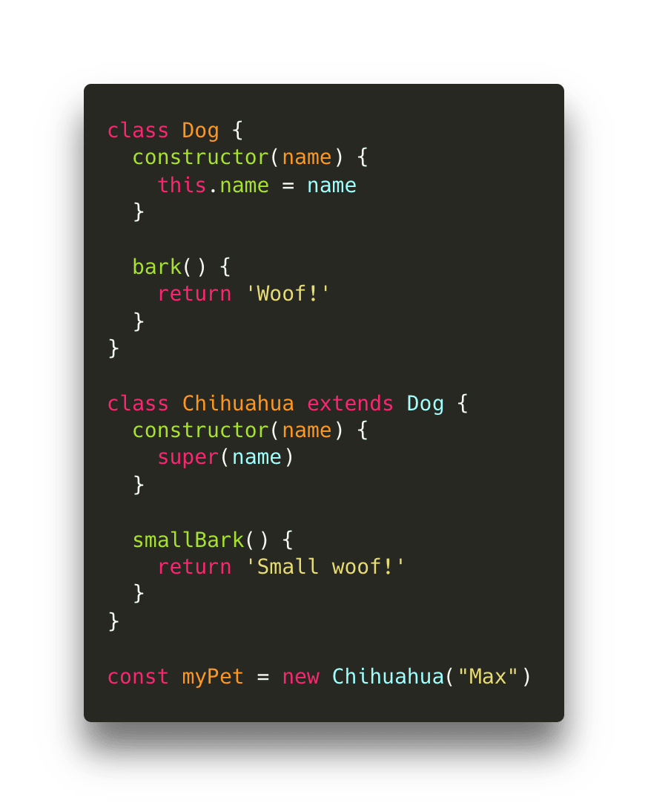

# Prototype








## class

```ts
class MyClass {
  // 1. public 인스턴스 속성
  public prop: string = 'default';

  // 2. private 필드
  #privateField: number = 42;

  // 3. static class 속성
  static staticProp: string = 'I am static';

  // 4. static class 메서드
  static staticMethod(): string {
    return 'This is a static method';
  }

  // 5. 생성자
  constructor(public name: string) {
    console.log('Instance created!');
  }

  // 6. 프로토타입 메서드
  public method(): string {
    return `Hello, my name is ${this.name}`;
  }

  // 7. getter
  get privateFieldValue(): number {
    return this.#privateField;
  }

  // 8. setter
  set privateFieldValue(value: number) {
    this.#privateField = value;
  }

  // 9. 계산된 이름 메서드 (Symbol 사용)
  [Symbol.iterator](): Iterator<number> {
    let count = 0;
    return {
      next: (): IteratorResult<number> => {
        if (count < 3) {
          return { value: count++, done: false };
        }
        return { done: true } as IteratorResult<number>;
      },
    };
  }
}

// 사용 예시
const instance = new MyClass('John');
console.log(instance.method()); // Hello, my name is John
console.log(MyClass.staticMethod()); // This is a static method
console.log(instance.privateFieldValue); // 42
instance.privateFieldValue = 100;
console.log(instance.privateFieldValue); // 100

for (const val of instance) {
  console.log(val); // 0, 1, 2
}
```

```ts
function MyClassProto(name) {
  // 1. 인스턴스 속성
  this.prop = 'default';
  this.name = name;

  // 2. 은닉된 필드 (클로저 사용; private 필드 대체)
  let privateField = 42;

  // 7. getter와 setter 대체
  Object.defineProperty(this, 'privateFieldValue', {
    get: function () {
      return privateField;
    },
    set: function (value) {
      privateField = value;
    },
  });
}

// 3. static 속성
MyClassProto.staticProp = 'I am static';

// 4. static 메서드
MyClassProto.staticMethod = function () {
  return 'This is a static method';
};

// 5. 프로토타입 메서드
MyClassProto.prototype.method = function () {
  return `Hello, my name is ${this.name}`;
};

// 9. 계산된 이름 메서드 (Symbol 사용)
MyClassProto.prototype[Symbol.iterator] = function () {
  let count = 0;
  return {
    next: function () {
      if (count < 3) {
        return { value: count++, done: false };
      }
      return { done: true };
    },
  };
};

// 사용 예시:
const instanceProto = new MyClassProto('John');
console.log(instanceProto.method()); // Hello, my name is John
console.log(MyClassProto.staticMethod()); // This is a static method
console.log(instanceProto.privateFieldValue); // 42
instanceProto.privateFieldValue = 100;
console.log(instanceProto.privateFieldValue); // 100

for (const val of instanceProto) {
  console.log(val); // 0, 1, 2
}
```
