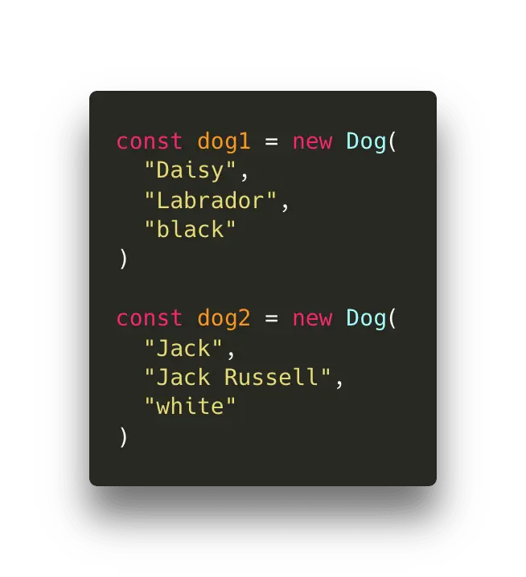
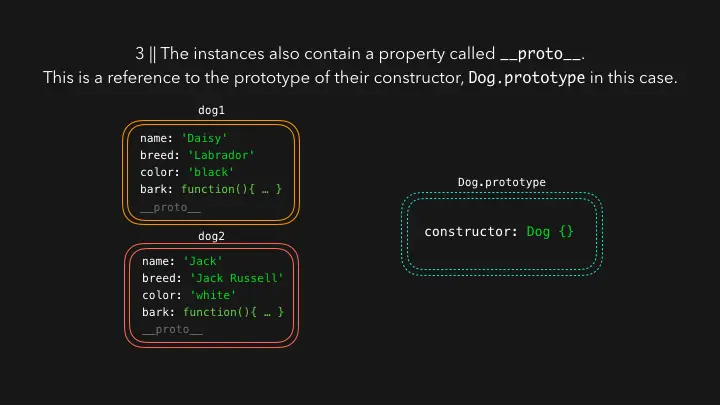
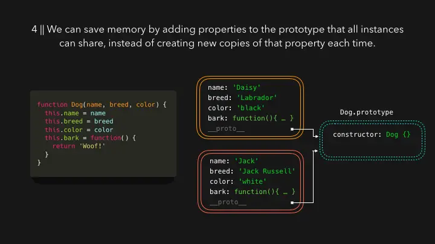
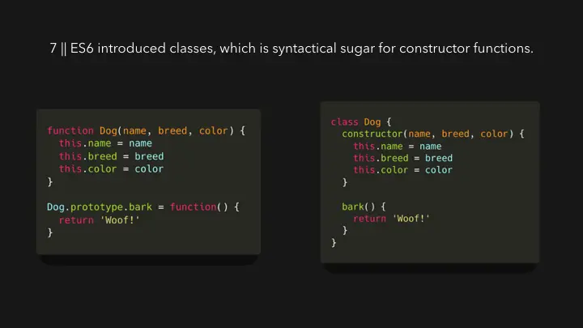
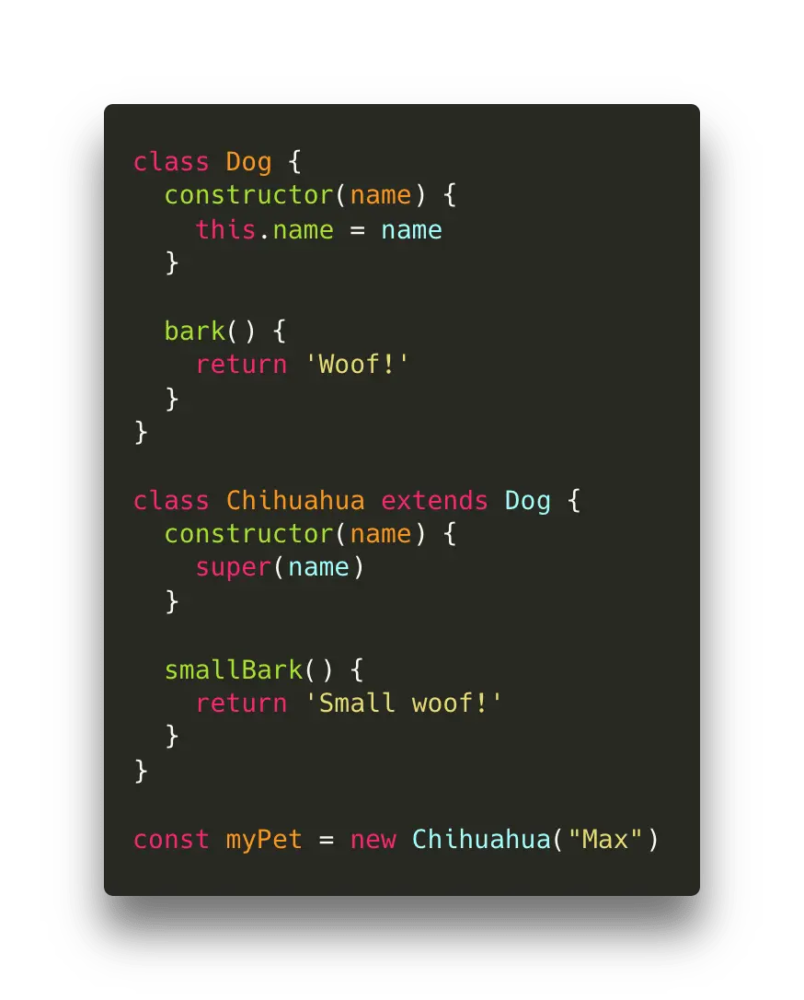
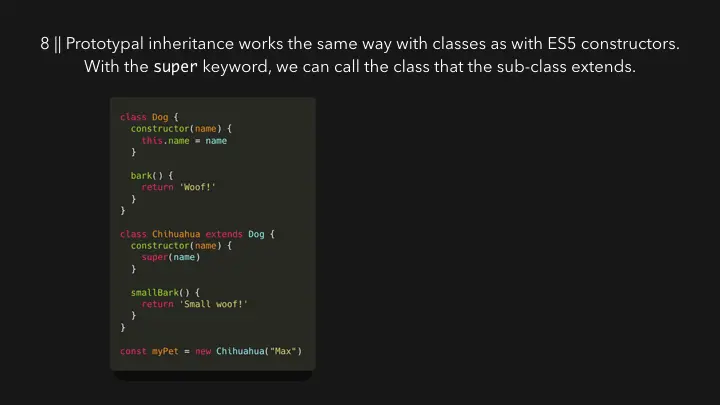
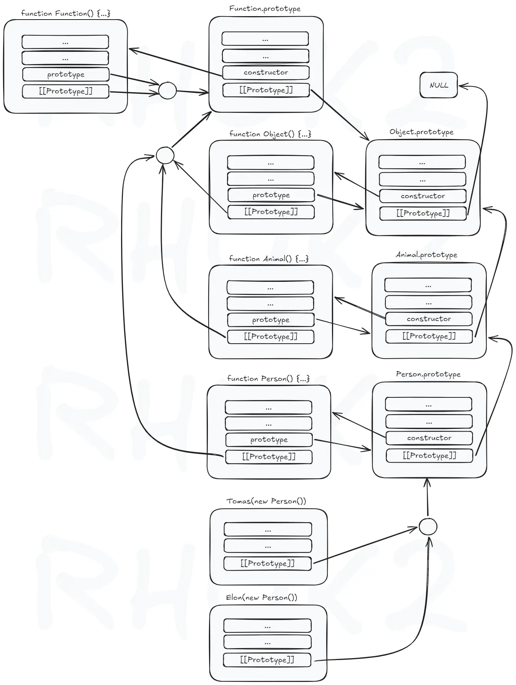

# 프로토타입(Prototype)

- [프로토타입(Prototype)이란?](#프로토타입prototype이란)
- [그림으로 보는 프로토타입](#그림으로-보는-프로토타입)
  - [프로토타입 다이어그램](#프로토타입-다이어그램)
- [프로토타입 기반 상속 vs 클래스 기반 상속](#프로토타입-기반-상속-vs-클래스-기반-상속)
  - [프로토타입 방식 예제](#프로토타입-방식-예제)
  - [클래스 방식 예제](#클래스-방식-예제)
- [JavaScript 클래스 vs TypeScript 클래스](#javascript-클래스-vs-typescript-클래스)
  - [문법 차이점](#문법-차이점)
    - [1. 타입 선언 및 접근 제어자(Access Modifier)](#1-타입-선언-및-접근-제어자access-modifier)
    - [2. 인터페이스(Interface) 구현](#2-인터페이스interface-구현)
    - [3. 추상 클래스(Abstract Class)](#3-추상-클래스abstract-class)
  - [주요 차이점 요약](#주요-차이점-요약)

## 프로토타입(Prototype)이란?

JavaScript는 프로토타입 기반의 객체 지향 언어다. 모든 객체는 자신의 부모 역할을 하는 프로토타입 객체로부터 속성과 메서드를 상속받는다.

- 특징:
  - 객체 간의 효율적인 자원 공유를 위해 사용됨.
  - 프로토타입 체인(Prototype Chain)을 통해 상위 객체의 속성에 접근함.
  - `Object.prototype`은 모든 객체의 최상위 부모임.

## 그림으로 보는 프로토타입












### 프로토타입 다이어그램



## 프로토타입 기반 상속 vs 클래스 기반 상속

JavaScript에서 상속을 구현하는 두 가지 방식인 생성자 함수(Constructor Function)와 ES6 클래스(Class)를 비교한다.

- 프로토타입 방식:
  - 생성자 함수의 `prototype` 속성에 메서드를 직접 정의함.
  - `Object.create()`를 사용하여 상속 체인을 형성함.
- 클래스 방식:
  - `class`, `extends`, `super` 키워드를 사용하여 더 직관적인 문법을 제공함.
  - 내부적으로는 여전히 프로토타입 기반으로 동작함.

### 프로토타입 방식 예제

```ts
// 부모 생성자 함수
function Animal(name: string, age: number) {
  this.name = name;
  this.age = age;
}

// 부모 프로토타입에 메서드 추가
Animal.prototype.makeSound = function () {
  return 'Some sound';
};

// 자식 생성자 함수
function Person(name: string, age: number, gender: string) {
  Animal.call(this, name, age); // 부모 생성자 호출
  this.gender = gender;
}

// 상속 설정
Person.prototype = Object.create(Animal.prototype);
Person.prototype.constructor = Person;

Person.prototype.makeSound = function () {
  return 'Hello!';
};
```

### 클래스 방식 예제

```ts
class Animal {
  constructor(
    public name: string,
    public age: number,
  ) {}
  makeSound() {
    return 'Some sound';
  }
}

class Person extends Animal {
  constructor(
    name: string,
    age: number,
    public gender: string,
  ) {
    super(name, age);
  }
  makeSound() {
    return 'Hello!';
  }
}
```

## JavaScript 클래스 vs TypeScript 클래스

TypeScript는 JavaScript의 클래스 문법에 타입 시스템과 강력한 객체 지향 기능을 추가한다.

### 문법 차이점

#### 1. 타입 선언 및 접근 제어자(Access Modifier)

- JavaScript: 타입 선언이 없으며, `#` 기호를 사용한 프라이빗 필드만 지원함.
- TypeScript: `public`, `private`, `protected` 접근 제어자를 통해 캡슐화를 지원함.

#### 2. 인터페이스(Interface) 구현

- TypeScript는 `implements` 키워드를 사용하여 클래스가 특정 규격을 준수하도록 강제할 수 있음.

#### 3. 추상 클래스(Abstract Class)

- TypeScript는 `abstract` 키워드를 지원하여 인스턴스화할 수 없는 부모 클래스를 정의하고 하위 클래스에서 특정 메서드를 구현하도록 강제함.

### 주요 차이점 요약

- 타입 안정성: TypeScript는 컴파일 타임에 타입 체크를 수행함.
- 접근 제어: 명시적인 접근 제어자 지원으로 코드 가독성 및 보안 향상.
- 인터페이스 및 제네릭: 더 복잡하고 유연한 클래스 설계가 가능함.
- 개발 환경: IDE의 자동완성 및 리팩토링 지원이 강력함.
