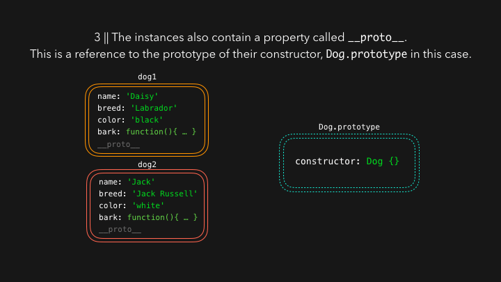

# 프로토타입(Prototype)

## 그림으로 보는 프로토타입





## 프로토타입 다이어그램


## 프로토타입 방식 vs 클래스

```ts
// 부모 생성자 함수
function Animal(name: string, age: number) {
  this.name = name;
  this.age = age;
}

// 부모 프로토타입에 메서드 추가
Animal.prototype.makeSound = function () {
  return 'override sound';
};

Animal.prototype.move = function (distance: number) {
  return `${this.name} moved ${distance} meters`;
};

// 정적 메서드 정의
Animal.isAdult = function (age: number) {
  return age >= 18;
};

// 자식 생성자 함수
function Person(name: string, age: number, gender: string) {
  // 부모 생성자 호출(this 바인딩)
  Animal.call(this, name, age);
  this.gender = gender;
}

// Person의 프로토타입을 Animal의 프로토타입으로 연결(상속 설정)
Person.prototype = Object.create(Animal.prototype);

// Person의 constructor를 복구(Object.create로 덮어씌워졌기 때문)
Person.prototype.constructor = Person;

// 자식 프로토타입에 메서드 추가 및 오버라이딩
Person.prototype.makeSound = function () {
  return 'Hello, Nice to meet you!';
};

Person.prototype.jump = function () {
  return `${this.name} jumped!`;
};

const dinosaur = new Animal('Dinosaur', 5);
console.log(dinosaur);
console.log(dinosaur.move(10));
console.log(dinosaur.makeSound());
console.log(Animal.isAdult(30));

const tomas = new Person('Tomas', 30, 'male');
console.log(tomas);
console.log(tomas.move(5));
console.log(tomas.makeSound());
console.log(tomas.jump());
console.log(tomas instanceof Person);
console.log(tomas instanceof Animal);
```

```ts
class Animal {
  constructor(
    public name: string,
    public age: number,
  ) {
    this.name = name;
    this.age = age;
  }
  makeSound() {
    return 'Some generic animal sound';
  }
  move(distance: number) {
    return `${this.name} moved ${distance} meters`;
  }

  static isAdult(age: number) {
    return age >= 18;
  }
}

class Person extends Animal {
  constructor(
    name: string,
    age: number,
    public gender: string,
  ) {
    super(name, age);
    this.gender = gender;
  }
  makeSound() {
    return 'Hello, Nice to meet you!';
  }
  jump() {
    return `${this.name} jumped!`;
  }
}
```

## js 클래스 vs ts 클래스

### 문법 차이점

#### 1. 타입 선언

```js
// JavaScript - 타입 선언 없음
class Animal {
  constructor(name, age) {
    this.name = name;
    this.age = age;
  }
}
```

```ts
// TypeScript - 타입 선언 필수
class Animal {
  constructor(
    public name: string,
    public age: number,
  ) {
    this.name = name;
    this.age = age;
  }
}
```

#### 2. 접근 제어자

```js
// JavaScript - 접근 제어자 지원 안함 (private # 문법만 지원)
class Animal {
  #privateField = 'private';

  constructor(name, age) {
    this.name = name;
    this.age = age;
  }
}
```

```ts
// TypeScript - public, private, protected 지원
class Animal {
  private _id: number;
  protected species: string;

  constructor(
    public name: string,
    public age: number,
  ) {
    this._id = Math.random();
    this.species = 'unknown';
  }
}
```

#### 3. 메서드 타입 정의

```js
// JavaScript - 반환 타입 선언 불가
class Animal {
  makeSound() {
    return 'Some sound';
  }

  move(distance) {
    return `Moved ${distance} meters`;
  }
}
```

```ts
// TypeScript - 매개변수와 반환 타입 선언 가능
class Animal {
  makeSound(): string {
    return 'Some sound';
  }

  move(distance: number): string {
    return `Moved ${distance} meters`;
  }
}
```

#### 4. 인터페이스 구현

```js
// JavaScript - 인터페이스 개념 없음
class Animal {
  makeSound() {
    return 'Some sound';
  }
}
```

```ts
// TypeScript - 인터페이스 구현 가능
interface Movable {
  move(distance: number): string;
}

interface Soundable {
  makeSound(): string;
}

class Animal implements Movable, Soundable {
  makeSound(): string {
    return 'Some sound';
  }

  move(distance: number): string {
    return `Moved ${distance} meters`;
  }
}
```

#### 5. 제네릭 클래스

```js
// JavaScript - 제네릭 지원 안함
class Container {
  constructor(value) {
    this.value = value;
  }

  getValue() {
    return this.value;
  }
}
```

```ts
// TypeScript - 제네릭 클래스 지원
class Container<T> {
  constructor(private value: T) {}

  getValue(): T {
    return this.value;
  }
}

const stringContainer = new Container<string>('hello');
const numberContainer = new Container<number>(42);
```

#### 6. 추상 클래스

```js
// JavaScript - 추상 클래스 개념 없음 (런타임에 체크해야 함)
class Animal {
  constructor(name) {
    if (this.constructor === Animal) {
      throw new Error('Cannot instantiate abstract class');
    }
    this.name = name;
  }

  makeSound() {
    throw new Error('Must implement makeSound method');
  }
}
```

```ts
// TypeScript - abstract 키워드 지원
abstract class Animal {
  constructor(protected name: string) {}

  abstract makeSound(): string;

  move(): string {
    return `${this.name} is moving`;
  }
}

class Dog extends Animal {
  makeSound(): string {
    return 'Woof!';
  }
}
```

### 컴파일 결과 비교

#### TypeScript 코드

```ts
class Person {
  constructor(
    private name: string,
    public age: number,
  ) {}

  greet(): string {
    return `Hello, I'm ${this.name}`;
  }
}
```

#### 컴파일된 JavaScript 코드

```js
class Person {
  constructor(name, age) {
    this.name = name;
    this.age = age;
  }

  greet() {
    return `Hello, I'm ${this.name}`;
  }
}
```

### 주요 차이점 요약

- **타입 안정성**: TypeScript는 컴파일 타임에 타입 체크
- **접근 제어**: TypeScript는 명시적인 접근 제어자 지원
- **인터페이스**: TypeScript는 인터페이스 구현 가능
- **제네릭**: TypeScript는 제네릭 클래스 지원
- **추상화**: TypeScript는 추상 클래스와 메서드 지원
- **개발 경험**: TypeScript는 더 나은 IDE 지원과 자동완성
