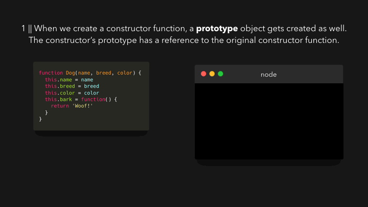
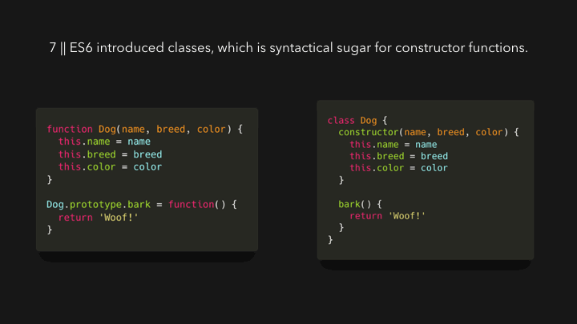
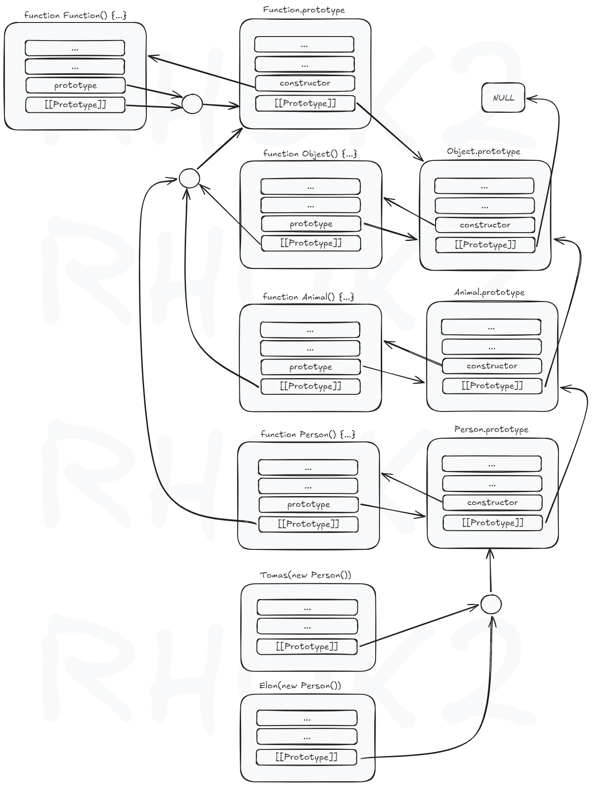

# 프로토타입(Prototype)

## 그림으로 보는 프로토타입







## 프로토타입 다이어그램



## 프로토타입 방식 vs 클래스

```ts
// 부모 생성자 함수
function Animal(name: string, age: number) {
  this.name = name;
  this.age = age;
}

// 부모 프로토타입에 메서드 추가
Animal.prototype.makeSound = function () {
  return 'override sound';
};

Animal.prototype.move = function (distance: number) {
  return `${this.name} moved ${distance} meters`;
};

// 정적 메서드 정의
Animal.isAdult = function (age: number) {
  return age >= 18;
};

// 자식 생성자 함수
function Person(name: string, age: number, gender: string) {
  // 부모 생성자 호출(this 바인딩)
  Animal.call(this, name, age);
  this.gender = gender;
}

// Person의 프로토타입을 Animal의 프로토타입으로 연결(상속 설정)
Person.prototype = Object.create(Animal.prototype);

// Person의 constructor를 복구(Object.create로 덮어씌워졌기 때문)
Person.prototype.constructor = Person;

// 자식 프로토타입에 메서드 추가 및 오버라이딩
Person.prototype.makeSound = function () {
  return 'Hello, Nice to meet you!';
};

Person.prototype.jump = function () {
  return `${this.name} jumped!`;
};

const dinosaur = new Animal('Dinosaur', 5);
console.log(dinosaur);
console.log(dinosaur.move(10));
console.log(dinosaur.makeSound());
console.log(Animal.isAdult(30));

const tomas = new Person('Tomas', 30, 'male');
console.log(tomas);
console.log(tomas.move(5));
console.log(tomas.makeSound());
console.log(tomas.jump());
console.log(tomas instanceof Person);
console.log(tomas instanceof Animal);
```

```ts
class Animal {
  constructor(
    public name: string,
    public age: number,
  ) {
    this.name = name;
    this.age = age;
  }
  makeSound() {
    return 'Some generic animal sound';
  }
  move(distance: number) {
    return `${this.name} moved ${distance} meters`;
  }

  static isAdult(age: number) {
    return age >= 18;
  }
}

class Person extends Animal {
  constructor(
    name: string,
    age: number,
    public gender: string,
  ) {
    super(name, age);
    this.gender = gender;
  }
  makeSound() {
    return 'Hello, Nice to meet you!';
  }
  jump() {
    return `${this.name} jumped!`;
  }
}
```
