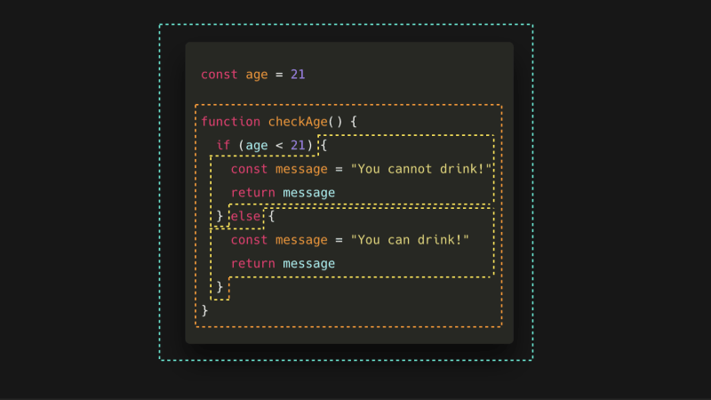

# 스코프(Scope)

- [스코프(Scope)란?](#스코프scope란)
- [스코프 종류](#스코프-종류)
- [스코프 체인(Scope Chain)](#스코프-체인scope-chain)
- [렉시컬 스코프(Lexical Scope)](#렉시컬-스코프lexical-scope)
- [클로저(Closure)](#클로저closure)

## 스코프(Scope)란?

스코프는 변수와 함수가 접근 가능한 범위를 의미한다.

## 스코프 종류



1. 전역 스코프

   - 코드의 가장 바깥쪽에서 선언된 변수 또는 함수.
   - 어디서든 접근 가능.
   - `*.js`의 최상위 스코프

     ```ts
     let globalVar = "I'm global!";

     function globalFunc() {
       console.log(globalVar); // 접근 가능
     }
     ```

2. 모듈 스코프

   - ES6(ES2015)에서 도입된 `import`/`export`를 사용하는 모듈 시스템에서 적용.
   - 전역 스코프와 분리되어, 모듈 간의 충돌을 방지.
   - 모듈 내부의 변수는 전역으로 노출되지 않으며, `export`를 통해 외부에 공개 가능.
   - 모듈 내에서 선언된 변수, 함수, 클래스는 해당 모듈 내에서만 접근 가능.
   - `*.mjs`의 최상위 스코프

     ```ts
     let moduleVar = "I'm in a module!";

     export function getModuleVar() {
       return moduleVar;
     }
     ```

     ```ts
     import { getModuleVar } from './module.js';

     console.log(getModuleVar()); // "I'm in a module!"
     console.log(moduleVar); // 접근 불가 (ReferenceError)
     ```

3. 함수 스코프

   - 함수 내부에서 선언된 변수 또는 함수.
   - 해당 함수 내부에서만 접근 가능.

     ```ts
     function myFunc() {
       let localVar = "I'm local!";

       console.log(localVar); // 접근 가능
     }

     console.log(localVar); // 접근 불가 (ReferenceError)
     ```

4. 블록 스코프

   - `{}`로 묶인 블록 내부에서 선언된 변수.
   - `let`과 `const`로 선언된 변수만 블록 스코프를 가짐.

     ```ts
     if (true) {
       let blockVar = "I'm in a block!";

       console.log(blockVar); // 접근 가능
     }

     console.log(blockVar); // 접근 불가 (ReferenceError)
     ```

## 스코프 체인(Scope Chain)


- 함수가 중첩되어 있을 때, 내부 함수는 외부 함수의 스코프에 접근 가능.
- 변수를 찾을 때 현재 스코프에서 시작해 상위 스코프로 올라가며 탐색.

```ts
let outerVar = "I'm outer!";

function outerFunc() {
  let innerVar = "I'm inner!";

  function innerFunc() {
    console.log(outerVar); // "I'm outer!"
    console.log(innerVar); // "I'm inner!"
  }

  innerFunc();
}

outerFunc();
```

## 렉시컬 스코프(Lexical Scope)

- 스코프는 코드가 작성된 위치에 따라 정적으로 결정.
- 함수가 선언된 위치에 따라 스코프가 결정되며, 호출 위치와 무관.

  ```ts
  let x = 'global';

  function outer() {
    let x = 'outer';

    function inner() {
      console.log(x); // "outer" (호출 위치가 아닌 선언 위치 기준)
    }

    inner();
  }

  outer();
  ```

## 클로저(Closure)

- 클로저는 함수와 그 함수가 선언된 렉시컬 환경의 조합이다.
- 함수가 자신이 생성될 때의 환경을 기억하고, 이후에도 그 환경에 접근할 수 있는 특성을 가진다.
- 클로저에 의해 참조되는 경우, 가비지 컬렉션 대상에서 제외된다.
- 메모리 누수 가능성이 존재한다.

```ts
function outer() {
  let count = 0;

  return function inner() {
    count++;

    return count;
  };
}

const counter = outer();

console.log(counter()); // 1
console.log(counter()); // 2
```
