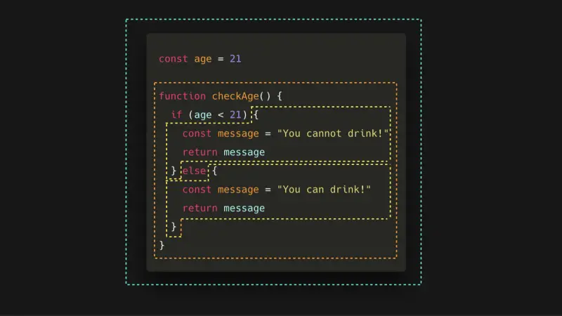
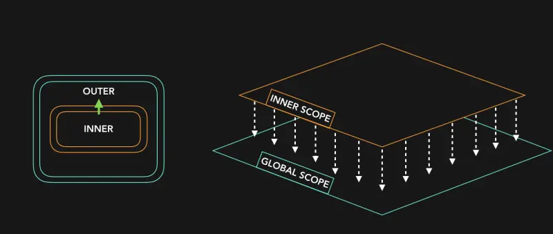
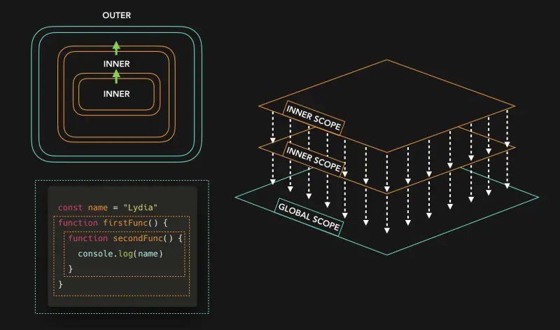

# 스코프(Scope)와 클로저(Closure)

- [스코프(Scope)의 개념](#스코프scope의-개념)
- [스코프의 종류](#스코프의-종류)
  - [전역 스코프 • 모듈 스코프](#전역-스코프--모듈-스코프)
  - [함수 스코프 • 블록 스코프](#함수-스코프--블록-스코프)
- [스코프 체인(Scope Chain)](#스코프-체인scope-chain)
- [렉시컬 스코프(Lexical Scope)](#렉시컬-스코프lexical-scope)
- [클로저(Closure)](#클로저closure)
  - [클로저의 활용과 주의사항](#클로저의-활용과-주의사항)
  - [클로저와 메모리 관리](#클로저와-메모리-관리)

## 스코프(Scope)의 개념

스코프(Scope)는 식별자(변수, 함수, 클래스 이름 등)가 유효한 범위를 의미한다. 자바스크립트 엔진은 스코프를 통해 어떤 변수를 참조해야 할지 결정하는 '식별자 결정'을 수행한다.

## 스코프의 종류

### 전역 스코프 • 모듈 스코프

- 전역 스코프(Global Scope): 코드의 가장 바깥 영역임. 어디서든 접근 가능하며, 전역 변수는 프로그램 종료 시까지 메모리에 유지됨
- 모듈 스코프(Module Scope): ES6 모듈 시스템에서 파일 하나당 할당되는 독립적인 범위임. `export`하지 않은 식별자는 외부에서 접근 불가함

### 함수 스코프 • 블록 스코프

- 함수 스코프(Function Scope): 함수 몸체 내부에서만 유효한 범위임. `var` 키워드로 선언된 변수는 오직 함수 스코프만 따름
- 블록 스코프(Block Scope): 중괄호(`{}`)로 둘러싸인 코드 블록 내에서만 유효한 범위임. `let`, `const` 키워드로 선언된 변수에 적용됨



## 스코프 체인(Scope Chain)

스코프가 계층적으로 연결된 것을 스코프 체인(Scope Chain)이라 한다. 자바스크립트 엔진은 변수를 참조할 때 현재 스코프에서 시작하여 상위 스코프 방향으로 이동하며 선언된 변수를 검색한다.

- 검색 방향: 하위 스코프에서 상위 스코프로만 전파됨 (단방향성)
- 물리적 구현: 실행 컨텍스트(Execution Context)의 렉시컬 환경(Lexical Environment)에 연결된 외부 환경 참조를 통해 구현됨




## 렉시컬 스코프(Lexical Scope)

함수를 어디서 호출했는지가 아니라, 어디서 정의했는지에 따라 상위 스코프가 결정되는 방식이다. 이를 정적 스코프(Static Scope)라고도 한다.

```ts
let x = 'global';

function foo() {
  let x = 'local';
  bar();
}

function bar() {
  console.log(x); // "global" 출력
}

foo();
```

- 특징: 함수가 호출될 때가 아닌 선언될 때 스코프가 확정되어 영구적으로 고정됨

## 클로저(Closure)

클로저(Closure)는 함수와 그 함수가 선언된 렉시컬 환경(Lexical Environment)의 조합이다. 외부 함수보다 내부 함수가 더 오래 유지되는 경우, 내부 함수는 이미 생명 주기가 종료된 외부 함수의 변수를 여전히 참조할 수 있다.

```ts
function makeCounter() {
  let count = 0;

  return function () {
    return ++count;
  };
}

const counter = makeCounter();
console.log(counter()); // 1
console.log(counter()); // 2
```

### 클로저의 활용과 주의사항

- 활용 사례:
  - 캡슐화 및 정보 은닉: 외부에서 직접 접근할 수 없는 프라이빗 변수를 구현함
  - 상태 유지: 전역 변수를 사용하지 않고 특정 상태를 안전하게 유지함
  - 함수 팩토리: 특정 환경을 기억하는 특화된 함수를 생성함
- 주의사항:
  - 메모리 소비: 참조가 유지되는 동안은 가비지 컬렉션 대상이 되지 않으므로 필요한 경우에만 사용해야 함
  - 순환 참조: 의도치 않은 참조로 인해 메모리 누수가 발생할 수 있으니 주의가 필요함

### 클로저와 메모리 관리

클로저가 캡처한 변수는 클로저가 참조되는 동안 가비지 컬렉션(GC) 대상이 되지 않는다. 캡처한 값이 숫자, 문자열 등 작은 원시값이라면 메모리 영향이 미미하지만, 대용량 배열이나 객체를 캡처하면 메모리 사용량이 커질 수 있다.

React 환경에서 리렌더링마다 새로운 클로저가 생성되는 경우 `useRef`나 `useMemo`로 참조를 단일화하여 불필요한 메모리 점유를 방지한다.

```ts
// 리렌더링마다 새 배열 생성 → 메모리 누적 위험
function useCustom() {
  const array = Array.from({ length: 1000000 }, (_, i) => i + 1);
  return () => console.log(array);
}

// useRef로 단일 인스턴스 유지 → 메모리 누수 방지
function useCustom() {
  const array = useRef(Array.from({ length: 1000000 }, (_, i) => i + 1));
  return () => console.log(array.current);
}
```

DevTools에서 `console.log`로 큰 객체를 출력하면 콘솔이 해당 객체를 GC Root로 유지하므로 GC가 동작하지 않아 메모리가 누적될 수 있다. 디버깅 후에는 콘솔을 지우거나 출력 데이터를 줄이는 것이 권장된다.
