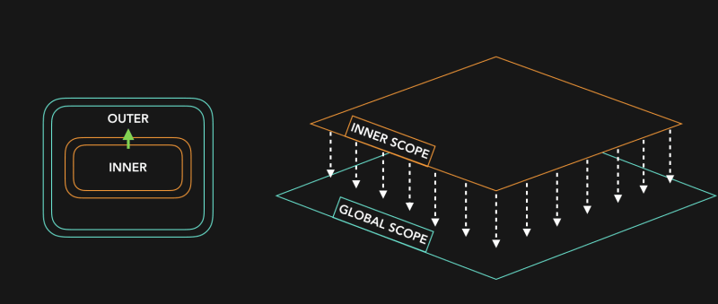
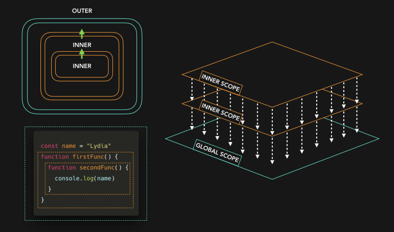

# Scope

- [스코프 종류](#스코프-종류)
- [스코프 체인](#스코프-체인)
- [렉시컬 스코프](#렉시컬-스코프)
  - [모듈 스코프의 특징:](#모듈-스코프의-특징)
  - [모듈 스코프의 장점:](#모듈-스코프의-장점)
- [개념](#개념)
- [Closure](#closure)
- [일급 객체](#일급-객체)
- [실무에서 클로저 사용 예시](#실무에서-클로저-사용-예시)
- [Decorator](#decorator)

## 스코프 종류

1. 전역 스코프(Global Scope):

   - 코드의 가장 바깥쪽에서 선언된 변수 또는 함수.
   - 어디서든 접근 가능.
   - 예:
     ```javascript
     let globalVar = "I'm global!";
     function globalFunc() {
       console.log(globalVar); // 접근 가능
     }
     ```

2. 함수 스코프(Function Scope):

   - 함수 내부에서 선언된 변수 또는 함수.
   - 해당 함수 내부에서만 접근 가능.
   - 예:
     ```javascript
     function myFunc() {
       let localVar = "I'm local!";
       console.log(localVar); // 접근 가능
     }
     console.log(localVar); // 접근 불가 (ReferenceError)
     ```

3. 블록 스코프(Block Scope):
   - `{}`(중괄호)로 묶인 블록 내부에서 선언된 변수.
   - `let`과 `const`로 선언된 변수만 블록 스코프를 가짐.
   - 예:
     ```javascript
     if (true) {
       let blockVar = "I'm in a block!";
       console.log(blockVar); // 접근 가능
     }
     console.log(blockVar); // 접근 불가 (ReferenceError)
     ```

## 스코프 체인




- 함수가 중첩되어 있을 때, 내부 함수는 외부 함수의 스코프에 접근 가능.
- 변수를 찾을 때 현재 스코프에서 시작해 상위 스코프로 올라가며 탐색.

```ts
let outerVar = "I'm outer!";
function outerFunc() {
  let innerVar = "I'm inner!";
  function innerFunc() {
    console.log(outerVar); // "I'm outer!"
    console.log(innerVar); // "I'm inner!"
  }
  innerFunc();
}
outerFunc();
```

## 렉시컬 스코프

- 스코프는 코드가 작성된 위치에 따라 정적으로 결정.
- 함수가 선언된 위치에 따라 스코프가 결정되며, 호출 위치와 무관.
- 예:
  ```javascript
  let x = 'global';
  function outer() {
    let x = 'outer';
    function inner() {
      console.log(x); // "outer" (호출 위치가 아닌 선언 위치 기준)
    }
    inner();
  }
  outer();
  ```

결론:

- 스코프는 변수와 함수의 접근 범위를 정의.
- 전역, 함수, 블록 스코프로 구분되며, 스코프 체인과 렉시컬 스코프를 통해 변수 탐색이 이루어짐.
- 모듈 스코프(Module Scope):
  - ES6(ES2015)에서 도입된 `import`/`export`를 사용하는 모듈 시스템에서 적용.
  - 모듈 내에서 선언된 변수, 함수, 클래스는 해당 모듈 내에서만 접근 가능.
  - 전역 스코프와 분리되어, 모듈 간의 충돌을 방지.

### 모듈 스코프의 특징:

1. 모듈 내부의 변수는 전역으로 노출되지 않음:

   - 모듈 내에서 선언된 변수는 기본적으로 해당 모듈 내부에서만 접근 가능.
   - 예:
     ```javascript
     // module.js
     let moduleVar = "I'm in a module!";
     export function getModuleVar() {
       return moduleVar;
     }
     ```
     ```javascript
     // main.js
     import { getModuleVar } from './module.js';
     console.log(getModuleVar()); // "I'm in a module!"
     console.log(moduleVar); // 접근 불가 (ReferenceError)
     ```

2. 모듈 간의 독립성:

   - 각 모듈은 자신만의 스코프를 가지며, 다른 모듈의 스코프에 직접 접근 불가.
   - `export`로 명시적으로 공개한 것만 다른 모듈에서 사용 가능.

3. 전역 스코프와의 차이:
   - 전역 스코프는 모든 코드에서 접근 가능하지만, 모듈 스코프는 해당 모듈 내부로 제한.
   - 예:
     ```javascript
     // module.js
     let globalVar = "I'm global!";
     export function getGlobalVar() {
       return globalVar;
     }
     ```
     ```javascript
     // main.js
     import { getGlobalVar } from './module.js';
     console.log(getGlobalVar()); // "I'm global!"
     console.log(globalVar); // 접근 불가 (ReferenceError)
     ```

### 모듈 스코프의 장점:

- 캡슐화: 모듈 내부의 구현 세부사항을 숨기고, 필요한 기능만 공개 가능.
- 충돌 방지: 전역 스코프와 분리되어 변수 이름 충돌 문제를 방지.
- 재사용성: 모듈 단위로 코드를 분리하여 재사용성 증가.

결론:

- 모듈 스코프는 ES6 모듈 시스템에서 적용되는 독립적인 스코프.
- 모듈 내부의 변수는 전역으로 노출되지 않으며, `export`를 통해 외부에 공개 가능.
- 전역 스코프와 분리되어 코드의 안정성과 재사용성을 높임.

## 개념


## Closure

## 일급 객체

일급 객체(First-class Object)는 프로그래밍 언어에서 특정 조건을 만족하는 객체를 지칭하는 용어입니다.

주요 조건은 다음과 같습니다:

1. 변수에 할당 가능
2. 함수의 인자로 전달 가능
3. 함수의 반환값으로 사용 가능
4. 자료구조(배열, 객체 등)에 저장 가능

JavaScript에서 함수는 일급 객체의 조건을 모두 만족합니다. 예를 들어:

```javascript
// 1. 변수에 할당
const foo = function () {
  console.log('Hello');
};

// 2. 함수의 인자로 전달
function bar(func) {
  func();
}
bar(foo);

// 3. 함수의 반환값으로 사용
function baz() {
  return function () {
    console.log('World');
  };
}
const qux = baz();
qux();

// 4. 자료구조에 저장
const arr = [foo, qux];
arr.forEach((func) => func());
```

이처럼 JavaScript에서 함수는 일급 객체로서 다양한 방식으로 활용될 수 있습니다. 이러한 특성은 고차 함수, 클로저, 콜백 패턴 등 함수형 프로그래밍 기법을 가능하게 하는 기반이 됩니다.

## 실무에서 클로저 사용 예시

이벤트에 이벤트 객체 외에 인수를 받는 함수를 연결할 경우 클로저를 사용해서 조금 더 간결하게 작성 가능하다.

```js
// 이벤트 객체와 같은 depth에서 인수를 구성한 경우
const debounce = (event, callback) => {
  ...
}

<button onClick={(event) => debounce(event, callback)}>Click</button>

// 이벤트 객체를 인수로 받는 함수를 클로저로 감싸서 함수를 실행하는 형태로 이벤트에 연결하는 경우
const debounce = (callback) => () => {
  ...
};

<button onClick={debounce(callback)}>Click</button>
```

## Decorator

데코레이터는 함수를 받아서 기능을 확장시킨 새로운 함수를 반환하는 함수

데코레이터 함수 실행은 기능 추가된 함수의 반환이며 그 함수를 실행하려면 한 번 더 실행해야한다.
