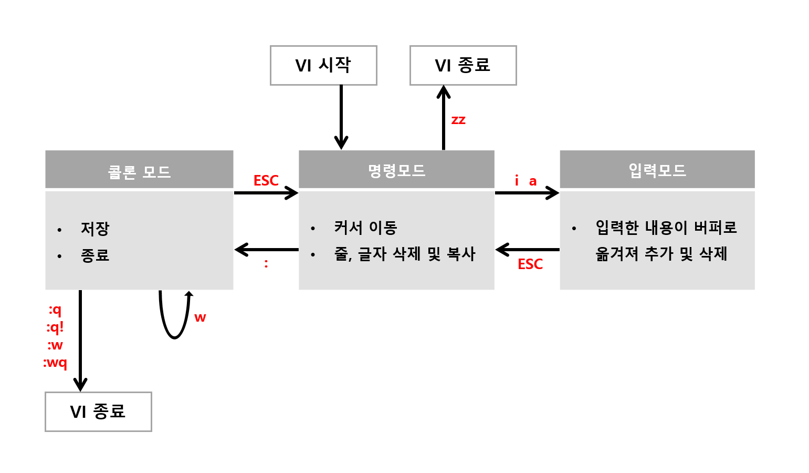

# Bash 셸(Shell) 사용법

- [파일 및 디렉터리 관리](#파일-및-디렉터리-관리)
- [표준 입출력 및 리다이렉션(Redirection)](#표준-입출력-및-리다이렉션redirection)
- [파일 권한(File Permissions) 관리](#파일-권한file-permissions-관리)
  - [심볼릭 링크와 하드 링크](#심볼릭-링크와-하드-링크)
  - [umask: 기본 권한 마스크](#umask-기본-권한-마스크)
- [텍스트 처리](#텍스트-처리)
  - [grep: 패턴 검색](#grep-패턴-검색)
  - [sort: 행 단위 정렬](#sort-행-단위-정렬)
  - [awk: 데이터 추출 및 가공](#awk-데이터-추출-및-가공)
  - [tr: 문자 변환 및 삭제](#tr-문자-변환-및-삭제)
- [파일 검색](#파일-검색)
- [압축 및 해제](#압축-및-해제)
- [시스템 리소스 모니터링](#시스템-리소스-모니터링)
- [프로세스 관리](#프로세스-관리)
- [패키지 관리](#패키지-관리)
- [사용자 및 그룹 관리](#사용자-및-그룹-관리)
- [네트워크 문제 해결](#네트워크-문제-해결)
- [SSH (Secure Shell Protocol)](#ssh-secure-shell-protocol)
- [예약 작업(Cron)](#예약-작업cron)
- [셸 환경 설정](#셸-환경-설정)
  - [alias: 명령어 별칭 설정](#alias-명령어-별칭-설정)
  - [source: 설정 파일 즉시 적용](#source-설정-파일-즉시-적용)
  - [다중 명령어 처리 연산자](#다중-명령어-처리-연산자)
  - [기본 셸 변경(chsh)](#기본-셸-변경chsh)
- [Bash 스크립트](#bash-스크립트)
  - [변수 선언 및 참조](#변수-선언-및-참조)
  - [환경 변수(Environment Variables)](#환경-변수environment-variables)
  - [위치 매개변수(Positional Parameters)](#위치-매개변수positional-parameters)
  - [조건문 및 연산자](#조건문-및-연산자)
  - [반복문](#반복문)
  - [함수(Function)](#함수function)
- [vi 에디터](#vi-에디터)

## 파일 및 디렉터리 관리

```sh
# 현재 위치 확인 및 이동
pwd                       # 현재 디렉터리 경로 출력
ls                        # 디렉터리 목록 표시
ls -a                     # 숨김 파일 포함 모든 목록 표시
ls -l                     # 상세 정보(권한, 소유자, 크기 등) 표시
ls -lh                    # 파일 크기를 읽기 쉬운 단위(KB, MB 등)로 표시
cd ~                      # 홈 디렉터리로 이동
cd -                      # 이전 작업 디렉터리로 이동

# 디렉터리 관리
mkdir foo                 # 디렉터리 생성
mkdir -p foo/bar          # 하위 디렉터리까지 계층적으로 생성
cp -r foo bar             # 디렉터리 재귀적 복사
mv foo bar                # 디렉터리 이동 또는 이름 변경
rmdir foo                 # 비어있는 디렉터리 삭제
rm -rf foo                # 디렉터리와 그 내용을 강제로 삭제

# 파일 관리
touch foo.txt             # 빈 파일 생성 또는 수정 시간 업데이트
cp foo.txt bar.txt        # 파일 복사
mv foo.txt bar.txt        # 파일 이동 또는 이름 변경
rm foo.txt                # 파일 삭제
cat foo.txt               # 파일 내용 출력
head -n 20 foo.txt        # 앞 20줄 출력
tail -n 20 foo.txt        # 뒤 20줄 출력
tail -f foo.txt           # 파일에 추가되는 내용을 실시간 출력(로그 모니터링)
```

## 표준 입출력 및 리다이렉션(Redirection)

```sh
echo "foo" > bar.txt       # 파일 내용을 덮어쓰기
echo "foo" >> bar.txt      # 파일 끝에 내용 추가

ls exists 1> stdout.txt    # 표준 출력(stdout)을 파일로 저장
ls noexist 2> stderror.txt # 표준 에러(stderr)를 파일로 저장
ls > /dev/null 2>&1        # 모든 출력과 에러를 무시함
```

## 파일 권한(File Permissions) 관리

- `r`(읽기, 4), `w`(쓰기, 2), `x`(실행, 1) 조합으로 구성됨.
- 사용자(User), 그룹(Group), 기타(Others) 순서로 적용됨.

```sh
chmod 755 foo.sh         # 소유자에게 모든 권한, 나머지에 읽기/실행 권한 부여
chmod +x foo.sh          # 모든 사용자에게 실행 권한 추가
chown user:group foo.txt # 파일의 소유자와 그룹 변경
```

### 심볼릭 링크와 하드 링크

| 특징          | 심볼릭 링크(Symbolic Link)  | 하드 링크(Hard Link)                  |
| ------------- | --------------------------- | ------------------------------------- |
| 정의          | 원본 경로를 가리키는 포인터 | 원본과 동일한 inode를 공유하는 복제본 |
| 원본 삭제 시  | 링크가 깨짐(Dangling)       | 데이터가 유지됨                       |
| 디렉터리 링크 | 가능                        | 불가능                                |
| 생성 명령어   | `ln -s origin link`         | `ln origin link`                      |

### umask: 기본 권한 마스크

파일이나 디렉터리 생성 시 자동으로 차단할 권한을 지정함.

- 계산 방식: 기본 권한(파일 666, 디렉터리 777) - umask 값 = 최종 권한.
- 예: `umask 022` 설정 시 파일 권한은 `644`(`rw-r--r--`)가 됨.

## 텍스트 처리

### grep: 패턴 검색

파일 내에서 특정 패턴에 일치하는 행을 출력함.

```sh
grep "pattern" foo.txt        # 파일에서 패턴 검색
grep -r "pattern" ./dir       # 디렉터리 내 모든 파일에서 재귀 검색
grep -i "pattern" foo.txt     # 대소문자 구분 없이 검색
grep -n "pattern" foo.txt     # 일치하는 행 번호를 함께 출력
grep -v "pattern" foo.txt     # 패턴이 없는 행만 출력(반전)
```

### sort: 행 단위 정렬

텍스트 파일의 내용을 특정 기준에 따라 정렬함.

```sh
sort foo.txt    # 오름차순 정렬
sort -r foo.txt # 내림차순(Reverse) 정렬
sort -n foo.txt # 숫자 크기순(Numeric) 정렬
```

### awk: 데이터 추출 및 가공

텍스트 데이터를 열(Column) 단위로 인식하여 처리하는 스크립트 언어임.

- 기본 문법: `awk 'pattern { action }' filename`

```sh
awk -F, '{ print $0 }' foo.txt                         # 쉼표를 구분자로 전체 출력
awk '{ sum += $2 } END { print "Total:", sum }' foo.txt # 2번째 열 합계 출력
awk '/ERROR/ { print $0 }' foo.txt                     # ERROR 포함 행만 필터링
awk '$3 > 50 { print $1, $2 }' foo.txt                 # 3번째 열이 50보다 큰 행만 출력
```

### tr: 문자 변환 및 삭제

표준 입력으로부터 문자를 받아 변환하거나 삭제함.

```sh
echo "hello" | tr 'a-z' 'A-Z'  # 소문자를 대문자로 변환
echo "$PATH" | tr ':' '\n'      # 구분자(:)를 줄바꿈으로 변환
```

## 파일 검색

```sh
which wget                    # 실행 파일의 경로 확인
locate foo.txt                # 인덱스 데이터베이스 기반 빠른 파일 검색
find /path -name "*.txt"      # 특정 경로 내에서 파일명 패턴으로 검색
find /path -type f -mtime -7  # 7일 이내에 수정된 파일 검색
```

## 압축 및 해제

- `tar`: 여러 파일을 하나로 묶거나 압축할 때 사용함.
- `zip` / `unzip`: `.zip` 형식의 압축 관리.

```sh
tar -cvzf archive.tar.gz /path  # gzip 방식으로 압축 및 아카이브 생성
tar -xvzf archive.tar.gz        # 압축 해제
zip -r archive.zip /path        # 디렉터리를 zip으로 압축
unzip archive.zip               # zip 압축 해제
```

## 시스템 리소스 모니터링

```sh
df -h                  # 디스크 여유 공간 확인
du -sh .               # 현재 디렉터리의 전체 크기 확인
free -h                # 메모리 사용 현황 확인
```

## 프로세스 관리

```sh
top                    # 실시간 프로세스 모니터링
ps aux                 # 실행 중인 모든 프로세스 상세 목록 표시
kill -9 PID            # 특정 PID를 가진 프로세스 강제 종료
pkill process_name     # 프로세스 이름으로 종료
```

## 패키지 관리

Debian/Ubuntu 계열 시스템에서 `apt`로 소프트웨어를 설치 및 관리함.

```sh
apt update               # 패키지 목록 최신화
apt upgrade              # 설치된 패키지 업그레이드
apt install wget         # 패키지 설치
apt remove wget          # 패키지 삭제(설정 파일 유지)
apt autoremove           # 불필요한 의존성 패키지 자동 삭제
```

## 사용자 및 그룹 관리

```sh
adduser username         # 사용자 추가
userdel username         # 사용자 삭제
usermod -aG group user   # 사용자를 그룹에 추가
groups username          # 사용자가 속한 그룹 목록 확인
```

- `/etc/passwd`: 시스템 사용자 정보가 저장된 파일.
- `/etc/group`: 시스템 그룹 정보가 저장된 파일.

## 네트워크 문제 해결

```sh
ping google.com          # 네트워크 연결 확인
ip addr                  # 네트워크 인터페이스 및 IP 주소 확인
netstat -tnlp            # 현재 리스닝(Listening) 중인 포트 확인
curl -I https://url      # HTTP 응답 헤더 확인
curl ifconfig.me         # 공인 IP 주소 확인
```

## SSH (Secure Shell Protocol)

SSH는 원격 서버에 안전하게 접속하는 프로토콜이다. 암호화된 채널을 통해 데이터를 송수신함.

```sh
ssh user@host               # 원격 서버에 접속
ssh -p 2222 user@host       # 포트를 지정하여 접속
ssh-keygen -t ed25519       # Ed25519 방식의 SSH 키 쌍 생성
ssh-copy-id user@host       # 공개키를 원격 서버에 등록(비밀번호 없이 접속 가능)
scp foo.txt user@host:/path # 로컬 파일을 원격 서버로 복사
scp user@host:/path/foo.txt . # 원격 파일을 로컬로 복사
```

`~/.ssh/config` 파일에 접속 정보를 등록하면 별칭으로 접속할 수 있다.

```sh
# ~/.ssh/config
Host myserver
    HostName 192.168.1.100
    User ubuntu
    IdentityFile ~/.ssh/id_ed25519
```

```sh
ssh myserver  # 위 설정을 사용하여 접속
```

## 예약 작업(Cron)

Cron은 특정 시간에 명령어를 자동으로 실행하는 작업 스케줄러다.

```sh
crontab -e   # 현재 사용자의 cron 작업 편집
crontab -l   # 현재 등록된 cron 작업 목록 확인
crontab -r   # 현재 사용자의 cron 작업 전체 삭제
```

crontab 작업의 형식은 `분 시 일 월 요일 명령어` 순서다.

```sh
# 매일 오전 2시에 백업 스크립트 실행
0 2 * * * /home/user/backup.sh

# 매주 월요일 오전 9시에 스크립트 실행
0 9 * * 1 /home/user/script.sh

# 매 5분마다 실행
*/5 * * * * /home/user/check.sh
```

## 셸 환경 설정

### alias: 명령어 별칭 설정

길고 복잡한 명령어를 짧은 별명으로 등록하여 사용함.

```sh
alias ll='ls -lah'  # 상세 목록 표시 별칭 등록
unalias ll          # 등록된 별칭 제거
alias               # 현재 등록된 모든 별칭 목록 출력
```

`~/.bashrc` 또는 `~/.zshrc`에 alias를 등록하면 새 셸 세션에서도 유지됨.

### source: 설정 파일 즉시 적용

스크립트나 설정 파일을 현재 셸 세션에서 직접 실행함. 새로운 셸을 띄우지 않으므로 변수 변경 사항이 현재 세션에 즉시 반영됨.

```sh
source ~/.bashrc   # 수정된 bash 설정 적용
. ~/.bashrc        # source 명령의 축약형
```

### 다중 명령어 처리 연산자

하나의 라인에서 여러 명령어를 제어함.

- `;` (순차 실행): 앞 명령어의 성공 여부와 상관없이 다음 명령어 실행.
- `&&` (논리 AND): 앞 명령어가 성공(`exit 0`)했을 때만 다음 명령어 실행.
- `||` (논리 OR): 앞 명령어가 실패했을 때만 다음 명령어 실행.
- `|` (파이프): 앞 명령어의 표준 출력을 다음 명령어의 표준 입력으로 전달.

### 기본 셸 변경(chsh)

`chsh` 명령어로 로그인 셸을 변경한다. PAM 설정에 따라 인증 오류가 발생하는 경우 `pam_shells` 설정을 수정해야 한다.

```sh
# PAM 인증 오류 발생 시 (required → sufficient)
sudo vi /etc/pam.d/chsh
# auth required pam_shells.so → auth sufficient pam_shells.so 로 변경

# 기본 셸을 zsh로 변경
chsh -s $(which zsh)
```

변경 후 터미널 세션을 종료하고 재접속하면 새 셸이 적용된다. WSL2에서 VS Code Server가 설치된 경우 VS Code Server 제거 후 재시작이 필요할 수 있음.

## Bash 스크립트

### 변수 선언 및 참조

- 변수 대입 시 `=` 좌우에 공백이 없어야 함.
- 참조 시 `$` 기호를 사용하며, 문자열 연결 시 `${var}` 형태를 권장함.

```sh
#!/bin/bash

NAME="Gemini"          # 일반 변수 선언
readonly PI=3.14       # 읽기 전용 변수
declare -i AGE=20      # 정수형 변수 명시

echo "Hello, $NAME"           # 변수 출력
echo "${NAME}_CLI"            # 문자열 연결
echo ${UNDEFINED:-"Default"}  # 변수 미정의 시 기본값 사용
```

### 환경 변수(Environment Variables)

- `export` 명령어를 사용하여 자식 프로세스로 변수를 전달함.

```sh
export API_KEY="secret"  # 환경 변수 설정
env                      # 현재 설정된 모든 환경 변수 목록 출력
```

### 위치 매개변수(Positional Parameters)

스크립트 실행 시 전달된 인자를 참조함.

- `$0`: 스크립트 이름, `$1`~`$9`: 인자 순서, `$#`: 인자 개수, `$@`: 모든 인자 목록.

### 조건문 및 연산자

- `[[ ... ]]` 구문을 사용하여 조건을 평가함.
- 숫자 비교: `-eq`(같음), `-ne`(다름), `-gt`(큼), `-lt`(작음).
- 문자열 비교: `==`(같음), `!=`(다름), `-z`(빈 문자열).
- 파일 확인: `-e`(존재), `-f`(일반 파일), `-d`(디렉터리).

```sh
if [[ $AGE -gt 19 ]]; then
  echo "Adult"
elif [[ $AGE -eq 19 ]]; then
  echo "Borderline"
else
  echo "Minor"
fi
```

### 반복문

```sh
# for 반복문
for i in 1 2 3 4 5; do
  echo "Number: $i"
done

# while 반복문
COUNT=0
while [[ $COUNT -lt 5 ]]; do
  echo "Count: $COUNT"
  ((COUNT++))
done
```

### 함수(Function)

```sh
greet() {
  local name=$1   # local 키워드로 지역 변수 선언
  echo "Hello, $name"
}

greet "World"  # 함수 호출
```

## vi 에디터



- 명령 모드: 기본 상태, 이동 및 삭제 명령 수행.
- 입력 모드: `i`, `a`, `o` 키로 진입하여 텍스트 입력.
- 마지막 행 모드: `:` 키로 진입하여 저장(`w`), 종료(`q`) 등 수행.
