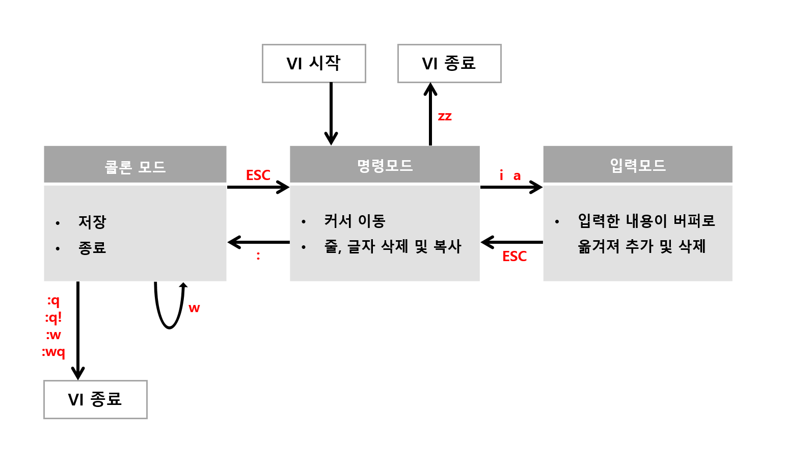

# Bash2

- [공인 IP 확인](#공인-ip-확인)
- [sort](#sort)
- [awk](#awk)
- [alias](#alias)
- [ngrok](#ngrok)
- [tr](#tr)
- [source](#source)
- [vi](#vi)
- [표준 입력 • 표준 출력 • 표준 에러 출력 • 리다이렉션](#표준-입력--표준-출력--표준-에러-출력--리다이렉션)
- [터미널 세션](#터미널-세션)
- [--](#--)
- [glob pattern](#glob-pattern)
- [다중 명령어 처리](#다중-명령어-처리)
- [사용자 관리](#사용자-관리)
  - [유저](#유저)
  - [그룹](#그룹)
  - [파일/폴더의 유저/그룹 변경](#파일폴더의-유저그룹-변경)
  - [유저/그룹 정보 경로](#유저그룹-정보-경로)
- [linux 한영 fcitx hangul 설치](#linux-한영-fcitx-hangul-설치)
- [locale로 시스템 언어 설정 가능](#locale로-시스템-언어-설정-가능)
- [심볼릭 링크](#심볼릭-링크)
  - [심볼릭 링크 vs 하드 링크 비교](#심볼릭-링크-vs-하드-링크-비교)
  - [1. 동작 방식 차이](#1-동작-방식-차이)
  - [2. 주요 사용 사례](#2-주요-사용-사례)
    - [심볼릭 링크 (Soft Link)](#심볼릭-링크-soft-link)
    - [하드 링크](#하드-링크)
  - [3. 문제 해결 팁](#3-문제-해결-팁)
    - [심볼릭 링크](#심볼릭-링크-1)
    - [하드 링크](#하드-링크-1)
  - [결론](#결론)
- [root etc bashrc 수정으로 모든 사용자 공통 쉘 환경 주입하기](#root-etc-bashrc-수정으로-모든-사용자-공통-쉘-환경-주입하기)
- [umask 권한 마스킹](#umask-권한-마스킹)

## 공인 IP 확인

```sh
curl ifconfig.me
```

## sort

텍스트를 행 단위로 정렬할 때 사용한다.

```sh
sort -r foo.txt # 내림차순
sort -f foo.txt # 대소문자를 구분하지 않음
```

## awk

리눅스의 SQL문이라 불리며, 텍스트 내용을 테이블로 인지하여 원하는 데이터를 사용자 입맛에 맞게 출력할 수 있다.

- pattern: 각 줄에서 일치시키고자 하는 패턴 (선택적)
- action: 패턴이 일치하는 줄에 대해 수행할 작업

```sh
awk <옵션> "pattern { action }" foo.txt # 문법
awk -F, '{ print }' foo.txt # 구분자로 쉼표(,) 사용 ex) -F- -F/ -F; -F' -F"
awk '{ sum += $2 } END { print "Total:", sum }' foo.txt # 2번째 열 값을 모두 더해서 출력
awk '/ERROR/ { print }' foo.txt # ERROR가 포함된 모든 행 출력
awk '$3 > 50 { print NR, NF, $1, $2, $3 }' foo.txt # 3번째 열 값이 50보다 크면 행 번호, 행의 컬럼 수, 1번째 열, 2번째 열, 3번째 열 출력
```

## alias

자주 사용하는 명령에 별명을 붙여서 편하게 사용할 때 사용한다.

```sh
alias # 별명 리스트 출력
alias foo='ls -lah' # 별명을 가진 명령 생성
unalias foo # 명령 삭제
```

## ngrok

ngrok은 개발자가 로컬 서버를 인터넷에 노출할 수 있도록 임시 URL을 제공해주는 도구다. 이는 웹훅 테스트, 클라이언트 데모 시연 등에 유용하다.

사용 전에 공식 홈페이지에 계정을 생성해서 로그인 후에 인증 과정을 거쳐야한다.

```sh
ngrok http 3000
```

## tr

지정한 문자를 바꾸거나 삭제할 때 사용한다.

```sh
echo "$PATH" | tr ':' '\n' # 모든 ':'를 '\n'으로 변경
```

## source

- 쉘 스크립트나 설정 파일을 현재 쉘 세션에서 실행하거나 환경 변수를 로드할 때 사용된다.
- `sh`, `bash`는 새로운 서브 쉘에서 스크립트를 실행하므로 환경 변수 변경 등이 현재 세션에 영향을 주지 않는다.

```sh
source .bashrc
```

## vi



## 표준 입력 • 표준 출력 • 표준 에러 출력 • 리다이렉션

> /dev/null 2>&1

## 터미널 세션

```sh
w # 현재 로그인한 사용자와 그들이 실행 중인 작업 확인

tty # 현재 터미널 세션의 TTY 이름 확인

ps -u $(whoami) # 현재 사용자가 실행 중인 모든 프로세스 확인

ps -t pts/2 # 해당 TTY와 관련된 프로세스 확인

ps -ef # 시스템의 모든 프로세스를 자세한 형식으로 출력
```

- vscode를 사용하여 원격 접속을 한다면, 해당 서버에 `~/.vscode-server`를 설치하고 실행한다.
- 이때 생성되는 터미널 세션이 메인 세션(`pts/*`)이다.
- 이후 사용자가 터미널을 새로 생성할 때마다 가상 터미널(`/dev/pts/*`)을 생성한다.
- 메인 세션을 로그아웃시키기 위해서 `close connection`을 수행하거나 `~/.vscode-server`를 삭제한다.

## --

--는 명령어 옵션의 끝을 표시하는 특수 기호

```sh
touch -- -myfile.txt  # "-myfile.txt" 파일 생성
```

## glob pattern

| 패턴 기호 | 설명                                                            | 예시                                                    |
| --------- | --------------------------------------------------------------- | ------------------------------------------------------- |
| `∗`       | 0개 이상의 문자를 의미 (디렉토리 구분자는 제외)                 | `∗.txt` → 모든 `.txt` 파일                              |
| `?`       | 정확히 1개의 문자와 일치 (디렉토리 구분자는 제외)               | `?.txt` → `a.txt`, `b.txt`                              |
| `[abc]`   | 대괄호 안의 문자 중 하나와 일치                                 | `file[abc].txt` → `filea.txt`, `fileb.txt`, `filec.txt` |
| `[a-z]`   | 대괄호 안의 문자 범위 중 하나와 일치                            | `file[a-z].txt` → `filea.txt`, `fileb.txt`              |
| `[^abc]`  | 대괄호 안의 문자 외의 문자와 일치                               | `file[^a].txt` → `fileb.txt`, `filec.txt`               |
| `[!abc]`  | `[^abc]`와 동일                                                 | `file[!a].txt` → `fileb.txt`, `filec.txt`               |
| `∗∗`      | 모든 디렉토리 또는 0개 이상의 디렉토리를 의미 (재귀적으로 탐색) | `∗∗/∗.txt` → 모든 하위 디렉토리의 `.txt` 파일           |

## 다중 명령어 처리

| 구분            | 기호      | 설명                                                                     | 예시              |
| --------------- | --------- | ------------------------------------------------------------------------ | ----------------- |
| 순차 실행       | `;`       | 각 명령어를 순차적으로 실행하며, 앞의 명령이 실패해도 다음 명령을 실행함 | `cmd1; cmd2`      |
| 논리 AND        | `&&`      | 앞의 명령어가 성공한 경우에만 뒤의 명령어를 실행함                       | `cmd1 && cmd2`    |
| 논리 OR         | `\|\|`    | 앞의 명령어가 실패한 경우에만 뒤의 명령어를 실행함                       | `cmd1 \|\| cmd2`  |
| 백그라운드 실행 | `&`       | 명령어를 백그라운드에서 실행하고, 바로 프롬프트로 돌아감                 | `cmd1 &`          |
| 파이프          | `\|`      | 앞의 명령어 출력 결과를 뒤의 명령어 입력으로 전달함                      | `cmd1 \| cmd2`    |
| 명령 그룹화     | `{ }`     | 여러 명령어를 하나의 그룹으로 묶어 실행 (마지막에 세미콜론 필요)         | `{ cmd1; cmd2; }` |
| 서브쉘          | `( )`     | 여러 명령어를 서브쉘에서 실행하여 별도의 환경에서 실행됨                 | `(cmd1; cmd2)`    |
| 명령 치환       | `` ` ` `` | 명령어의 출력을 다른 명령어의 입력으로 사용                              | `` echo `ls` ``   |

## 사용자 관리

### 유저

```sh
whoami # 현재 유저 확인
sudo su # root 사용자로 로그인(root 환경변수)
sudo -s # root 사용자로 로그인(사용자 환경변수)
sudo cat foo.txt # root 권한으로 명령어 실행
sudo adduser foo # 유저 생성
sudo userdel -r foo # 유저 삭제
exit # 유저 변경 전 사용자로 돌아가거나 쉘 종료
```

`adduser` 명령어를 실행하면 다음과 같은 실행흐름을 가진다.

1. 사용자 추가하기
2. 그룹 추가하기
3. 그룹 안에 사용자 추가하기
4. `/home` 디렉토리 안에 사용자 폴더 추가
5. `/etc/skel` 디렉토리 안에 파일 및 폴더를 `/home` 디렉토리 안에 새로 추가된 사용자 폴더에 복사
6. 사용자 패스워드 설정
7. 기타 정보 설정

### 그룹

```sh
sudo groupadd bar # 그룹 생성
sudo groupdel bar # 그룹 삭제
sudo gpasswd bar # 그룹 암호 설정, 이 암호는 그룹에 포함되지 않는 사용자가 그룹으로 로그인하기 위해서 사용된다.
sudo gpasswd -r bar # 그룹 암호 제거
sudo gpasswd -A foo bar # 유저를 그룹 관리자로 설정
sudo gpasswd -a foo bar # 유저를 그룹에 포함
sudo gpasswd -d foo bar # 유저를 그룹에서 제외
groups foo # 유저가 포함된 그룹을 나열, 한 사용자가 여러 그룹에 소속될 수 있다.
```

### 파일/폴더의 유저/그룹 변경

```sh
sudo chown foo foo.txt # foo.txt 파일의 유저를 foo로 변경
sudo chown -R foo baz # baz 디렉토리와 하위 파일 모두 유저를 foo로 변경
sudo chown foo:bar foo.txt # foo.txt 파일의 유저와 그룹을 foo와 bar로 변경
sudo chgrp bar foo.txt # foo.txt 파일의 그룹을 bar로 변경, 일반 사용자는 자신이 속한 그룹으로만 변경이 가능하다.
```

### 유저/그룹 정보 경로

```sh
cat /etc/passwd # 유저 정보(사용자이름:암호:사용자ID:그룹ID:추가정보:홈디렉토리:쉘)
cat /etc/group # 유저 그룹 정보
cat /etc/shadow # 비밀번호 정보
cd /etc/skel # /home 디렉토리 안에 유저 폴더에 추가될 파일 및 폴더
```

## linux 한영 fcitx hangul 설치

## locale로 시스템 언어 설정 가능

## 심볼릭 링크

### 심볼릭 링크 vs 하드 링크 비교

| 특징            | 심볼릭 링크 (Symbolic Link)                     | 하드 링크 (Hard Link)                      |
| --------------- | ----------------------------------------------- | ------------------------------------------ |
| 정의            | 원본 파일을 가리키는 "바로가기" (포인터)        | 원본 파일과 동일한 inode를 공유하는 복제본 |
| 저장 위치       | 별도의 파일로 생성 (작은 용량)                  | 원본과 동일한 물리적 데이터 블록 참조      |
| 원본 삭제 시    | 깨짐 (Dangling link)                            | 유지됨 (inode가 살아있음)                  |
| 파일시스템 제약 | 모든 파일시스템에서 사용 가능                   | 동일 파일시스템 내에서만 생성 가능         |
| 디렉터리 링크   | 가능 (`ln -s dir linkdir`)                      | 불가능 (파일만 지원)                       |
| 크기            | 원본 경로 저장용 작은 크기 (e.g., 64B)          | 원본과 동일한 크기 (실제 데이터 공유)      |
| inode 번호      | 새로운 inode 할당                               | 원본과 동일한 inode 공유                   |
| 권한/속성       | 원본 파일에 종속적 (실제 권한은 원본 따름)      | 원본과 완전히 동일 (UID/GID, 권한 공유)    |
| 사용 예시       | - PM2 전역 통합<br>- 버전 관리 (Python/Node.js) | - 파일 백업<br>- 디스크 공간 절약          |
| 명령어          | `ln -s 원본 링크`                               | `ln 원본 링크`                             |

### 1. 동작 방식 차이

- 심볼릭 링크

  ```text
  [링크 파일] → (경로 참조) → [원본 파일]
  (inode 1001)               (inode 2001)
  ```

  - 원본 이동/삭제 시: 링크 깨짐 (`ls -l`에서 빨간색으로 표시).

- 하드 링크

  ```text
  [원본 파일] ← (동일 inode) → [하드 링크]
  (inode 2001)                (inode 2001)
  ```

  - 원본 삭제 시: 링크 유지 (데이터 블록 참조 카운트가 0이 될 때까지 삭제되지 않음).

---

### 2. 주요 사용 사례

#### 심볼릭 링크 (Soft Link)

- 크로스-파일시스템 링크
  ```sh
  ln -s /mnt/external-db/data ~/app/data  # 외부 디스크 연결
  ```
- 버전 스위칭
  ```sh
  ln -sf /opt/python3.12 /usr/bin/python  # 기본 Python 버전 변경
  ```

#### 하드 링크

- 파일 백업/공유
  ```sh
  ln important.txt backup.txt  # 동일한 데이터 블록 공유
  ```
- 디스크 공간 절약
  ```sh
  ln bigfile.txt hardlink.txt  # 추가 공간 사용 없음
  ```

---

### 3. 문제 해결 팁

#### 심볼릭 링크

- 깨진 링크 확인
  ```sh
  find /path -type l -xtype l  # Dangling link 검색
  ```
- 절대 경로 권장
  ```sh
  ln -sf /absolute/path/to/file linkname  # 상대 경로보다 안정적
  ```

#### 하드 링크

- inode 확인
  ```sh
  ls -i file.txt  # 원본과 하드 링크의 inode 번호 동일해야 함
  ```
- 제약 사항
  - 디렉터리 링크 불가 → `tar` + 심볼릭 링크로 대체.

---

### 결론

- "유연성"이 필요하면 → 심볼릭 링크  
  (크로스-파일시스템, 버전 관리, 디렉터리 링크)
- "데이터 보존"이 중요하면 → 하드 링크  
  (백업, 공간 절약, 원본 삭제 방지)

> 🛠️ 실험해 보기:
>
> ```sh
> echo "Hello" > original.txt
> ln original.txt hardlink.txt
> ln -s original.txt symlink.txt
> rm original.txt
> cat hardlink.txt  # "Hello" 출력 (유지됨)
> cat symlink.txt   # "No such file" (깨짐)
> ```

## root etc bashrc 수정으로 모든 사용자 공통 쉘 환경 주입하기

etc/profile의 전역 설정 수정하기
zsh 쓰면 etc 안에서 zsh 관련해서 수정

## umask 권한 마스킹
