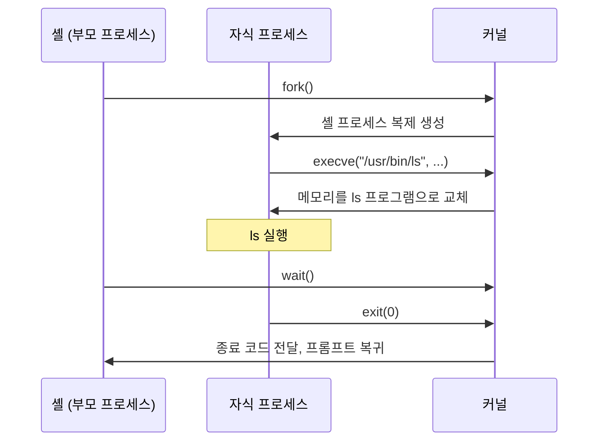
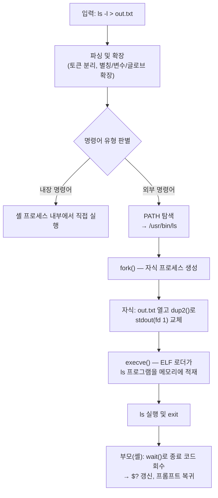

# Linux 명령어 실행 원리

- [명령어의 종류](#명령어의-종류)
- [셸의 명령어 처리 과정](#셸의-명령어-처리-과정)
  - [1. 입력 파싱과 확장(Expansion)](#1-입력-파싱과-확장expansion)
  - [2. 명령어 탐색 순서](#2-명령어-탐색-순서)
  - [3. PATH 탐색](#3-path-탐색)
- [프로세스 생성: fork와 exec](#프로세스-생성-fork와-exec)
  - [fork: 프로세스 복제](#fork-프로세스-복제)
  - [exec: 프로그램 교체](#exec-프로그램-교체)
  - [wait: 자식 프로세스 대기](#wait-자식-프로세스-대기)
- [내장 명령어가 fork 없이 실행되는 이유](#내장-명령어가-fork-없이-실행되는-이유)
- [실행 파일 로딩](#실행-파일-로딩)
  - [ELF 바이너리](#elf-바이너리)
  - [셔뱅(Shebang)과 스크립트 실행](#셔뱅shebang과-스크립트-실행)
  - [정적 링크와 동적 링크](#정적-링크와-동적-링크)
- [리다이렉션과 파이프의 동작 원리](#리다이렉션과-파이프의-동작-원리)
- [종료 코드(Exit Code)](#종료-코드exit-code)
- [전체 흐름 정리](#전체-흐름-정리)

## 명령어의 종류

셸에서 실행하는 명령어는 하나의 형태가 아니다. 셸은 입력된 단어를 아래 유형 중 하나로 해석한다.

| 종류                  | 설명                               | 예시                     |
| --------------------- | ---------------------------------- | ------------------------ |
| 별칭(Alias)           | 사용자가 등록한 명령어 치환 문자열 | `ll='ls -lah'`           |
| 셸 함수(Function)     | 셸 스크립트로 정의된 함수          | `greet() { ...; }`       |
| 내장 명령어(Builtin)  | 셸 프로그램 자체에 구현된 명령어   | `cd`, `export`, `source` |
| 외부 명령어(External) | 디스크에 존재하는 독립 실행 파일   | `ls`, `grep`, `docker`   |
| 셸 키워드(Keyword)    | 셸 문법의 예약어                   | `if`, `for`, `while`     |

`type` 명령어로 특정 명령어가 어떤 유형인지 확인할 수 있다.

```sh
type cd      # cd is a shell builtin
type ls      # ls is aliased to `ls --color=auto'
type grep    # grep is /usr/bin/grep
type if      # if is a shell keyword
type -a echo # echo is a shell builtin, echo is /usr/bin/echo (중복 정의 모두 출력)
```

- `echo`처럼 내장 명령어와 외부 실행 파일이 동시에 존재하는 경우도 있으며, 이때 내장 명령어가 우선 실행됨.
- `which`는 PATH 상의 외부 실행 파일만 찾으므로, 내장 명령어나 별칭까지 확인하려면 `type`을 사용해야 함.

## 셸의 명령어 처리 과정

### 1. 입력 파싱과 확장(Expansion)

셸은 입력된 한 줄을 실행하기 전에 여러 단계의 전처리를 수행한다.

1. 토큰 분리: 공백을 기준으로 명령어와 인자를 분리한다.
2. 별칭 치환: 첫 단어가 별칭이면 등록된 문자열로 치환한다.
3. 확장 수행: 아래 확장들을 순서대로 적용한다.
   - 중괄호 확장: `file{1,2}.txt` → `file1.txt file2.txt`
   - 틸드 확장: `~` → `/home/user`
   - 변수 확장: `$HOME` → `/home/user`
   - 명령어 치환: `$(date)` → 명령어 실행 결과
   - 산술 확장: `$((1 + 2))` → `3`
   - 글로브(Glob) 확장: `*.txt` → 패턴에 일치하는 파일 목록
4. 리다이렉션 분리: `>`, `<`, `|` 등을 해석하여 입출력 설정을 준비한다.

중요한 점은 확장이 명령어 실행 전에 셸에서 끝난다는 것이다. 예를 들어 `rm *.txt`를 실행하면 `rm` 프로그램은 `*.txt`라는 패턴을 받는 것이 아니라, 셸이 미리 펼쳐 놓은 파일명 목록을 인자로 받는다.

```sh
# 셸이 글로브를 확장한 뒤 rm에 전달함
rm *.txt           # 실제 실행: rm a.txt b.txt c.txt

# 따옴표로 감싸면 확장이 억제되어 패턴 문자열 그대로 전달됨
rm "*.txt"         # 실제 실행: rm '*.txt' (리터럴 파일명 탐색)
```

### 2. 명령어 탐색 순서

전처리가 끝나면 셸은 첫 번째 단어(명령어)를 아래 우선순위로 탐색한다.

1. 별칭(Alias)
2. 셸 키워드(Keyword)
3. 셸 함수(Function)
4. 내장 명령어(Builtin)
5. 외부 명령어 — PATH 탐색

- 명령어에 `/`가 포함된 경우(`./script.sh`, `/usr/bin/ls`)는 위 탐색을 건너뛰고 해당 경로의 파일을 직접 실행함.
- 현재 디렉터리의 실행 파일을 `./` 없이 실행할 수 없는 이유는 PATH에 현재 디렉터리(`.`)가 포함되어 있지 않기 때문임. 이는 악성 파일이 시스템 명령어를 가로채는 것을 막기 위한 보안 관례다.

### 3. PATH 탐색

외부 명령어는 환경 변수 `PATH`에 등록된 디렉터리를 왼쪽부터 순서대로 탐색하여 찾는다.

```sh
echo "$PATH" | tr ':' '\n'
# /usr/local/sbin
# /usr/local/bin
# /usr/sbin
# /usr/bin
# ...
```

- 같은 이름의 실행 파일이 여러 디렉터리에 있으면 먼저 등록된 디렉터리의 파일이 실행됨.
- 셸은 매번 디스크를 탐색하지 않도록 탐색 결과를 해시 테이블에 캐싱함. `hash` 명령어로 캐시를 확인하고 `hash -r`로 초기화할 수 있음.
- 새 프로그램을 설치했는데 `command not found`가 발생하면 PATH 미등록 또는 캐시 문제인 경우가 대부분임.

```sh
hash         # 캐시된 명령어 경로 목록 확인
hash -r      # 캐시 초기화 (프로그램 위치가 바뀐 경우)
```

## 프로세스 생성: fork와 exec

외부 명령어를 실행하기로 결정하면 셸은 커널의 시스템 콜(System Call)을 통해 새 프로세스를 만든다. Linux에서 프로세스 생성은 `fork`와 `exec` 두 단계로 분리되어 있다.



### fork: 프로세스 복제

`fork()`는 호출한 프로세스(부모)를 그대로 복제하여 자식 프로세스를 만드는 시스템 콜이다.

- 자식은 부모의 메모리 공간, 환경 변수, 열린 파일 디스크립터(File Descriptor)를 그대로 물려받음.
- 실제로는 쓰기 시 복사(Copy-on-Write) 방식으로 동작하여, 메모리를 즉시 복사하지 않고 쓰기가 발생할 때만 해당 페이지를 복사함.
- 호출 후 부모에게는 자식의 PID가, 자식에게는 `0`이 반환되어 두 프로세스가 자신의 역할을 구분함.

환경 변수가 `export`로 설정해야만 명령어에 전달되는 이유가 여기에 있다. `export`된 변수만 fork 시 자식 프로세스로 복사되는 환경 영역에 포함된다.

```sh
FOO=1                  # 셸 지역 변수 — 자식에게 전달되지 않음
export BAR=2           # 환경 변수 — fork 시 자식에게 복사됨
bash -c 'echo $FOO $BAR'  # 출력: 2 (FOO는 비어 있음)
```

### exec: 프로그램 교체

`exec` 계열 시스템 콜(`execve` 등)은 현재 프로세스의 메모리를 새 프로그램으로 통째로 교체한다.

- PID는 그대로 유지되고 코드, 데이터, 스택 등 메모리 내용만 교체됨.
- 새 프로세스를 만드는 것이 아니므로, fork 없이 exec만 호출하면 현재 프로세스가 사라짐.
- 열린 파일 디스크립터는 exec 이후에도 유지됨 — 리다이렉션이 동작하는 핵심 원리.

셸에서도 `exec` 내장 명령어로 이 동작을 직접 확인할 수 있다.

```sh
exec ls   # 셸 프로세스 자체가 ls로 교체됨 — ls 종료 시 터미널도 종료됨
```

### wait: 자식 프로세스 대기

fork 후 부모인 셸은 `wait()` 시스템 콜로 자식의 종료를 기다린다.

- 자식이 종료되면 커널이 종료 코드를 부모에게 전달하고, 셸은 프롬프트를 다시 표시함.
- 명령어 끝에 `&`를 붙이면 셸이 wait를 생략하고 즉시 프롬프트로 복귀함 — 백그라운드 실행의 원리.
- 자식이 종료됐지만 부모가 종료 코드를 회수하지 않은 상태의 프로세스를 좀비(Zombie) 프로세스라고 함.

## 내장 명령어가 fork 없이 실행되는 이유

`cd`가 외부 프로그램이 아니라 내장 명령어인 이유는 fork/exec 모델의 구조적 한계 때문이다.

- 작업 디렉터리, 환경 변수 등은 프로세스마다 독립적으로 유지되는 속성임.
- 자식 프로세스가 자신의 작업 디렉터리를 바꿔도 부모(셸)에게는 아무 영향이 없음.
- 따라서 `cd`가 외부 프로그램이라면 fork된 자식만 이동하고 종료되어 셸의 위치는 그대로가 됨.

같은 이유로 셸 자신의 상태를 바꿔야 하는 명령어들은 모두 내장 명령어로 구현된다.

| 내장 명령어 | 변경하는 셸 상태          |
| ----------- | ------------------------- |
| `cd`        | 작업 디렉터리             |
| `export`    | 환경 변수                 |
| `source`    | 현재 셸에서 스크립트 실행 |
| `alias`     | 별칭 테이블               |
| `ulimit`    | 리소스 제한               |
| `exit`      | 셸 프로세스 종료          |

`source ./env.sh`와 `./env.sh`의 차이도 동일한 원리다. 전자는 현재 셸 프로세스에서 직접 실행하므로 변수 설정이 유지되고, 후자는 fork된 자식 셸에서 실행되므로 종료와 함께 변경 사항이 사라진다.

## 실행 파일 로딩

`execve`가 호출되면 커널은 파일의 첫 바이트(매직 넘버)를 읽어 실행 방식을 결정한다.

### ELF 바이너리

Linux의 표준 실행 파일 형식은 ELF (Executable and Linkable Format)다.

- 파일이 `\x7fELF` 매직 넘버로 시작하면 커널이 ELF 로더로 처리함.
- 커널은 ELF 헤더를 읽어 코드/데이터 세그먼트를 가상 메모리에 매핑하고, 동적 링크 바이너리인 경우 동적 링커(`ld-linux.so`)를 먼저 로드함.
- 동적 링커가 의존하는 공유 라이브러리(`libc.so` 등)를 메모리에 매핑한 뒤 프로그램의 진입점(Entry Point)으로 점프함.

```sh
file /usr/bin/ls       # ELF 64-bit LSB pie executable, dynamically linked ...
ldd /usr/bin/ls        # 의존하는 공유 라이브러리 목록 출력
readelf -h /usr/bin/ls # ELF 헤더 정보 출력
```

### 셔뱅(Shebang)과 스크립트 실행

파일이 `#!`로 시작하면 커널은 이를 스크립트로 인식하고, 첫 줄에 지정된 인터프리터를 대신 실행한다.

```sh
#!/bin/bash
echo "hello"
```

- `./script.sh` 실행 시 커널은 실제로 `/bin/bash ./script.sh`를 실행함.
- 즉 스크립트 자체가 실행되는 것이 아니라, 인터프리터가 실행되고 스크립트 경로가 인자로 전달되는 구조임.
- 셔뱅이 없는 스크립트를 직접 실행하면 커널이 처리하지 못하고(`ENOEXEC`), 셸이 폴백(Fallback)으로 자기 자신을 사용해 해석을 시도함.
- 스크립트 실행에는 읽기 권한과 실행 권한이 모두 필요함. 인터프리터가 파일 내용을 읽어야 하기 때문임.

```sh
#!/usr/bin/env node
// env를 경유하면 PATH에서 node를 탐색하므로 설치 경로에 의존하지 않음
```

### 정적 링크와 동적 링크

| 구분       | 정적 링크(Static)              | 동적 링크(Dynamic)                   |
| ---------- | ------------------------------ | ------------------------------------ |
| 라이브러리 | 실행 파일에 포함               | 실행 시점에 공유 라이브러리 로드     |
| 파일 크기  | 큼                             | 작음                                 |
| 메모리     | 프로세스마다 중복 적재         | 여러 프로세스가 공유                 |
| 배포       | 단일 파일로 어디서나 실행 가능 | 대상 시스템에 라이브러리가 있어야 함 |

## 리다이렉션과 파이프의 동작 원리

리다이렉션과 파이프는 fork와 exec 사이의 빈틈을 활용한다. fork 직후의 자식은 아직 셸 코드를 실행 중이므로, exec로 프로그램을 교체하기 전에 파일 디스크립터를 원하는 대상으로 바꿔치기할 수 있다.

모든 프로세스는 세 개의 표준 파일 디스크립터를 가지고 시작한다.

- `0` (stdin): 표준 입력
- `1` (stdout): 표준 출력
- `2` (stderr): 표준 에러

`ls > out.txt`의 실제 동작 순서는 다음과 같다.

1. 셸이 `fork()`로 자식 프로세스를 생성한다.
2. 자식이 `out.txt`를 열고, `dup2()`로 파일 디스크립터 `1`(stdout)이 해당 파일을 가리키도록 교체한다.
3. 자식이 `execve("/usr/bin/ls", ...)`를 호출한다.
4. exec 후에도 파일 디스크립터는 유지되므로, `ls`는 자신이 파일에 쓰는지조차 모른 채 stdout(fd 1)에 출력한다.

파이프(`ls | grep foo`)도 같은 구조다.

1. 셸이 `pipe()` 시스템 콜로 커널 내 버퍼와 읽기/쓰기 디스크립터 쌍을 만든다.
2. 두 자식을 fork하여, 첫 자식의 stdout을 파이프 쓰기 끝에, 둘째 자식의 stdin을 파이프 읽기 끝에 연결한다.
3. 각각 exec한다. 두 프로세스는 동시에 실행되며 커널 버퍼를 통해 데이터가 흐른다.

프로그램이 리다이렉션이나 파이프를 전혀 인지할 필요가 없다는 점이 이 설계의 핵심이다. 프로그램은 항상 fd `0`, `1`, `2`만 다루고, 그 연결 대상을 결정하는 책임은 셸이 가진다.

## 종료 코드(Exit Code)

모든 프로세스는 종료 시 0~255 범위의 정수 코드를 부모에게 반환한다.

- `0`: 성공.
- `1` 이상: 실패. 의미는 프로그램마다 다름.
- `126`: 권한 부족 등으로 실행 불가.
- `127`: 명령어를 찾지 못함(command not found).
- `128 + N`: 시그널 N으로 종료됨. (예: `137` = `128 + 9(SIGKILL)`)

직전 명령어의 종료 코드는 `$?` 변수로 확인한다.

```sh
ls /exists
echo $?    # 0

ls /noexist
echo $?    # 2
```

`&&`, `||` 연산자와 `if` 문은 모두 이 종료 코드를 기반으로 동작한다.

```sh
mkdir build && cd build   # mkdir가 0을 반환할 때만 cd 실행
cd build || exit 1        # cd가 실패하면 스크립트 종료
```

## 전체 흐름 정리

`ls -l > out.txt` 한 줄이 실행되기까지의 전체 과정이다.



1. 셸이 입력을 파싱하고 확장을 수행한다.
2. 명령어 유형을 판별한다. 내장 명령어면 셸 안에서 직접 실행하고 끝난다.
3. 외부 명령어면 PATH에서 실행 파일을 찾는다.
4. `fork()`로 자식 프로세스를 복제한다.
5. 자식이 리다이렉션에 맞게 파일 디스크립터를 재배치한다.
6. `execve()`로 자식의 메모리를 대상 프로그램으로 교체한다. 커널이 ELF 헤더 또는 셔뱅을 해석하여 로딩한다.
7. 프로그램이 실행되고 종료 코드와 함께 exit한다.
8. 셸이 `wait()`로 종료 코드를 회수하고 `$?`를 갱신한 뒤 프롬프트로 복귀한다.
