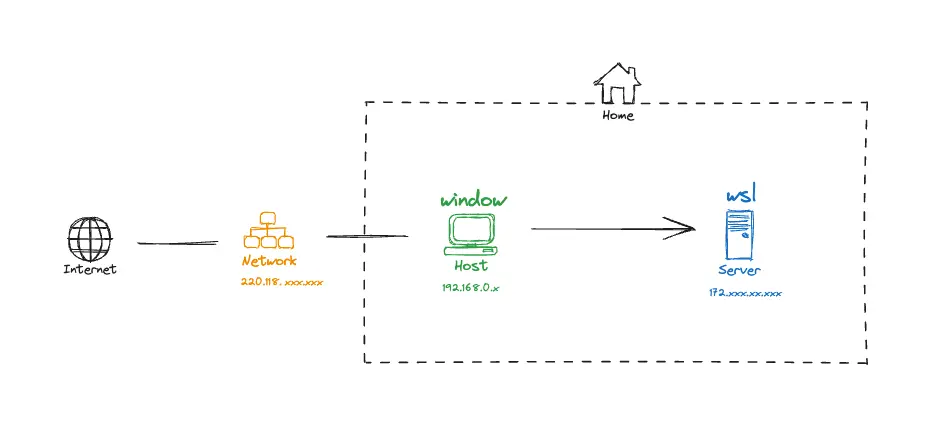

# WSL(Windows Subsystem for Linux) 활용

- [WSL 아키텍처 및 네트워크](#wsl-아키텍처-및-네트워크)
- [WSL1과 WSL2의 기술적 차이점](#wsl1과-wsl2의-기술적-차이점)
- [WSL 주요 관리 명령어](#wsl-주요-관리-명령어)
  - [배포판 목록 및 상태 확인](#배포판-목록-및-상태-확인)
  - [배포판 실행 및 종료](#배포판-실행-및-종료)
  - [배포판 내보내기 및 가져오기](#배포판-내보내기-및-가져오기)
  - [사용자 및 설정 관리](#사용자-및-설정-관리)

## WSL 아키텍처 및 네트워크



- WSL은 Windows 환경에서 리눅스 바이너리를 실행할 수 있게 해주는 하위 시스템임.
- 기본적으로 가상 이더넷 어댑터를 통해 호스트(Windows)와 통신하며, 각각 고유한 IP 주소를 가짐.

## WSL1과 WSL2의 기술적 차이점

WSL2는 완전한 리눅스 커널을 도입하여 WSL1의 한계를 극복함.

| 비교 항목          | WSL 1                        | WSL 2                         |
| ------------------ | ---------------------------- | ----------------------------- |
| 커널(Kernel)       | 변환 계층(Translation Layer) | 실제 리눅스 커널(Managed VM)  |
| 가상화 방식        | 없음 (시스템 호출 변환)      | 가상화 기술(Hyper-V) 사용     |
| 파일 시스템 성능   | 보통                         | 매우 빠름 (Linux FS 접근 시)  |
| 시스템 호출 호환성 | 일부 제한됨                  | 완벽한 호환성(Docker 등 지원) |
| 네트워크           | 호스트 IP 공유               | 별도의 가상 IP 할당           |

- WSL1: 리눅스 시스템 호출을 윈도우 API로 변환하는 방식으로 동작하여 파일 시스템 I/O가 상대적으로 느림.
- WSL2: 경량 유틸리티 VM 위에서 실제 리눅스 커널을 실행함. 이로 인해 파일 성능이 비약적으로 향상되었으며, Docker와 같은 리눅스 전용 기술을 완벽하게 지원함.

## WSL 주요 관리 명령어

### 배포판 목록 및 상태 확인

```sh
wsl -l -v               # 설치된 배포판 목록과 WSL 버전, 상태 표시
wsl --status            # WSL 설정 상태 및 커널 버전 확인
```

### 배포판 실행 및 종료

```sh
wsl -d <distro_name>    # 특정 배포판 실행
wsl -t <distro_name>    # 특정 배포판 강제 종료(Terminate)
wsl --shutdown          # 실행 중인 모든 WSL 인스턴스 종료
```

### 배포판 내보내기 및 가져오기

시스템을 백업하거나 다른 드라이브로 옮길 때 유용함.

```sh
# 배포판을 .tar 파일로 내보내기
wsl --export <distro_name> C:\backup\ubuntu.tar

# .tar 파일로부터 새 배포판 생성 및 경로 지정
wsl --import <new_name> D:\WSL\ubuntu C:\backup\ubuntu.tar --version 2
```

### 사용자 및 설정 관리

```sh
wsl --unregister <distro_name> # 배포판 등록 해제 및 데이터 삭제
wsl -u root                    # 특정 사용자로 실행

# 기본 사용자 변경 (Ubuntu 기준)
ubuntu config --default-user <username>
```
