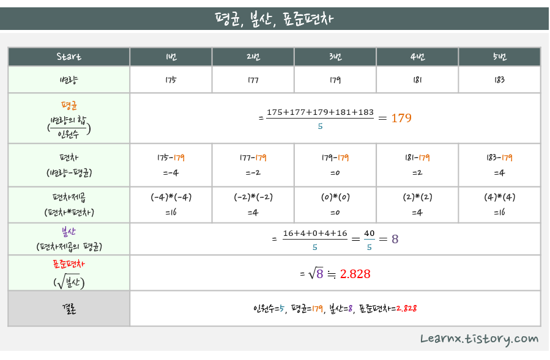
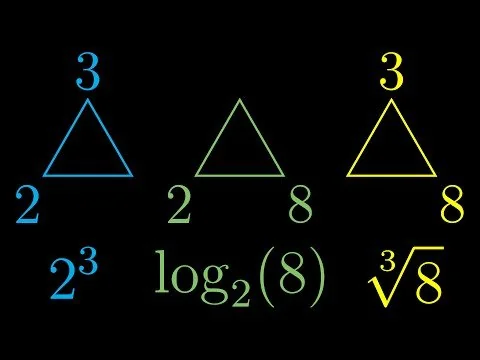

# 수학

- [기초 통계(Basic Statistics)](#기초-통계basic-statistics)
  - [평균 • 중앙값 • 최빈값](#평균--중앙값--최빈값)
  - [분산 • 표준편차](#분산--표준편차)
- [데이터 정규화 및 표준화](#데이터-정규화-및-표준화)
  - [Min-Max 정규화(Normalization)](#min-max-정규화normalization)
  - [Z-score 표준화(Standardization)](#z-score-표준화standardization)
- [방정식(Equation)](#방정식equation)
- [지수 • 로그 • 루트](#지수--로그--루트)
- [함수 개념(Function Concepts)](#함수-개념function-concepts)
  - [정의역 • 공역 • 치역](#정의역--공역--치역)
- [로그 스케일(Log Scale)](#로그-스케일log-scale)
- [벡터(Vector)](#벡터vector)
  - [벡터의 기본 연산](#벡터의-기본-연산)
  - [내적 • 외적](#내적--외적)

## 기초 통계(Basic Statistics)

데이터의 특성을 요약하고 분석하기 위한 기초적인 수치들임.

### 평균 • 중앙값 • 최빈값

- 평균(Mean): 모든 데이터를 더해 개수로 나눈 값. 산술 평균이 가장 널리 사용됨.
- 중앙값(Median): 데이터를 크기순으로 나열했을 때 중앙에 위치한 값. 극단값(Outlier)의 영향을 적게 받음.
- 최빈값(Mode): 데이터셋에서 가장 자주 나타나는 값.

### 분산 • 표준편차

데이터가 평균으로부터 얼마나 퍼져 있는지를 나타내는 척도임.

- 분산(Variance): 편차(각 데이터와 평균의 차이) 제곱의 합을 데이터 개수로 나눈 값.
- 표준편차(Standard Deviation): 분산의 제곱근. 데이터의 산포도를 원래 단위로 표현함.
  - 표준편차가 작으면 데이터가 평균에 밀집됨.
  - 표준편차가 크면 데이터가 넓게 퍼져 있음.

## 데이터 정규화 및 표준화

### Min-Max 정규화(Normalization)

데이터를 특정 범위(주로 [0, 1])로 변환하는 방법임.

$X_{\text{norm}} = \frac{X - X_{\text{min}}}{X_{\text{max}} - X_{\text{min}}} \times (b - a) + a$

- $X$: 원본 데이터 값
- $X_{\text{min}}, X_{\text{max}}$: 데이터셋의 최소값 및 최대값
- $a, b$: 대상 범위 (기본 $a=0, b=1$)

### Z-score 표준화(Standardization)

데이터를 평균이 0, 표준편차가 1인 분포로 변환함.

$X_{\text{std}} = \frac{X - \mu}{\sigma}$

- $\mu$: 데이터셋의 평균
- $\sigma$: 데이터셋의 표준편차

## 방정식(Equation)

미지수의 값에 따라 참 또는 거짓이 결정되는 등식임. 참이 되게 하는 미지수의 값을 해(Solution) 또는 근(Root)이라고 함.

## 지수 • 로그 • 루트

- 지수(Exponent): 거듭제곱의 횟수를 나타냄.
- 로그(Logarithm): 어떤 수를 만들기 위해 밑을 몇 번 거듭제곱해야 하는지 나타냄.
- 루트(Root): 제곱근을 구함.

## 함수 개념(Function Concepts)

함수 $f: A \rightarrow B$에 대한 집합 정의임.

### 정의역 • 공역 • 치역

- 정의역(Domain): 함수의 입력값이 될 수 있는 원소들의 집합 $A$.
- 공역(Codomain): 함수의 출력값이 될 수 있는 전체 후보 원소들의 집합 $B$.
- 치역(Range): 정의역의 원소들에 대응하여 실제로 출력되는 값들의 집합. 공역의 부분집합임.

## 로그 스케일(Log Scale)

데이터의 범위가 매우 클 때, 로그를 취하여 값 사이의 차이를 압축하는 척도임. 지수적으로 증가하는 현상을 선형적으로 시각화할 때 유용함.

- 선형 스케일: 1, 2, 3, 4, 5
- 로그 스케일: 1, 10, 100, 1000, 10000

## 벡터(Vector)

크기(Magnitude)와 방향(Direction)을 동시에 가지는 수학적 객체임.

### 벡터의 기본 연산

- 벡터 합: 대응하는 성분끼리 더함. 기하학적으로는 평행사변형법이나 삼각형법으로 표현됨.
  - $\vec{a} + \vec{b} = (a_1+b_1, a_2+b_2)$
- 스칼라 곱: 벡터의 각 성분에 실수(스칼라)를 곱함. 벡터의 방향은 유지하거나 반대가 되며 크기만 변함.
  - $k\vec{a} = (ka_1, ka_2)$

### 내적 • 외적

- 내적(Dot Product): 두 벡터의 대응 성분 곱의 합. 결과는 스칼라 값임. 두 벡터 사이의 각도를 구할 때 사용함.
  - $\vec{a} \cdot \vec{b} = |\vec{a}||\vec{b}|\cos\theta$
- 외적(Cross Product): 3차원 공간에서 두 벡터에 수직인 새로운 벡터를 구함. 결과는 벡터이며, 크기는 두 벡터가 만드는 평행사변형의 넓이와 같음.
  - $|\vec{a} \times \vec{b}| = |\vec{a}||\vec{b}|\sin\theta$
