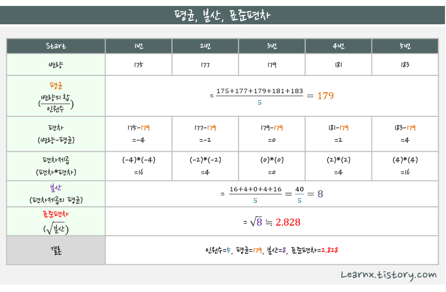

- [표준편차](#표준편차)
- [Min-Max 정규화](#min-max-정규화)
- [Z-score 표준화](#z-score-표준화)
- [방정식](#방정식)
- [지수 • 로그 • 루트](#지수--로그--루트)
- [정의역(Domain) • 공역(Codomain) • 치역(Range)](#정의역domain--공역codomain--치역range)
- [로그 스케일(Log Scale)](#로그-스케일log-scale)
- [벡터(Vector)](#벡터vector)

## 표준편차

표준편차는 데이터의 평균에서 각 데이터가 떨어진 정도를 나타내는 값이다. 표준편차가 작으면 데이터가 평균에 모여있고, 표준편차가 크면 데이터가 평균에서 멀리 떨어져있다.

## Min-Max 정규화

최소-최대 정규화는 데이터를 특정 범위 \([a, b]\)로 변환하는 방법이다. 가장 일반적으로 \([0, 1]\) 범위로 변환된다.

$X{\text{norm}} = \frac{X - X{\text{min}}}{X{\text{max}} - X{\text{min}}} \times (b - a) + a$

- $X$ : 원본 데이터 값
- $X{\text{min}}$ : 데이터셋에서 최소값
- $X{\text{max}}$ : 데이터셋에서 최대값
- $a, b$ : 원하는 변환 범위 (기본적으로 $a=0, b=1$)

## Z-score 표준화

Z-score 표준화는 데이터를 평균이 0, 표준편차가 1인 분포로 변환한다.

$X{\text{norm}} = \frac{X - \mu}{\sigma}$

- $X$ : 원본 데이터 값
- $\mu$ : 데이터셋의 평균
- $\sigma$ : 데이터셋의 표준 편차

## 방정식

- 미지수의 값에 따라 참, 거짓이 결정되는 등식이다.
- 방정식을 참이 되게 하는 미지수의 값을 해 또는 근이라고 한다.

## 지수 • 로그 • 루트

- 지수: 지수 방정식의 결과값을 찾음.
- 로그: 지수 방정식의 지수를 찾음.
- 루트: 지수 방정식의 밑을 해결

## 정의역(Domain) • 공역(Codomain) • 치역(Range)

함수 $f: A \rightarrow B$에서:

- 정의역(Domain): 함수의 입력값이 될 수 있는 모든 값들의 집합 $A$
- 공역(Codomain): 함수의 출력값이 될 수 있는 모든 값들의 집합 $B$
- 치역(Range): 함수가 실제로 출력하는 값들의 집합 (공역의 부분집합)

## 로그 스케일(Log Scale)

데이터의 범위가 매우 클 때, 로그 함수를 적용하여 값들 사이의 차이를 압축해서 보여주는 척도이다. 지수적으로 증가하는 데이터나 매우 큰 범위의 데이터를 시각화할 때 유용하다.

- 선형 스케일: 1, 2, 3, 4, 5
- 로그 스케일: 1, 10, 100, 1000, 10000

## 벡터(Vector)

벡터는 크기(magnitude)와 방향(direction)을 모두 가지는 수학적 객체이다. 물리학에서는 힘, 속도, 가속도 등을 나타내고, 컴퓨터 과학에서는 데이터를 표현하는 배열 형태로 사용된다.

- 2차원 벡터 예시: $\vec{v} = (3, 4)$
- 크기: $|\vec{v}| = \sqrt{3^2 + 4^2} = 5$
- 방향: x축에서 시계 반대방향으로 약 53.13°
