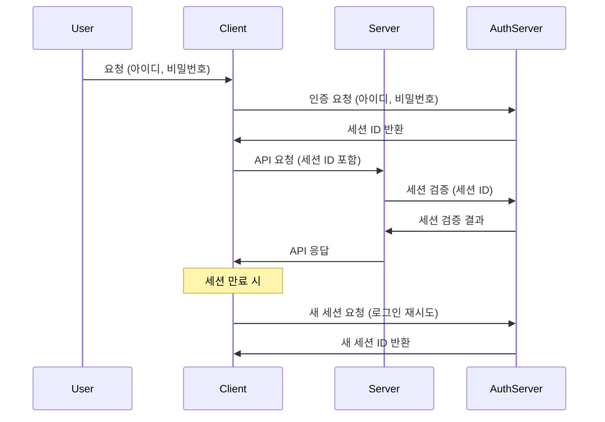
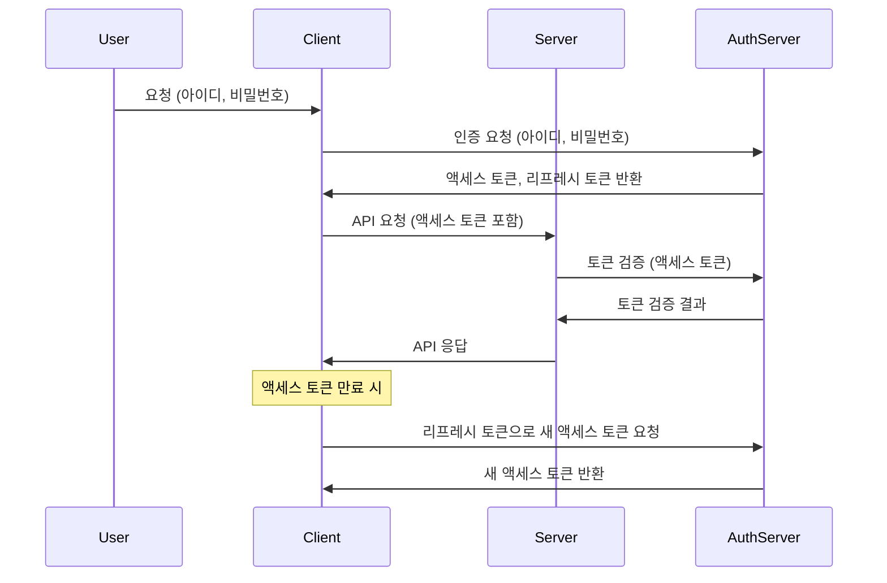
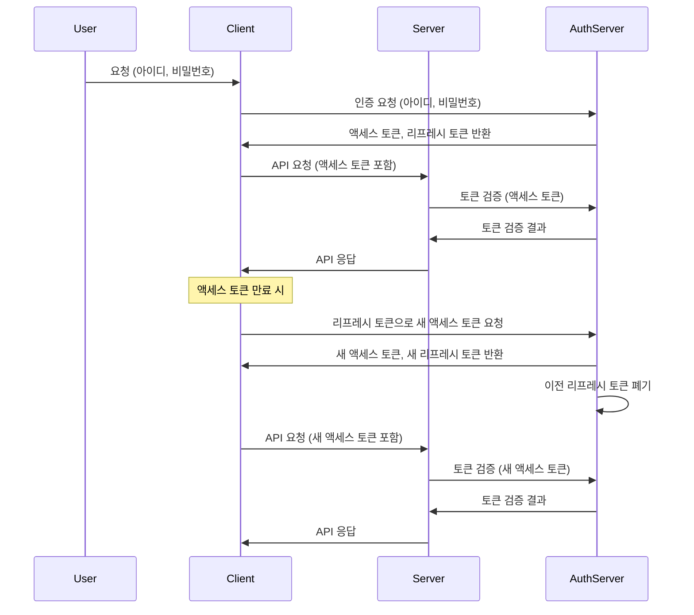
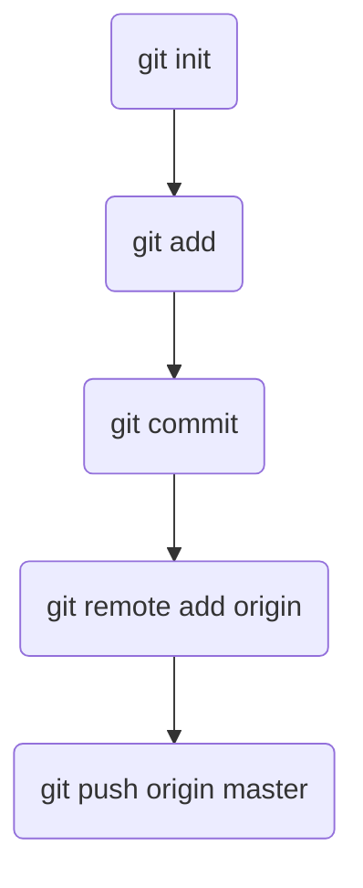
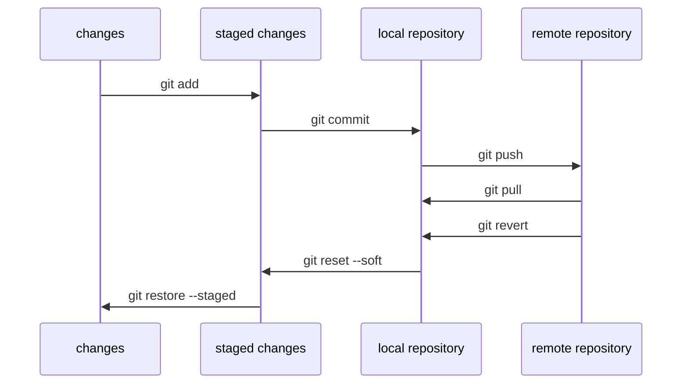
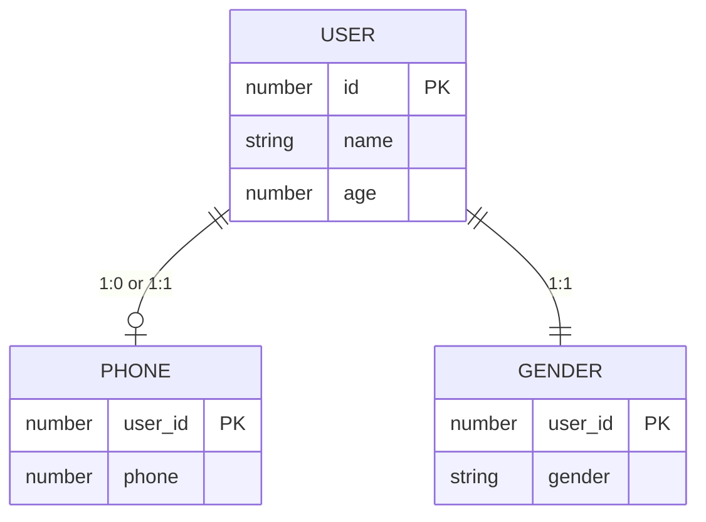
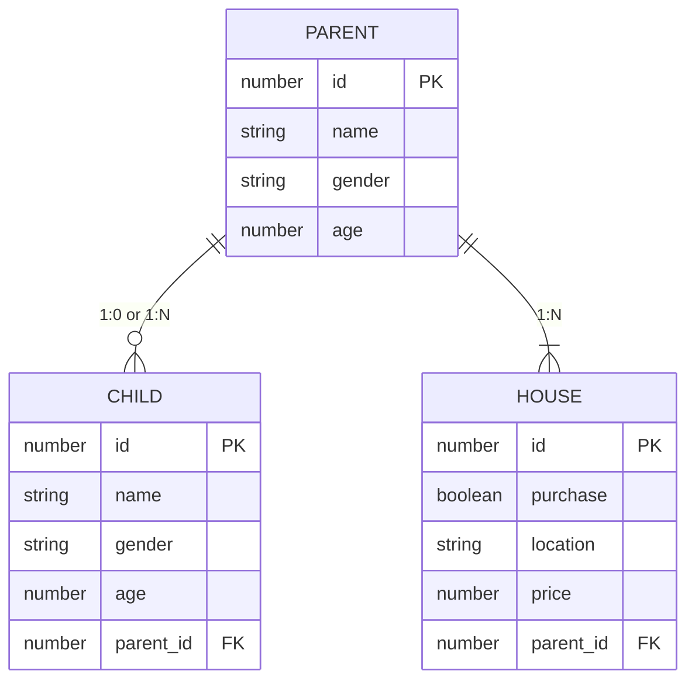
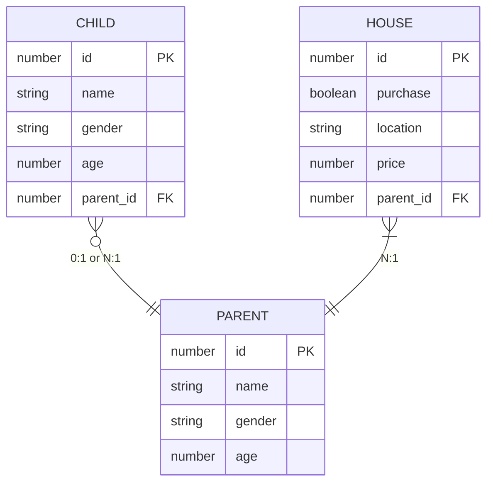
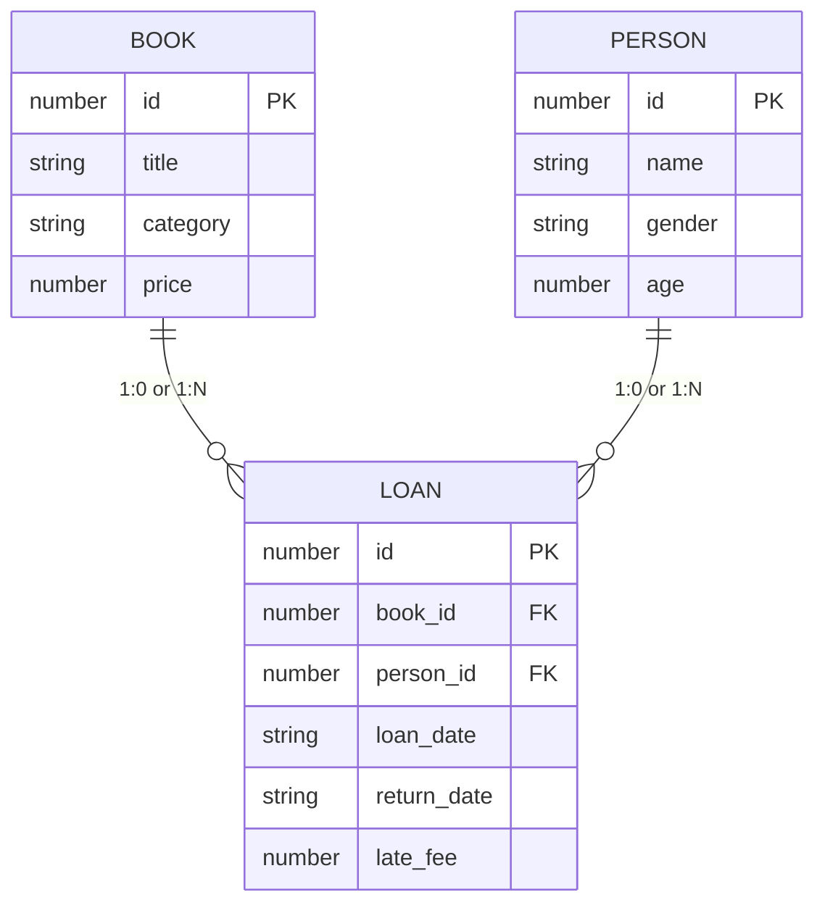

# Mermaid

```mermaid
sequenceDiagram
    participant User
    participant Client
    participant Server
    participant AuthServer

    User->>Client: 요청 (아이디, 비밀번호)
    Client->>AuthServer: 인증 요청 (아이디, 비밀번호)
    AuthServer->>Client: 세션 ID 반환
    Client->>Server: API 요청 (세션 ID 포함)
    Server->>AuthServer: 세션 검증 (세션 ID)
    AuthServer->>Server: 세션 검증 결과
    Server->>Client: API 응답
    Note over Client: 세션 만료 시
    Client->>AuthServer: 새 세션 요청 (로그인 재시도)
    AuthServer->>Client: 새 세션 ID 반환
```

```mermaid
sequenceDiagram
    participant User
    participant Client
    participant Server
    participant AuthServer

    User->>Client: 요청 (아이디, 비밀번호)
    Client->>AuthServer: 인증 요청 (아이디, 비밀번호)
    AuthServer->>Client: 액세스 토큰, 리프레시 토큰 반환
    Client->>Server: API 요청 (액세스 토큰 포함)
    Server->>AuthServer: 토큰 검증 (액세스 토큰)
    AuthServer->>Server: 토큰 검증 결과
    Server->>Client: API 응답
    Note over Client: 액세스 토큰 만료 시
    Client->>AuthServer: 리프레시 토큰으로 새 액세스 토큰 요청
    AuthServer->>Client: 새 액세스 토큰 반환
```

```mermaid
sequenceDiagram
    participant User
    participant Client
    participant Server
    participant AuthServer

    User->>Client: 요청 (아이디, 비밀번호)
    Client->>AuthServer: 인증 요청 (아이디, 비밀번호)
    AuthServer->>Client: 액세스 토큰, 리프레시 토큰 반환
    Client->>Server: API 요청 (액세스 토큰 포함)
    Server->>AuthServer: 토큰 검증 (액세스 토큰)
    AuthServer->>Server: 토큰 검증 결과
    Server->>Client: API 응답
    Note over Client: 액세스 토큰 만료 시
    Client->>AuthServer: 리프레시 토큰으로 새 액세스 토큰 요청
    AuthServer->>Client: 새 액세스 토큰, 새 리프레시 토큰 반환
    AuthServer->>AuthServer: 이전 리프레시 토큰 폐기
    Client->>Server: API 요청 (새 액세스 토큰 포함)
    Server->>AuthServer: 토큰 검증 (새 액세스 토큰)
    AuthServer->>Server: 토큰 검증 결과
    Server->>Client: API 응답
```

<!-- git -->

```mermaid
flowchart TD
    1("git init")
    2("git add")
    3("git commit")
    4("git remote add origin")
    5("git push origin master")
    1-->2-->3-->4-->5
```

```mermaid
sequenceDiagram
    changes->>staged changes: git add
    staged changes->>local repository: git commit
    local repository->>remote repository: git push
    remote repository->>local repository: git pull
    remote repository->>local repository: git revert
    local repository->>staged changes: git reset --soft
    staged changes->>changes: git restore --staged
```

<!-- sql -->

```mermaid
erDiagram
USER {
  number id PK
  string name
  number age
}
PHONE {
  number user_id PK
  number phone
}
GENDER {
  number user_id PK
  string gender
}
USER ||--o| PHONE: "1:0 or 1:1"
USER ||--|| GENDER: "1:1"
```

```mermaid
erDiagram
PARENT {
  number id PK
  string name
  string gender
  number age
}
CHILD {
  number id PK
  string name
  string gender
  number age
  number parent_id FK
}
HOUSE {
  number id PK
  boolean purchase
  string location
  number price
  number parent_id FK
}
PARENT ||--o{ CHILD: "1:0 or 1:N"
PARENT ||--|{ HOUSE: "1:N"
```

```mermaid
erDiagram
PARENT {
  number id PK
  string name
  string gender
  number age
}
CHILD {
  number id PK
  string name
  string gender
  number age
  number parent_id FK
}
HOUSE {
  number id PK
  boolean purchase
  string location
  number price
  number parent_id FK
}
CHILD }o--|| PARENT: "0:1 or N:1"
HOUSE }|--|| PARENT: "N:1"
```

```mermaid
erDiagram
BOOK {
  number id PK
  string title
  string category
  number price
}
PERSON {
  number id PK
  string name
  string gender
  number age
}
LOAN {
  number id PK
  number book_id FK
  number person_id FK
  string loan_date
  string return_date
  number late_fee
}
BOOK ||--o{ LOAN: "1:0 or 1:N"
PERSON ||--o{ LOAN: "1:0 or 1:N"
```
