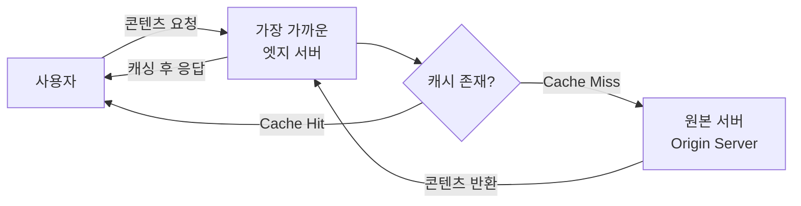
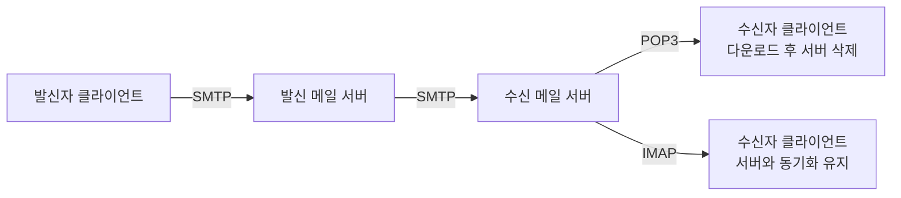

# 네트워크

- [OSI 7계층과 TCP/IP 4계층](#osi-7계층과-tcpip-4계층)
- [TCP와 UDP의 차이](#tcp와-udp의-차이)
  - [TCP 3-way Handshake](#tcp-3-way-handshake)
- [포트(Port)와 트래픽(Traffic)](#포트port와-트래픽traffic)
  - [인바운드와 아웃바운드 트래픽](#인바운드와-아웃바운드-트래픽)
  - [임시 포트(Ephemeral Port)](#임시-포트ephemeral-port)
- [CDN(Content Delivery Network)](#cdncontent-delivery-network)
- [이메일 프로토콜(SMTP, POP3, IMAP)](#이메일-프로토콜smtp-pop3-imap)
- [루프백 주소(Loopback Address)](#루프백-주소loopback-address)

## OSI 7계층과 TCP/IP 4계층

네트워크 통신 과정을 단계별로 표준화한 모델이다. 상위 계층에서 하위 계층으로 데이터를 보낼 때 각 계층의 헤더를 붙이는 캡슐화(Encapsulation)를 거치며, 받을 때는 반대로 헤더를 제거하는 역캡슐화(Decapsulation)를 수행한다.

- OSI 7계층:
  - (7) 응용(Application): 사용자 서비스 제공 (HTTP, FTP, SMTP)
  - (6) 표현(Presentation): 데이터 인코딩, 암호화, 압축
  - (5) 세션(Session): 통신 세션 수립 및 동기화
  - (4) 전송(Transport): 종단 간 신뢰성 있는 전송 (TCP, UDP)
  - (3) 네트워크(Network): 최적의 경로 설정 및 패킷 전달 (IP, Router)
  - (2) 데이터 링크(Data Link): 물리적 매체 간 인접 노드 전송 (Ethernet, Switch)
  - (1) 물리(Physical): 전기적 신호 전송 (Cable, Hub)

## TCP와 UDP의 차이

| 항목      | TCP (Transmission Control Protocol) | UDP (User Datagram Protocol)   |
| :-------- | :---------------------------------- | :----------------------------- |
| 연결 방식 | 연결 지향형 (Connection-oriented)   | 비연결형 (Connectionless)      |
| 신뢰성    | 높음 (순서 보장, 패킷 재전송)       | 낮음 (데이터 유실 가능성 있음) |
| 속도      | 상대적으로 느림 (오버헤드 발생)     | 매우 빠름 (실시간성 위주)      |
| 용도      | 웹(HTTP), 이메일, 파일 전송         | 스트리밍, 게임, DNS            |

### TCP 3-way Handshake

데이터를 전송하기 전, 클라이언트와 서버가 서로 신뢰할 수 있는 연결을 수립하는 과정이다.

1. `SYN`: 클라이언트가 서버에게 연결 요청 패킷을 보냄.
2. `SYN + ACK`: 서버가 요청을 수락하고 클라이언트에게 확인 패킷을 보냄.
3. `ACK`: 클라이언트가 최종적으로 서버에게 확인 패킷을 보내 연결이 완료됨.

## 포트(Port)와 트래픽(Traffic)

포트는 운영체제 통신의 종단점(Endpoint)으로, 하나의 IP 주소 내에서 실행되는 여러 프로세스를 구분하기 위해 사용된다.

### 인바운드와 아웃바운드 트래픽

- 인바운드 트래픽(Inbound Traffic):
  - 외부 네트워크에서 내부 네트워크(또는 서버)로 들어오는 데이터 흐름임.
  - 보안을 위해 방화벽에서 엄격하게 관리됨.
- 아웃바운드 트래픽(Outbound Traffic):
  - 내부 네트워크에서 외부로 나가는 데이터 흐름임.
  - 인바운드에 비해 상대적으로 제한이 덜함.

### 임시 포트(Ephemeral Port)

클라이언트 프로그램(웹 브라우저 등)이 서버와 통신할 때 운영체제로부터 동적으로 할당받는 포트다.

- 특징:
  - 서버처럼 고정된 포트를 리스닝하지 않고, 요청 시에만 할당받음.
  - 통신이 끝나면 운영체제에 반환되어 재사용됨.
  - 보통 `49152`~`65535` 범위의 포트를 사용함.
- 동작 과정:
  1. 클라이언트가 임시 포트를 열고 서버의 포트로 요청을 보냄 (Outbound).
  2. 서버는 요청을 보낸 클라이언트의 임시 포트 번호를 확인하여 응답을 보냄 (Inbound).

## CDN(Content Delivery Network)

지리적으로 분산된 엣지 서버(Edge Server)를 활용하여 정적 콘텐츠를 빠르게 전송하는 기술이다.

- 동작 원리:
  - 사용자가 콘텐츠를 요청하면 물리적으로 가장 가까운 엣지 서버의 IP를 반환함.
  - 엣지 서버에 데이터가 있다면 즉시 응답함 (`Cache Hit`).
  - 데이터가 없다면 원본 서버(Origin Server)에서 받아와 캐싱한 후 사용자에게 전달함 (`Cache Miss`).

## 이메일 프로토콜(SMTP, POP3, IMAP)

- `SMTP(Simple Mail Transfer Protocol)`: 이메일 발송을 위한 프로토콜임. 클라이언트 → 발신 서버, 발신 서버 → 수신 서버 구간 모두에서 사용됨.
- `POP3(Post Office Protocol v3)`: 서버의 메일을 클라이언트로 내려받으며, 기본적으로 서버 데이터는 삭제됨.
- `IMAP(Internet Message Access Protocol)`: 서버와 클라이언트의 메일 상태를 실시간 동기화함. 여러 기기 사용에 적합함.

## 루프백 주소(Loopback Address)

컴퓨터 자기 자신(Localhost)을 가리키는 특수 주소다. 데이터가 네트워크 카드를 거치지 않고 내부 네트워크 스택에서만 이동한다.

- `127.0.0.1` (IPv4): 관례적으로 사용하는 IPv4 루프백 주소임.
- `::1` (IPv6): IPv6 환경에서 로컬 호스트를 가리키는 128비트 주소임.
- OS의 `hosts` 파일(`/etc/hosts`, `C:\Windows\System32\drivers\etc\hosts`)에 `localhost → 127.0.0.1` 매핑이 정의되어 있음.

로컬 개발 환경에서 자주 맞닥뜨리는 문제와 해결 방법:

- 쿠키 도메인 문제: 쿠키의 `domain` 속성이 `localhost`에 적용되지 않는 경우, `hosts` 파일에 별칭을 추가하여 커스텀 도메인을 `127.0.0.1`로 매핑하면 해결할 수 있음.
- 로컬 HTTPS 통신: `mkcert`로 로컬 CA를 생성하면 `localhost`에서 HTTPS 인증서를 발급받아 `https://localhost`로 개발이 가능함.
- CORS 문제: 개발 서버의 프록시 기능(예: Vite `proxy`, Next.js `rewrites`)을 사용하면 브라우저가 CORS 검사를 건너뛰고 서버 측에서 API 요청을 중계할 수 있음.
