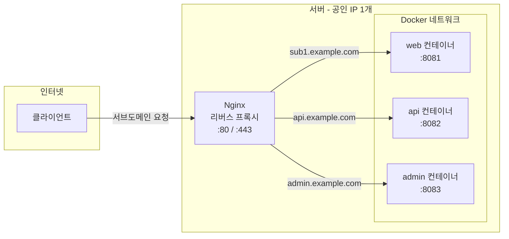

# DNS

- [도메인과 DNS(Domain Name System)](#도메인과-dnsdomain-name-system)
  - [DNS 서버의 종류와 계층 구조](#dns-서버의-종류와-계층-구조)
  - [DNS 조회 흐름](#dns-조회-흐름)
  - [리버스 프록시(Reverse Proxy)를 통한 관리](#리버스-프록시reverse-proxy를-통한-관리)

## 도메인과 DNS(Domain Name System)

도메인 이름을 IP 주소로 변환하여 사용자가 서버에 접속할 수 있게 해주는 시스템이다.

- 주요 레코드 타입:
  - `A`: 도메인을 IPv4 주소로 매핑함.
  - `AAAA`: 도메인을 IPv6 주소로 매핑함.
  - `CNAME`: 도메인에 대한 별칭(Alias)을 설정함. 값은 반드시 도메인 형태여야 함.
  - `NS`: 도메인의 권한을 가진 네임서버를 지정함.
- `TTL(Time To Live)`: DNS 서버가 해당 레코드 정보를 캐시할 수 있는 유효 기간임. TTL이 짧으면 변경 사항이 빠르게 반영되지만 DNS 서버 부하가 증가함.

### DNS 서버의 종류와 계층 구조

DNS 서버는 역할에 따라 크게 리졸버(Resolver)와 네임서버(Authoritative Name Server)로 나뉜다. 흔히 "DNS 서버"라고 부르는 것은 리졸버를 지칭하는 경우가 많지만, 네임서버 역시 DNS 서버의 일종이다.

- 리졸버(Resolver):
  - 클라이언트로부터 도메인 질의를 받아 대신 답을 찾아주는 중개 서버임.
  - 인터넷 연결 시 ISP(통신사)가 기본으로 제공하며, `8.8.8.8`(Google) • `1.1.1.1`(Cloudflare) 등으로 수동 변경 가능함.
  - 한 번 조회한 결과를 TTL 동안 캐시하여 동일 질의에 대해 빠르게 응답함.
- 권한 네임서버(Authoritative Name Server):
  - 특정 도메인의 DNS 레코드를 직접 관리하는 원본 서버임.
  - 도메인 소유자가 선택하며, AWS Route 53 • Cloudflare DNS 등이 해당함.
  - `nslookup` 결과에서 `Non-authoritative answer`라고 표시되면 리졸버의 캐시를 통해 응답받은 것이고, 권한 네임서버에서 직접 받은 응답이 아님을 의미함.

DNS는 계층적 트리 구조로 설계되어 있으며, 각 계층을 서로 다른 기관이 운영한다.

| 계층          | 운영 주체                           | 예시                            |
| :------------ | :---------------------------------- | :------------------------------ |
| 루트 네임서버 | ICANN 위임, 13개 기관               | Verisign, NASA, RIPE NCC 등     |
| TLD 네임서버  | 각 도메인 레지스트리                | `.com` → Verisign, `.kr` → KISA |
| 권한 네임서버 | 도메인 소유자가 선택                | AWS Route 53, Cloudflare 등     |
| 리졸버        | ISP, 기업, 개인 등 누구나 운영 가능 | KT, SKT, Google(`8.8.8.8`) 등   |

루트 네임서버는 `A.root-servers.net`부터 `M.root-servers.net`까지 13개의 논리적 주소로 구성되지만, 실제로는 애니캐스트(Anycast) 기술로 전 세계 1,000개 이상의 물리 서버가 동일한 IP를 공유한다. 클라이언트의 요청은 물리적으로 가장 가까운 서버가 자동으로 응답한다.

### DNS 조회 흐름

클라이언트가 `example.com`을 조회하면 다음과 같은 단계를 거친다.

1. 클라이언트가 리졸버에게 `example.com`의 IP를 질의함.
2. 리졸버의 캐시에 해당 레코드가 없으면 루트 네임서버에 질의함.
3. 루트 네임서버가 `.com` TLD 네임서버의 주소를 반환함.
4. 리졸버가 `.com` TLD 네임서버에 질의하면, `example.com`의 권한 네임서버 주소를 반환함.
5. 리졸버가 권한 네임서버에 질의하여 최종 IP 주소(A 레코드)를 받아옴.
6. 리졸버가 결과를 캐시한 뒤 클라이언트에게 응답함.

### 리버스 프록시(Reverse Proxy)를 통한 관리

Nginx와 같은 리버스 프록시 서버를 사용하면 하나의 공인 IP로 여러 서브도메인 서비스를 운영할 수 있다.

- 장점: 비용 절감, SSL 인증서 및 보안 설정의 통합 관리 가능.
