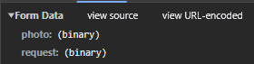
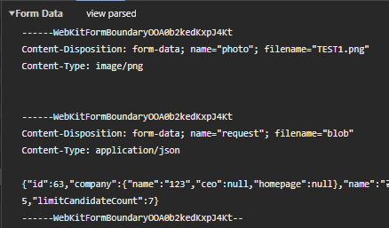
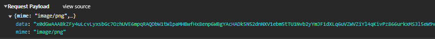
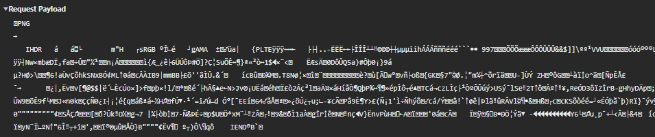
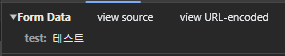

## MIME 타입

MIME(Multipurpose Internet Mail Extensions) 타입은 파일의 형식이나 유형을 식별하기 위한 표준화된 문자열이다. MIME 타입은 주로 웹에서 사용되며, 웹 브라우저와 서버가 파일의 내용을 올바르게 처리하도록 도와준다. MIME 타입은 파일의 확장자나 내용의 특성에 따라 결정되며, 파일의 실제 형식을 정확하게 식별할 수 있도록 도와준다.

### multipart/form-data

여러 데이터 유형(텍스트, 이미지, 파일 등)을 동시에 HTTP 요청의 body 값으로 전송할 수 있으며 주로 파일 업로드와 폼 데이터를 같이 전송할 때 사용된다. 각 파트에 Content-Type 및 Content-Disposition 헤더가 부여된다.

자바스크립트에서 바이너리 데이터를 다룰 때 blob 객체로 다뤄지는데 multipart/form-data를 사용하면 해당 객체를 자동으로 바이너리 데이터로 변환하고 서버로 전송한다.

HTML 폼 방식, fetch API, axios 방식으로 요청 가능하다.

### application/json

HTTP 요청의 body 값으로 JSON 데이터를 보낼 때 사용한다.

fetch API, axios 방식으로 요청 가능하다.

바이너리 데이터를 Base64 형식으로 인코딩해서 보내는 경우는 아래와 같다.

### application/octet-stream

HTTP 요청의 body 값으로 아무런 특별한 분류나 변환 없이 원시 바이트 데이터로 이루어진 스트림을 전송할 때 사용한다. 어떤 종류의 파일인지 알 수 있는 바이너리 데이터는 다른 MIME 타입을 사용해서 명시해준다.

자바스크립트에서 바이너리 데이터를 다룰 때 blob 객체로 다뤄지는데 application/octet-stream을 사용하면 해당 객체를 바이너리 데이터로 변환 후에 서버로 전송해야 한다.

fetch API, axios 방식으로 요청 가능하다.

### application/x-www-form-urlencoded

HTML 폼 방식으로 HTTP 요청을 할 때 기본값으로 설정되며, HTTP 요청의 body 값으로 데이터를 URL 인코딩하여 보낼 때 사용한다.

HTML 폼 방식, fetch API, axios 방식으로 요청 가능하다.

### etc

- application/JavaScript
- application/xml
- application/zip
- application/pdf
- application/sql
- application/graphql
- application/ld+json
- application/msword (.doc)
- application/vnd.openxmlformats-officedocument.wordprocessingml.document(.docx)
- application/vnd.ms-excel (.xls)
- application/vnd.openxmlformats-officedocument.spreadsheetml.sheet (.xlsx)
- application/vnd.ms-powerpoint (.ppt)
- application/vnd.openxmlformats-officedocument.presentationml.presentation (.pptx)
- application/vnd.oasis.opendocument.text (.odt)
- audio/mpeg
- audio/vorbis
- text/css
- text/html
- text/csv
- text/plain
- images/image/png
- image/jpeg
- image/gif
