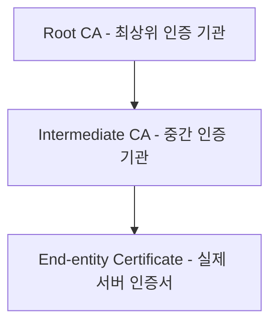
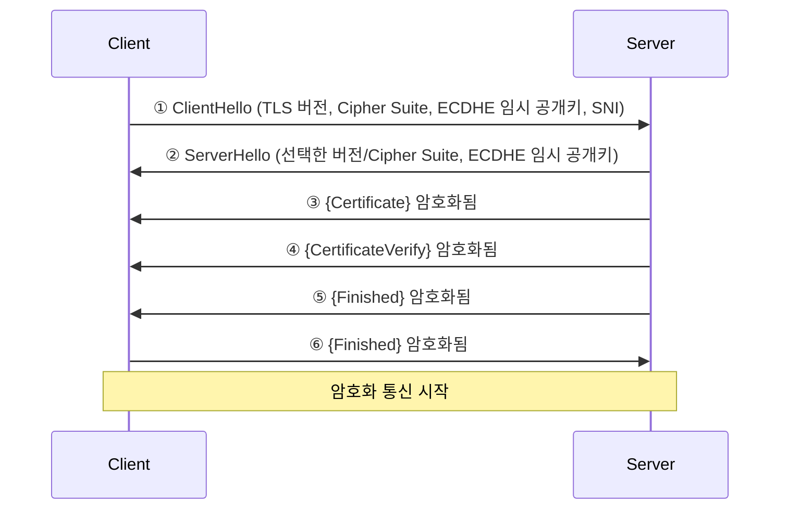

# SSL/TLS

- [SSL/TLS](#ssltls)
  - [인증서 구조](#인증서-구조)
  - [인증서 종류](#인증서-종류)
  - [TLS 핸드셰이크](#tls-핸드셰이크)
  - [ECDHE와 Forward Secrecy](#ecdhe와-forward-secrecy)
  - [핸드셰이크 후 암호화 통신](#핸드셰이크-후-암호화-통신)
  - [인증서 폐기 확인 — OCSP](#인증서-폐기-확인--ocsp)
  - [인증서의 본질](#인증서의-본질)

## SSL/TLS

SSL(Secure Sockets Layer) / TLS(Transport Layer Security)는 클라이언트-서버 간 통신을 암호화하는 프로토콜이다. SSL은 구버전이며 현재는 TLS가 표준이지만 관행적으로 SSL이라 부른다.

인증서의 역할은 세 가지다.

- 암호화: 데이터를 암호화해 중간에서 탈취해도 읽을 수 없게 함.
- 신원 인증: 서버가 해당 도메인의 진짜 서버임을 증명함.
- 데이터 무결성: 전송 중 데이터가 변조되지 않았음을 보장함.

오해하기 쉬운 개념들:

- "HTTPS = 안전한 사이트" (틀림): 자물쇠 아이콘은 전송 구간 암호화만 의미하며, 피싱 사이트도 HTTPS 인증서를 가질 수 있음.
- "SSL 인증서": SSL은 이미 폐기된 프로토콜이며 현재 동작하는 것은 TLS 1.2/1.3임. "SSL 인증서"라는 말은 관습적 표현임.
- "HTTPS만 설정하면 HTTP 자동 차단": 별도 리다이렉트 설정과 `Strict-Transport-Security` 헤더가 필요함.

### 인증서 구조

브라우저는 Root CA를 신뢰 목록에 내장하고 있으며, 체인을 타고 서버 인증서까지 신뢰 검증을 수행한다.



- 공개키(Public Key): 인증서에 포함되며 누구나 볼 수 있음.
- 개인키(Private Key): 서버만 보관하며 절대 외부 노출 금지.
- CA (Certificate Authority): 인증서를 발급하는 신뢰 기관(DigiCert, Let's Encrypt 등).
- CSR (Certificate Signing Request): CA에 제출하는 인증서 서명 요청. 개인키는 CA에 절대 전송하지 않으며 CSR(공개키 포함)만 제출함.

### 인증서 종류

| 종류                         | 검증 수준        | 특징                         |
| :--------------------------- | :--------------- | :--------------------------- |
| DV (Domain Validation)       | 도메인 소유권만  | 빠름, Let's Encrypt          |
| OV (Organization Validation) | 도메인 + 조직    | 중간 수준                    |
| EV (Extended Validation)     | 엄격한 기업 검증 | 브라우저 주소창 녹색 표시    |
| Wildcard                     | `*.example.com`  | 1단계 서브도메인 전체 커버   |
| SAN                          | 여러 도메인 한장 | `example.com`, `example.net` |

Wildcard 인증서는 1단계 서브도메인만 커버한다. `api.example.com`은 적용되지만 `api.v2.example.com`은 별도 인증서가 필요하다.

### TLS 핸드셰이크

|                 | TLS 1.2        | TLS 1.3    |
| :-------------- | :------------- | :--------- |
| 왕복 횟수       | 2-RTT          | 1-RTT      |
| 키 교환         | RSA 또는 ECDHE | ECDHE 전용 |
| Forward Secrecy | 선택적         | 강제       |
| 현재 권장       | 레거시 호환    | 표준       |

TLS 1.3 핸드셰이크 흐름은 다음과 같다.



ServerHello 직후 양쪽이 `Shared Secret + Client Random + Server Random`으로 대칭키를 도출하며, 이후 메시지부터 암호화가 시작된다. CertificateVerify 단계에서 서버는 핸드셰이크 메시지 전체를 해시한 뒤 개인키로 서명하여 인증서의 실제 소유자임을 증명한다.

중간 CA 인증서(체인)도 함께 제공해야 하며 누락 시 "인증서를 신뢰할 수 없음" 오류가 발생한다.

```nginx
# 올바른 방식 (fullchain = 서버 인증서 + 중간 CA 포함)
ssl_certificate /etc/ssl/fullchain.pem;
```

### ECDHE와 Forward Secrecy

ECDHE(Elliptic Curve Diffie-Hellman Ephemeral)는 TLS 핸드셰이크에서 대칭키를 교환하기 위한 알고리즘이다.

- Elliptic Curve: 타원곡선 수학을 사용해 짧은 키(256bit)로 RSA 3072bit와 동등한 보안 수준을 제공함.
- Diffie-Hellman: 공개된 채널에서 제3자 모르게 공통 비밀값을 만드는 키 교환 방식.
- Ephemeral(임시): 연결마다 새 키 쌍을 생성하고 연결 종료 후 폐기함.

공개 파라미터로 타원곡선 위의 기준점 `G`를 사용하며, Shared Secret 계산 과정은 다음과 같다.

- 클라이언트: 임시 개인키 `a` 생성 → 공개키 `A = a × G` → ServerHello로 전달받은 서버 공개키 `B`로 `a × B = ab × G` 계산
- 서버: 임시 개인키 `b` 생성 → 공개키 `B = b × G` → ClientHello로 전달받은 클라이언트 공개키 `A`로 `b × A = ab × G` 계산

양쪽이 `ab × G`라는 동일한 Shared Secret을 도출한다. `a`와 `b`는 전송되지 않으며, 공개키만으로는 이산 대수 문제 때문에 개인키를 역산할 수 없다.

Ephemeral이 중요한 이유는 Forward Secrecy(전방 비밀성) 때문이다. 고정 키 쌍을 사용하면 서버 개인키 탈취 시 과거 트래픽까지 복호화가 가능하지만, 연결마다 임시 키를 생성하면 개인키를 탈취해도 이미 폐기된 과거 키를 복원할 수 없다.

### 핸드셰이크 후 암호화 통신

핸드셰이크의 결과로 양쪽이 대칭키(Session Key)를 공유하게 되며, 이후 실제 데이터 전송에는 대칭키 암호화(AES-256 등)를 사용한다. 공개키 암호화는 비용이 크기 때문에 대칭키 교환 단계에서만 쓰고 이후엔 대칭키로 전환한다.

TLS 1.3에서는 AES-GCM(AEAD) 방식으로 암호화와 무결성 검증을 동시에 처리한다. Nonce(일회성 난수)를 레코드마다 달리하여 같은 데이터도 매번 다른 암호문을 생성한다.

### 인증서 폐기 확인 — OCSP

Certificate를 받은 후 클라이언트가 CA에 인증서 유효성을 확인하는 과정이다.

| 방식          | 조회 주체  | 시점                      |
| :------------ | :--------- | :------------------------ |
| CRL           | 클라이언트 | 폐기 목록 주기적 다운로드 |
| OCSP          | 클라이언트 | 연결마다 CA에 실시간 질의 |
| OCSP Stapling | 서버       | 미리 받아서 인증서에 첨부 |

OCSP Stapling은 서버가 CA로부터 OCSP 응답을 미리 받아두고 Certificate 전송 시 함께 첨부하는 방식이다. 클라이언트가 CA에 별도 요청하지 않아 지연이 줄고 CA가 사용자 접속 기록을 파악하는 프라이버시 문제도 해결된다.

인증서가 만료되면 서버는 계속 동작하지만 브라우저가 `ERR_CERT_DATE_INVALID` 경고를 표시하며 차단한다.

### 인증서의 본질

DNS는 단순한 주소록으로 위변조가 가능하지만, 인증서는 CA가 독립적으로 도메인 소유권을 검증(DNS TXT 레코드, 파일 업로드, 이메일 인증 등)하므로 공격자가 DNS를 조작해도 CA 검증은 별도로 통과해야 한다.

|             | DNS                  | 인증서                      |
| :---------- | :------------------- | :-------------------------- |
| 관리 주체   | DNS 서버 (탈취 가능) | CA (신뢰 기관)              |
| 증명 내용   | IP 주소              | 도메인 소유권 + 개인키 보유 |
| 위변조      | 가능                 | 개인키 없으면 불가          |
| 실시간 검증 | 없음                 | 핸드셰이크마다 서명 검증    |

DNS는 어디로 갈지 알려주고, 인증서는 거기가 진짜인지 증명한다.
