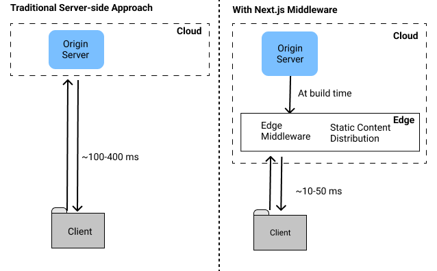

# Next Note

- [Page Router 방식의 렌더링 전략](#page-router-방식의-렌더링-전략)
- [Page Router 동적 라우팅 시 경로 사전 생성하기](#page-router-동적-라우팅-시-경로-사전-생성하기)
- [App Router 방식의 렌더링 전략](#app-router-방식의-렌더링-전략)
- [Hydration Error](#hydration-error)
- [주요 웹 성능 지표](#주요-웹-성능-지표)
- [App Router 동적 라우팅 시 경로 사전 생성하기](#app-router-동적-라우팅-시-경로-사전-생성하기)
- [Middleware](#middleware)
- [Image Component](#image-component)

## Page Router 방식의 렌더링 전략

▾ SSG (Static-Site Generation):

`getStaticProps` → SSG (빌드 시점에 정적 페이지 생성)

1. 서버에서 빌드 타임에 HTML, CSS, JS를 사전 생성
2. 클라이언트가 CDN에 SPA 요청
3. 클라이언트가 CDN에서 SPA 다운로드
4. 클라이언트가 브라우저에서 SPA 파싱 및 렌더링 (FP/FCP/LCP 발생)
5. React 하이드레이션 실행 (TBT/TTI 영향)

▾ SSR (Server-Side Rendering):

`getServerSideProps` → SSR (매 요청 시 서버 렌더링)

1. 사전 생성 없음
2. 클라이언트 요청 시 서버에서 HTML, CSS, JS 실시간 생성
3. 클라이언트가 서버에서 SPA 다운로드
4. SSG와 동일한 렌더링 과정
5. SSG와 동일한 하이드레이션 과정

▾ ISR (Incremental Static Regeneration):

`getStaticProps` + `revalidate` → ISR (빌드 시점에 정적 페이지 생성 후 `revalidate` 간격으로 재생성)

1. SSG와 동일한 빌드 타임 생성
2. CDN 요청 + revalidate 조건 시 재생성
3. SSG와 동일한 다운로드
4. SSG와 동일한 렌더링
5. SSG와 동일한 하이드레이션

▾ CSR (Client-Side Rendering):

1. 데이터 제외한 정적 파일만 생성
2. 데이터 없는 SPA 요청
3. 데이터 없는 SPA 다운로드
4. SSG와 동일한 렌더링
5. 데이터 없는 하이드레이션
6. 클라이언트에서 데이터 페치 및 UI 업데이트

## Page Router 동적 라우팅 시 경로 사전 생성하기

`getStaticPaths(fallback: false)`
`getStaticPaths(fallback: true)`
`getStaticPaths(fallback: 'blocking')`

fallback: false

getStaticPaths에서 반환되지 않은 경로는 404 페이지로 이동
next build 시 getStaticPaths가 반환한 경로만 정적 생성
소량의 경로 생성 시 적합
새로운 경로 추가 시 다시 빌드 필요
fallback: true

미생성 경로 접속 시 로딩 상태 표시 후 getStaticProps 실행
대규모 데이터 기반 사이트(이커머스 등)에 적합
첫 접속 후 동일 경로는 정적 페이지 제공
output: 'export' 사용 시 지원되지 않음
fallback: 'blocking'

미생성 경로 접속 시 SSR 방식으로 HTML 생성 후 캐싱
사용자는 생성 완료 시까지 대기(로딩 UI 없음)
경로당 한 번만 생성되며 이후 정적 페이지 제공
output: 'export' 사용 시 지원되지 않음

## App Router 방식의 렌더링 전략

`await fetch(`https://...`, { cache: 'force-cache' })` → SSG
`await fetch(`https://...`, { next: { revalidate: 60 } })` → ISR
`await fetch(`https://...`, { cache: 'no-store' })` → SSR

## Hydration Error

## 주요 웹 성능 지표

| 지표                           | 설명                                                                     | 측정 대상     | 권장값     |
| ------------------------------ | ------------------------------------------------------------------------ | ------------- | ---------- |
| FCP (First Contentful Paint)   | 페이지 로딩 시작 후 첫 번째 콘텐츠가 화면에 렌더링되는 시점              | 로딩 성능     | 1.8초 이하 |
| LCP (Largest Contentful Paint) | 페이지의 가장 큰 콘텐츠 요소가 렌더링되는 시점                           | 로딩 성능     | 2.5초 이하 |
| SI (Speed Index)               | 페이지 콘텐츠가 시각적으로 표시되는 속도                                 | 로딩 성능     | 3.4초 이하 |
| FID (First Input Delay)        | 사용자가 첫 번째 상호작용을 시도한 후 브라우저가 응답하기까지의 지연시간 | 상호작용 성능 | 100ms 이하 |
| TTI (Time to Interactive)      | 페이지가 완전히 상호작용 가능한 상태가 되는 시점                         | 상호작용 성능 | 3.8초 이하 |
| TBT (Total Blocking Time)      | FCP와 TTI 사이에 메인 스레드가 블로킹된 총 시간                          | 상호작용 성능 | 200ms 이하 |
| CLS (Cumulative Layout Shift)  | 페이지 로딩 중 예상치 못한 레이아웃 이동의 누적 점수                     | 시각적 안정성 | 0.1 이하   |

## App Router 동적 라우팅 시 경로 사전 생성하기

- `generateStaticParams` + `dynamicParams: false` → 404
- `generateStaticParams` + `dynamicParams: true` → SSR

## Middleware

권한 제어 시 소프트 라우팅 이후 router.back(), router.forward() 등 앞으로 가기, 뒤로 가기 사용 시 middleware가 감지하지 못함

## Image Component
