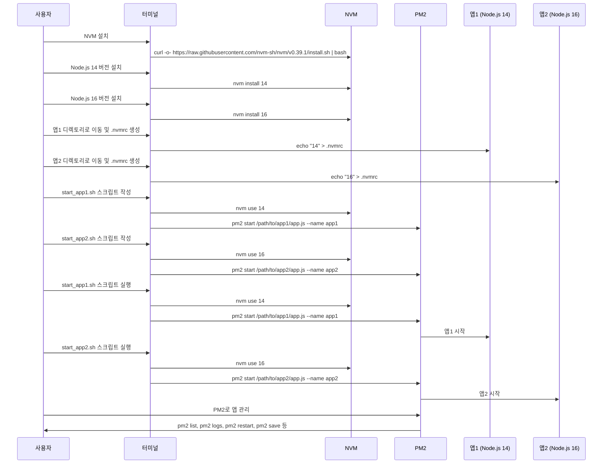
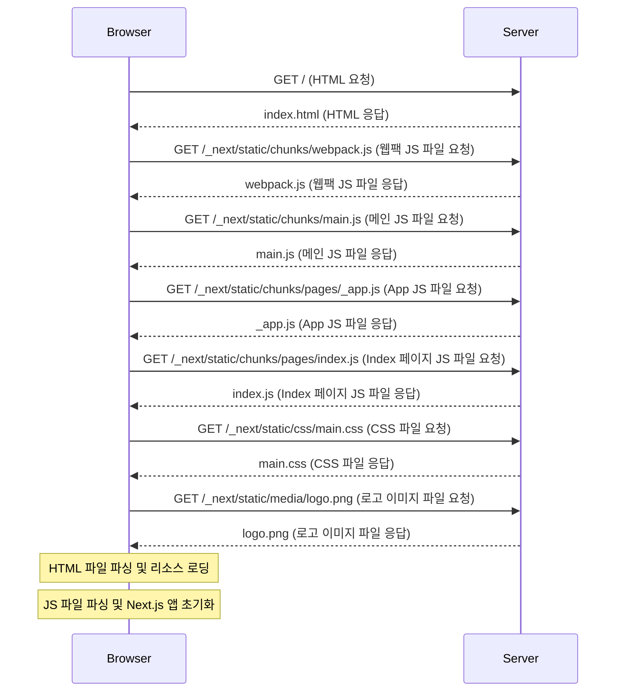
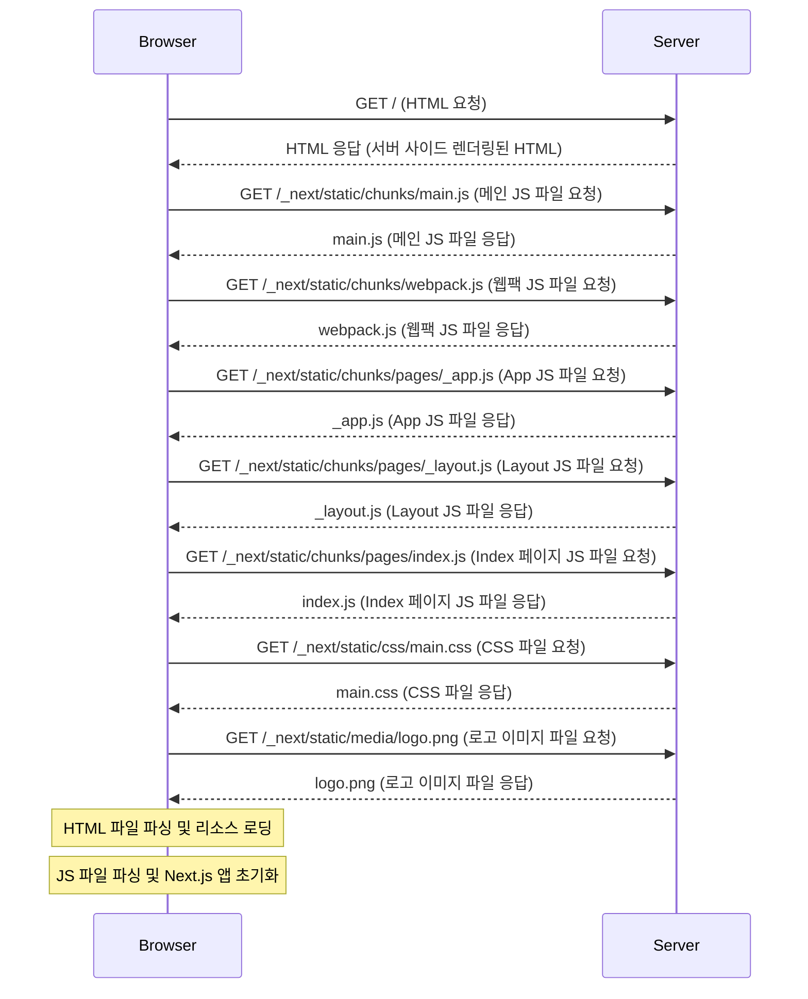
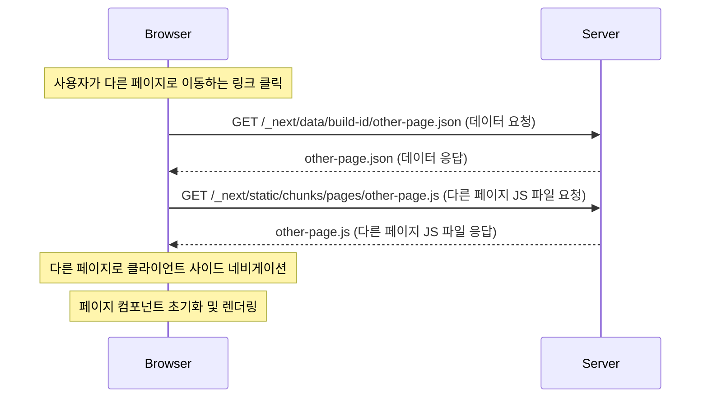
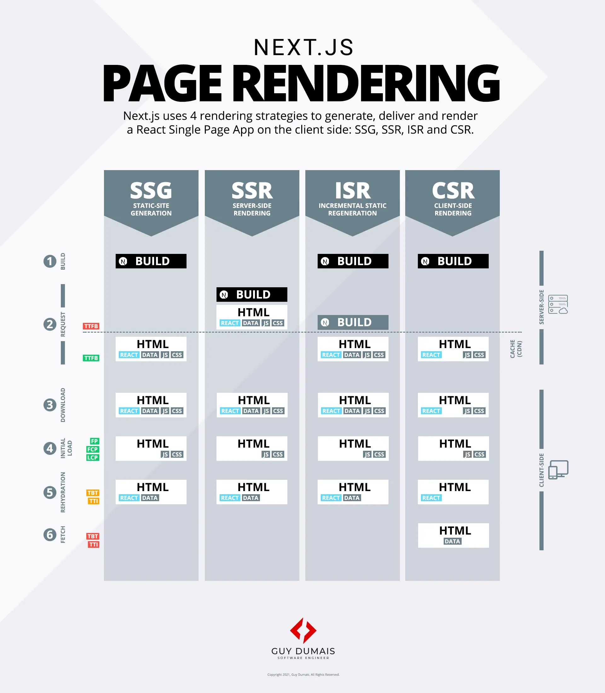
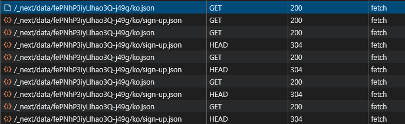

# Next Note

- [렌더링 전략 4가지](#렌더링-전략-4가지)
  - [SSG](#ssg)
  - [CSR](#csr)
  - [ISR](#isr)
  - [SSR](#ssr)
- [hydration](#hydration)
- [웹 성능 지표](#웹-성능-지표)
- [코드스플리팅, 프리렌더링](#코드스플리팅-프리렌더링)
- [app router, page router](#app-router-page-router)
- [빌드](#빌드)
- [240806](#240806)
- [edge function, edge network, middelware](#edge-function-edge-network-middelware)
- [미들웨어 개념](#미들웨어-개념)
- [오류 처리 개념](#오류-처리-개념)
  - [1. 서버 에러](#1-서버-에러)
  - [2. 클라이언트 에러](#2-클라이언트-에러)
  - [요약](#요약)
- [router.isReady](#routerisready)
- [Image Component](#image-component)
- [SSG, SSR, ISR](#ssg-ssr-isr)
  - [Page Router (Pages Directory)](#page-router-pages-directory)
    - [정적 라우팅](#정적-라우팅)
    - [동적 라우팅](#동적-라우팅)
    - [정적 라우팅](#정적-라우팅-1)
    - [동적 라우팅](#동적-라우팅-1)
  - [렌더링 전략 비교](#렌더링-전략-비교)
- [서버 사이드 라우팅](#서버-사이드-라우팅)
- [클라이언트 사이드 라우팅](#클라이언트-사이드-라우팅)
- [Next.js의 하이브리드 라우팅](#nextjs의-하이브리드-라우팅)

## 렌더링 전략 4가지


### SSG

- 1단계: Next.js는 서버에서 `.css` 및 `.js`와 함께 단일 페이지 앱을 `.html` 파일로 생성한다. 사전 렌더링이라고 하는 이 단계는 빌드 시점에 한 번만 수행된다. 이 단계에서 모든 페이지(HTML)가 생성되는데, 여기에는 React 코드, CSS, JavaScript, 그리고 페이지가 `getStaticProps()`와 같은 데이터 불러오기 메서드를 사용하는 경우 선택적으로 데이터도 포함된다.
- 2단계: 클라이언트가 CDN에 싱글 페이지 앱을 요청합니다.
- 3단계: 클라이언트가 CDN에서 싱글 페이지 앱을 다운로드합니다.
- 4단계: 클라이언트가 싱글 페이지 앱을 파싱하여 브라우저에 렌더링한다. 페이지의 HTML이 서버 측에서 미리 렌더링되어 있으므로 클라이언트 브라우저는 이를 그대로 로드하고 렌더링하기만 하면 된다. 또한 페이지가 최소한의 자바스크립트 코드로 브라우저에서 렌더링할 수 있는 방식으로 코딩되어 있기 때문에 렌더링 차단이 최소로 줄어들어 성능 결과가 우수하다.
- 5단계: React (자바스크립트) 코드를 실행하여 페이지를 (재)하이드레이트합니다. 페이지가 미리 빌드되었더라도 이 추가 단계는 React가 JavaScript 이벤트를 가상 DOM에 첨부하거나 활성화하고 페이지를 대화형으로 만들 수 있도록 하기 위해 필요합니다. 이 시점에서 자바스크립트가 실행되므로 총 차단 시간은 이 추가 단계의 영향을 받습니다. 또한 브라우저는 수화 프로세스가 완료될 때까지 기다려야 하므로 인터랙티브 시간도 영향을 받습니다.

### CSR

- 1단계: 콘텐츠(데이터)가 미리 렌더링되지 않거나 정적 묶음에 포함되지 않는다는 점을 제외하면 SSG의 1단계와 동일하다. 따라서 파일 크기가 작아져 다운로드 시간이 단축된다.
- 2단계: SSG의 2단계와 동일하지만 콘텐츠(데이터)가 없다.
- 3단계: SSG의 3단계와 동일하지만 콘텐츠(데이터)가 없다.
- 4단계: SSG의 4단계와 동일하다.
- 5단계: SSG의 5단계와 동일하지만 콘텐츠(데이터)가 없다.
- 6단계: 클라이언트가 콘텐츠(데이터)를 가져오고 React가 UI를 업데이트한다.

### ISR

- 1단계: SSG의 1단계와 동일합니다.
- 2단계: 클라이언트가 CDN에 싱글 페이지 앱을 요청합니다. 또한 페이지가 재검증 옵션과 함께 데이터 가져오기 메서드 getStaticProps()를 사용하는 경우 가져오기 결과에서 반환된 데이터가 업데이트된 경우 페이지가 다시 생성됩니다. 1,000페이지가 넘는 대규모 사이트에는 이 메서드를 사용할 것을 권장합니다. 각 페이지를 미리 렌더링하는 데 시간이 걸리므로 이 증분 방식을 사용하면 첫 번째 요청과 페이지 콘텐츠가 업데이트될 때만 미리 렌더링됩니다.
- 3단계: SSG의 3단계와 동일합니다.
- 4단계: SSG의 4단계와 동일합니다.
- 5단계: SSG의 5단계와 동일합니다.
-

### SSR

- 1단계: Next.js가 페이지를 생성(미리 렌더링)하지 않습니다.
- 2단계: 클라이언트가 서버에 단일 페이지 앱을 요청합니다. Next.js는 서버에서 .css 및 .js와 함께 단일 페이지 앱을 .html 파일로 생성(사전 렌더링)합니다. 이 단계에서 React 코드, CSS, JavaScript 및 페이지가 getServerSideProps() 데이터 불러오기 메서드를 사용하는 경우 선택적으로 데이터를 포함한 모든 페이지 코딩(HTML)이 생성됩니다.
- 3단계: 클라이언트가 서버에서 싱글 페이지 앱을 다운로드합니다.
- 4단계: SSG의 4단계와 동일합니다.
- 5단계: SSG의 5단계와 동일합니다.

## hydration

hydration은 Next.js 프레임워크에서 사용되는 용어이다. 이 용어는 클라이언트 측에서 서버에서 렌더링된 HTML을 가져와서 해당 HTML을 JavaScript로 변환하고 상호작용성을 추가하는 과정을 가리킨다.

Next.js는 서버 측 렌더링(SSR)과 클라이언트 측 렌더링(CSR)을 모두 지원한다. 서버 측 렌더링은 요청 시에 서버에서 페이지를 렌더링하고 완전한 HTML을 클라이언트에 반환한다. 이러한 방식으로 앱의 초기 로드 시간을 줄일 수 있고, SEO를 향상시킬 수 있다. 그러나 이렇게 생성된 페이지는 정적이며, 사용자와의 상호작용에는 제한이 있다.

클라이언트 측 렌더링은 페이지를 브라우저에서 JavaScript를 사용하여 렌더링하는 방식입니다. 이것은 앱의 상호작용성을 높일 수 있지만, 초기 로드 시간이 길어질 수 있으며, SEO에도 부정적인 영향을 줄 수 있습니다.

Next.js에서는 이 두 가지 방법을 결합하여 최상의 사용자 경험을 제공하기 위해 "hydration"이라는 개념을 도입했습니다. 이것은 서버 측에서 렌더링된 페이지의 HTML이 클라이언트로 전송되고, 클라이언트에서 해당 HTML을 가져와서 JavaScript를 사용하여 적절한 상호작용성을 추가하는 프로세스입니다. 이를 통해 초기 로드 시간을 최소화하고, 사용자가 페이지를 빠르게 볼 수 있게 됩니다. 이 과정을 "hydration"이라고 합니다.

결론적으로, Next.js의 hydration은 서버 측 렌더링과 클라이언트 측 렌더링의 장점을 결합하여 최상의 성능과 사용자 경험을 제공하는 데 도움이 됩니다.

## 웹 성능 지표

| 성능 지표                        | 설명                                                                                                          |
| -------------------------------- | ------------------------------------------------------------------------------------------------------------- |
| FCP (First Contentful Paint)     | 페이지의 첫 번째 콘텐츠 요소가 화면에 렌더링되는 시간을 측정합니다.                                           |
| FMP (First Meaningful Paint)     | 페이지가 로드된 후 사용자가 유용한 콘텐츠를 볼 수 있는 시간을 측정합니다.                                     |
| TTI (Time to Interactive)        | 페이지가 로드된 후 사용자가 상호 작용할 수 있는 상태가 되는 시간을 측정합니다.                                |
| TTFP (Total Time to First Paint) | 페이지가 요청되어부터 브라우저가 첫 번째 픽셀을 그리는 데 걸리는 전체 시간을 측정합니다.                      |
| TBT (Total Blocking Time)        | 페이지 로드 중에 메인 스레드가 블록되는 시간의 합계를 측정합니다.                                             |
| LCP (Largest Contentful Paint)   | 페이지의 가장 큰 컨텐츠 요소가 화면에 렌더링되는 시간을 측정합니다.                                           |
| FID (First Input Delay)          | 사용자가 페이지와 상호 작용하기 시작한 후에 브라우저가 해당 상호 작용에 응답하는 데 걸리는 시간을 측정합니다. |
| CLS (Cumulative Layout Shift)    | 페이지가 로드되는 동안 발생하는 레이아웃의 예기치 않은 변화를 측정합니다.                                     |

## 코드스플리팅, 프리렌더링

리액트는 초기 html 파일이 빈 파일로 오고, nextjs의 ssg 전략은 처음 접속한 페이지의 html을 제공하고 이후 페이지가 변경될 때에는 자바스크립트만 변경되는거지? 이런 경우에도 SEO는 문제가 없는거고?

ChatGPT
올바른 지적이시네요. 네, 맞습니다! 리액트의 경우 초기 HTML 파일은 빈 상태로 제공되며, 이후에 자바스크립트가 로드되고 실행되면서 페이지가 렌더링됩니다. 반면에 Next.js의 SSG 전략은 초기에 방문한 페이지의 HTML을 미리 렌더링하여 제공하고, 이후에는 클라이언트 측에서 자바스크립트가 로드되고 페이지가 동적으로 변경됩니다.

빈 HTML을 제공하는 경우, 초기 로딩 속도는 느릴 수 있고, 검색 엔진은 페이지의 콘텐츠를 인식하기 어려울 수 있습니다. 그러나 Next.js의 SSG 전략을 사용하는 경우, 초기 로딩 시에는 이미 미리 렌더링된 HTML이 제공되므로 사용자는 빠르게 콘텐츠를 볼 수 있습니다. 이후에는 클라이언트 측에서 자바스크립트가 로드되어 페이지를 동적으로 변경할 수 있습니다.

이러한 동작 방식은 검색 엔진이 페이지의 콘텐츠를 더 잘 이해하고 인덱싱할 수 있도록 도와주며, 초기 로딩 속도를 향상시키므로 SEO에 유리합니다. 따라서 Next.js의 SSG 전략을 사용하는 경우에도 SEO에 문제가 없습니다.

User
페이지 변경 시에는 미리 렌더링된 html 파일을 주는 게 아니라 리액트처럼 새로 그리는거야?
ChatGPT
네, 맞습니다. 페이지 변경 시에는 Next.js에서도 일반적으로 React와 같이 클라이언트 측에서 새로 렌더링되는 것이 일반적입니다. 초기 페이지 요청 시에만 SSG(정적 사이트 생성)를 통해 미리 렌더링된 HTML 파일이 제공됩니다. 그 이후에는 클라이언트 측에서 JavaScript가 로드되고, React 컴포넌트가 렌더링되어 페이지가 업데이트됩니다.

다시 말해, 초기 요청 시에는 서버 측에서 해당 페이지의 HTML이 미리 렌더링되어 제공되지만, 사용자의 상호작용으로 인해 페이지가 변경되면 서버에서 새로운 HTML 파일을 생성하는 것이 아니라 클라이언트에서 React가 새로 렌더링됩니다.

이러한 방식은 초기 로딩 속도를 향상시키는 동시에 사용자 경험을 유지하면서도 동적으로 콘텐츠를 업데이트할 수 있게 해줍니다. SEO에도 이점을 제공합니다. 왜냐하면 검색 엔진은 초기 페이지 요청 시에 미리 렌더링된 HTML을 볼 수 있으며, 이는 초기 로딩 속도가 빠르고 콘텐츠가 잘 인덱싱되어 있는 것으로 해석될 수 있기 때문입니다.

User
아 ssg가 아니라 ssr이였어
ChatGPT
알겠습니다! SSR(Server Side Rendering)를 사용하는 경우, 페이지 변경 시에도 서버에서 새로운 HTML 파일을 생성하여 클라이언트에 전송할 수 있습니다.

SSR을 사용하면 클라이언트가 페이지를 요청할 때마다 서버에서 해당 페이지를 렌더링하고 초기 HTML을 생성합니다. 따라서 페이지 변경이 발생하면 해당 페이지의 HTML이 서버에서 다시 렌더링되어 클라이언트에게 새로운 HTML이 전송됩니다.

이러한 방식으로 SSR을 사용하면 사용자에게 동적으로 업데이트된 콘텐츠를 제공할 수 있으며, 초기 로딩 속도가 빠르고 SEO에도 유리합니다. 사용자가 페이지를 요청할 때마다 서버에서 새로운 HTML을 생성하기 때문에 항상 최신 상태의 콘텐츠를 보여줄 수 있습니다.

따라서 SSR을 사용하면 페이지 변경 시에도 새로운 HTML 파일을 서버에서 제공할 수 있으며, 이는 초기에 요청한 HTML 파일이 아닌 새로 생성된 HTML 파일이 클라이언트에게 전송되는 것을 의미합니다.

## app router, page router

위 두 방식은 렌더링 방식이 아예 다르다

전자는 서버 컴포넌트를 활용하며, 후자는 ssr, ssg, isr 등 다양한 전략을 취한다.



## 빌드







NextJS는 서버에서 HTML 로딩을 가속화하여 SEO 점수를 높이기 위해 사전 렌더링을 수행하지만 이미 웹사이트에 있는 경우 전체 새 페이지 HTML을 다시 로드할 필요가 없으며 표시되는 구성 요소를 변경할 때만 React를 사용합니다.

브라우저의 네트워크 탭에서 첫 번째 페이지가 완전히 로드되는 동안 다른 페이지는 현재 페이지를 변경하기 위한 정보가 포함된 .json 파일을 로드하는 것을 볼 수 있습니다.

또한 페이지 소스 코드가 표시되면 새 요청을 수행하여 새 URL에 대한 HTML을 가져옵니다.

## 240806

네, 정확히 말씀하신 대로입니다. Next.js는 초기 로딩 시에는 서버 사이드 렌더링(SSR)을 사용하여 전체 HTML을 클라이언트에 전달하고, 이후 페이지 전환 시에는 SPA(싱글 페이지 애플리케이션)처럼 동작합니다.

여기서 핵심은:

초기 로딩: 서버가 페이지의 전체 HTML을 렌더링하여 클라이언트에 전달합니다. 이는 페이지가 처음 요청될 때 SEO와 초기 로딩 성능을 개선하는 데 도움을 줍니다.

클라이언트 라우팅: 페이지가 로드된 후, 사용자 상호작용에 따라 클라이언트 사이드 라우팅을 처리합니다. 이때, JavaScript를 사용하여 필요한 데이터만 가져오고, 페이지 전환을 빠르고 부드럽게 수행합니다. 이 과정에서 페이지 전체를 다시 로드할 필요 없이 필요한 부분만 업데이트하게 됩니다.

이러한 방식은 Next.js가 SSR과 CSR을 조합하여, 초기 로딩 성능을 극대화하고, 이후 사용자 경험을 매끄럽게 유지할 수 있도록 합니다. SPA처럼 클라이언트 측에서 동적으로 페이지를 업데이트하는 이점을 살리면서도, 초기 렌더링에서 서버의 지원을 받아 효율적인 SEO와 성능을 유지할 수 있습니다.




초기 HTML 파일 위치 .next/server/pages
ssg 방식인 페이지는 빌드 시 html 파일이 생기나
ssr 방식인 페이지는 html 파일이 안생김



## edge function, edge network, middelware

api 또는 서버 사이드 렌더링 쪽은 node base

## 미들웨어 개념

요청 -> 미들웨어 -> 엔드포인트 -> 응답

요청 -> 엔드포인트 -> 미들웨어 -> 응답 (?)

## 오류 처리 개념

Next.js에서 에러 처리 우선순위는 일반적으로 에러의 발생 위치(서버 또는 클라이언트)에 따라 다르게 적용되며, 각각의 파일들은 다음과 같은 우선순위를 가집니다.

### 1. 서버 에러

- 404.tsx와 500.tsx: Next.js는 서버 사이드에서 발생하는 404 및 500 에러에 대해 각각의 정적 페이지를 우선 적용합니다.
  - `404.tsx`: 페이지가 존재하지 않을 때 (`404` 에러) 렌더링됩니다.
  - `500.tsx`: 서버 에러(`500` 에러)가 발생했을 때 렌더링됩니다.
- \_error.tsx: 특정한 에러 페이지가 없을 때(예: 404.tsx 또는 500.tsx가 없는 경우), `_error.tsx`가 기본적으로 사용됩니다. 이 파일은 404.tsx나 500.tsx보다 낮은 우선순위를 가지며, 404 또는 500 전용 페이지가 없을 경우 대체 역할을 합니다.

따라서, 404.tsx와 500.tsx가 존재하면 이들이 먼저 사용되며, `_error.tsx`는 그 외의 서버 에러를 처리하거나 기본 에러 페이지로 사용됩니다.

### 2. 클라이언트 에러

- react-error-boundary: 클라이언트에서 발생하는 런타임 에러는 `react-error-boundary`를 통해 우선 처리됩니다. 이는 컴포넌트 단위에서 에러를 포착해주기 때문에, 특정 컴포넌트나 기능에 한정된 에러 핸들링에 유용합니다.
- \_error.tsx: react-error-boundary로 처리되지 않은 클라이언트 에러는 `_error.tsx`로 전달되어 처리됩니다. 이 파일은 마지막 방어선처럼 사용되어, react-error-boundary가 포착하지 못한 클라이언트 에러를 처리합니다.

### 요약

- 서버 에러: `404.tsx` > `500.tsx` > `_error.tsx`
- 클라이언트 에러: `react-error-boundary` > `_error.tsx`

이렇게 우선순위가 적용되어 각각의 에러 타입에 적합한 처리가 이루어집니다.

## router.isReady

## Image Component

```tsx
export default async function RootPage() {
  return (
    <>
      <div className='relative h-96 w-full'>
        <Image
          alt='img'
          src='/test.jpg'
          fill={true} // absolute 자동 적용
          sizes='(max-width: 768px) 100vw, (max-width: 1200px) 50vw, 33vw' // 768px 이하까지 100vw, 768px - 1200px 이하까지 50vw, 그 이상 33vw
          blurDataURL='data:image/png;base64,iVBORw0KGgoAAAANSUhEUgAAAAEAAAABCAQAAAC1HAwCAAAAC0lEQVR42mN89hMAAssB4YXjhpkAAAAASUVORK5CYII='
          placeholder='blur'
        />
      </div>
      <div className='flex flex-col gap-4 p-4'>
        <Image
          alt='img'
          src='/test.jpg'
          width={400} // 이미지 종횡비를 알려주는 역할
          height={600} // 이미지 종횡비를 알려주는 역할
          className='mx-auto'
          blurDataURL='data:image/png;base64,iVBORw0KGgoAAAANSUhEUgAAAAEAAAABCAQAAAC1HAwCAAAAC0lEQVR42mN89hMAAssB4YXjhpkAAAAASUVORK5CYII='
          placeholder='blur'
        />
        <Image
          alt='img'
          src='https://wecruit-landing.s3.ap-northeast-2.amazonaws.com/_assets/customer.png'
          width={400} // 이미지 종횡비를 알려주는 역할
          height={267} // 이미지 종횡비를 알려주는 역할
          className='mx-auto'
          blurDataURL='data:image/png;base64,iVBORw0KGgoAAAANSUhEUgAAAAEAAAABCAQAAAC1HAwCAAAAC0lEQVR42mN89hMAAssB4YXjhpkAAAAASUVORK5CYII='
          placeholder='blur'
        />
      </div>
    </>
  );
}
```

## SSG, SSR, ISR

### Page Router (Pages Directory)

#### 정적 라우팅

- `getStaticProps` → **SSG** (빌드 시점에 정적 페이지 생성)
- `getStaticProps` + `revalidate` → **ISR** (빌드 후 설정 간격으로 재생성)
- `getServerSideProps` → **SSR** (매 요청 시 서버 렌더링)

#### 동적 라우팅

- `getStaticPaths(fallback: false)` + `getStaticProps` → **SSG**
- `getStaticPaths(fallback: true/blocking)` + `getStaticProps` + `revalidate` → **ISR**
- `getServerSideProps` → **SSR**

#### 정적 라우팅

- 데이터 페칭 없음 → **SSG**
- 데이터 페칭 + `revalidate` 설정 → **ISR**
- 데이터 페칭 (revalidate 없음) → **SSR**

#### 동적 라우팅

- `generateStaticParams` + 데이터 페칭 없음 → **SSG**
- `generateStaticParams` + 데이터 페칭 + `revalidate` → **ISR**
- `generateStaticParams` + 데이터 페칭 (revalidate 없음) → **SSR**
- `generateStaticParams` 없음 + `dynamicParams: false` → **404**
- `generateStaticParams` 없음 + `dynamicParams: true` → **SSR**

### 렌더링 전략 비교

| 전략    | 빌드 시점 | 요청 시점        | 캐시      | 사용 사례                    |
| ------- | --------- | ---------------- | --------- | ---------------------------- |
| **SSG** | HTML 생성 | 정적 파일 제공   | 영구      | 블로그, 마케팅 페이지        |
| **ISR** | HTML 생성 | 캐시 또는 재생성 | 설정 시간 | 자주 업데이트되는 콘텐츠     |
| **SSR** | -         | 매번 HTML 생성   | 없음      | 개인화 콘텐츠, 실시간 데이터 |

1. nextjs(v15)에서 정적 라우팅 페이지인 경우

1-1. 서버 페칭이 존재하면 SSR

1-2. 서버 페칭이 존재하고, revalidate 설정이 있으면 ISR

1-3. 서버 페칭이 없다면 SSG

2. nextjs(v15)에서 동적 라우팅 페이지인 경우

2-1. generateStaticParams를 제공하고, 서버 페칭이 없는 경우는 SSG

2-2. generateStaticParams를 제공하고, 서버 페칭이 있는 경우는 SSR

2-3. generateStaticParams를 제공하고, 서버 페칭이 있고, revalidate가 설정되면 경우는 ISR

2-4. generateStaticParams를 제공하지않고, dynamicParams가 false면 404

2-5. generateStaticParams를 제공하지않고, dynamicParams가 true면 요청 시 생성(SSR or ISR)

## 서버 사이드 라우팅

서버 사이드 라우팅은 페이지 요청을 서버에서 처리하는 방식이다. 사용자가 링크를 클릭하거나 URL을 입력하면 브라우저는 서버에 요청을 보내고, 서버는 해당 요청에 맞는 HTML 페이지를 응답으로 보낸다.

장점:

- SEO 최적화: 서버에서 완전한 HTML을 제공하므로 검색 엔진 크롤러가 콘텐츠를 쉽게 읽을 수 있다
- 초기 로드 속도: 서버에서 전체 HTML을 렌더링하므로 브라우저는 이미 렌더링된 페이지를 받는다
- 보안: 클라이언트 측 코드가 노출되지 않아 보안상 더 안전하다

단점:

- 페이지 전환 지연: 페이지가 새로 고쳐지면서 전체 페이지가 다시 로드되어 사용자 경험이 느려진다
- 서버 부하: 모든 페이지 요청이 서버로 전달되어 서버 부하가 증가한다

## 클라이언트 사이드 라우팅

클라이언트 사이드 라우팅은 SPA(Single Page Application)에서 주로 사용된다. 클라이언트 측에서 JavaScript가 URL 변경을 감지하고 필요한 데이터를 로드한 후 페이지 콘텐츠를 동적으로 업데이트한다.

장점:

- 빠른 페이지 전환: 서버와의 추가 요청 없이 클라이언트 측에서만 콘텐츠를 업데이트하므로 빠르다
- 향상된 사용자 경험: 매끄럽고 반응성이 좋은 사용자 경험을 제공한다
- 리소스 절약: 서버로부터 HTML 페이지를 매번 받아오지 않아 네트워크 트래픽과 서버 부하를 줄인다

단점:

- SEO 문제: 클라이언트 측에서 콘텐츠를 동적으로 로드하므로 검색 엔진 크롤러가 콘텐츠를 제대로 인식하지 못할 수 있다
- 초기 로드 시간: 클라이언트에서 초기 JavaScript 파일을 로드해야 하므로 초기 로드 시간이 길어질 수 있다
- 보안 우려: 클라이언트 측 코드가 노출되어 보안상 취약점이 생길 수 있다

## Next.js의 하이브리드 라우팅

Next.js는 SSR과 CSR을 조합한 하이브리드 방식을 사용한다:

1. 초기 로딩: 서버가 페이지의 전체 HTML을 렌더링하여 클라이언트에 전달한다. SEO와 초기 로딩 성능을 개선한다.

2. 클라이언트 라우팅: 페이지가 로드된 후 사용자 상호작용에 따라 클라이언트 사이드 라우팅을 처리한다. JavaScript를 사용하여 필요한 데이터만 가져오고 페이지 전환을 빠르고 부드럽게 수행한다.

이 방식은 초기 로딩 성능을 극대화하고 이후 사용자 경험을 매끄럽게 유지할 수 있다.
