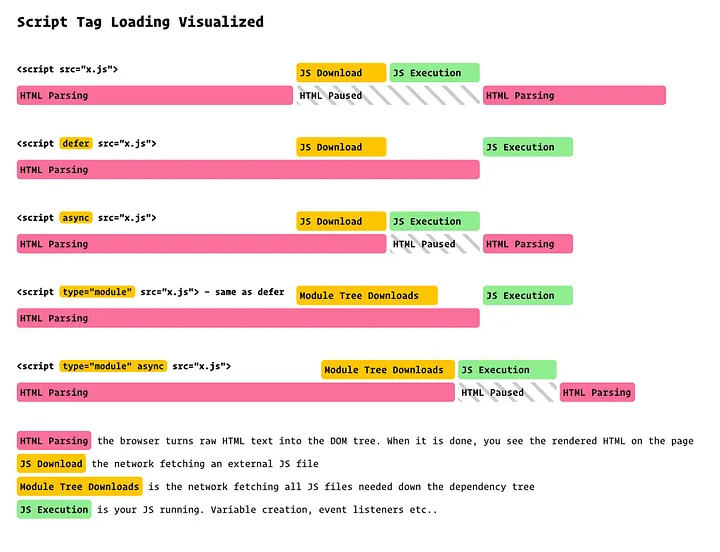
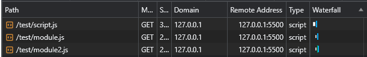

# 모듈 번들러(Module Bundler)

- [브라우저 환경에서 모듈 시스템](#브라우저-환경에서-모듈-시스템)
  - [과거](#과거)
  - [ESM 등장](#esm-등장)
  - [ESM이 보편화됐어도 모듈 번들러(Module Bundler)를 사용하는 이유](#esm이-보편화됐어도-모듈-번들러module-bundler를-사용하는-이유)
- [Node.js 환경에서 모듈 시스템](#nodejs-환경에서-모듈-시스템)
- [모듈 번들러(Module Bundler)가 필수가 된 이유](#모듈-번들러module-bundler가-필수가-된-이유)
  - [모듈 번들러](#모듈-번들러)

## 브라우저 환경에서 모듈 시스템

### 과거

- JavaScript는 공식적인 모듈 시스템이 존재하지 않았다.
- JavaScript는 `<script>` 태그를 통해 로드되었고, 모든 스크립트는 전역 스코프에서 실행되었다.
- 변수나 함수가 전역 객체(`window`)에 추가되어 이름 충돌이 빈번했다.
- 스크립트 로드 순서를 수동으로 관리해서 의존성 관리가 어려웠다.

  ```html
  <!DOCTYPE html>
  <html>
    <head>
      <meta charset="utf-8" />
      <script src="https://unpkg.com/lodash@4.17.20"></script>
    </head>
    <body>
      <!-- 이 스크립트는 lodash 라이브러리가 필요하다. -->
      <script src="./src/index.js"></script>
    </body>
  </html>
  ```

  - 해당 스크립트가 외부 라이브러리에 의존한다는 것이 명확하지 않다.
  - 의존성을 잃어버렸거나 잘못된 순서로 포함되었으면 애플리케이션이 제대로 작동하지 않는다.
  - 의존성이 포함되었지만 사용되지 않는 경우에도 브라우저는 필요 없는 코드를 강제로 다운로드한다.

### ESM 등장

- 2015년 ECMAScript6(ES6)에서 공식적으로 모듈 시스템이 도입되어 `import`와 `export` 문법을 사용할 수 있게 되었다.
- 브라우저 환경은 `<script>` 태그에 `type="module"` 속성 유무에 따라 일반 스크립트와 모듈 스크립트를 구분한다(`*.js`, `*.mjs` 등 확장자와 상관없음).

  ```html
  <script type='module' src='./module.js' > // Error
  ```

▾ 과거에 비해 보완된 점

- 모듈 스크립트는 독립적인 모듈 스코프에서 실행되어 전역 스코프의 변수 충돌 문제를 해결할 수 있다.
- `import`로 필요한 모듈을 선언하여 의존성 관리가 쉬워졌다.

▾ 특징

- 모듈 스크립트는 항상 지연 실행된다.

  

- 일반 스크립트에서 `async` 속성은 외부 스크립트를 불러올 때만 유효하다. 반면, 모듈 스크립트에선 `async` 속성을 인라인 스크립트에도 적용할 수 있다.
- `src` 속성값이 동일한 외부 스크립트는 한 번만 실행된다.
- 다른 오리진에서 모듈 스크립트를 불러오려면 CORS 헤더가 필요하다.
- 경로 없는 모듈은 무효된다.

  ```ts
  import { sayHi } from 'sayHi'; // Error
  // './sayHi.js'와 같이 경로 정보를 지정해 주어야 한다.
  ```

- 모듈은 로드 시 단 한 번만 평가되어 그 결과를 메모리에 저장한다. (싱글톤 패턴)

  ```ts
  // counter.js
  console.log('counter 모듈 평가 시작');
  export let count = 0;
  export function increment() {
    count++;
    console.log(`count: ${count}`);
  }

  // main.js
  import { count, increment } from './counter.js';
  console.log(`초기 count: ${count}`); // 0
  increment(); // count: 1

  // another.js
  import { count, increment } from './counter.js';
  console.log(`another에서 count: ${count}`); // 1 (0이 아님!)
  increment(); // count: 2
  ```

```html
<script type="module" src="script.js"></script>
```

```ts
// module.js
export let a = 'a';

// module2.js
export let b = 'b';

// script.js
import { a } from './module.js';
import { b } from './module2.js';
```



### ESM이 보편화됐어도 모듈 번들러(Module Bundler)를 사용하는 이유

## Node.js 환경에서 모듈 시스템

## 모듈 번들러(Module Bundler)가 필수가 된 이유

- 현대 브라우저 환경에서 공식적인 모듈 시스템은 ES Modules(ESM)을 사용한다.
- 현대 Node.js 환경에서 채택된 모듈 시스템은 CommonJS를 사용하며, 점진적으로 ESM 방식으로 변경되고 있다.

자바스크립트 엔진은 `module.js` 파일 안에 `import`문을 만나면 해당 모듈을 가져오기 위해 네트워크 요청 또는 파일 경로를 통해 온다. 브라우저 환경에서는 일반적으로 네트워크 요청을 통해 해당 모듈을 가져오며, Node.js 환경에서는 파일 시스템을 통해 모듈을 가져온다.

### 모듈 번들러

브라우저 환경에서는 모듈 번들러 없이 모듈을 사용한다면, 무수히 많은 네트워크 요청이 발생한다. 이를 방지하기 위해 웹팩(Webpack)과 같은 모듈 번들러 툴을 사용해 하나의 번들러를 생성하고 이를 `script`와 연결한다.

모듈 번들러 툴은 보통 아래와 같이 동작합니다.

1. HTML의 `<script type="module">`에 진입점 역할을 하는 모듈을 넣는다.
2. 진입점 모듈에 의존하고 있는(`import`되어 있는) 모듈 분석을 시작으로 모듈 간의 의존 관계를 파악한다.
3. 모듈 전체를 한데 모아 하나의 큰 파일을 만든다(설정에 따라 여러 개의 파일을 만드는 것도 가능하다). 이 과정에서 `import`문이 번들러 내부 함수로 대체되므로 기존 기능은 그대로 유지된다. 4. 위 과정에서 아래와 같은 변형 및 최적화도 함께 수행한다.
   - 도달하지 못한 코드는 삭제된다.
   - 내보내진 모듈 중 쓰임처가 없는 모듈을 삭제한다(tree-shaking).
   - `console`, `debugger` 같은 개발 관련 코드를 삭제한다.
   - 최신 자바스크립트 문법이 사용된 경우 바벨(Babel)을 사용해 동일한 기능을 하는 낮은 버전의 스크립트로 변환한다.
   - 공백 제거, 변수 이름 줄이기 등으로 산출물의 크기를 줄인다.

기존 `import`, `export`는 번들러 내부 함수로 대체되기 때문에 `type='module'`이 사라진다.

```html
<script defer src="bundle.js"></script>
```
