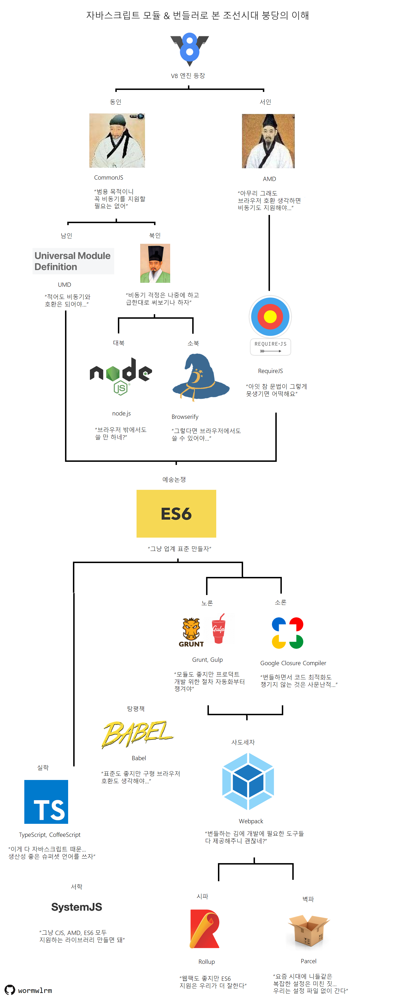
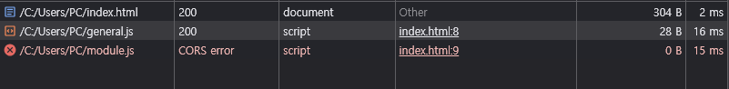
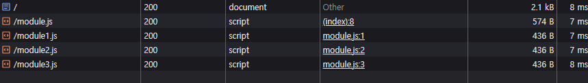

# 모듈 번들러(Module Bundler)

- [그림으로 보는 모듈 시스템 역사](#그림으로-보는-모듈-시스템-역사)
- [Node.js 환경에서 모듈 시스템](#nodejs-환경에서-모듈-시스템)
  - [CommonJS](#commonjs)
  - [NPM(Node Package Manager)의 등장](#npmnode-package-manager의-등장)
  - [ESM의 등장](#esm의-등장)
- [브라우저 환경에서 모듈 시스템](#브라우저-환경에서-모듈-시스템)
  - [과거](#과거)
  - [ESM의 등장](#esm의-등장-1)
- [ESM이 보편화됐어도 모듈 번들러(Module Bundler)를 사용하는 이유](#esm이-보편화됐어도-모듈-번들러module-bundler를-사용하는-이유)
  - [브라우저: 네트워크 기반 웹 페이지 렌더링 도구](#브라우저-네트워크-기반-웹-페이지-렌더링-도구)
  - [Node.js: 파일 시스템 기반 런타임 환경](#nodejs-파일-시스템-기반-런타임-환경)
  - [비교와 이해 보완](#비교와-이해-보완)
    - [질문에 대한 확인](#질문에-대한-확인)
    - [약간의 보완](#약간의-보완)
  - [결론](#결론)

## 그림으로 보는 모듈 시스템 역사



## Node.js 환경에서 모듈 시스템

### CommonJS

- Node.js는 2009년에 등장하여 CommonJS 모듈 시스템을 채택했다.
- `require()` 함수로 모듈을 불러오고 `module.exports`, `exports`로 모듈을 내보낼 수 있다.
- 동기적으로 모듈을 로드한다.

  - 브라우저 환경과 달리 파일 시스템을 이용하는 서버 환경에서는 적합하다.
  - 모듈이 많아지면 성능에 영향을 줄 수 있다.

- 브라우저 환

### NPM(Node Package Manager)의 등장

### ESM의 등장

## 브라우저 환경에서 모듈 시스템

### 과거

- JavaScript는 공식적인 모듈 시스템이 존재하지 않았다.
- 일반 스크립트는 `<script>` 태그를 통해 로드되며, SOP 정책이 느슨하게 적용되어 CORS 제약이 없다.
- 일반 스크립트는 브라우저에서 `file://`과 같이 파일 시스템을 이용해 직접 읽는 방식이 허용된다.
- 일반 스크립트는 전역 스코프에서 실행되어 변수나 함수가 전역 객체(`window`)에 추가될 때 이름 충돌이 빈번했다.
- 일반 스크립트는 로드 순서를 수동으로 관리해서 의존성 관리가 어려웠다.

  ```html
  <!DOCTYPE html>
  <html>
    <head>
      <meta charset="utf-8" />
      <script src="https://unpkg.com/lodash@4.17.20"></script>
    </head>
    <body>
      <!-- 이 스크립트는 lodash 라이브러리가 필요하다. -->
      <script src="index.js"></script>
    </body>
  </html>
  ```

  - 해당 스크립트가 외부 라이브러리에 의존한다는 것이 명확하지 않다.
  - 의존성을 잃어버렸거나 잘못된 순서로 포함되었으면 애플리케이션이 제대로 작동하지 않는다.
  - 의존성이 포함되었지만 사용되지 않는 경우에도 브라우저는 필요 없는 코드를 강제로 다운로드한다.

### ESM의 등장

- 2015년 ECMAScript6(ES6)에서 공식적으로 모듈 시스템이 도입되었다.
- 하나의 모듈은 단순히 `import`와 `export` 문법을 사용할 수 있는 하나의 Javascript 파일이다.
- 브라우저 환경은 `<script>` 태그에 `type="module"` 속성 유무에 따라 일반 스크립트와 모듈 스크립트를 구분한다(`*.js`, `*.mjs` 등 확장자와 상관없음).

  ```html
  <script type='module' src='./module.js' > // Error
  ```

▾ 특징

- 모듈 스크립트는 독립적인 모듈 스코프에서 실행되어 전역 스코프의 변수 충돌 문제를 해결할 수 있다.
- `import`로 필요한 모듈을 선언하여 의존성 관리가 쉬워졌다.
- 모듈 스크립트는 항상 지연 실행된다.

  

- 일반 스크립트에서 `async` 속성은 외부 스크립트를 불러올 때만 유효하다. 반면, 모듈 스크립트에선 `async` 속성을 인라인 스크립트에도 적용할 수 있다.
- `src` 속성값이 동일한 외부 스크립트는 한 번만 실행된다.
- 모듈 스크립트는 보안을 위해 CORS 정책을 강제한다.
- ESM은 모듈 경로를 URL 기반으로 해석하여 `import { sayHi } from 'sayHi.js';`를 HTTP 요청으로 변환한다. 그러므로 `file://`에서 동작하지 않는다.

  

- 경로 없는 모듈은 에러가 발생한다.

  ```ts
  import { sayHi } from 'sayHi.js'; // Success
  import { sayHi } from 'sayHi'; // Error
  ```

- 각 모듈은 개별로 로드되어 파일이 많아질수록 네트워크 요청이 증가한다.

  ```html
  <script type="module" src="module.js"></script>
  ```

  ```ts
  // module1.js
  export let foo = 'foo';

  // module2.js
  export let bar = 'bar';

  // module3.js
  export let baz = 'baz';

  // index.js
  import { foo } from './module1.js';
  import { bar } from './module2.js';
  import { baz } from './module3.js';
  ```

  

- 모듈은 로드 시 단 한 번만 평가되어 그 결과를 메모리에 저장한다. (싱글톤 패턴)

  ```ts
  // counter.js
  console.log('counter 모듈 평가 시작');
  export let count = 0;
  export function increment() {
    count++;
    console.log(`count: ${count}`);
  }

  // main.js
  import { count, increment } from './counter.js';
  console.log(`초기 count: ${count}`); // 0
  increment(); // count: 1

  // another.js
  import { count, increment } from './counter.js';
  console.log(`another에서 count: ${count}`); // 1 (0이 아님!)
  increment(); // count: 2
  ```

## ESM이 보편화됐어도 모듈 번들러(Module Bundler)를 사용하는 이유

- 현대 브라우저 환경에서 공식적인 모듈 시스템은 ES Modules(ESM)을 사용한다.
- 현대 Node.js 환경에서 채택된 모듈 시스템은 CommonJS를 사용하며, 점진적으로 ESM 방식으로 변경되고 있다.

자바스크립트 엔진은 `module.js` 파일 안에 `import`문을 만나면 해당 모듈을 가져오기 위해 네트워크 요청 또는 파일 경로를 통해 온다. 브라우저 환경에서는 일반적으로 네트워크 요청을 통해 해당 모듈을 가져오며, Node.js 환경에서는 파일 시스템을 통해 모듈을 가져온다.

브라우저 환경에서는 모듈 번들러 없이 모듈을 사용한다면, 무수히 많은 네트워크 요청이 발생한다. 이를 방지하기 위해 웹팩(Webpack)과 같은 모듈 번들러 툴을 사용해 하나의 번들러를 생성하고 이를 `script`와 연결한다.

모듈 번들러 툴은 보통 아래와 같이 동작합니다.

1. HTML의 `<script type="module">`에 진입점 역할을 하는 모듈을 넣는다.
2. 진입점 모듈에 의존하고 있는(`import`되어 있는) 모듈 분석을 시작으로 모듈 간의 의존 관계를 파악한다.
3. 모듈 전체를 한데 모아 하나의 큰 파일을 만든다(설정에 따라 여러 개의 파일을 만드는 것도 가능하다). 이 과정에서 `import`문이 번들러 내부 함수로 대체되므로 기존 기능은 그대로 유지된다. 4. 위 과정에서 아래와 같은 변형 및 최적화도 함께 수행한다.
   - 도달하지 못한 코드는 삭제된다.
   - 내보내진 모듈 중 쓰임처가 없는 모듈을 삭제한다(tree-shaking).
   - `console`, `debugger` 같은 개발 관련 코드를 삭제한다.
   - 최신 자바스크립트 문법이 사용된 경우 바벨(Babel)을 사용해 동일한 기능을 하는 낮은 버전의 스크립트로 변환한다.
   - 공백 제거, 변수 이름 줄이기 등으로 산출물의 크기를 줄인다.

기존 `import`, `export`는 번들러 내부 함수로 대체되기 때문에 `type='module'`이 사라진다.

### 브라우저: 네트워크 기반 웹 페이지 렌더링 도구

브라우저(Chrome, Firefox 등)는 본질적으로 웹 페이지를 표시하는 클라이언트 프로그램입니다. 주요 역할은 다음과 같습니다:

- 네트워크를 통한 파일 읽기: HTML, CSS, JavaScript 등의 파일을 HTTP/HTTPS 요청으로 서버에서 가져옵니다.
- 해석 및 렌더링: 가져온 파일을 파싱(parse)하고, DOM(Document Object Model)과 CSSOM(CSS Object Model)을 생성해 화면에 렌더링합니다. JavaScript는 V8 같은 엔진에서 실행되어 동적 기능을 추가합니다.
- 제한된 자원 접근: 보안 샌드박스 때문에 로컬 파일 시스템이나 시스템 자원에 직접 접근할 수 없습니다. 모든 작업은 네트워크와 브라우저 API(예: `fetch`, `localStorage`)를 통해 이루어집니다.

즉, 브라우저는 사용자에게 시각적 결과물을 제공하는 데 초점이 맞춰져 있고, 네트워크를 통해 외부에서 데이터를 가져와 실행하는 구조입니다.

---

### Node.js: 파일 시스템 기반 런타임 환경

Node.js는 JavaScript를 서버 측에서 실행할 수 있게 해주는 런타임 환경입니다. 브라우저와 달리 시스템 자원을 활용하는 데 초점이 맞춰져 있습니다:

- 파일 시스템 접근: 로컬 디스크에서 직접 파일을 읽고 실행합니다(예: `require`, `import`). 네트워크 요청 없이도 동작 가능합니다.
- 시스템 호출 활용: Node.js는 V8 엔진 위에 구축되었지만, `libuv`라는 C 라이브러리를 통해 파일 I/O, 네트워크 I/O, 스레드 관리 등 운영체제 커널에 접근합니다. 이를 통해 디스크 쓰기, 서버 소켓 생성 같은 작업이 가능합니다.
- 고수준 언어 환경: JavaScript라는 고수준 언어를 사용해 복잡한 저수준 시스템 호출을 추상화하며, 개발자가 쉽게 서버 애플리케이션을 작성할 수 있게 합니다.

즉, Node.js는 컴퓨터 자원을 활용해 다양한 작업(서버, CLI 도구 등)을 수행하는 데 초점이 맞춰져 있습니다.

---

### 비교와 이해 보완

| 특성      | 브라우저                            | Node.js                            |
| --------- | ----------------------------------- | ---------------------------------- |
| 주요 목적 | 웹 페이지 렌더링 및 사용자 상호작용 | 서버 로직 실행 및 시스템 자원 활용 |
| 파일 접근 | 네트워크(URL) 기반                  | 파일 시스템 기반                   |
| 환경      | 클라이언트(사용자 장치)             | 서버(또는 로컬 머신)               |
| 자원 접근 | 제한적(샌드박스)                    | 광범위(커널 호출 가능)             |
| 결과물    | 시각적 웹 페이지                    | 데이터 처리, 서버 응답 등          |

#### 질문에 대한 확인

- 브라우저: "네트워크를 통해 파일들을 읽어와서 해당 내용들을 해석해 웹 페이지로 표시" → 정확합니다. 다만, 단순히 표시뿐 아니라 JavaScript로 동적 로직도 실행합니다.
- Node.js: "파일 시스템을 통해 파일들을 읽어와서 시스템 호출을 통해 커널에 접근하여 컴퓨터 자원을 활용할 수 있도록 도와주는 고수준 언어 환경" → 대체로 맞습니다. "고수준 언어 환경"이라는 표현은 적절하며, JavaScript를 통해 저수준 작업을 쉽게 다룰 수 있게 한다는 점이 핵심입니다.

#### 약간의 보완

- Node.js가 "커널에 접근"한다는 표현은 직접적이진 않습니다. 정확히는 `libuv`를 통해 커널의 시스템 호출을 간접적으로 활용한다고 볼 수 있습니다. 개발자는 JavaScript로 코드를 작성하고, Node.js가 이를 커널 수준 작업으로 변환해줍니다.
- 브라우저도 JavaScript 실행 환경이지만, DOM 조작이나 이벤트 처리에 초점이 맞춰져 있어 Node.js와는 용도가 다릅니다.

---

### 결론

네, 이해하신 내용이 맞습니다! 브라우저는 웹 표시와 사용자 경험을 위한 네트워크 중심 도구이고, Node.js는 시스템 자원 활용과 서버 로직을 위한 파일 시스템 중심 런타임입니다. 두 환경의 파일 접근 방식 차이가 모듈 시스템의 설계와 역할에도 영향을 미쳤습니다. 추가로 궁금한 점 있으면 말씀해주세요!
