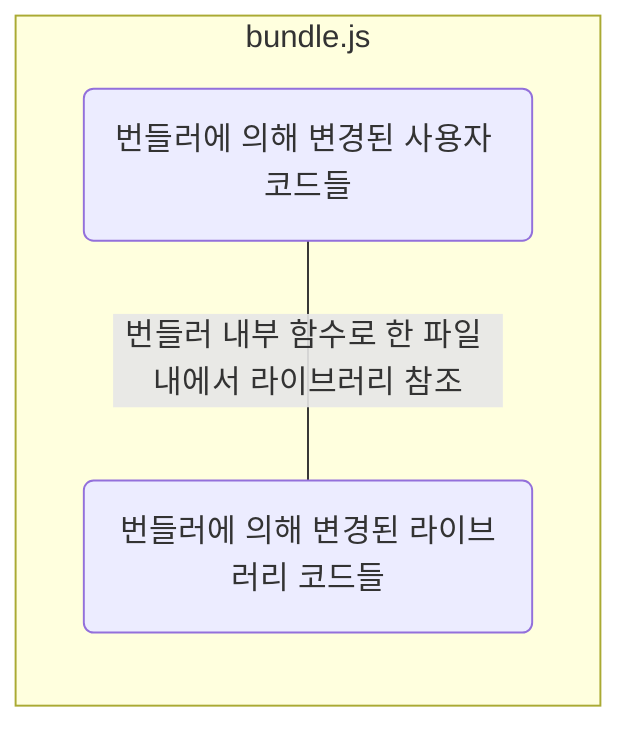

# 모듈 번들러(Module Bundler)

- [브라우저 환경에서 모듈 시스템](#브라우저-환경에서-모듈-시스템)
- [Node.js 환경에서 모듈 시스템](#nodejs-환경에서-모듈-시스템)
- [모듈 번들러(Module Bundler)가 필수가 된 이유](#모듈-번들러module-bundler가-필수가-된-이유)
- [모듈 시스템의 종류](#모듈-시스템의-종류)
  - [모듈 번들러](#모듈-번들러)
  - [번들러 파일 구조](#번들러-파일-구조)
  - [개발/프로덕션 모드에 따른 번들링 방식](#개발프로덕션-모드에-따른-번들링-방식)
    - [개발 모드(dev 모드)](#개발-모드dev-모드)
    - [프로덕션 모드(prod 모드)](#프로덕션-모드prod-모드)
- [module script, nomodule script, defer, async](#module-script-nomodule-script-defer-async)
- [`*.js` • `*.mjs`](#js--mjs)

## 브라우저 환경에서 모듈 시스템

## Node.js 환경에서 모듈 시스템

## 모듈 번들러(Module Bundler)가 필수가 된 이유

- 현대 브라우저 환경에서 공식적인 모듈 시스템은 ES Modules(ESM)을 사용한다.
- 현대 Node.js 환경에서 채택된 모듈 시스템은 CommonJS를 사용하며, 점진적으로 ESM 방식으로 변경되고 있다.

## 모듈 시스템의 종류

`export`와 `import` 지시자를 스크립트 내에서 사용하려면 아래와 같이 `type='module'` 속성을 추가해서 작성해야 한다.

```html
<script type='module' src='./module.js' >
```

자바스크립트 엔진은 `module.js` 파일 안에 `import`문을 만나면 해당 모듈을 가져오기 위해 네트워크 요청 또는 파일 경로를 통해 온다. 브라우저 환경에서는 일반적으로 네트워크 요청을 통해 해당 모듈을 가져오며, Node.js 환경에서는 파일 시스템을 통해 모듈을 가져온다.

### 모듈 번들러

브라우저 환경에서는 모듈 번들러 없이 모듈을 사용한다면, 무수히 많은 네트워크 요청이 발생한다. 이를 방지하기 위해 웹팩(Webpack)과 같은 모듈 번들러 툴을 사용해 하나의 번들러를 생성하고 이를 `script`와 연결한다.

```html
<script type="module" src="script.js"></script>
```

```ts
// module.js
export let a = 'a';

// module2.js
export let b = 'b';

// script.js
import { a } from './module.js';
import { b } from './module2.js';
```


모듈 번들러 툴은 보통 아래와 같이 동작합니다.

1. HTML의 `<script type="module">`에 진입점 역할을 하는 모듈을 넣는다.
2. 진입점 모듈에 의존하고 있는(`import`되어 있는) 모듈 분석을 시작으로 모듈 간의 의존 관계를 파악한다.
3. 모듈 전체를 한데 모아 하나의 큰 파일을 만든다(설정에 따라 여러 개의 파일을 만드는 것도 가능하다). 이 과정에서 `import`문이 번들러 내부 함수로 대체되므로 기존 기능은 그대로 유지된다. 4. 위 과정에서 아래와 같은 변형 및 최적화도 함께 수행한다.
   - 도달하지 못한 코드는 삭제된다.
   - 내보내진 모듈 중 쓰임처가 없는 모듈을 삭제한다(tree-shaking).
   - `console`, `debugger` 같은 개발 관련 코드를 삭제한다.
   - 최신 자바스크립트 문법이 사용된 경우 바벨(Babel)을 사용해 동일한 기능을 하는 낮은 버전의 스크립트로 변환한다.
   - 공백 제거, 변수 이름 줄이기 등으로 산출물의 크기를 줄인다.

기존 `import`, `export`는 번들러 내부 함수로 대체되기 때문에 `type='module'`이 사라진다.

```html
<script defer src="bundle.js"></script>
```

### 번들러 파일 구조



### 개발/프로덕션 모드에 따른 번들링 방식

#### 개발 모드(dev 모드)

- 개발용 소스맵: 웹팩은 개발 모드에서 소스맵을 생성하여 번들된 코드와 원본 코드 간의 매핑을 제공해서 개발자 도구에서 원본 코드를 볼 수 있도록 해준다. 이는 디버깅을 용이하게 하고 원본 코드의 오류를 추적하는 데 도움을 준다.
- 빠른 빌드: 빠른 빌드와 빠른 리로딩을 위해 번들링 속도를 최적화한다. 파일을 변경할 때 필요한 부분만 다시 빌드하고 적용하는 등의 최적화 작업을 수행한다.
- 개발용 플러그인 및 기능: HMR(Hot Module Replacement)과 같은 기능을 제공하는 플러그인이나 개발 도구와의 통합을 위한 기능들이 포함될 수 있다.

#### 프로덕션 모드(prod 모드)

- 코드 최적화: 코드를 압축하고 최적화하여 번들된 파일의 크기를 최소화한다. 이는 애플리케이션의 다운로드 속도를 향상시키고 사용자 경험을 개선하는 데 도움을 준다.
- 난독화: 코드 난독화 기법을 적용하여 번들된 코드를 해석하기 어렵게 만든다. 이는 코드의 보안성을 높이고 외부에서의 접근을 어렵게 만드는 데 도움을 준다.
- 환경 변수 설정: 환경 변수를 설정하여 개발 모드와 다른 설정을 사용할 수 있다. 이를 통해 프로덕션 환경에서 필요한 설정 및 동작을 조정할 수 있다.

## module script, nomodule script, defer, async


## `*.js` • `*.mjs`

브라우저
