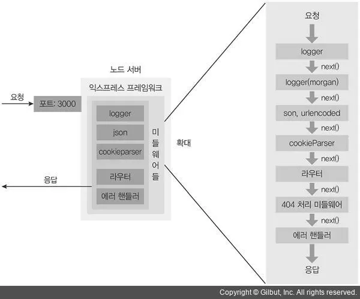

# Node.js

- [모듈 시스템(Module System)](#모듈-시스템module-system)
- [버퍼(Buffer)와 스트림(Stream)](#버퍼buffer와-스트림stream)
  - [버퍼(Buffer)](#버퍼buffer)
  - [스트림(Stream)](#스트림stream)
- [경로 관리 및 파일 시스템 API](#경로-관리-및-파일-시스템-api)
- [HTTP 응답 제어(Response Handling)](#http-응답-제어response-handling)
  - [res.end vs res.send](#resend-vs-ressend)
  - [res.writeHead vs res.setHeader](#reswritehead-vs-ressetheader)
- [Web API와 Node.js 환경](#web-api와-nodejs-환경)
- [Express 미들웨어(Middleware)](#express-미들웨어middleware)
- [환경 변수(Environment Variables)](#환경-변수environment-variables)
- [`process` 객체](#process-객체)

## 모듈 시스템(Module System)

Node.js는 두 가지 모듈 시스템을 지원한다.

| 비교 항목       | CJS (CommonJS)                 | ESM (ES Modules)                   |
| --------------- | ------------------------------ | ---------------------------------- |
| 문법            | `require()` / `module.exports` | `import` / `export`                |
| 로딩 방식       | 동기(Synchronous)              | 비동기(Asynchronous)               |
| 확장자          | `.js`, `.cjs`                  | `.js`(`"type": "module"`), `.mjs`  |
| `__dirname`     | 지원                           | 미지원(수동 구성 또는 20.11+ 방식) |
| Top-level await | 불가                           | 가능                               |

`package.json`의 `"type"` 필드로 모듈 시스템을 지정한다. 미설정 시 CJS가 기본값임.

```json
{ "type": "commonjs" }
{ "type": "module" }
```

```ts
// CJS
const fs = require('fs');
module.exports = { hello: 'world' };

// ESM
import fs from 'fs';
export const hello = 'world';
```

CJS는 `require()` 호출 시점에 파일을 동기적으로 읽고 실행한다. ESM은 실행 전 정적 분석으로 의존성 그래프를 먼저 구성하고 비동기로 로드한다. 이 차이로 인해 ESM에서는 Top-level await가 가능하고, 트리 쉐이킹(Tree Shaking)에도 유리하다.

## 버퍼(Buffer)와 스트림(Stream)

데이터를 효율적으로 처리하기 위해 Node.js는 두 가지 주요 방식을 제공한다.

### 버퍼(Buffer)

- 고정된 크기의 메모리 덩어리에 바이너리 데이터를 직접 저장하는 방식임.
- 전체 데이터를 메모리에 모두 올린 후 처리를 시작하므로, 대용량 파일 처리 시 메모리 부족 위험이 있음.

### 스트림(Stream)

- 데이터를 작은 조각(Chunks)으로 나누어 연속적으로 처리하는 방식임.
- 메모리 사용량을 최소화하며 데이터 로딩 중에도 처리가 가능함.
- 종류: Readable(읽기 전용), Writable(쓰기 전용), Duplex(양방향), Transform(변환 가능).

## 경로 관리 및 파일 시스템 API

- `__dirname`: 현재 실행 중인 모듈 파일이 위치한 폴더의 절대 경로임.
- `__filename`: 현재 실행 중인 모듈 파일의 전체 경로임.
- `process.cwd()`: Node.js 프로세스가 시작된 작업 디렉토리 경로임.
- ESM 환경에서는 `__dirname`, `__filename`을 기본 제공하지 않음. Node.js 20.11 이상에서는 `import.meta.dirname`, `import.meta.filename`으로 접근할 수 있고, 하위 버전에서는 `import.meta.url`로 수동 구성해야 한다.

```ts
// CJS (CommonJS)
console.log(__dirname); // /home/user/project/src
console.log(__filename); // /home/user/project/src/app.js
console.log(process.cwd()); // /home/user/project (실행 위치 기준)

// ESM — Node.js 20.11+
console.log(import.meta.dirname); // /home/user/project/src
console.log(import.meta.filename); // /home/user/project/src/app.js

// ESM — Node.js 20.11 미만 (수동 구성)
import { fileURLToPath } from 'url';
import { dirname, join } from 'path';

const __filename = fileURLToPath(import.meta.url);
const __dirname = dirname(__filename);

// path.join으로 OS에 무관한 경로 생성
const filePath = join(__dirname, 'data', 'config.json');
```

`fs` 모듈을 사용하여 파일을 읽고 쓸 수 있다. 비동기 처리가 필요한 경우 `fs/promises`를 사용함.

```ts
import { readFile, writeFile } from 'fs/promises';
import { join } from 'path';

const filePath = join(__dirname, 'data.json');

// 파일 읽기
const raw = await readFile(filePath, 'utf-8');
const data = JSON.parse(raw);

// 파일 쓰기
await writeFile(filePath, JSON.stringify(data, null, 2), 'utf-8');
```

## HTTP 응답 제어(Response Handling)

### res.end vs res.send

- `res.end()`: 표준 Node.js 메서드로, 추가 데이터 없이 응답을 종료할 때 사용함.
- `res.send()`: Express.js 확장 메서드로, 데이터 타입에 따라 `Content-Type`을 자동 설정하고 응답을 종료한다.

### res.writeHead vs res.setHeader

- `res.writeHead()`: 상태 코드와 헤더를 한 번에 설정하며, 호출 이후에는 헤더를 변경할 수 없음.
- `res.setHeader()`: 개별 헤더를 설정하며, 실제 응답 전송 전까지 수정이 가능하다.

## Web API와 Node.js 환경

Node.js는 브라우저 외부 환경이지만 개발 편의를 위해 다양한 Web API를 표준으로 채택하고 있다.

- 지원 API: `Fetch API`, `URL`, `TextEncoder`, `Performance`, `Timer(setTimeout 등)`.
- 차이점:
  - 브라우저는 `window` 객체를 전역으로 사용하지만 Node.js는 `global` 객체를 사용함. 크로스 환경 코드에서는 둘 다 참조 가능한 `globalThis`를 사용하는 것이 안전함.
  - DOM 조작 API는 Node.js에서 기본적으로 지원되지 않는다.

## Express 미들웨어(Middleware)



미들웨어는 요청(req)과 응답(res) 사이에서 실행되는 함수다. `next()`를 호출하여 다음 미들웨어로 제어를 넘기며, 호출하지 않으면 요청 처리가 그 시점에서 멈춤.

```ts
(req, res, next) => {
  // 로직 처리
  next(); // 다음 미들웨어로 이동
};
```

- 종류:
  - 애플리케이션 미들웨어: `app.use()`로 등록하며 모든 요청에 적용됨.
  - 라우터 미들웨어: 특정 경로에만 적용됨. `app.use('/api', router)` 형태로 사용함.
  - 내장 미들웨어: Express가 기본 제공. `express.json()`, `express.static()` 등.
  - 서드파티 미들웨어: `cors`, `helmet`, `morgan` 등 외부 패키지.
  - 에러 처리 미들웨어: 인자가 4개(`err, req, res, next`)인 경우 에러 처리 미들웨어로 인식됨. 반드시 다른 미들웨어 등록 이후 마지막에 위치해야 함.

```ts
import express from 'express';

const app = express();

// 내장 미들웨어
app.use(express.json());

// 애플리케이션 미들웨어: 모든 요청에 실행
app.use((req, res, next) => {
  console.log(`${req.method} ${req.url}`);
  next();
});

// 라우터 미들웨어: /api 경로에만 실행
app.use('/api', (req, res, next) => {
  // 인증 처리 등
  next();
});

// 에러 처리 미들웨어: 반드시 마지막에 등록
app.use((err: Error, req, res, next) => {
  res.status(500).json({ message: err.message });
});
```

## 환경 변수(Environment Variables)

환경 변수는 애플리케이션의 설정 값을 코드 외부에서 관리하는 수단이다. OS 수준과 개발 환경 수준에서 동작 방식이 다르다.

- OS 환경 변수: 시스템 전역에서 유효하며 모든 프로세스가 상속받음. `export VAR=value` (Unix) 형식으로 설정함.
- 개발 환경 변수(`.env`): 프로젝트 단위로 격리된 설정임. `dotenv` 등의 라이브러리가 런타임 시 `process.env`로 로드함.

| 비교 항목 | OS 환경 변수       | 개발 환경 변수 (`.env`)           |
| --------- | ------------------ | --------------------------------- |
| 범위      | 시스템 전체        | 특정 프로세스/애플리케이션만      |
| 설정 방법 | `export VAR=value` | `.env` 파일에 `VAR=value`         |
| 우선순위  | 더 높음            | 더 낮음 (OS 변수를 덮어쓰지 않음) |
| 예시      | `PATH`, `HOME`     | `DATABASE_URL`, `API_KEY`         |

`dotenv`는 이미 `process.env`에 정의된 변수를 덮어쓰지 않는다. 따라서 OS 환경 변수가 `.env` 파일보다 우선한다. 배포 환경에서는 OS 환경 변수로 민감한 값을 주입하고, `.env`는 로컬 개발 전용으로 사용하는 것이 일반적임.

프론트엔드 환경 변수 주의사항:

- Webpack, Vite 등 번들러가 빌드 시점에 `REACT_APP_*`, `VITE_*` 등의 변수를 정적 코드로 치환함.
- 빌드 결과물에 평문으로 포함되므로 민감한 정보(API 시크릿, 개인키 등)를 저장하면 안 됨.
- 프론트엔드 환경 변수는 "빌드 시점에 고정되는 값"이 핵심 특성이다.

## `process` 객체

Node.js 프로세스에 대한 정보와 제어 기능을 제공하는 전역 객체임. `require` 없이 어디서든 접근할 수 있다.

- `process.env`: 환경 변수 객체. `process.env.NODE_ENV`와 같이 접근함.
- `process.argv`: 명령줄 인수 배열. 인덱스 0은 node 실행 경로, 1은 스크립트 경로, 이후가 사용자 인수.
- `process.cwd()`: 프로세스가 시작된 작업 디렉토리를 반환함.
- `process.exit(code)`: 프로세스를 종료함. `0`은 정상 종료, 그 외는 비정상 종료.
- `process.pid`: 현재 프로세스 ID.
- `process.platform`: 실행 중인 OS 플랫폼(`'linux'`, `'darwin'`, `'win32'` 등).
- `process.version`: 현재 Node.js 버전 문자열.

```ts
console.log(process.env.NODE_ENV); // 'development'
console.log(process.argv); // ['node경로', '스크립트경로', ...사용자인수]
console.log(process.platform); // 'linux', 'darwin', 'win32'
console.log(process.pid); // 12345
console.log(process.version); // 'v22.0.0'

// 처리되지 않은 예외를 전역에서 잡아 안전하게 종료
process.on('uncaughtException', (err) => {
  console.error('처리되지 않은 예외:', err);
  process.exit(1);
});
```
