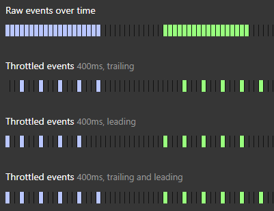
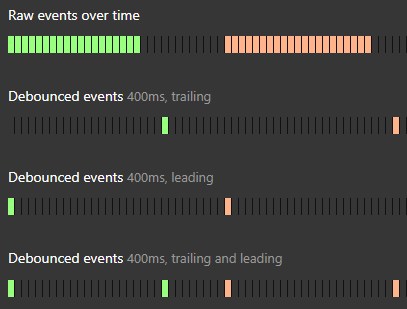

# throttle과 debounce

- [Throttle](#throttle)
- [Debounce](#debounce)
- [RequestAnimationFrame](#requestanimationframe)

## Throttle



- 특정 함수가 연속적으로 호출되는 것을 제한하여, 일정 시간 간격 내에서는 함수가 한 번만 실행되도록 만드는 기법이다.
- 이벤트가 너무 자주 발생할 때 (예: 스크롤, 리사이즈, 키 입력), 성능 저하를 방지하기 위해 호출 빈도를 줄인다.
- 설정한 시간 간격(예: 100ms) 동안에는 함수가 한 번만 실행되고, 그 시간 내에 추가 호출은 무시된다.

구현:

```ts
import { useRef } from 'react';

type Callback = (...args: any[]) => void;

interface ThrottleOptions {
  leading?: boolean;
  trailing?: boolean;
}

export function useThrottle<T extends Callback>(
  callback: T,
  delay: number,
  options: ThrottleOptions = { leading: true, trailing: false },
) {
  const { leading, trailing } = options;
  const timerId = useRef<ReturnType<typeof setTimeout>>();
  const isReady = useRef(true);
  const lastArgs = useRef<Parameters<T>>();

  return (...args: Parameters<T>) => {
    lastArgs.current = args;

    if (isReady.current) {
      if (leading) {
        callback(...args);
      }

      isReady.current = false;

      clearTimeout(timerId.current);

      timerId.current = setTimeout(() => {
        if (trailing && lastArgs.current) {
          callback(...lastArgs.current);
        }

        isReady.current = true;
        lastArgs.current = undefined;
      }, delay);
    }
  };
}
```

## Debounce

- 연속적인 이벤트 호출이 끝난 후, 일정 시간이 지나면 함수가 한 번만 실행되도록 만드는 기법이다.
- 사용자가 입력을 멈추거나 연속 동작이 끝날 때까지 기다렸다가 처리해야 할 때 유용하다 (예: 검색창 입력, 버튼 연속 클릭 방지).
- 이벤트가 발생할 때마다 타이머를 리셋하고, 설정한 시간이 지나면 마지막 호출만 실행한다.



구현:

```ts
import { useRef } from 'react';

type Callback = (...args: any[]) => void;

interface DebounceOptions {
  leading?: boolean;
  trailing?: boolean;
}

export function useDebounce<T extends Callback>(
  callback: T,
  delay: number,
  options: DebounceOptions = { leading: true, trailing: false },
) {
  const { leading, trailing } = options;
  const timerId = useRef<ReturnType<typeof setTimeout>>();
  const isReady = useRef(true);
  const lastArgs = useRef<Parameters<T>>();

  return (...args: Parameters<T>) => {
    lastArgs.current = args;

    if (timerId.current) {
      clearTimeout(timerId.current);
    }

    if (leading && isReady.current) {
      callback(...args);
    }

    isReady.current = false;

    timerId.current = setTimeout(() => {
      if (trailing && lastArgs.current) {
        callback(...lastArgs.current);
      }
      isReady.current = true;
    }, delay);
  };
}
```

## RequestAnimationFrame

- 브라우저가 다음 리페인트(화면 갱신) 직전에 함수를 실행하도록 스케줄링하는 API다.
- 애니메이션이나 부드러운 UI 업데이트가 필요할 때, 브라우저의 렌더링 주기(보통 60fps)에 맞춰 최적화된 실행을 보장한다.
- `setTimeout`이나 `setInterval` 대신 사용하며, 브라우저가 준비될 때만 호출되므로 불필요한 연산을 줄인다.

구현:

```ts
import { useRef } from 'react';

type Callback = (...args: any[]) => void;

export function useRequestAnimationFrame<T extends Callback>(callback: T) {
  const rafId = useRef<number | null>(null);

  return (...args: Parameters<T>) => {
    if (rafId.current == null) {
      rafId.current = requestAnimationFrame((t) => {
        callback(...args);

        rafId.current = null;
      });
    }
  };
}
```
