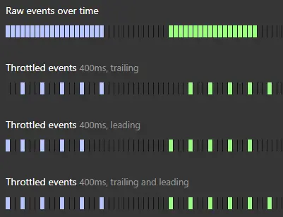
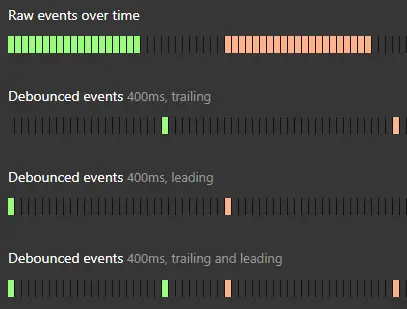

# 이벤트 호출 주기 제어

- [쓰로틀링(Throttling)](#쓰로틀링throttling)
  - [구현 예시](#구현-예시)
- [디바운싱(Debouncing)](#디바운싱debouncing)
  - [구현 예시](#구현-예시-1)
- [RequestAnimationFrame(rAF)](#requestanimationframeraf)
  - [구현 예시](#구현-예시-2)

## 쓰로틀링(Throttling)



- 쓰로틀링(Throttling)은 특정 함수가 연속적으로 호출되는 것을 제한하여, 일정 시간 간격 내에서 함수가 최대 한 번만 실행되도록 하는 기법이다.
- 이벤트가 과도하게 발생할 때 호출 빈도를 줄여 성능 저하를 방지함.
- 특징:
  - 스크롤(Scroll), 리사이즈(Resize) 이벤트 처리에 주로 사용함.
  - 설정한 시간 간격 동안 추가적인 호출은 무시됨.
  - 일정한 주기마다 실행을 보장하여 사용자에게 실시간성을 제공함.

### 구현 예시

```ts
import { useEffect, useRef } from 'react';

type Callback = (...args: any[]) => void;

interface ThrottleOptions {
  leading?: boolean;
  trailing?: boolean;
}

export function useThrottle<T extends Callback>(
  callback: T,
  delay: number,
  options: ThrottleOptions = { leading: true, trailing: false },
) {
  const { leading, trailing } = options;
  const timerId = useRef<ReturnType<typeof setTimeout>>();
  const isReady = useRef(true);
  const lastArgs = useRef<Parameters<T>>();

  useEffect(() => {
    return () => {
      clearTimeout(timerId.current);
    };
  }, []);

  return (...args: Parameters<T>) => {
    lastArgs.current = args;

    if (isReady.current) {
      if (leading) {
        callback(...args);
      }

      isReady.current = false;

      clearTimeout(timerId.current);

      timerId.current = setTimeout(() => {
        if (trailing && lastArgs.current) {
          callback(...lastArgs.current);
        }

        isReady.current = true;
        lastArgs.current = undefined;
      }, delay);
    }
  };
}
```

## 디바운싱(Debouncing)

- 디바운싱(Debouncing)은 연속적인 이벤트 호출이 멈춘 후, 일정 시간이 지나면 함수가 한 번만 실행되도록 하는 기법이다.
- 사용자가 입력을 멈추거나 동작이 끝날 때까지 처리를 지연시켜 불필요한 연산을 방지함.
- 특징:
  - 검색창 입력(Search Input), 버튼 중복 클릭 방지 등에 유용함.
  - 이벤트 발생 시마다 기존 타이머를 취소하고 새로 시작함.
  - 마지막 호출로부터 지정된 시간이 경과해야 최종적으로 실행됨.



### 구현 예시

```ts
import { useEffect, useRef } from 'react';

type Callback = (...args: any[]) => void;

interface DebounceOptions {
  leading?: boolean;
  trailing?: boolean;
}

export function useDebounce<T extends Callback>(
  callback: T,
  delay: number,
  options: DebounceOptions = { leading: true, trailing: false },
) {
  const { leading, trailing } = options;
  const timerId = useRef<ReturnType<typeof setTimeout>>();
  const isReady = useRef(true);
  const lastArgs = useRef<Parameters<T>>();

  useEffect(() => {
    return () => {
      clearTimeout(timerId.current);
    };
  }, []);

  return (...args: Parameters<T>) => {
    lastArgs.current = args;

    if (timerId.current) {
      clearTimeout(timerId.current);
    }

    if (leading && isReady.current) {
      callback(...args);
    }

    isReady.current = false;

    timerId.current = setTimeout(() => {
      if (trailing && lastArgs.current) {
        callback(...lastArgs.current);
      }
      isReady.current = true;
    }, delay);
  };
}
```

기본값은 `{ leading: true, trailing: false }`로, 연속 호출의 첫 번째 시점에 즉시 실행하고 이후 입력은 무시하는 leading 방식이다. 일반적인 trailing 방식(마지막 호출 후 지연 실행)이 필요한 경우 `{ leading: false, trailing: true }`로 설정한다.

## RequestAnimationFrame(rAF)

- `RequestAnimationFrame(rAF)`은 브라우저가 다음 리페인트(Repaint) 직전에 함수를 실행하도록 스케줄링하는 API다.
- 브라우저의 렌더링 주기(일반적으로 60fps)에 맞춰 최적화된 실행을 보장함.
- 특징:
  - 애니메이션이나 부드러운 UI 업데이트가 필요할 때 사용함.
  - 탭이 활성화되어 있을 때만 호출되므로 CPU 자원을 절약함.
  - `setTimeout`보다 정확한 타이밍에 실행되어 끊김 현상을 최소화함.

### 구현 예시

```ts
import { useEffect, useRef } from 'react';

type Callback = (...args: any[]) => void;

export function useRequestAnimationFrame<T extends Callback>(callback: T) {
  const rafId = useRef<number | null>(null);

  useEffect(() => {
    return () => {
      if (rafId.current != null) {
        cancelAnimationFrame(rafId.current);
      }
    };
  }, []);

  return (...args: Parameters<T>) => {
    if (rafId.current == null) {
      rafId.current = requestAnimationFrame(() => {
        callback(...args);

        rafId.current = null;
      });
    }
  };
}
```
