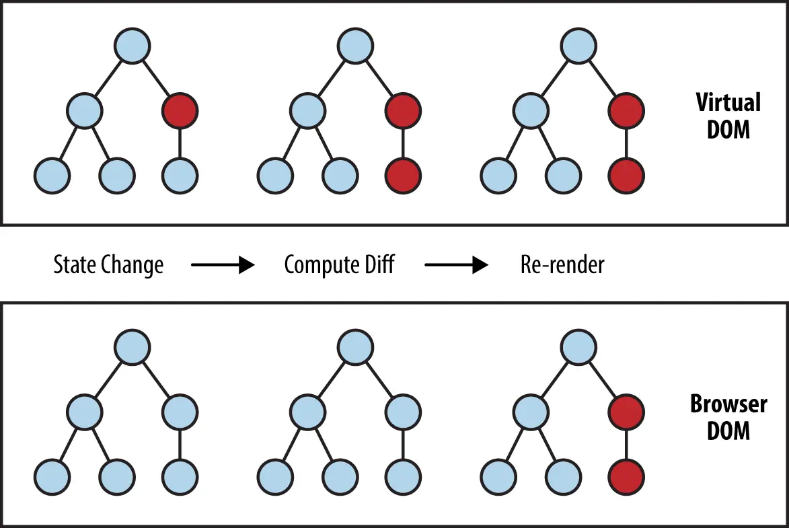

# 리액트 렌더링(React Rendering)

- [리액트 렌더링(React Rendering) 과정](#리액트-렌더링react-rendering-과정)
  - [1. 렌더 단계(Render Phase)](#1-렌더-단계render-phase)
  - [2. 커밋 단계(Commit Phase)](#2-커밋-단계commit-phase)
- [가상 DOM(Virtual DOM)](#가상-domvirtual-dom)
- [재조정(Reconciliation)과 Fiber](#재조정reconciliation과-fiber)
  - [Diffing 알고리즘](#diffing-알고리즘)
  - [Fiber 아키텍처](#fiber-아키텍처)
- [JSX(JavaScript XML)](#jsxjavascript-xml)
  - [createElement 변환과 Virtual DOM 생성](#createelement-변환과-virtual-dom-생성)
- [조건부 렌더링 방식 비교](#조건부-렌더링-방식-비교)
  - [요소 숨김 방법 비교](#요소-숨김-방법-비교)
- [리스트 렌더링(List Rendering)](#리스트-렌더링list-rendering)
  - [key prop](#key-prop)
  - [key 선택 전략](#key-선택-전략)
  - [`<Fragment>`와 리스트](#fragment와-리스트)

## 리액트 렌더링(React Rendering) 과정

리액트의 렌더링은 크게 렌더 단계(Render Phase)와 커밋 단계(Commit Phase)로 나뉜다.

### 1. 렌더 단계(Render Phase)

컴포넌트를 호출하여 이전 가상 DOM(Virtual DOM)과 비교하고 변경 사항을 계산하는 단계다.

- 특징:
  - 사용자에게 보이지 않는 내부적인 계산 과정임.
  - React 18의 동시성 모드(Concurrent Mode)에서는 렌더링을 중단하거나 우선순위에 따라 재시작할 수 있음.
  - 부모 컴포넌트가 렌더링되면 자식 컴포넌트도 기본적으로 함께 렌더링됨.

### 2. 커밋 단계(Commit Phase)

렌더 단계에서 계산된 변경 사항을 실제 브라우저의 DOM에 반영하는 단계다.

- 특징:
  - 브라우저가 화면을 실제로 그리는 가시적인 단계임.
  - 리액트가 DOM 노드를 삽입, 수정, 삭제하며 동기적으로 실행됨.
  - `useLayoutEffect`는 커밋 직후, 브라우저가 화면을 그리기 전 실행됨.
  - `useEffect`는 커밋이 완료되고 브라우저가 화면을 그린 후 실행됨.

## 가상 DOM(Virtual DOM)



가상 DOM은 실제 DOM 구조를 반영한 경량 JavaScript 객체 트리다. React는 UI 상태가 변경될 때 실제 DOM을 직접 조작하는 대신, 가상 DOM 트리 두 벌(이전/현재)을 비교하여 최소한의 변경 사항만 실제 DOM에 반영한다.

- 실제 DOM 조작은 브라우저의 레이아웃·페인트를 유발하므로 비용이 크다.
- 가상 DOM 비교는 순수 JavaScript 연산이므로 상대적으로 빠르다.
- 변경 사항 계산이 끝나면 커밋 단계에서 실제 DOM에 일괄 적용된다.

## 재조정(Reconciliation)과 Fiber

재조정은 가상 DOM의 변경된 부분만 실제 DOM에 효율적으로 업데이트하는 알고리즘이다.

### Diffing 알고리즘

전체 트리를 비교하는 $O(n^3)$ 알고리즘 대신, 리액트는 $O(n)$의 휴리스틱 알고리즘을 사용한다.

- 규칙:
  - 엘리먼트 타입 비교: 타입이 다르면 이전 트리를 버리고 새로운 트리를 구축함.
  - Key 활용: 동일한 부모 아래의 자식 요소들을 비교할 때 `key`를 사용하여 효율적으로 이동 및 재사용을 판단함.
  - 컴포넌트 인스턴스 유지: 타입이 같으면 인스턴스를 유지하고 Props만 업데이트함.

### Fiber 아키텍처

React 16부터 도입된 렌더링 엔진으로, 작업을 작은 단위로 쪼개어 스케줄링할 수 있게 한다.

- 목적:
  - 애니메이션이나 사용자 입력 같은 높은 우선순위 작업의 응답성 확보.
  - 렌더링 작업을 일시 중지했다가 나중에 다시 시작하거나 폐기할 수 있는 유연성 제공.

## JSX(JavaScript XML)

JSX는 JavaScript 코드 내에서 HTML과 유사한 마크업을 작성할 수 있게 해주는 구문 확장이다. Babel이나 TypeScript 컴파일러가 JSX를 `React.createElement()` 호출로 변환한다.

### createElement 변환과 Virtual DOM 생성

컴파일 전후를 비교하면 JSX가 어떻게 가상 DOM 객체로 이어지는지 확인할 수 있다.

```tsx
// JSX 작성
const element = <Button color='red'>클릭</Button>;

// 컴파일 결과
const element = React.createElement(Button, { color: 'red' }, '클릭');
```

`React.createElement`는 다음과 같은 일반 JavaScript 객체(React 엘리먼트)를 반환한다.

```ts
{
  type: Button,
  props: { color: 'red', children: '클릭' },
  key: null,
  ref: null,
}
```

이 객체들이 트리 구조를 이루어 가상 DOM을 형성하며, 렌더 단계에서 이전 가상 DOM 트리와 비교(Diffing)되어 변경 사항을 계산한다. JSX 표현식 내의 값은 렌더링 전에 자동으로 이스케이프되므로, XSS 공격을 방지한다.

## 조건부 렌더링 방식 비교

조건부 렌더링 방식은 크게 두 가지로, 요소를 DOM에서 완전히 제거하는 방식과 CSS로 시각적으로만 숨기는 방식으로 나뉜다.

| 방식                        | 특징                               | 장단점                                                   | 권장 상황                            |
| :-------------------------- | :--------------------------------- | :------------------------------------------------------- | :----------------------------------- |
| 조건문 연산자 (`&&`, `? :`) | 요소 자체가 DOM에서 제거/추가됨    | 메모리 효율은 좋으나 토글 시 재마운트(remount) 비용 발생 | 상태 변화가 적은 일반적인 경우       |
| CSS 제어 (`display: none`)  | DOM 노드는 유지하고 숨김 처리만 함 | 초기 렌더링 비용은 크나 토글 속도가 매우 빠름            | 탭 메뉴 등 빈번한 전환이 필요한 경우 |

조건부 렌더링은 falsy 값 처리에 주의해야 한다. `&&` 연산자 왼쪽이 `0`이나 `NaN`이면 해당 값 자체가 렌더링된다.

```tsx
// ❌ incorrect: count가 0이면 "0"이 화면에 출력됨
{
  count && <Item />;
}

// ✅ correct: 명시적으로 boolean으로 변환
{
  count > 0 && <Item />;
}
{
  !!count && <Item />;
}
```

### 요소 숨김 방법 비교

React와 CSS에서 요소를 숨기는 방법은 여러 가지이며, DOM 유지 여부와 애니메이션 가능 여부에서 차이가 있다.

| 방법                                    | DOM 잔류 | 공간 점유 | 렌더링 | 애니메이션             | 주 용도                       |
| --------------------------------------- | -------- | --------- | ------ | ---------------------- | ----------------------------- |
| 조건부 렌더링 (`{condition && <El />}`) | 제거됨   | 없음      | 안 함  | 라이브러리 필요        | 성능 최적화, 간단한 토글      |
| `display: none`                         | 유지됨   | 없음      | 안 함  | 불가                   | 간단한 숨김, DOM 유지 필요 시 |
| `visibility: hidden`                    | 유지됨   | 있음      | 함     | `opacity` 등 일부 가능 | 공간 유지, 부드러운 전환      |
| Framer Motion `AnimatePresence`         | 제거됨   | 없음      | 안 함  | 가능 (`exit` 등)       | 애니메이션과 함께 요소 제거   |

- `display: none`: DOM은 유지되므로 ref 접근이나 포커스 관리가 필요한 컴포넌트에 적합함. 단, 탭 순서에서 제외되지 않으므로 접근성 처리가 필요할 수 있음.
- `visibility: hidden`: 레이아웃 공간을 차지하므로 요소 크기를 유지하면서 내용만 감출 때 사용함.
- 조건부 렌더링: 언마운트 시 내부 상태가 초기화되므로, 상태 보존이 필요한 경우에는 CSS 숨김 방식이 적합함.

## 리스트 렌더링(List Rendering)

배열 데이터를 UI 요소 목록으로 변환할 때는 `Array.prototype.map()`을 사용한다. 각 항목에는 `key` prop을 반드시 지정해야 한다.

```tsx
const items = ['사과', '바나나', '체리'];

function FruitList() {
  return (
    <ul>
      {items.map((item) => (
        <li key={item}>{item}</li>
      ))}
    </ul>
  );
}
```

### key prop

`key`는 React가 리스트 항목을 식별하는 데 사용하는 특수 prop이다. 재조정(Reconciliation) 과정에서 어떤 항목이 추가·변경·삭제되었는지 파악하는 기준이 된다.

- `key`는 같은 부모 아래에서 고유해야 하며, 전체 애플리케이션에서 고유할 필요는 없음.
- `key`는 자식 컴포넌트의 props로 전달되지 않으므로, 컴포넌트 내부에서 `props.key`로 접근할 수 없음.
- `key`가 변경되면 React는 해당 컴포넌트 인스턴스를 언마운트하고 새 인스턴스를 마운트함.

### key 선택 전략

| 상황                     | 권장 key                 | 이유                         |
| :----------------------- | :----------------------- | :--------------------------- |
| 서버에서 내려오는 데이터 | 데이터베이스 ID          | 고유하고 안정적임            |
| 로컬 생성 데이터         | `crypto.randomUUID()` 등 | 항목 생성 시 한 번만 할당    |
| 고정 순서의 정적 목록    | 배열 인덱스              | 순서가 바뀌지 않을 때만 허용 |

배열의 인덱스를 `key`로 사용하면 항목 순서가 바뀌거나 중간 삽입·삭제가 발생할 때 재조정 과정에서 불필요한 DOM 변경과 상태 오류가 발생할 수 있다.

```tsx
// ❌ incorrect: 인덱스를 key로 사용하면 재정렬 시 상태 오류 발생 가능
{
  items.map((item, index) => <Item key={index} value={item} />);
}

// ✅ correct: 안정적인 고유 ID를 key로 사용
{
  items.map((item) => <Item key={item.id} value={item} />);
}
```

인풋 요소가 포함된 항목처럼 내부 상태를 가지는 컴포넌트에서 인덱스를 `key`로 사용하면, 순서 변경 후 이전 항목의 상태가 엉뚱한 컴포넌트에 남아 있는 버그가 생긴다.

### `<Fragment>`와 리스트

여러 요소를 반환해야 하는데 래퍼 태그를 추가하고 싶지 않을 때는 `<Fragment>`를 사용한다. 리스트 렌더링에서 `key`를 전달할 때는 단축 문법(`<>...</>`) 대신 `<Fragment key={...}>`를 사용해야 한다.

```tsx
import { Fragment } from 'react';

{
  items.map((item) => (
    <Fragment key={item.id}>
      <dt>{item.term}</dt>
      <dd>{item.description}</dd>
    </Fragment>
  ));
}
```
